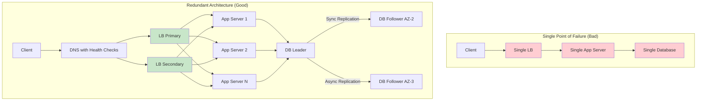
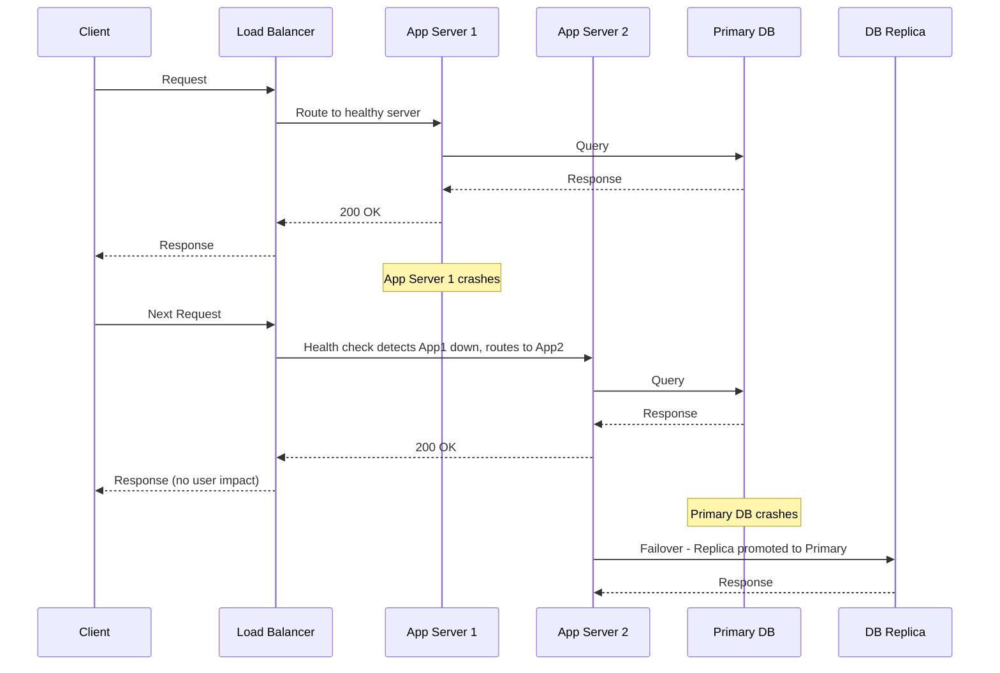

# Availability and Reliability

## 1. Overview

Availability and reliability are the two metrics that define whether a system is trustworthy in production. They are related but distinct: availability measures whether the system is reachable (can the user get a response?), while reliability measures whether the system is correct (does the response do what it should?). A system can be highly available but unreliable -- it always answers the phone but gives you the wrong information. Conversely, a system can be reliable but unavailable -- it gives perfect answers when it is up, but it is frequently down.

As a senior architect, you must mandate specific targets for both, expressed as Service Level Objectives (SLOs) backed by Service Level Agreements (SLAs). These targets directly determine your infrastructure investment, redundancy strategy, and on-call burden.

## 2. Why It Matters

- **Availability is what the business tracks.** Revenue-generating systems lose money every minute they are down. Amazon reportedly loses ~$220K per minute of downtime. A 99.9% target sounds impressive until you realize it permits 8.76 hours of downtime per year.
- **Reliability is what users trust.** A system that returns incorrect data (wrong balance, double-booked seat, lost message) destroys user trust even if it never goes "down." Financial and healthcare systems treat reliability failures as existential threats.
- **The cost curve is exponential.** Moving from 99.9% to 99.99% availability does not cost 0.09% more -- it can cost 10x more in engineering effort, infrastructure redundancy, and operational complexity. You must choose the right target for each service based on business impact.
- **Blast radius determines architecture.** Every system will fail. The question is how much of the system fails with it. Architecting for small blast radius (isolated failure domains) is the primary strategy for high availability.

## 3. Core Concepts

- **Availability:** The proportion of time a system is operational and accessible. Expressed as a percentage (e.g., 99.99%) or in "nines."
- **Reliability:** The probability that a system performs its intended function correctly over a given period. A system that returns wrong data is unreliable even if it is always reachable.
- **Fault Tolerance:** The ability of a system to continue operating (possibly at reduced capacity) when components fail. This is the engineering mechanism that delivers availability.
- **Redundancy:** Duplication of critical components (servers, databases, network paths) so that failure of one does not cause system failure.
- **Failover:** The process of switching to a redundant component when the primary fails. Can be automatic (preferred) or manual (slower, riskier).
- **SLA (Service Level Agreement):** A contractual commitment to a specific availability level. Breach of SLA typically triggers financial penalties or service credits.
- **SLO (Service Level Objective):** An internal engineering target, typically more aggressive than the SLA. If your SLA is 99.9%, your SLO should be 99.95% to provide a safety margin.
- **SLI (Service Level Indicator):** The actual measured metric (e.g., percentage of successful requests in the last 5 minutes) used to evaluate whether SLOs are being met.
- **MTTF (Mean Time To Failure):** Average time between failures. Higher is better.
- **MTTR (Mean Time To Recovery):** Average time to restore service after failure. Lower is better. Availability = MTTF / (MTTF + MTTR).
- **Blast Radius:** The scope of impact when a component fails. Minimizing blast radius is the primary architectural strategy for availability.
- **Single Point of Failure (SPOF):** Any component whose failure brings down the entire system. Eliminating SPOFs is the first step toward high availability.

## 4. How It Works

### The "Nines" of Availability

The industry standard for expressing availability targets. Each additional nine represents a 10x reduction in permissible downtime:

| Availability Level | Percentage | Permissible Downtime/Year | Permissible Downtime/Month | Typical Use Case |
|---|---|---|---|---|
| 1 Nine | 90% | 36.5 days | 72 hours | Internal batch jobs |
| 2 Nines | 99% | 3.65 days | 7.2 hours | Internal tools |
| 3 Nines | 99.9% | 8.76 hours | 43.8 minutes | Standard SaaS |
| 4 Nines | 99.99% | 52.6 minutes | 4.38 minutes | High-availability production |
| 5 Nines | 99.999% | 5.26 minutes | 25.9 seconds | Mission-critical infrastructure |

**Architect's guidance:** Treat 4 Nines as the standard target for user-facing production systems. Moving to 5 Nines exponentially increases costs and requires sophisticated failover mechanisms, multi-region deployment, and highly specialized operational teams. Not every service needs 5 Nines -- your payment system might, but your recommendation engine probably does not.

### Calculating Composite Availability

For systems with components in series (all must work), multiply availabilities:

```
System = Component_A × Component_B × Component_C
System = 0.999 × 0.999 × 0.999 = 0.997 (99.7%)
```

Three "three-nines" components in series yield less than three nines overall. This is why every additional component in the critical path degrades system availability.

For systems with redundant components in parallel (any one must work):

```
System = 1 - (1 - Component_A) × (1 - Component_B)
System = 1 - (0.001 × 0.001) = 0.999999 (99.9999%)
```

Two "three-nines" components in parallel yield six nines. This is the mathematical basis for redundancy.

### Fault Tolerance Strategies

**Level 1 -- Redundancy:**
- Deploy multiple instances of every service behind a [Load Balancer](../02-scalability/load-balancing.md)
- Use database replication (leader + followers) for data redundancy
- Deploy across multiple Availability Zones (AZs) within a region

**Level 2 -- Isolation:**
- Separate services into independent failure domains (blast radius containment)
- Use bulkhead pattern: isolate thread pools and connection pools per downstream dependency
- Deploy separate database clusters per critical service

**Level 3 -- Graceful Degradation:**
- Circuit breaker pattern: fail fast when a dependency is down rather than cascading the failure. Cross-link to [Circuit Breaker](../08-resilience/circuit-breaker.md).
- Serve stale cached data when the primary database is unavailable
- Disable non-critical features under load to protect core functionality

**Level 4 -- Multi-Region:**
- Active-active deployment across geographic regions
- DNS-based traffic routing with health checks
- Eventual consistency between regions via async replication (see [CAP Theorem](./cap-theorem.md))

## 5. Architecture / Flow





## 6. Types / Variants

### Redundancy Models

| Model | Description | Recovery Time | Data Loss Risk | Cost |
|---|---|---|---|---|
| **Cold Standby** | Backup infrastructure powered off, brought up on failure | Hours | Depends on backup frequency | Low |
| **Warm Standby** | Backup running but not serving traffic, receives replicated data | Minutes | Minimal (near-real-time replication) | Medium |
| **Hot Standby** | Backup actively serving read traffic, instant failover for writes | Seconds | Zero (synchronous replication) | High |
| **Active-Active** | Multiple instances all serving traffic simultaneously | Zero (no failover needed) | Zero | Highest |

### Failure Categories

| Category | Example | Mitigation |
|---|---|---|
| **Hardware failure** | Disk crash, server power loss | Redundancy, RAID, multi-AZ deployment |
| **Software failure** | Memory leak, deadlock, crash bug | Health checks, auto-restart, rolling deployments |
| **Network failure** | Partition between data centers, DNS outage | Multi-path networking, DNS failover, CDN |
| **Human error** | Bad config deploy, accidental deletion | Canary deployments, feature flags, immutable infrastructure |
| **Overload** | Traffic spike beyond capacity | Auto-scaling, rate limiting, load shedding |
| **Dependency failure** | Third-party API down | Circuit breakers, fallback responses, caching |

## 7. Use Cases

- **Banking systems:** Require both high availability (4-5 nines) and high reliability (zero tolerance for incorrect balances). Deploy active-active across data centers with synchronous replication.
- **Social media feeds:** Prioritize availability over perfect consistency. A post appearing 5 seconds late is acceptable; the feed being unavailable is not. Use eventual consistency with read replicas.
- **E-commerce checkout:** The cart browsing experience can tolerate degradation (serve cached product pages), but the payment flow requires both availability and reliability (no double charges, no lost orders).
- **Healthcare systems:** Reliability is paramount -- displaying the wrong medication or dosage is worse than the system being temporarily unavailable. Strong consistency with synchronous replication.

## 8. Tradeoffs

| Factor | High Availability Approach | Implication |
|---|---|---|
| **Redundancy** | More replicas, more AZs, more regions | Higher infrastructure cost, more operational complexity |
| **Consistency** | Synchronous replication for strong consistency | Higher write latency, lower availability during partitions (see [CAP Theorem](./cap-theorem.md)) |
| **Recovery speed** | Automated failover with health checks | Risk of false positives (premature failover), split-brain scenarios |
| **Blast radius** | Smaller services, more isolation | More services to manage, more network hops, more monitoring |
| **Testing** | Chaos engineering (intentionally causing failures) | Requires mature operational culture and tooling |

### The Availability-Consistency Spectrum

| Scenario | Priority | Justification |
|---|---|---|
| Live commenting | Availability (AP) | Users tolerate seeing comments slightly out of order; the stream must stay active |
| Ticket booking | Consistency (CP) | Double-booking a seat is unacceptable; the system must reflect the latest write |
| Social media posts | Availability (AP) | A status update appearing 5 seconds late is acceptable for high availability |
| Bank transfers | Consistency (CP) | Spending the same $100 twice is catastrophic |
| Search results | Availability (AP) | Slightly stale search results are fine; the search service must always respond |

## 9. Common Pitfalls

- **Confusing availability with reliability.** The "available but useless friend" analogy: they always answer the phone (high availability) but never show up to help you move (low reliability). A system can have 5 Nines of availability but 0% reliability if it returns incorrect data.
- **Targeting 5 Nines for everything.** Not every service needs 5 Nines. Your internal admin dashboard does not need the same availability as your payment processor. Over-engineering availability is expensive and operationally burdensome.
- **Ignoring MTTR.** Teams focus on preventing failures (MTTF) but neglect recovery speed (MTTR). In practice, failures are inevitable -- what matters is how fast you recover. Invest in automated failover, runbooks, and observability.
- **Single point of failure in the load balancer.** Adding redundant app servers behind a single load balancer just moves the SPOF. Load balancers themselves must be redundant (active-passive or active-active cluster).
- **Untested failover.** A failover mechanism that has never been tested in production is a hypothesis, not a strategy. Chaos engineering (Netflix's Chaos Monkey) exists because untested redundancy is unreliable redundancy.
- **Ignoring dependent services.** Your service might have 4 Nines, but if it depends on a service with 2 Nines, your effective availability is limited by the weakest link. Map your dependency chain and calculate composite availability.

## 10. Real-World Examples

- **Netflix Chaos Monkey:** Netflix intentionally kills production instances to verify that their systems recover automatically. This practice -- chaos engineering -- ensures that redundancy mechanisms are continuously tested, not just theoretically present. Netflix also runs Chaos Kong, which simulates the failure of an entire AWS region to validate cross-region failover.
- **AWS Multi-AZ RDS:** Amazon RDS provides synchronous replication to a standby instance in a different Availability Zone. On primary failure, automatic failover completes in ~60 seconds with zero data loss. This is a hot standby model. For even higher availability, Aurora provides multi-region read replicas with sub-second replication lag.
- **Google Spanner:** Achieves 5 Nines of availability with strong consistency across global data centers using synchronized clocks (TrueTime API) and Paxos consensus. This is one of the most expensive availability architectures in production -- it required Google to install GPS receivers and atomic clocks in their data centers.
- **Ticketmaster:** During Taylor Swift-level surges, Ticketmaster deploys virtual waiting rooms to protect backend availability. Rather than letting millions of concurrent users crash the booking system, a queue-based admission system throttles ingress while maintaining system stability. Cross-link to [Rate Limiting](../08-resilience/rate-limiting.md).
- **Facebook (Meta) October 2021 Outage:** A BGP configuration change disconnected Facebook's DNS servers from the internet. The blast radius was total -- every Facebook service worldwide went down because DNS was a shared SPOF. Recovery took 6+ hours because even internal tools depended on the same DNS infrastructure. The post-mortem led to architectural changes to isolate DNS.
- **GitHub January 2023 Incident:** A database infrastructure upgrade caused degraded availability across GitHub services for approximately 48 hours. The root cause was that a configuration change caused unexpected load patterns on the MySQL primary database. This illustrated how even a managed database can become a SPOF when the workload changes unexpectedly.

### Availability Engineering Practices

| Practice | Description | Cost | Impact |
|---|---|---|---|
| **Health checks** | Periodic probes to verify component health | Low | Enables automatic removal of unhealthy instances |
| **Canary deployments** | Roll out changes to a small percentage first | Low | Catches bugs before they affect all users |
| **Blue-green deployment** | Maintain two identical environments, switch traffic | Medium | Zero-downtime deployments with instant rollback |
| **Chaos engineering** | Intentionally inject failures in production | Medium | Validates that redundancy actually works |
| **Game days** | Simulated outage exercises for the on-call team | Low | Improves MTTR through practice |
| **Multi-region active-active** | Serve traffic from multiple geographic regions | Very High | Survives complete region failure |
| **Immutable infrastructure** | Replace servers rather than patch them | Medium | Eliminates configuration drift |

## 11. Related Concepts

- [CAP Theorem](./cap-theorem.md) -- the fundamental trade-off between consistency and availability during partitions
- [Scaling Overview](./scaling-overview.md) -- horizontal scaling as a mechanism for availability through redundancy
- [Load Balancing](../02-scalability/load-balancing.md) -- traffic distribution and health checks as availability mechanisms
- [Autoscaling](../02-scalability/autoscaling.md) -- elastic scaling to maintain availability during traffic spikes
- [Circuit Breaker](../08-resilience/circuit-breaker.md) -- preventing cascading failures to preserve system availability
- [Database Replication](../03-storage/database-replication.md) -- data redundancy strategies

## 12. Source Traceability

- source/youtube-video-reports/2.md -- Blast radius, system reliability, security, and monitoring
- source/youtube-video-reports/5.md -- Nines of availability table, P99 as the metric that matters, CAP theorem
- source/youtube-video-reports/7.md -- Nines table (1-5 nines), reliability vs availability distinction ("available but useless friend"), scaling paradigms
- source/youtube-video-reports/9.md -- Nines of availability, fault tolerance, SPOF, redundancy, circuit breaker
- source/extracted/grokking/ch59-reliability-and-redundancy.md -- Reliability and redundancy for distributed data
- source/extracted/grokking/ch237-scalability.md -- Reliability as a key characteristic of distributed systems
- source/extracted/acing-system-design/ch05-non-functional-requirements.md -- Availability and fault-tolerance as NFRs
- source/extracted/ddia/ch02-reliable-scalable-and-maintainable-applications.md -- Reliability, faults vs failures, hardware/software/human faults
