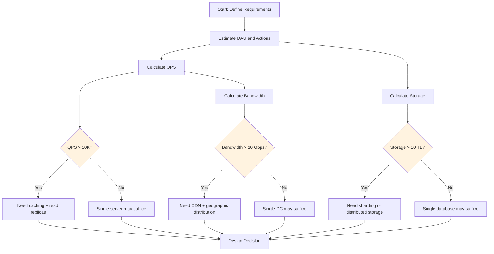
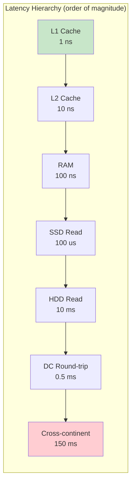

# Back-of-Envelope Estimation

## 1. Overview

Back-of-envelope estimation is the practice of using approximate arithmetic to validate or invalidate architectural decisions before committing to them. It is not a ritual performed for ceremony -- it is a design tool that tells you whether your proposed architecture can physically handle the expected load, how much storage you need over the system's lifetime, and where the bottlenecks will emerge first.

As a principal architect, you perform these calculations to make pivots. If the math says you need 3.6 PB of storage, you do not reach for a single Postgres instance. If the math says you need 12K QPS, you do not deploy a single server. The numbers drive the architecture, not the other way around.

## 2. Why It Matters

- **Math prevents over-engineering.** If your estimated QPS is 100, you do not need Kafka, a sharded database, or a global CDN. A single well-provisioned server handles it.
- **Math prevents under-engineering.** If your estimated storage is 3.6 PB over 10 years, a single relational database is not an option. The number dictates distributed storage.
- **Math reveals the true bottleneck.** Is your system read-heavy or write-heavy? Is storage the constraint or throughput? Is bandwidth the limiting factor or compute? The numbers tell you where to focus your design effort.
- **Math communicates competence.** In interviews and architecture reviews, the ability to quickly produce reasonable estimates demonstrates that you think quantitatively about systems rather than hand-waving about scale.

## 3. Core Concepts

- **QPS (Queries Per Second):** The number of requests per second the system must handle. Derived from DAU, actions per user per day, and seconds in a day.
- **Peak QPS:** Typically 2x-10x average QPS depending on the traffic pattern. Design for peak, not average.
- **Storage Estimation:** Total data volume accumulated over the system's lifetime. Drives database selection and partitioning strategy.
- **Bandwidth Estimation:** Data transfer rate required for inbound (ingress) and outbound (egress) traffic. Measured in Mbps or Gbps.
- **Latency Numbers:** Fixed physical constants and empirical benchmarks that every architect should internalize (memory access: 100ns, SSD read: 1ms, network round-trip within DC: 0.5ms, cross-continent: 150ms).

### Powers of Two (Memory Reference)

| Power | Exact Value | Approximate | Common Name |
|---|---|---|---|
| 2^10 | 1,024 | ~1 Thousand | 1 KB |
| 2^20 | 1,048,576 | ~1 Million | 1 MB |
| 2^30 | 1,073,741,824 | ~1 Billion | 1 GB |
| 2^40 | 1,099,511,627,776 | ~1 Trillion | 1 TB |
| 2^50 | | ~1 Quadrillion | 1 PB |

### Time Conversions (Rounded for Estimation)

| Period | Seconds |
|---|---|
| 1 minute | 60 |
| 1 hour | 3,600 |
| 1 day | ~86,400 (~10^5 for estimation) |
| 1 month | ~2.5 million (~2.5 x 10^6) |
| 1 year | ~31.5 million (~3 x 10^7) |

**Key simplification:** There are roughly 100,000 seconds in a day (actual: 86,400). Using 10^5 makes mental math dramatically easier with acceptable accuracy.

## 4. How It Works

### Step 1: QPS Estimation

**Formula:**

```
Average QPS = (DAU × actions_per_user_per_day) / seconds_per_day

Peak QPS = Average QPS × peak_multiplier (typically 2x-5x)
```

**Example -- Twitter-like service:**
- DAU: 100 million (10^8)
- Tweets per user per day: 2
- Reads per user per day: 100 (50:1 read-to-write ratio)

```
Write QPS = (10^8 × 2) / 10^5 = 2,000 writes/sec
Read QPS  = (10^8 × 100) / 10^5 = 100,000 reads/sec
Peak Read QPS = 100,000 × 3 = 300,000 reads/sec
```

**Architectural implication:** 300K reads/sec requires caching and read replicas. A single database cannot serve this.

### Step 2: Storage Estimation

**Formula:**

```
Daily storage = daily_new_records × average_record_size
Total storage = daily_storage × retention_days
```

**Example -- Photo sharing (Instagram-like):**
- 2 million new photos per day
- Average photo metadata: 284 bytes (PhotoID: 4B, UserID: 4B, PhotoPath: 256B, coordinates: 16B, timestamp: 4B)
- Average photo file: 2 MB
- Retention: 10 years

```
Metadata per day  = 2M × 284 bytes ≈ 0.5 GB/day
Metadata 10 years = 0.5 GB × 3,650 days ≈ 1.88 TB

Files per day     = 2M × 2 MB = 4 TB/day
Files 10 years    = 4 TB × 3,650 ≈ 14.6 PB
```

**Architectural implication:** 14.6 PB of photos cannot live in a database. This requires object storage (S3) with metadata in a separate database. Cross-link to [Object Storage](../03-storage/object-storage.md).

### Step 3: Bandwidth Estimation

**Formula:**

```
Ingress bandwidth = write_QPS × average_request_size
Egress bandwidth  = read_QPS × average_response_size
```

**Example -- Video streaming (YouTube-like):**
- 5 million video views per day
- Average video stream: 3 Mbps for 5 minutes = 112.5 MB per view
- Peak concurrent viewers: 50,000

```
Peak egress = 50,000 × 3 Mbps = 150 Gbps
```

**Architectural implication:** 150 Gbps cannot be served from a single data center. This requires CDN distribution across edge locations. Cross-link to [CDN](../04-caching/cdn.md).

### Step 4: Latency Budget

Every request has a latency budget. Decompose it into components:

| Operation | Typical Latency |
|---|---|
| L1 cache reference | 0.5 ns |
| L2 cache reference | 7 ns |
| Main memory reference | 100 ns |
| SSD random read | 150 microseconds |
| HDD random read | 10 ms |
| Send 1 MB over 1 Gbps network | 10 ms |
| Read 1 MB sequentially from SSD | 1 ms |
| Read 1 MB sequentially from HDD | 20 ms |
| Round-trip within same data center | 0.5 ms |
| Round-trip same continent | 50 ms |
| Round-trip cross-continent | 150 ms |
| Packet round-trip CA to Netherlands | ~150 ms |

**Jeff Dean's numbers (approximate order of magnitude):**
- Memory is ~100x faster than SSD
- SSD is ~100x faster than HDD
- Network within DC is ~100x faster than cross-continent

**Example latency budget -- API call with database lookup:**

```
Target: P99 < 500ms

DNS resolution:        ~5 ms  (cached)
TLS handshake:         ~30 ms (new connection)
Network to LB:         ~50 ms (cross-continent user)
LB to app server:      ~1 ms  (within DC)
App processing:        ~10 ms
Database query:        ~5 ms  (indexed, hot data in cache)
Cache lookup (Redis):  ~1 ms  (within DC)
Response serialization: ~2 ms
Network to client:     ~50 ms
─────────────────────────────
Total:                 ~154 ms (well within budget)
```

If the database query hits disk instead of cache: +10ms. If it requires a cross-shard query: +50ms. If the cache misses and triggers a full table scan: budget blown.

### Step 5: Web Crawler Estimation (Advanced Example)

**Problem:** Crawl 10 billion pages in 5 days.

```
Pages per second = 10B / (5 × 86,400) ≈ 23,000 pages/sec

Average page size: 200 KB
Bandwidth needed: 23,000 × 200 KB = 4.6 GB/sec ≈ 37 Gbps

With ~30% real-world efficiency (DNS lookups, rate limits, retransmission):
Effective throughput per 400 Gbps instance: ~10,000 pages/sec

Instances needed: 23,000 / 10,000 ≈ 3-4 network-optimized instances
```

## 5. Architecture / Flow





## 6. Types / Variants

### Estimation Approaches

| Approach | Method | When to Use |
|---|---|---|
| **Top-down** | Start with total users, derive QPS, storage, bandwidth | Initial system design, interview setting |
| **Bottom-up** | Start with per-request resource consumption, multiply by expected volume | Capacity planning for existing systems |
| **Comparative** | Reference known systems (Twitter handles ~300K tweets/sec) and scale proportionally | Quick validation, sanity checking |

### Common System Profiles

| System Type | Read:Write Ratio | Primary Bottleneck | Key Metric |
|---|---|---|---|
| Social media feed | 100:1 to 1000:1 | Read throughput | Read QPS |
| Chat/messaging | 1:1 | Connection count | Concurrent WebSocket connections |
| Video streaming | Read-dominated | Bandwidth | Egress Gbps |
| E-commerce | 100:1 (browse vs buy) | Read throughput + write consistency | Read QPS + transaction IOPS |
| IoT telemetry | Write-dominated | Write throughput | Write QPS |
| Search engine | Read-dominated | Index size + query latency | Storage + P99 latency |

## 7. Use Cases

- **Facebook Post Search:** 1B posts/day x 365 days x 10 years = 3.6 trillion posts. At 1 KB/post = 3.6 PB. This figure immediately invalidated a relational approach and dictated distributed inverted indexes backed by S3.
- **Instagram data sizing:** 500M users x 68 bytes/user = 32 GB for user data. 2M photos/day x 284 bytes metadata = 0.5 GB/day metadata. 10-year total: ~3.7 TB for metadata alone, 14.6 PB for photos. Metadata fits in a database; photos require object storage.
- **Web crawler bandwidth:** Crawling 10B pages in 5 days requires ~37 Gbps sustained throughput. At 30% real-world efficiency on a 400 Gbps instance, you need 3-4 dedicated network-optimized instances.
- **Chat application connections:** 100M concurrent users each holding one WebSocket. At ~10K connections per server (typical), you need ~10,000 servers just for connection management.

## 8. Tradeoffs

| Precision Level | Speed | Accuracy | Use Case |
|---|---|---|---|
| **Order of magnitude** (10^N) | Fastest | +-10x | Interview, quick sanity check |
| **Rounded estimates** | Fast | +-2x | Initial architecture decisions |
| **Detailed calculation** | Slow | +-20% | Capacity planning, procurement |

**Rules of thumb for estimation:**
- Use powers of 10 for mental math. Round aggressively -- 86,400 seconds/day becomes 10^5.
- Multiply with exponents: 10^8 users x 10 actions / 10^5 seconds = 10^4 QPS.
- Always estimate peak separately from average. Design for peak.
- Storage grows linearly; traffic grows non-linearly (viral events, seasonal peaks).
- When in doubt, round up. Under-provisioning is more expensive than over-provisioning at scale.

## 9. Common Pitfalls

- **Treating estimation as a ritual.** If the numbers do not change your architecture, you are doing them wrong or doing them too late. The numbers must produce a design pivot.
- **Forgetting replication factor.** If you need 10 TB of storage with a replication factor of 3, you actually need 30 TB of raw storage.
- **Using average QPS for capacity planning.** Peak QPS can be 2x-10x average. If you provision for average, you crash during peak. Always calculate and design for peak.
- **Ignoring metadata overhead.** A 2 MB photo consumes 2 MB in object storage but also consumes database rows for metadata, index entries, CDN cache entries, and thumbnails at multiple resolutions. Total storage footprint can be 3-5x the raw file size.
- **Conflating bandwidth and throughput.** A 1 Gbps network link does not deliver 1 Gbps of useful throughput. Protocol overhead, TCP congestion control, and other traffic reduce effective throughput to 60-80% of link speed.
- **Not accounting for growth.** If your system grows 20% per month, your year-2 traffic is ~9x your year-1 traffic. Design for at least 2-3 years of projected growth.

## 10. Real-World Examples

- **Twitter:** At ~500M tweets per day and an average tweet size of ~1 KB, Twitter generates ~500 GB of tweet data per day. Over 10 years, that is ~1.8 PB of raw tweet storage -- requiring distributed storage, not a single database.
- **YouTube:** Over 500 hours of video are uploaded per minute. At ~1 GB per hour of compressed video, that is ~500 GB per minute, or ~720 TB per day of new video content. This drives YouTube's investment in Google's custom storage infrastructure and global CDN.
- **WhatsApp:** Handles over 100 billion messages per day. At ~100 bytes per text message, that is ~10 TB of message data per day. At ~1.15M messages per second average, with peak at ~3M/sec, the system requires horizontally scaled message routing.
- **Hotstar (Disney+):** During the 2019 Cricket World Cup, Hotstar served 12M+ concurrent viewers. At an average bitrate of 3 Mbps, peak egress was ~36 Tbps. This required pre-warming CDN caches and aggressive auto-scaling of origin servers. See [Autoscaling](../02-scalability/autoscaling.md) for traffic pattern handling.

## 11. Related Concepts

- [System Design Framework](./system-design-framework.md) -- estimation as Phase 5 of the design process
- [Scaling Overview](./scaling-overview.md) -- quantitative thresholds that trigger scaling decisions
- [Sharding](../02-scalability/sharding.md) -- storage estimation drives sharding decisions
- [Autoscaling](../02-scalability/autoscaling.md) -- QPS estimation drives auto-scaling configuration
- [CDN](../04-caching/cdn.md) -- bandwidth estimation drives CDN decisions
- [Object Storage](../03-storage/object-storage.md) -- storage estimation for large binary objects

## 12. Source Traceability

- source/youtube-video-reports/5.md -- Strategic estimates as a design tool, Facebook Post Search 3.6PB calculation
- source/youtube-video-reports/6.md -- Web crawler bandwidth estimation, latency vs accuracy trade-offs
- source/youtube-video-reports/8.md -- Latency numbers (RAM vs SSD vs HDD), capacity estimation
- source/youtube-video-reports/9.md -- QPS calculation (10^8 / 10^5 = 10^3), availability nines
- source/extracted/grokking/ch87-capacity-estimation-and-constraints.md -- Capacity estimation methodology
- source/extracted/grokking/ch183-capacity-estimation-and-constraints.md -- Storage and bandwidth estimation
- source/extracted/grokking/ch59-reliability-and-redundancy.md -- Data size estimation examples (Instagram)
- source/extracted/acing-system-design/ch05-non-functional-requirements.md -- QPS, P99, throughput definitions
