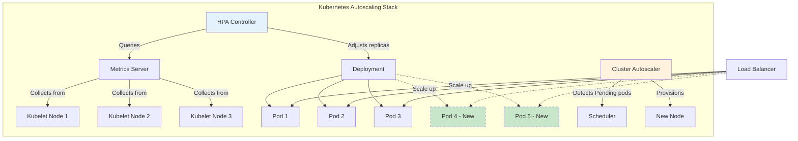
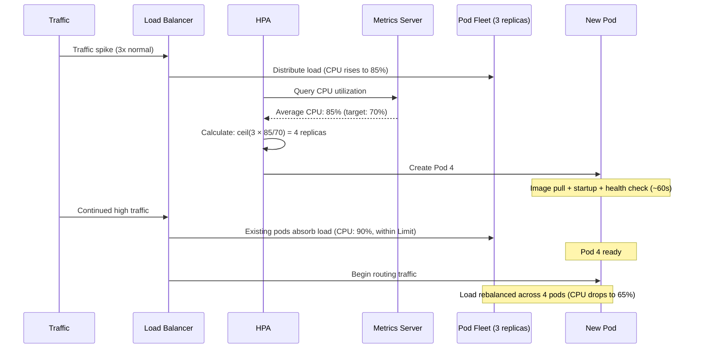

# Autoscaling

## 1. Overview

Autoscaling is the ability of a system to automatically adjust its compute capacity based on real-time demand. Instead of provisioning for peak traffic 24/7 (wasting money) or provisioning for average traffic (crashing during spikes), autoscaling dynamically adds and removes instances to match the current load. In the Kubernetes ecosystem, this is primarily achieved through the Horizontal Pod Autoscaler (HPA), which monitors resource metrics and adjusts the number of pod replicas accordingly.

Manual scaling is obsolete for any system that experiences variable traffic. The question is not whether to autoscale but how to configure it correctly -- setting the right thresholds, choosing the right metrics, and understanding the scaling latency that determines whether your system survives a sudden surge.

## 2. Why It Matters

- **Cost optimization.** Infrastructure cost is dominated by compute (70-80% of cluster expenses). Autoscaling ensures you are not paying for idle capacity during off-peak hours while having sufficient capacity during peaks.
- **Availability during surges.** Traffic spikes -- whether from a viral moment, a marketing campaign, or a live event -- can overwhelm fixed-capacity systems. Autoscaling responds to demand before users experience degradation.
- **Operational simplicity.** Rather than manually monitoring dashboards and issuing scaling commands, autoscaling codifies your scaling policy as configuration. This removes the human from the critical path.
- **Resource efficiency.** Autoscaling works in both directions. Scaling down during low-traffic periods reclaims resources for other workloads or reduces cloud costs.

## 3. Core Concepts

- **Horizontal Pod Autoscaler (HPA):** A Kubernetes controller that adjusts the number of pod replicas based on observed metrics (CPU, memory, or custom metrics). The standard autoscaling mechanism in Kubernetes.
- **Vertical Pod Autoscaler (VPA):** Adjusts the CPU and memory requests/limits of individual pods rather than changing the number of replicas. Useful for workloads that cannot scale horizontally.
- **Cluster Autoscaler:** Adjusts the number of nodes in the Kubernetes cluster. Works in tandem with HPA -- when HPA wants more pods but no node has capacity, the Cluster Autoscaler provisions new nodes.
- **Metrics Server:** A Kubernetes component that collects resource utilization metrics (CPU, memory) from kubelets and makes them available to HPA.
- **Requests and Limits:** Kubernetes resource configuration. Requests are the guaranteed minimum resources; Limits are the maximum. HPA decisions are based on utilization relative to Requests.
- **Target Utilization:** The desired average utilization across all replicas. When actual utilization exceeds the target, HPA scales up; when it drops below, HPA scales down.
- **Cooldown Period:** The minimum time between scaling actions. Prevents thrashing (rapid scale-up/scale-down cycles).
- **Scaling Latency:** The time from when a scaling decision is made to when the new instance is ready to serve traffic. Includes container image pull, startup, health check pass, and LB registration.

## 4. How It Works

### HPA Mechanics

The HPA control loop runs every 15 seconds (configurable):

1. **Collect metrics:** Query the Metrics Server for current CPU/memory utilization of all pods in the target deployment.
2. **Calculate desired replicas:**

```
desiredReplicas = ceil(currentReplicas × (currentMetricValue / targetMetricValue))
```

For example, if you have 3 replicas at 90% CPU and your target is 60%:

```
desiredReplicas = ceil(3 × (90 / 60)) = ceil(4.5) = 5
```

3. **Apply constraints:** Ensure desired replicas are within the configured min/max bounds.
4. **Execute scaling:** Update the deployment's replica count. Kubernetes scheduler places new pods on available nodes.

### Resource Requests, Limits, and the 80% Rule

A critical HPA strategy is to trigger scaling at approximately 80% of the resource limit:

- **Requests:** The guaranteed baseline (e.g., 250m CPU, 256Mi memory). The scheduler uses this to place pods on nodes.
- **Limits:** The maximum allowed (e.g., 500m CPU, 512Mi memory). The pod is throttled or killed if it exceeds this.
- **HPA target:** Set at ~80% of the Limit. This creates a "bandwidth buffer" -- the pod can temporarily burst up to its Limit while the new replica is spinning up.

```yaml
# Example HPA configuration
apiVersion: autoscaling/v2
kind: HorizontalPodAutoscaler
metadata:
  name: web-service
spec:
  scaleTargetRef:
    apiVersion: apps/v1
    kind: Deployment
    name: web-service
  minReplicas: 3
  maxReplicas: 50
  metrics:
  - type: Resource
    resource:
      name: cpu
      target:
        type: Utilization
        averageUtilization: 70
  behavior:
    scaleUp:
      stabilizationWindowSeconds: 30
      policies:
      - type: Percent
        value: 100
        periodSeconds: 60
    scaleDown:
      stabilizationWindowSeconds: 300
```

### Scaling Latency Budget

When a spike hits, the system must scale before degradation reaches users:

| Phase | Typical Duration | Notes |
|---|---|---|
| Metric collection + HPA decision | 15-30 seconds | HPA loop interval |
| Pod scheduling | 1-5 seconds | Assuming node capacity exists |
| Container image pull | 5-30 seconds | Depends on image size and caching |
| Application startup | 5-60 seconds | Depends on application (Spring Boot: 30s+, Go: <1s) |
| Health check pass | 10-30 seconds | Readiness probe must pass |
| Load balancer registration | 5-15 seconds | LB discovers and routes to new pod |
| **Total scaling latency** | **~40 seconds - 3 minutes** | **Must survive this gap with existing capacity** |

This is why the 80% rule matters: during the 40s-3m scaling latency, existing pods must absorb the excess load using their burst capacity (between Request and Limit).

### Cluster Autoscaler Integration

When HPA requests more pods than the cluster can accommodate:

1. HPA requests 5 new pods.
2. Kubernetes scheduler cannot place 3 of them (insufficient node resources).
3. Pods enter "Pending" state.
4. Cluster Autoscaler detects Pending pods and provisions new nodes from the cloud provider.
5. Node provisioning takes 2-5 minutes (cloud provider dependent).
6. Scheduler places Pending pods on new nodes.

**Total time for new-node scaling: 3-8 minutes.** This is why you should always maintain some headroom in your cluster and consider pre-warming nodes for predictable traffic patterns.

## 5. Architecture / Flow





## 6. Types / Variants

### Traffic Patterns and Scaling Strategies

| Pattern | Description | Example | Scaling Strategy |
|---|---|---|---|
| **Predictable Spike** | Known in advance (time of day, scheduled event) | Netflix movie release, Black Friday | **Pre-warming:** Scale up infrastructure ahead of the event. Do not rely on reactive scaling. |
| **Unpredictable Spike** | Sudden, unexpected surge | YouTube viral video, breaking news, celebrity tweet | **Aggressive reactive scaling:** Low HPA thresholds (60-70%), high maxReplicas, warm standby capacity. |
| **Interconnected Spike** | Spike in one service triggers cascade in others | Hotstar: cricket wicket → "Back" button spike → homepage service overload | **Correlated scaling:** Scale dependent services together. Monitor upstream signals, not just local metrics. |
| **Diurnal Pattern** | Regular daily cycle (peak during business hours) | Enterprise SaaS, e-commerce | **Scheduled scaling:** Scale up at 8am, scale down at 10pm using CronJobs or scheduled scaling policies. |
| **Gradual Growth** | Steady increase over weeks/months | Growing user base | **Baseline adjustment:** Periodically increase minReplicas and node capacity as the baseline grows. |

### Autoscaling Mechanisms Compared

| Mechanism | What Scales | Based On | Latency | Use Case |
|---|---|---|---|---|
| **HPA** | Pod replicas | CPU, memory, custom metrics | 30-120 seconds | Stateless application services |
| **VPA** | Pod resource requests/limits | Historical utilization | Requires pod restart | Single-instance workloads, databases |
| **Cluster Autoscaler** | Nodes in the cluster | Pending pods | 2-5 minutes | Expanding cluster capacity |
| **KEDA** | Pod replicas | External metrics (queue depth, HTTP rate) | 30-60 seconds | Event-driven workloads, queue consumers |
| **AWS Auto Scaling Groups** | EC2 instances | CloudWatch metrics | 2-5 minutes | Non-Kubernetes workloads |

### Cost Optimization with Spot Instances

With 70-80% of cluster costs in compute, combining autoscaling with spot instances provides dramatic savings:

- **Spot Instances:** Cloud provider excess capacity sold at 60-90% discount. Can be reclaimed with 2-minute notice.
- **On-Demand Instances:** Full price, guaranteed availability. No interruption risk.

**Strategy using Affinity Rules:**
- **Hard Affinity (Required):** Critical workloads (databases, payment processing) must run on On-Demand nodes.
- **Soft Affinity (Preferred):** Stateless workloads (web servers, workers) prefer Spot nodes but fall back to On-Demand if Spot capacity is reclaimed.

This approach yields 30-50% total cluster cost reduction while maintaining availability for critical workloads.

## 7. Use Cases

- **Hotstar (Disney+):** During the 2019 Cricket World Cup, Hotstar auto-scaled to handle 12M+ concurrent viewers. They used a combination of pre-warming (scaling up 2 hours before match start), aggressive HPA (targeting 60% CPU), and interconnected scaling (homepage service scales with live stream events).
- **Netflix:** Pre-warms infrastructure for predictable spikes (movie releases on Fridays) using scheduled scaling. For unpredictable viral moments, aggressive HPA with custom metrics (stream starts per second) triggers rapid scale-out.
- **Uber:** Uses custom metrics (rides requested per second, driver locations updated per second) to drive HPA for each microservice. During surge pricing events, the pricing service and matching service scale independently based on their own demand.
- **GitHub Actions:** KEDA-based autoscaling for CI/CD runners. Scales to zero during idle periods and spins up dozens of runners when a large repository triggers builds.

## 8. Tradeoffs

| Factor | Aggressive Scaling (Low Threshold) | Conservative Scaling (High Threshold) |
|---|---|---|
| **Response to spikes** | Fast -- scales before degradation | Slow -- may degrade before scaling |
| **Cost** | Higher -- more instances running at lower utilization | Lower -- instances run at higher utilization |
| **Stability** | Risk of thrashing (rapid up/down cycles) | More stable but may miss sudden spikes |
| **Resource waste** | Higher -- many pods at 40% utilization | Lower -- pods at 70-80% utilization |

| Factor | HPA (Horizontal) | VPA (Vertical) |
|---|---|---|
| **Scaling speed** | Fast (new pods in seconds) | Slow (requires pod restart) |
| **Disruption** | None (new pods added alongside existing) | Disruptive (existing pods restarted) |
| **State handling** | Requires stateless design | Works with stateful workloads |
| **Cost efficiency** | May over-provision (many small pods) | Efficient (right-sized pods) |
| **Ceiling** | Limited by cluster size | Limited by node size |

## 9. Common Pitfalls

- **Scaling on CPU alone.** CPU utilization is a lagging indicator. By the time CPU hits 80%, requests may already be queuing. Consider scaling on request latency (P99), queue depth, or custom business metrics.
- **Forgetting the Cluster Autoscaler.** HPA without Cluster Autoscaler is like adding guests to a restaurant without checking if there are tables. When HPA requests more pods than nodes can hold, pods sit in Pending state.
- **Setting maxReplicas too low.** If your maxReplicas is 10 and a viral moment requires 50, HPA caps at 10 and your system degrades. Set maxReplicas generously -- you only pay for what you use.
- **Ignoring scaling latency.** A 3-minute scaling latency means your existing pods must absorb 3 minutes of excess load. If they cannot, users experience degradation. The 80% threshold rule exists for this reason.
- **Not testing scale-down behavior.** Scale-down is where thrashing happens. If your system scales up to 20 pods during a spike and immediately scales back to 3 when it subsides, you may oscillate. Use stabilization windows (300-600 seconds for scale-down).
- **Container image too large.** A 2 GB container image takes 30+ seconds to pull. Use multi-stage builds, minimize image layers, and pre-cache images on nodes to reduce scaling latency.
- **Scaling the wrong bottleneck.** Adding more app server pods when the database is the bottleneck just creates more connections to an already saturated database. Always identify the actual bottleneck before scaling.

## 10. Real-World Examples

- **Kubernetes HPA in production (Spotify):** Spotify uses HPA with custom metrics (audio streams per second) to scale its audio streaming service. They found that CPU-based scaling was too slow to respond to sudden playlist-driven spikes.
- **AWS Auto Scaling + Spot (Netflix):** Netflix runs a significant portion of its encoding pipeline on Spot instances. When Spot capacity is reclaimed, the Cluster Autoscaler provisions On-Demand instances as fallback, ensuring encoding jobs complete without interruption.
- **Open Cost (Kubecost):** Integrated with Prometheus, Open Cost translates CPU and memory usage into actual currency. Teams use this visibility to optimize their Requests baseline against actual spend, ensuring the cluster's financial footprint is lean.
- **Google Cloud Run:** A fully managed autoscaling platform that scales to zero. Each incoming request triggers a container to spin up (cold start: 100-500ms). This is the extreme end of autoscaling -- zero cost when idle.

## 11. Related Concepts

- [Load Balancing](./01-load-balancing.md) -- distributing traffic across the scaled pool
- [Scaling Overview](../01-fundamentals/03-scaling-overview.md) -- the strategic context for autoscaling decisions
- [Back-of-Envelope Estimation](../01-fundamentals/07-back-of-envelope-estimation.md) -- estimating the capacity needed for autoscaling configuration
- [Consistent Hashing](./03-consistent-hashing.md) -- stable data distribution as the cache/database layer scales
- [Monitoring](../10-observability/01-monitoring.md) -- the metrics that drive autoscaling decisions
- [Availability and Reliability](../01-fundamentals/04-availability-reliability.md) -- autoscaling as an availability mechanism

## 12. Source Traceability

- source/youtube-video-reports/1.md -- HPA and resource baselining, requests vs limits, 80% threshold strategy, Open Cost/Prometheus integration, spot instances + affinity rules
- source/youtube-video-reports/4.md -- Traffic patterns (predictable/unpredictable/interconnected), serverless scaling, Hotstar 12M concurrent users
- source/youtube-video-reports/5.md -- Auto scaling in Kubernetes, HPA with Metrics Server, exponential backoff and jitter
- source/youtube-video-reports/7.md -- Kubernetes five pillars, deployments, scaling
- source/extracted/acing-system-design/ch05-non-functional-requirements.md -- Scalability as NFR, vertical vs horizontal scaling
