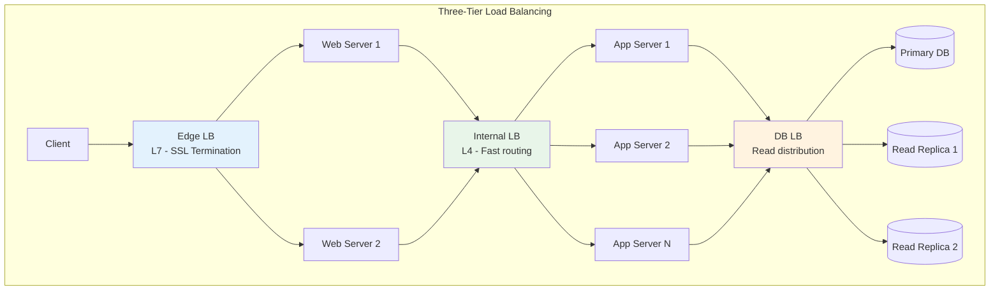
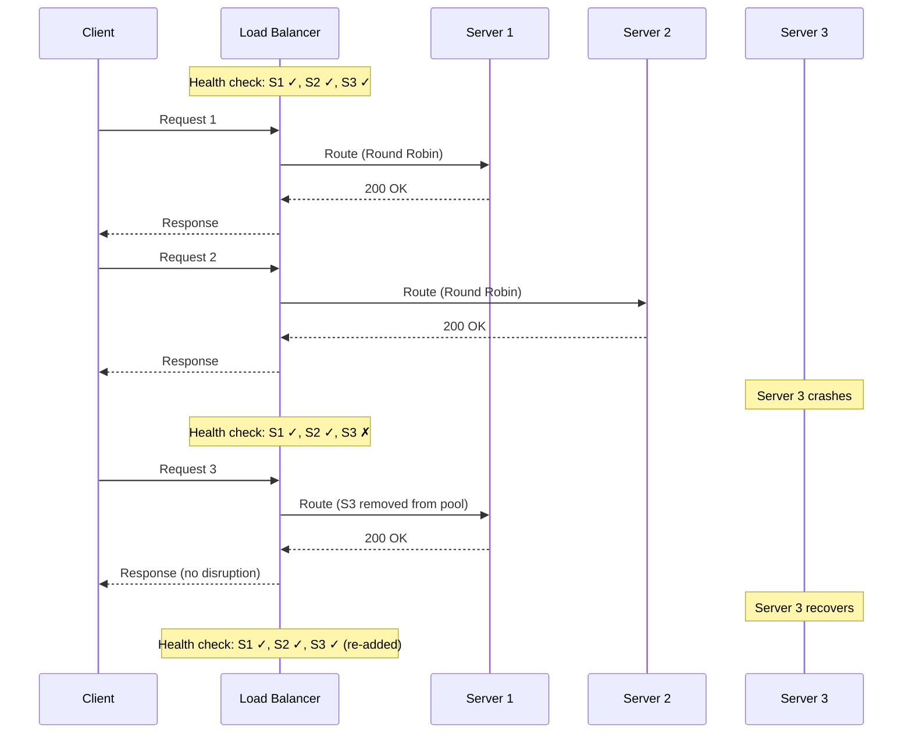
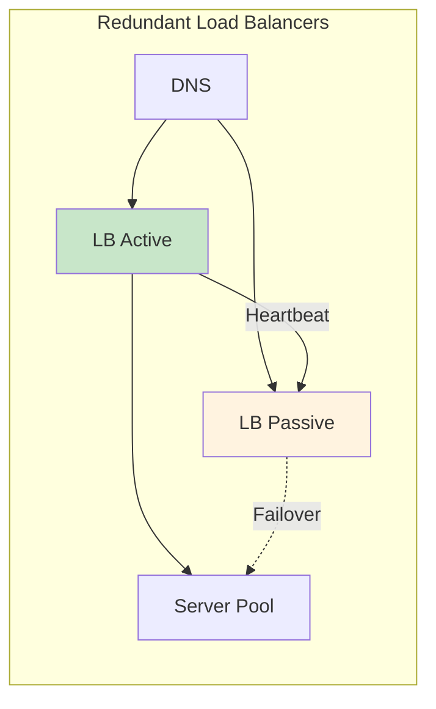

# Load Balancing

## 1. Overview

A load balancer is the traffic controller of distributed systems. It sits between clients and a fleet of backend servers, distributing incoming requests so that no single server becomes a bottleneck while hiding the server topology from the outside world. Beyond simple distribution, a modern load balancer performs health checking (removing unhealthy servers from the pool), SSL termination (offloading encryption from application servers), and connection management (managing persistent connections for WebSockets or HTTP/2).

Load balancing is the first mechanism you deploy when scaling horizontally. Without it, adding servers does nothing -- clients have no way to discover or distribute across them. With it, you achieve both higher throughput (more servers handling requests) and higher availability (failure of one server is absorbed by the others).

## 2. Why It Matters

- **Eliminates single points of failure.** A load balancer routes around failed servers automatically. If one of your ten servers crashes, the remaining nine absorb the traffic with no user impact.
- **Enables horizontal scaling.** Adding servers to the pool is transparent to clients. The load balancer handles discovery and distribution.
- **Improves utilization.** Smart algorithms ensure all servers are working at similar capacity rather than one being overwhelmed while others idle.
- **Provides operational agility.** You can remove servers for maintenance, deploy new versions via rolling updates, and perform canary releases -- all without client awareness.
- **Security boundary.** The reverse proxy function of a load balancer hides internal IP addresses and server topology, presenting a single endpoint to the world.

## 3. Core Concepts

- **Layer 4 (L4) Load Balancing:** Operates at the transport layer (TCP/UDP). Routes based on IP address and port without inspecting packet contents. Extremely fast with minimal overhead.
- **Layer 7 (L7) Load Balancing:** Operates at the application layer (HTTP/HTTPS). Inspects headers, URLs, cookies, and message content for intelligent routing. Slower than L4 but far more flexible.
- **Health Check:** Periodic probe (TCP connect, HTTP GET to /health) to verify a server is responsive. Failed servers are removed from the pool until they recover.
- **Upstream / Backend Pool:** The collection of servers behind the load balancer that actually process requests.
- **Sticky Session (Session Affinity):** Ensuring a specific client always reaches the same server. Required for stateful applications but undermines even load distribution.
- **SSL Termination:** Decrypting HTTPS at the load balancer, forwarding unencrypted HTTP to backend servers. Offloads CPU-intensive cryptography from application servers.
- **Connection Draining:** Allowing in-flight requests to complete on a server being removed from the pool, rather than abruptly dropping connections.
- **Reverse Proxy:** A server-side intermediary that receives requests from clients and forwards them to backend servers. Load balancers function as reverse proxies. See [Networking Fundamentals](../01-fundamentals/networking-fundamentals.md) for proxy details.

## 4. How It Works

### L4 vs. L7: The Fundamental Trade-off

**Layer 4 (Transport Layer):**
- Inspects only: source IP, destination IP, source port, destination port, protocol (TCP/UDP).
- Decision made at the packet level -- no application data is read.
- Extremely fast: operates at line speed with minimal CPU overhead.
- Cannot route based on URL path, HTTP headers, or cookies.
- Use case: when you need raw throughput and all backend servers are identical.

**Layer 7 (Application Layer):**
- Inspects: URL path, query parameters, HTTP headers, cookies, request body.
- Can route `/api/v1/users` to the Users microservice and `/api/v1/orders` to the Orders microservice.
- Supports content-based routing, A/B testing, canary deployments.
- Higher CPU overhead due to packet inspection and potential TLS termination.
- Use case: microservices routing, content-based distribution, feature flags.

| Feature | L4 Load Balancer | L7 Load Balancer |
|---|---|---|
| **OSI Layer** | Transport (TCP/UDP) | Application (HTTP/HTTPS) |
| **Inspection depth** | IP + Port only | Full HTTP request (URL, headers, cookies, body) |
| **Speed** | Faster (no content parsing) | Slower (full request parsing) |
| **Routing intelligence** | Simple (IP/port-based) | Smart (URL, header, cookie-based) |
| **SSL termination** | No (passes through) | Yes |
| **WebSocket support** | Transparent pass-through | Protocol-aware handling |
| **Cost** | Lower | Higher |
| **Use case** | Internal traffic, homogeneous backends | Microservices, content routing, edge |

### Load Balancing Algorithms

| Algorithm | Mechanism | Best For | Weakness |
|---|---|---|---|
| **Round Robin** | Distributes requests sequentially: Server 1, Server 2, ..., Server N, repeat | Stateless servers with similar capacity | Load-agnostic -- may overwhelm a slow server |
| **Weighted Round Robin** | Like Round Robin but servers with higher weights receive proportionally more traffic | Servers with different hardware specs | Requires manual weight configuration |
| **Least Connections** | Routes to the server with the fewest active connections | Requests with variable processing times (long-running queries) | Overhead of tracking connection counts |
| **Least Response Time** | Routes to the server with the fewest connections AND lowest average response time | Mixed workloads needing optimal performance | Higher monitoring overhead |
| **IP Hash** | Hash of client IP determines the server | Sticky sessions, session persistence, WebSocket connections | Uneven distribution if client IP distribution is skewed |
| **Least Bandwidth** | Routes to the server currently handling the least traffic in Mbps | Bandwidth-sensitive workloads (streaming) | Requires continuous bandwidth monitoring |
| **Random** | Random server selection | Quick and simple for large, homogeneous pools | No awareness of server state or load |

### Health Checking

Load balancers perform continuous health checks to maintain an accurate pool of healthy servers:

1. **TCP health check:** Attempts a TCP connection to the server. If the connection succeeds, the server is considered healthy. Fast but does not verify application health.
2. **HTTP health check:** Sends an HTTP GET to a health endpoint (e.g., `/health`). Expects a 200 response. Can verify that the application and its dependencies (database, cache) are functioning.
3. **Intervals and thresholds:** Typically checked every 5-30 seconds. A server is removed after 2-3 consecutive failures and re-added after 2-3 consecutive successes (hysteresis prevents flapping).

### Placement in the Architecture

Load balancers can be placed at three layers:

1. **Between users and web servers (Edge LB):** The public-facing entry point. Handles SSL termination, DDoS protection, and geographic routing.
2. **Between web servers and application/cache servers (Internal LB):** Distributes traffic between microservices within the private network. Internal LBs do not need public IPs.
3. **Between application servers and database servers (Data LB):** Less common, but used for distributing reads across database replicas.

### Global Server Load Balancing (GSLB)

For multi-region deployments, a Global Server Load Balancer distributes traffic across geographic regions:

1. **DNS-based GSLB:** Returns the IP of the nearest healthy region based on the client's geographic location. AWS Route 53 with latency-based routing is a common implementation.
2. **Anycast-based GSLB:** All regions advertise the same IP address via BGP. Network routing naturally directs packets to the nearest region. Used by Cloudflare and Google.
3. **Application-layer GSLB:** A global proxy (like Cloudflare Workers or AWS CloudFront) inspects the request and routes to the optimal backend region.

| Method | Routing Granularity | Failover Speed | Complexity |
|---|---|---|---|
| **DNS-based** | Per DNS TTL (60-300 seconds) | Slow (must wait for TTL expiry) | Low |
| **Anycast** | Per packet (instant) | Fast (BGP reconverges in seconds) | Medium |
| **Application-layer** | Per request (instant) | Fast | High |

### Connection Handling Patterns

- **Keep-Alive Connections:** HTTP/1.1 keep-alive and HTTP/2 multiplexing reduce connection setup overhead. The load balancer maintains persistent connections to backend servers (connection pooling) rather than establishing new TCP connections for every request.
- **WebSocket Pass-through:** For WebSocket connections, the load balancer upgrades the HTTP connection and maintains a persistent bidirectional channel. IP Hash or sticky sessions ensure the client maintains its connection to the same backend.
- **gRPC Load Balancing:** gRPC uses HTTP/2 with multiplexed streams over a single TCP connection. L4 load balancing sends all streams to one server; L7 load balancing (required for even distribution) can route individual gRPC calls to different servers.

## 5. Architecture / Flow

## 6. Types / Variants

### Software vs. Hardware Load Balancers

| Type | Examples | Pros | Cons |
|---|---|---|---|
| **Hardware LB** | F5 BIG-IP, Citrix ADC | Extreme throughput, dedicated ASICs | Expensive ($10K-$100K+), inflexible, vendor lock-in |
| **Software LB** | Nginx, HAProxy, Envoy | Flexible, programmable, commodity hardware | CPU overhead, requires tuning |
| **Cloud LB** | AWS ALB/NLB, GCP Cloud LB, Azure LB | Managed, elastic, integrated with cloud ecosystem | Cost scales with traffic, limited customization |

### Cloud Load Balancer Types (AWS)

| AWS Service | Layer | Key Feature | Use Case |
|---|---|---|---|
| **ALB (Application LB)** | L7 | Content-based routing, WebSocket support, WAF integration | Microservices, HTTP/HTTPS workloads |
| **NLB (Network LB)** | L4 | Ultra-low latency, static IP, preserves client IP | TCP/UDP workloads, high-throughput |
| **CLB (Classic LB)** | L4/L7 | Legacy, being deprecated | Only for existing legacy deployments |
| **GWLB (Gateway LB)** | L3 | Inline traffic inspection | Firewalls, IDS/IPS appliances |

### Reverse Proxy vs. Load Balancer

While often used interchangeably, they have distinct primary purposes:

| Feature | Reverse Proxy | Load Balancer |
|---|---|---|
| **Primary purpose** | Protecting and optimizing server access | Distributing traffic across servers |
| **Caching** | Yes (static assets, API responses) | Typically no |
| **SSL termination** | Yes | Yes (L7 only) |
| **Compression** | Yes (gzip/brotli) | Typically no |
| **Traffic distribution** | Can do basic distribution | Primary function with sophisticated algorithms |
| **Health checking** | Basic | Sophisticated with configurable intervals/thresholds |
| **Examples** | Nginx, Varnish | HAProxy, AWS ALB/NLB, Envoy |

In practice, tools like Nginx and Envoy serve both roles simultaneously.

## 7. Use Cases

- **Netflix:** Uses a combination of AWS NLB (L4) for raw TCP traffic and custom Zuul gateway (L7) for intelligent routing, canary deployments, and A/B testing. Each microservice has its own load balancer.
- **Ticketmaster:** During surge events (Taylor Swift ticket sales), load balancers work with virtual waiting rooms to throttle ingress and prevent backend collapse. Health checks aggressively remove struggling servers. Cross-link to [Rate Limiting](../08-resilience/rate-limiting.md).
- **Facebook:** Uses custom L4 load balancers (Katran, based on eBPF/XDP) that operate at kernel level for maximum throughput. Backend routing is handled by a separate L7 layer.
- **Uber:** Uses Envoy as a sidecar proxy in its service mesh, providing L7 load balancing, circuit breaking, and observability for inter-service communication.

## 8. Tradeoffs

| Decision | Option A | Option B | Guidance |
|---|---|---|---|
| **L4 vs L7** | L4: Fast, simple, no content inspection | L7: Smart routing, SSL termination, content-aware | L4 for internal homogeneous services; L7 for edge and microservices routing |
| **Round Robin vs Least Connections** | RR: Simple, fair for similar workloads | LC: Adaptive for variable processing times | RR as default; LC when request processing times vary significantly |
| **Sticky vs Stateless** | Sticky: Required for session state on server | Stateless: Even distribution, simpler failover | Externalize state (Redis) and avoid sticky sessions when possible |
| **Single LB vs Redundant** | Single: Simpler, cheaper | Redundant: Eliminates LB as SPOF | Always redundant in production -- the LB itself must not be a SPOF |
| **Software vs Cloud-managed** | Software: Full control, portable | Cloud: Managed, elastic, less ops | Cloud-managed for most use cases; software for specific customization needs |

## 9. Common Pitfalls

- **Load balancer as a single point of failure.** A single load balancer in front of 50 redundant servers gives you zero additional availability. Always deploy redundant LBs (active-passive or active-active).
- **Sticky sessions masking stateful design.** If your application requires sticky sessions, it is a signal that session state should be externalized to Redis or a database, not stored on the app server.
- **Ignoring health check configuration.** Default health checks may be too infrequent (missing a crashed server for 30+ seconds) or too sensitive (removing a server during a brief GC pause). Tune intervals and thresholds for your workload.
- **L7 load balancing for everything.** L7 inspection adds latency and CPU overhead. For internal service-to-service traffic where all backends are identical, L4 is faster and cheaper.
- **Not accounting for connection limits.** Each load balancer has a maximum concurrent connection count. AWS ALB supports ~100K concurrent connections per target. Plan for this ceiling during peak traffic.
- **Forgetting about the "Thundering Herd" on server recovery.** When a failed server recovers and is re-added to the pool, the load balancer may immediately send it a surge of requests. Use gradual warm-up (slow start) to ramp traffic to the recovered server.

## 10. Real-World Examples

- **GitHub:** Experienced repeated outages when their load balancer failed to properly health-check database connections. Requests were routed to app servers that had lost database connectivity, resulting in cascading 500 errors.
- **Cloudflare:** Operates one of the world's largest L4/L7 load balancing networks. Uses anycast routing so that every Cloudflare IP address routes to the nearest data center. Their load balancers handle SSL termination, DDoS mitigation, and WAF filtering.
- **Airbnb:** Uses Envoy proxy as both an edge load balancer and a sidecar for service mesh. This unified approach provides consistent L7 routing, observability, and circuit breaking across all services.
- **Google:** Developed Maglev, a custom L4 load balancer that uses consistent hashing to distribute packets across backend servers. Maglev is designed for line-rate packet processing (~10 million packets per second per machine) using a kernel-bypass architecture.

## 11. Related Concepts

- [Networking Fundamentals](../01-fundamentals/networking-fundamentals.md) -- OSI layers, TCP/UDP, reverse proxy details
- [Autoscaling](./autoscaling.md) -- dynamically adjusting the server pool behind the load balancer
- [Consistent Hashing](./consistent-hashing.md) -- distribution algorithm used in advanced load balancing
- [API Gateway](../06-architecture/api-gateway.md) -- application-layer routing, authentication, rate limiting
- [Availability and Reliability](../01-fundamentals/availability-reliability.md) -- load balancing as an availability mechanism
- [Rate Limiting](../08-resilience/rate-limiting.md) -- traffic throttling often implemented at the LB layer

## 12. Source Traceability

- source/youtube-video-reports/1.md -- Load balancing algorithms (IP hash, round robin, least connections), forward vs reverse proxy
- source/youtube-video-reports/2.md -- 3-stage infrastructure maturity model, API gateway vs LB vs reverse proxy comparison table
- source/youtube-video-reports/3.md -- L4 vs L7, algorithm comparison table, complexity budget
- source/youtube-video-reports/5.md -- L4 vs L7 detailed comparison, external vs internal LBs, reverse proxy as NAT
- source/youtube-video-reports/9.md -- Load balancers, L4 vs L7
- source/extracted/grokking/ch243-benefits-of-load-balancing.md -- LB placement (3 layers), benefits
- source/extracted/grokking/ch245-redundant-load-balancers.md -- LB algorithms, health checks, redundant LBs
- source/extracted/system-design-guide/ch07-distributed-systems-building-blocks-dns-load-balancers-and-a.md -- Load balancer fundamentals
