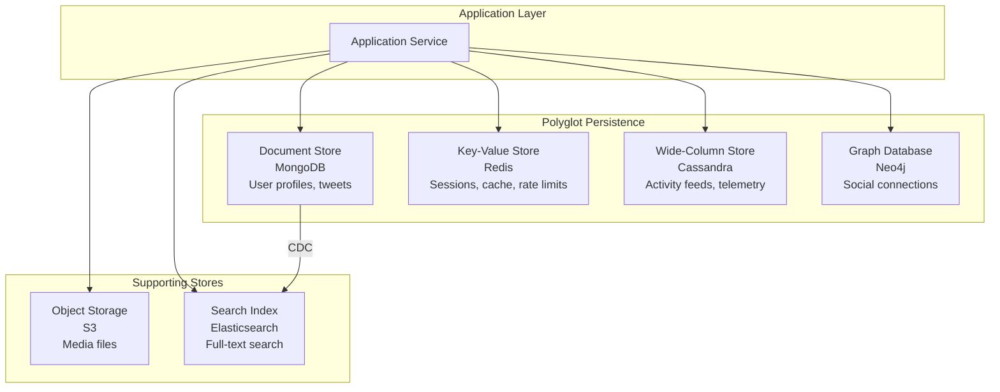

# NoSQL Databases

## 1. Overview

NoSQL is not a single technology --- it is an umbrella term for every database that abandons the relational model's rigid table-join-transaction paradigm in favor of a data model optimized for a specific access pattern. The four major families --- document stores, key-value stores, wide-column stores, and graph databases --- each make a deliberate tradeoff: they sacrifice the generality of SQL to achieve superior performance, horizontal scalability, or modeling flexibility for their target workload.

The decision to use NoSQL is never "SQL is bad." It is "my access pattern is known, my data shape is non-tabular, or my write volume exceeds what a single relational node can sustain." When you hear an architect say "polyglot persistence," they mean choosing the right storage engine for each data shape in the system.

## 2. Why It Matters

Modern distributed systems routinely handle data volumes and velocity that a single relational node cannot serve:

- **Netflix** ingests millions of telemetry events per second --- Cassandra handles this write throughput where Postgres would choke.
- **Twitter** stores tweets as self-contained JSON documents in Manhattan (an internal document store) because a tweet's schema is heterogeneous (text, media IDs, hashtags, geo-tags).
- **Tinder** records 100K+ swipes per second in Cassandra because the append-only write path avoids the random I/O overhead of B-tree updates.
- **Social graphs** with billions of edges are naturally modeled as nodes and relationships, not as join tables.

Choosing the wrong database model means fighting the storage engine instead of leveraging it.

## 3. Core Concepts

- **Schema-on-read**: NoSQL databases typically enforce schema at read time, not write time. This allows heterogeneous documents within the same collection.
- **Denormalization**: Data is duplicated across records to satisfy queries without joins. Storage is cheap; cross-node joins are catastrophic.
- **Horizontal scaling**: Most NoSQL databases distribute data across nodes via consistent hashing or range partitioning.
- **Eventual consistency**: Many NoSQL systems favor availability over immediate consistency (AP in CAP theorem). See [CAP Theorem](../01-fundamentals/05-cap-theorem.md).
- **Polyglot persistence**: Using multiple database types within a single system, each optimized for its workload.
- **Partition key**: The field used to determine which node stores the data. A good partition key has high cardinality and even distribution.

## 4. How It Works

### Document Stores (MongoDB, CouchDB, Firestore)

Data is stored as self-contained JSON-like documents within collections. Each document can have a different structure. Queries retrieve entire documents by key or by field-level queries with indexes.

```json
{
  "tweet_id": "abc123",
  "user_id": "user_456",
  "text": "System design is about tradeoffs",
  "hashtags": ["#systemdesign", "#architecture"],
  "media_urls": ["s3://bucket/img1.jpg"],
  "geo": { "lat": 37.7749, "lng": -122.4194 },
  "engagement": { "likes": 142, "retweets": 37, "replies": 12 },
  "created_at": "2025-03-15T10:30:00Z"
}
```

Document stores like MongoDB provide rich query capabilities including:
- **Field-level queries**: `db.tweets.find({ "user_id": "user_456" })`
- **Nested field queries**: `db.tweets.find({ "engagement.likes": { "$gt": 100 } })`
- **Aggregation pipeline**: Multi-stage data transformations (match, group, sort, project)
- **Secondary indexes**: B-tree indexes on any field or nested field
- **Text indexes**: Basic full-text search (though Elasticsearch is preferred for production search)
- **Geospatial indexes**: 2dsphere indexes for location-based queries

MongoDB scales horizontally through automatic sharding. A shard key determines how documents are distributed across shards. Once chosen, the shard key cannot be changed without rebuilding the collection --- making this a critical upfront design decision.

**When to use**: Rapidly evolving schemas, hierarchical data, content management, catalog systems where each item has variable attributes. Document stores shine when the "unit of retrieval" is a self-contained document that does not require joins with other collections.

### Key-Value Stores (Redis, DynamoDB, Memcached)

The simplest model: a hash map where every lookup is `GET key -> value`. Values can be strings, JSON blobs, or binary data. Lookups are O(1). Range queries are not supported (unless the store adds a sort key, as DynamoDB does).

Key-value stores vary significantly in capability:

| Store | Value Types | Persistence | Range Queries | Max Value Size |
|---|---|---|---|---|
| **Redis** | Strings, hashes, sorted sets, streams, geo | Optional (RDB/AOF) | Only via sorted sets | 512 MB |
| **Memcached** | Strings only | None | No | 1 MB |
| **DynamoDB** | Rich types (maps, lists, sets, numbers) | Fully durable | Yes (via sort key) | 400 KB per item |
| **Riak** | Opaque binary blobs | Durable (Bitcask/LevelDB) | No | Unlimited |

DynamoDB extends the pure key-value model with a composite primary key (partition key + sort key), which enables range queries within a partition. This makes it a hybrid between key-value and wide-column stores. See [DynamoDB](./08-dynamodb.md) for details.

**When to use**: Session storage, caching, feature flags, rate limiter counters, leaderboards. Any workload where access is exclusively by primary key. If you need richer data structures (sorted sets, geospatial), Redis is the default. If you need managed durability at scale, DynamoDB is the default on AWS.

### Wide-Column Stores (Cassandra, HBase, Bigtable)

Data is organized into rows with a partition key, but each row can have a different set of columns. Rows within a partition are sorted by a clustering key. This model excels at high-velocity, append-heavy writes.

The wide-column model is often confused with the document model, but there is a critical architectural difference: wide-column stores are designed for **query-driven data modeling**. You design your tables around your queries, duplicating data as needed. This is the opposite of the relational approach where you normalize first and query second.

Example: Cassandra table for a messaging inbox:
```cql
CREATE TABLE messages_by_user (
    user_id UUID,
    message_timestamp TIMESTAMP,
    sender_id UUID,
    message_text TEXT,
    PRIMARY KEY ((user_id), message_timestamp)
) WITH CLUSTERING ORDER BY (message_timestamp DESC);
```

The partition key `(user_id)` determines which node stores the data. The clustering key `message_timestamp DESC` ensures messages are stored in reverse chronological order within the partition, so "get latest 25 messages" is a single sequential disk read.

Wide-column stores achieve massive write throughput because they use an LSM tree storage engine (commit log -> MemTable -> SSTable) that converts all writes into sequential I/O. See [Database Indexing](./04-database-indexing.md) for the LSM tree internals.

**When to use**: Time-series data, IoT telemetry, activity feeds, messaging inboxes --- any workload with massive write throughput and known query patterns. If your queries require joins or ad-hoc filtering, a relational database is a better fit. See [Cassandra](./07-cassandra.md) for a deep dive.

### Graph Databases (Neo4j, Amazon Neptune, JanusGraph)

Data is modeled as nodes (entities) and edges (relationships), each with properties (key-value pairs). Traversals --- "find all friends of friends who like jazz" --- run in O(depth) rather than the O(n) of relational joins across multiple tables.

Graph databases use two primary query languages:
- **Cypher (Neo4j)**: Declarative, SQL-like pattern matching.
  ```cypher
  MATCH (user:Person)-[:FOLLOWS]->(friend:Person)-[:LIKES]->(genre:Genre {name: "Jazz"})
  WHERE user.name = "Alice"
  RETURN friend.name
  ```
- **Gremlin (Apache TinkerPop)**: Imperative traversal steps.
  ```
  g.V().has('name', 'Alice').out('FOLLOWS').out('LIKES').has('name', 'Jazz').path()
  ```

The key advantage of graph databases is **index-free adjacency**: each node directly references its neighbors in memory, so traversing a relationship is a pointer dereference (O(1)) rather than an index lookup (O(log n)). This makes multi-hop traversals dramatically faster than equivalent SQL queries with multiple self-joins.

**Limitations**: Graph databases struggle with horizontal scaling. Most production deployments run on a single powerful node (Neo4j Enterprise supports causal clustering for read replicas but not sharding). For massive graphs (billions of edges), distributed graph systems like JanusGraph (backed by Cassandra or HBase) sacrifice some traversal performance for horizontal scale.

**When to use**: Social networks, fraud detection (detect circular money flows), recommendation engines, knowledge graphs, access control hierarchies. If your core queries are "who is connected to whom, and how" --- use a graph database. If your core queries are key-value lookups or time-range scans, use a key-value or wide-column store instead.

### CAP Theorem and NoSQL

The CAP theorem dictates that during a network partition, a distributed database must choose between consistency and availability. Most NoSQL databases make this choice explicit:

- **CP (Consistency + Partition tolerance)**: MongoDB (with majority write concern), HBase. These systems may reject writes or return errors during partitions to ensure consistency.
- **AP (Availability + Partition tolerance)**: Cassandra (with low consistency levels), CouchDB, DynamoDB (with eventual consistency reads). These systems continue accepting reads and writes during partitions, at the risk of serving stale data.

In practice, the binary CP/AP classification is an oversimplification. Cassandra and DynamoDB offer **tunable consistency**, allowing per-request tradeoffs:

- A Cassandra query with `CONSISTENCY ALL` behaves like a CP system (all replicas must respond).
- The same Cassandra cluster with `CONSISTENCY ONE` behaves like an AP system (one replica suffices).
- A DynamoDB `GetItem` with `ConsistentRead=true` provides strong consistency; without it, eventual consistency.

The correct choice depends on the specific operation, not the entire system. A banking transfer needs strong consistency; a social media "likes" count tolerates eventual consistency. See [CAP Theorem](../01-fundamentals/05-cap-theorem.md) for a deeper treatment.

### Query-Driven vs Entity-Driven Data Modeling

The most fundamental difference between SQL and NoSQL data modeling:

**Entity-driven (SQL)**: Start with entities (Users, Orders, Products). Normalize them into tables. Write any query you need later --- the optimizer handles it.

**Query-driven (NoSQL)**: Start with your access patterns. Design tables to serve those specific queries. Denormalize aggressively. If a new query pattern emerges that the existing tables cannot serve efficiently, you may need to create a new table with the same data in a different shape.

This means NoSQL data modeling requires **more upfront design effort** but rewards you with predictable, low-latency performance at scale. It also means that changing access patterns is expensive --- you may need to backfill and migrate data to new table structures. This is the core tradeoff.

## 5. Architecture / Flow



## 6. Types / Variants

| Type | Examples | Data Model | Query Pattern | Consistency | Scale Model |
|---|---|---|---|---|---|
| **Document** | MongoDB, CouchDB, Firestore | JSON documents in collections | Field-level queries, aggregation pipeline | Tunable (strong or eventual) | Sharded by document key |
| **Key-Value** | Redis, DynamoDB, Memcached | Key -> opaque value | GET/SET by key only | Eventual (Redis) or tunable (DynamoDB) | Consistent hashing |
| **Wide-Column** | Cassandra, HBase, Bigtable | Row key + column families | Partition key + range on clustering key | Tunable (Cassandra: ANY to ALL) | Consistent hashing with vnodes |
| **Graph** | Neo4j, Neptune, JanusGraph | Nodes + edges + properties | Traversal queries (Cypher, Gremlin) | Strong (single-node Neo4j) | Limited horizontal scaling |

### SQL vs NoSQL Decision Matrix

| Criterion | Choose SQL | Choose NoSQL |
|---|---|---|
| **Data relationships** | Complex joins and referential integrity required | Self-contained records; joins are rare |
| **Schema stability** | Schema is well-defined and stable | Schema evolves rapidly or varies per record |
| **Consistency** | ACID is mandatory (financial, inventory) | Eventual consistency is acceptable |
| **Scale** | < 10K writes/sec, < 70 TB | Write-heavy or > 100 TB distributed |
| **Query flexibility** | Ad-hoc queries, analytics, reports | Access pattern is known at design time |

## 7. Use Cases

- **MongoDB at Forbes**: Content management system where articles have variable structure (some have videos, some have interactive charts, some are text-only).
- **Redis at Twitter**: In-memory cache for home timelines, session storage, and rate limiting. See [Redis](../04-caching/02-redis.md).
- **DynamoDB at Amazon**: Shopping cart and order history serving millions of requests per second with single-digit millisecond latency. See [DynamoDB](./08-dynamodb.md).
- **Cassandra at Netflix**: Stores viewing history, telemetry, and operational metrics at 1M+ writes/sec across global data centers. See [Cassandra](./07-cassandra.md).
- **Neo4j at eBay**: Shipping route optimization and fraud detection where relationship traversal outperforms relational joins by orders of magnitude.
- **Cassandra at Tinder**: Records swipe events at 100K+ writes/sec using Cassandra's append-only write path.

## 8. Tradeoffs

| Advantage | Disadvantage |
|---|---|
| Horizontal scaling is native to the architecture | No cross-partition joins; data must be denormalized |
| Schema flexibility supports evolving requirements | Schema-on-read can mask bugs; no compile-time safety |
| Optimized for specific access patterns (massive reads or writes) | Poor performance for access patterns the store was not designed for |
| High availability via replication and partition tolerance | Eventual consistency introduces stale-read risk |
| Lower operational cost at extreme scale (commodity hardware) | Requires upfront query-driven data modeling; changes are expensive |

## 9. Common Pitfalls

- **Choosing NoSQL to avoid learning SQL**: If your access pattern includes ad-hoc joins and complex aggregations, a relational database is almost certainly the right choice.
- **Low-cardinality partition keys**: A partition key like `is_premium` (true/false) creates exactly two partitions and a catastrophic hot spot. Use high-cardinality keys like `user_id`.
- **Treating a document store like a relational database**: Attempting multi-collection joins in MongoDB recreates the worst aspects of SQL without the optimizer. Denormalize instead.
- **Ignoring the write amplification of wide-column stores**: Cassandra's compaction merges SSTables in the background. Without proper compaction strategy tuning, disk usage can double.
- **Assuming all NoSQL databases are eventually consistent**: DynamoDB supports strong consistency reads. Cassandra supports QUORUM and ALL consistency levels. Understand the tuning options.

## 10. Real-World Examples

- **Twitter (Manhattan)**: An internal document store that replaced MySQL for tweet storage. Tweets are retrieved as self-contained JSON objects without joins, matching the read-heavy, key-based access pattern.
- **Discord**: Uses Cassandra for message storage, handling billions of messages with a partition key of `(channel_id, bucket)` and clustering key of `message_id` for time-ordered retrieval.
- **Uber**: Uses a combination of MySQL (Schemaless) for trip data, Cassandra for real-time telemetry, and Redis for geocoding caches.
- **Pinterest**: Uses HBase for pin storage and Redis for recommendations, demonstrating polyglot persistence at scale.

## 11. Related Concepts

- [SQL Databases](./01-sql-databases.md) --- when relational guarantees are required
- [Cassandra](./07-cassandra.md) --- deep dive into wide-column architecture
- [DynamoDB](./08-dynamodb.md) --- deep dive into AWS managed key-value/document store
- [Redis](../04-caching/02-redis.md) --- in-memory key-value store for caching and data structures
- [Database Indexing](./04-database-indexing.md) --- indexing strategies across SQL and NoSQL

## 12. Source Traceability

- source/youtube-video-reports/2.md (SQL vs NoSQL, Cassandra write path, document stores)
- source/youtube-video-reports/3.md (Storage engines by use case)
- source/youtube-video-reports/4.md (Relational vs NoSQL decision matrix, Redis, sharding)
- source/youtube-video-reports/5.md (DynamoDB deep dive, consistency models)
- source/youtube-video-reports/6.md (Partitioning, time-series DBs)
- source/youtube-video-reports/7.md (Five DB types, normalization vs denormalization, Cassandra deep dive)
- source/youtube-video-reports/8.md (SQL vs NoSQL, caching, CAP)
- source/extracted/ddia/ch03-data-models-and-query-languages.md (Relational vs document model)
- source/extracted/ddia/ch04-storage-and-retrieval.md (Storage engines)
