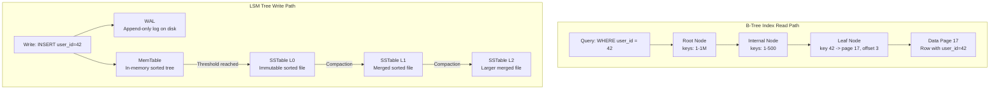
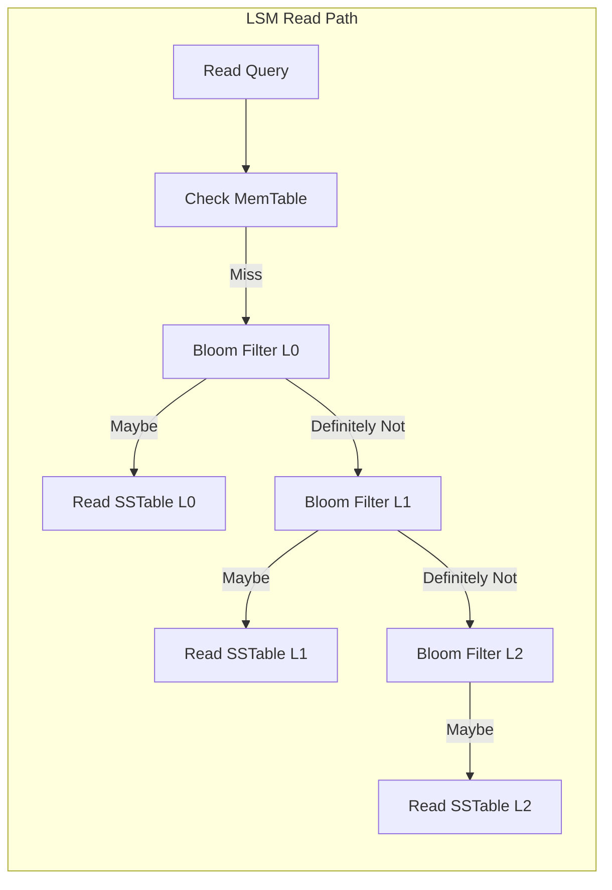

# Database Indexing

## 1. Overview

An index is a secondary data structure maintained alongside your primary data that trades write overhead for dramatically faster reads. Without an index, every query requires a full table scan --- reading every 8 KB page from disk into RAM, one by one, to find a single record. For a table of 100 million users, this takes seconds. With a well-chosen index, the same lookup completes in milliseconds.

The fundamental tradeoff is inescapable: **every index speeds up reads but slows down writes**, because the index must be updated on every INSERT, UPDATE, and DELETE. As a senior architect, your job is to choose indexes that match your actual query patterns --- not to index everything, and not to index nothing.

Two storage engine families dominate: **B-trees** (the standard for disk-based relational databases) and **LSM trees** (optimized for write-heavy workloads in systems like Cassandra, RocksDB, and LevelDB). Understanding when to use each is a prerequisite for any serious data architecture decision.

## 2. Why It Matters

- A missing index on a WHERE clause column turns a 2 ms query into a 30-second full table scan, destroying user experience and saturating database CPU.
- An unnecessary index on a write-heavy table adds latency to every insert and consumes disk space for a structure that is never queried.
- Choosing the wrong index type (B-tree vs hash) for your access pattern wastes I/O on every operation.
- At scale, the choice between B-tree and LSM tree storage engines determines whether your system can sustain 500K writes/sec or caps at 10K writes/sec.

## 3. Core Concepts

- **Primary index**: Created automatically on the primary key. Determines physical row ordering in clustered-index databases (MySQL InnoDB).
- **Secondary index**: Created on non-primary columns to accelerate queries on those columns. Points to the primary key or row location.
- **Composite (compound) index**: An index on multiple columns. Column order matters: an index on `(country, city)` can serve queries on `country` alone but not `city` alone.
- **Covering index**: An index that contains all columns needed by a query, eliminating the need to read the actual data page (index-only scan).
- **Write penalty**: The performance cost of maintaining the index on every write operation.
- **Selectivity**: The ratio of distinct values to total rows. High selectivity (many unique values) makes an index useful; low selectivity (few unique values like boolean flags) makes it wasteful.
- **Full table scan**: Reading every row in the table sequentially. This is O(n) and is what happens without a relevant index.

## 4. How It Works

### B-Tree Indexes

The B-tree is the industry standard for disk-based databases (PostgreSQL, MySQL, Oracle). It maintains a balanced, sorted tree structure where:

1. **Root node** contains range pointers to child nodes.
2. **Internal nodes** contain keys and pointers that subdivide the key range.
3. **Leaf nodes** contain the actual key values and pointers to data pages (row locations).

**Properties:**
- The tree is balanced: every path from root to leaf has the same length.
- Branching factor of ~500 (each node fills a 4-8 KB page with keys and pointers).
- A 4-level B-tree with branching factor 500 indexes ~62.5 billion keys: `500^4 = 62,500,000,000`.
- **Lookup**: O(log n) --- typically 3-4 disk reads for millions of rows.
- **Range query**: O(log n + k) where k is the number of results. Leaf nodes are linked, so once you find the start of the range, you scan sequentially.
- **Insert/Update**: O(log n) --- navigate to the correct leaf and insert. May trigger page splits.

**Page splits**: When a leaf node is full and a new key must be inserted, the node splits into two half-full nodes and a new key is promoted to the parent. This is an expensive but infrequent operation.

**Practical sizing**: A typical B-tree page is 4-16 KB. With 8-byte keys and 8-byte pointers, a single page holds ~500 entries. For a table of 100 million rows:
- Level 0 (root): 1 page, ~500 child pointers
- Level 1: ~500 pages, ~250,000 child pointers
- Level 2: ~250,000 pages, ~125 million leaf entries
- Total levels: 3 (most lookups require only 3 disk reads)

Since the root page is almost always cached in memory, a typical B-tree lookup on 100M rows requires only **2 disk reads** in practice. This is why B-tree indexes make such a dramatic difference for point lookups.

**Write penalty quantified**: Each INSERT requires:
1. One WAL write (sequential, fast)
2. One data page write (updating the heap)
3. One B-tree page write per index (navigating to leaf and inserting)

For a table with 5 indexes, every INSERT triggers 7 page writes. This is why over-indexing a write-heavy table is so costly.

### LSM Tree Indexes

Log-Structured Merge Trees are optimized for write-heavy workloads by converting random writes to sequential I/O:

1. **Write path**: Data is written to an in-memory balanced tree (MemTable). Simultaneously, the write is appended to a Write-Ahead Log (WAL) on disk for durability.
2. **Flush**: When the MemTable exceeds a size threshold, it is flushed to disk as a sorted, immutable file called an SSTable (Sorted String Table).
3. **Compaction**: Background processes periodically merge multiple SSTables, discarding deleted/overwritten entries and producing larger, sorted files.
4. **Read path**: Check the MemTable first, then check SSTables from newest to oldest. Bloom filters are used to quickly skip SSTables that do not contain the key.

**Properties:**
- **Write throughput**: Significantly higher than B-trees because all writes are sequential (append-only).
- **Read latency**: Potentially higher than B-trees because multiple SSTables may need to be checked.
- **Space amplification**: Compaction temporarily requires extra disk space for the merge output.
- **Write amplification**: Each key may be rewritten multiple times across compaction levels.

### Composite (Compound) Indexes

A composite index covers multiple columns. The column order in the index definition determines which queries it can serve:

An index on `(country, city, zip_code)` can serve:
- `WHERE country = 'US'` (leftmost prefix)
- `WHERE country = 'US' AND city = 'NYC'` (two-column prefix)
- `WHERE country = 'US' AND city = 'NYC' AND zip_code = '10001'` (full index)

It **cannot** efficiently serve:
- `WHERE city = 'NYC'` (skips the leftmost column)
- `WHERE zip_code = '10001'` (skips the two leftmost columns)

This is the **leftmost prefix rule**. The B-tree is sorted first by `country`, then by `city` within each country, then by `zip_code` within each city. Skipping the first column means the data is not sorted in a useful order.

**Design heuristic**: Order columns in a composite index by:
1. Equality predicates first (most selective)
2. Range predicates last
3. Columns used in ORDER BY at the end (to avoid a sort)

### Covering Indexes

A covering index includes all columns referenced by a query, eliminating the need to read the main data page (an "index-only scan"):

```sql
CREATE INDEX idx_user_email ON users (email) INCLUDE (name, created_at);
-- This query uses index-only scan:
SELECT name, created_at FROM users WHERE email = 'alice@example.com';
```

Without the INCLUDE clause, the database would:
1. Look up the `email` in the index to find the row pointer.
2. Follow the pointer to the data page to read `name` and `created_at`.

With the covering index, step 2 is eliminated. The tradeoff is a larger index (more disk and memory) but faster reads.

### Hash Indexes

The simplest index: a hash function maps each key to a memory offset. Bitcask (Riak's default engine) uses this approach --- an in-memory hash map points to byte offsets in append-only data files on disk.

**Properties:**
- **Lookup**: O(1) amortized.
- **Limitation**: No range queries, no sorting. The hash function destroys key ordering.
- **Constraint**: All keys must fit in memory (the hash map is in-memory).
- **Best for**: Workloads with many writes per key (e.g., video play counts) and lookup-only access patterns.

**Compaction in hash-indexed stores**: Since data files are append-only, old values for the same key accumulate. Compaction merges segment files, keeping only the latest value for each key, similar to LSM tree compaction. The difference is that the merge output is not sorted --- it is simply a deduplicated append-only file.

## 5. Architecture / Flow





## 6. Types / Variants

| Index Type | Lookup | Range Query | Write Cost | Best For |
|---|---|---|---|---|
| **B-Tree** | O(log n) | Excellent (sorted leaves) | O(log n) + page splits | General OLTP, relational databases |
| **LSM Tree** | O(log n) across levels | Good (sorted SSTables) | O(1) amortized write | Write-heavy workloads (Cassandra, time-series) |
| **Hash Index** | O(1) | Not supported | O(1) | In-memory key-value stores, counters |
| **Composite B-Tree** | O(log n) | Leftmost prefix only | O(log n) per column | Multi-column queries |
| **GIN (Generalized Inverted)** | O(log n) | Array/JSONB containment | High (index arrays) | PostgreSQL JSONB, full-text search |
| **GiST** | O(log n) | Multi-dimensional range | Medium | Geospatial (PostGIS), nearest-neighbor |

### B-Tree vs LSM Tree Comparison

| Dimension | B-Tree | LSM Tree |
|---|---|---|
| **Write throughput** | Lower (random I/O for page updates) | Higher (sequential I/O) |
| **Read latency** | Lower (single tree traversal) | Higher (multiple SSTable checks) |
| **Space efficiency** | Good (no compaction overhead) | Variable (compaction temporarily doubles space) |
| **Write amplification** | Lower (update in place) | Higher (rewritten during compaction) |
| **Range queries** | Excellent | Good |
| **Predictability** | Consistent latency | Compaction can cause latency spikes |
| **Used by** | PostgreSQL, MySQL, Oracle, SQL Server | Cassandra, RocksDB, LevelDB, HBase |

### Bloom Filters in LSM Trees

A critical optimization in LSM-based systems: before reading an SSTable from disk, check a Bloom filter to determine whether the key might exist in that SSTable.

A Bloom filter is a probabilistic data structure that answers "is this key in the set?" with two possible answers:
- **"Definitely not"**: The key is guaranteed absent. Skip this SSTable entirely (saves a disk read).
- **"Probably yes"**: The key might be present. Read the SSTable to confirm.

The false positive rate is configurable (typically 1-2%). With a 1% false positive rate for 1 million keys, a Bloom filter uses approximately 1.2 MB of memory. This is a tiny investment to avoid disk reads.

In Cassandra, the read path for a cold key might need to check 10 SSTables. Without Bloom filters, this requires 10 disk reads. With Bloom filters (99% true negative rate), the expected number of unnecessary disk reads drops to 0.1. See [Probabilistic Data Structures](../11-patterns/probabilistic-data-structures.md) for more details on Bloom filters.

### Index Selection Guidelines

When designing indexes for a production system, apply these principles:

1. **Index columns that appear in WHERE clauses** of your most frequent queries. Use `EXPLAIN ANALYZE` to verify the index is used.

2. **Do not index columns with low selectivity**. An index on `gender` (2 values) or `is_active` (boolean) returns too many rows to be useful. The optimizer will choose a sequential scan instead.

3. **Prefer composite indexes over multiple single-column indexes**. A composite index on `(user_id, created_at)` is more efficient than two separate indexes, because it enables index-only scans for queries that filter on both columns.

4. **Consider the write penalty**. If your table receives 10,000 INSERTs/sec and has 8 indexes, each INSERT triggers 8 additional B-tree updates. Profile your write path.

5. **Monitor and prune unused indexes**. PostgreSQL's `pg_stat_user_indexes` view shows how often each index is scanned. An index with zero scans is pure overhead.

6. **Rebuild indexes periodically on high-churn tables**. After millions of UPDATEs and DELETEs, B-tree indexes become bloated with dead entries. `REINDEX` or `pg_repack` can reclaim space.

## 7. Use Cases

- **PostgreSQL B-tree on user_id**: Single-column primary key lookup for user profile service. 3-4 page reads for 100M rows.
- **Composite index on (country, city, created_at)**: Powers "Find users in San Francisco, California, sorted by registration date" without a full table scan.
- **Cassandra LSM tree**: Swipe events at Tinder written at 100K/sec. The append-only write path avoids the B-tree's random-write overhead.
- **Redis hash index**: Session tokens stored as key-value pairs with O(1) lookup by session ID.
- **Elasticsearch inverted index**: Full-text search across millions of documents. Tokens are mapped to document IDs for instant keyword lookups. See [Search and Indexing](../11-patterns/search-and-indexing.md).

## 8. Tradeoffs

| Decision | Benefit | Cost |
|---|---|---|
| Add a secondary index | Query on that column goes from O(n) to O(log n) | Every INSERT/UPDATE/DELETE slows down |
| Use composite index | Serves multiple query patterns with one structure | Only works for leftmost prefix queries |
| Choose LSM over B-tree | 10-100x higher write throughput | Higher read latency, compaction overhead |
| Choose hash over B-tree | O(1) lookup latency | No range queries, all keys must fit in memory |
| Add a covering index | Eliminates data page reads entirely | Larger index size, higher write penalty |

## 9. Common Pitfalls

- **Indexing low-selectivity columns**: An index on a boolean `is_active` column (2 values across 100M rows) is useless. The optimizer will choose a full table scan instead.
- **Wrong column order in composite indexes**: An index on `(A, B, C)` cannot serve a query that filters on `B` alone. Order columns from most-selective to least-selective, matching your most common query pattern.
- **Too many indexes**: Each index is a separate B-tree that must be updated on every write. Five indexes on a write-heavy table means five B-tree updates per INSERT.
- **Ignoring index maintenance**: B-tree indexes can become bloated after heavy UPDATE/DELETE patterns. PostgreSQL requires periodic `REINDEX` or `VACUUM` to reclaim space.
- **Not using EXPLAIN ANALYZE**: The only way to know if your index is being used is to check the query plan. An unused index is pure write overhead.
- **Assuming LSM trees have no read cost**: Reading from an LSM tree may check the MemTable, Bloom filters, and multiple SSTables. For point lookups on cold data, this can be slower than a B-tree.

## 10. Real-World Examples

- **PostgreSQL (B-tree)**: Default index type. Instagram's original schema used B-tree indexes on user_id and photo_id for their social features.
- **Cassandra (LSM tree)**: Netflix uses Cassandra's LSM-based storage for viewing history with millions of writes per second. Bloom filters reduce unnecessary disk reads.
- **RocksDB (LSM tree)**: Used by CockroachDB and TiDB as the underlying storage engine. Facebook uses RocksDB for its Social Graph storage layer.
- **Bitcask (Hash index)**: Riak's default engine for high-velocity counters (video play counts) where keys fit in memory and range queries are not needed.
- **Elasticsearch (Inverted index)**: Twitter uses Elasticsearch for real-time tweet search, indexing tokens from tweet text to tweet IDs.

## 11. Related Concepts

- [SQL Databases](./sql-databases.md) --- B-tree indexes power relational query performance
- [NoSQL Databases](./nosql-databases.md) --- LSM trees power write-heavy NoSQL stores
- [Cassandra](./cassandra.md) --- LSM tree write path, SSTables, Bloom filters, compaction
- [Time-Series Databases](./time-series-databases.md) --- LSM trees for high-frequency telemetry
- [Search and Indexing](../11-patterns/search-and-indexing.md) --- inverted indexes for full-text search

## 12. Source Traceability

- source/youtube-video-reports/6.md (LSM trees, append-only storage, WAL, MemTable)
- source/youtube-video-reports/7.md (B-tree vs hash index, geospatial indexing, composite indexes, write penalty)
- source/youtube-video-reports/8.md (Indexing, primary/secondary/composite, CAP)
- source/extracted/ddia/ch04-storage-and-retrieval.md (Hash indexes, SSTables, LSM trees, B-trees, compaction, Bloom filters)
- source/extracted/alex-xu-vol2/ch10-s3-like-object-storage.md (RocksDB vs B+ tree for data node lookup)
