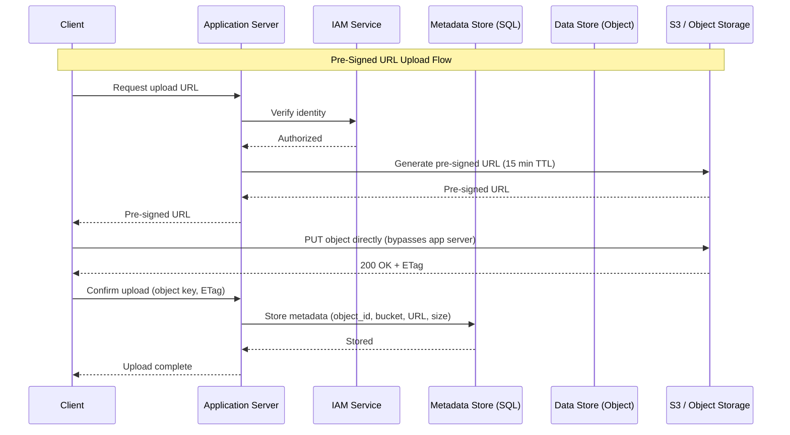
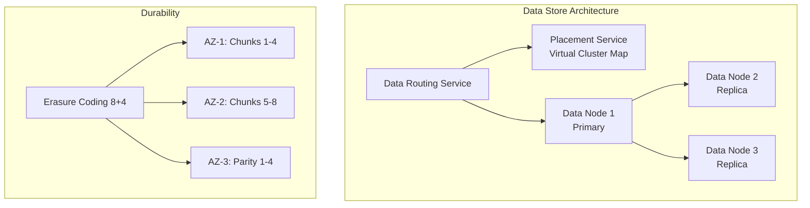

# Object Storage

## 1. Overview

Object storage is a flat-namespace, immutable-write storage system designed for massive volumes of unstructured data --- images, videos, ML training datasets, backups, and static web assets. Unlike block storage (which presents raw disk blocks) or file storage (which organizes data in hierarchical directories), object storage treats every piece of data as a discrete object identified by a globally unique key, with metadata attached alongside the binary payload.

Amazon S3 is the canonical implementation, holding over 100 trillion objects as of 2021. Google Cloud Storage, Azure Blob Storage, and MinIO (open-source) follow the same architectural principles. The defining tradeoff is deliberate: object storage sacrifices in-place mutation and low-latency random access in exchange for extreme durability (11 nines), vast horizontal scalability, and low cost per gigabyte.

In modern system design, object storage is the industry-standard repository for any binary data that does not belong in a relational database.

## 2. Why It Matters

Storing a 4 MB image in PostgreSQL spans 500 pages of 8 KB each. This bloats replication bandwidth, destroys backup performance, and causes memory pressure in the buffer pool. Every binary asset stored in a relational database is a ticking operational bomb.

Object storage exists to solve this permanently:

- **Cost**: S3 Standard costs ~$0.023/GB/month --- orders of magnitude cheaper than database storage.
- **Durability**: 99.999999999% (11 nines) durability via erasure coding across multiple availability zones.
- **Scale**: From kilobytes to petabytes with zero schema changes, no sharding decisions, and no capacity planning.
- **Decoupling**: Separating binary data from metadata allows each to be optimized independently.

The metadata/data split is the standard pattern: store the S3 URL and metadata (creator ID, timestamp, content type) in a relational database; store the actual bytes in object storage.

## 3. Core Concepts

- **Bucket**: A logical container for objects. Bucket names are globally unique across an entire cloud provider.
- **Object**: A single unit consisting of data (the binary payload), a key (the identifier), and metadata (name-value pairs like content-type, timestamps, custom tags).
- **Flat namespace**: Folder structures visible in the S3 console are UI sugar. Under the hood, `photos/2025/march/img.jpg` is a single string key. Lookups are O(1) by key.
- **Immutable writes**: You cannot modify bytes in the middle of an object. You must overwrite the entire object or create a new version. This eliminates complex locking and race conditions.
- **Versioning**: When enabled on a bucket, every overwrite or delete creates a new version rather than destroying the previous one. Accidental deletions insert a delete marker instead of removing data.
- **Pre-signed URL**: A temporary, time-limited URL that grants upload or download access directly to the object store, bypassing the application server entirely.
- **Multipart upload**: Large files are split into parts (typically 5 MB each), uploaded in parallel, and reassembled by the storage provider.
- **Erasure coding**: Data is split into data chunks and parity chunks distributed across failure domains. An (8+4) scheme can tolerate 4 simultaneous node failures while using only 50% storage overhead (vs. 200% for 3x replication).

## 4. How It Works

### Object Upload Flow

1. Client requests an upload via the API service.
2. API service authenticates the client via IAM (Identity and Access Management).
3. API service forwards object data to the data store.
4. Data store assigns a UUID, writes the object to the primary data node, and replicates it to secondary nodes.
5. API service writes metadata (object ID, bucket ID, object name, size) to the metadata store.
6. Success response is returned to the client.

### Pre-Signed URL Flow

For large file uploads, the application server should not proxy the binary data --- it becomes a bandwidth bottleneck during traffic spikes:

1. Client requests an upload URL from the application server.
2. Application server generates a pre-signed URL with a time-limited token (e.g., 15 minutes).
3. Client uploads the file directly to S3 using the pre-signed URL.
4. S3 notifies the application server (via S3 event notification or client callback).
5. Application server records the metadata in the relational database.

### Multipart Upload Flow

For files exceeding 100 MB (mandatory for files > 5 GB in S3):

1. Client initiates a multipart upload; S3 returns an `uploadID`.
2. Client splits the file into parts (5 MB - 5 GB each) and uploads them in parallel.
3. Each part upload returns an `ETag` (MD5 checksum) for verification.
4. Client sends a complete-multipart-upload request with uploadID, part numbers, and ETags.
5. S3 reassembles the object from its parts.
6. Old parts are garbage-collected.

### Durability via Erasure Coding

With (8+4) erasure coding:
- Original data is split into 8 equal data chunks.
- 4 parity chunks are computed via Reed-Solomon encoding.
- All 12 chunks are distributed across 12 different failure domains (racks/AZs).
- The original data can be reconstructed from any 8 of the 12 chunks.
- Storage overhead: 50% (vs. 200% for 3x replication).
- Durability: ~11 nines (99.999999999%).

### Data Organization Within Data Nodes

In a production object store, storing each small object as an individual file is inefficient. File systems have a fixed number of inodes and a minimum block size (typically 4 KB). A 1 KB object wastes 3 KB of block space, and millions of small files exhaust the inode table.

The solution is to **merge small objects into larger files**, similar to a write-ahead log:

1. New objects are appended to a "read-write" file (the current active data file).
2. When the read-write file reaches a threshold (typically a few GB), it is sealed as "read-only" and a new read-write file is created.
3. An object lookup table (stored in SQLite or RocksDB per data node) maps each object's UUID to:
   - The data file name
   - The byte offset within the file
   - The object's size
4. Reads use this mapping to seek directly to the correct position in the data file.

This design dramatically reduces inode consumption and improves sequential read performance.

### Garbage Collection and Compaction

Over time, deleted objects and orphaned multipart upload parts accumulate:

- **Lazy deletion**: Objects are marked as deleted in metadata but remain in the data file.
- **Orphan data**: Partially uploaded multipart parts where the upload was never completed.
- **Corrupted data**: Objects that fail checksum verification.

A background garbage collector periodically:
1. Scans read-only data files for deleted/orphaned objects.
2. Copies live objects to a new data file, skipping deleted ones.
3. Updates the object lookup table to reflect new file locations.
4. Deletes the old data file.

This compaction process reclaims disk space while the system continues serving reads and writes from other data files.

### Correctness Verification

Data corruption at scale is inevitable. Object storage systems protect integrity through checksums:

1. Each object is stored with an MD5 or SHA-256 checksum appended.
2. On read, the checksum is recomputed and compared to the stored value.
3. If checksums mismatch, the data is fetched from another replica or reconstructed via erasure coding.
4. Each data file also has a file-level checksum to detect file-level corruption.

## 5. Architecture / Flow

## 6. Types / Variants

| Feature | Block Storage | File Storage | Object Storage |
|---|---|---|---|
| **Mutable content** | Yes | Yes | No (version or overwrite) |
| **Cost** | High | Medium-High | Low |
| **Performance** | High (direct block access) | Medium-High | Low-Medium |
| **Data access** | SAS/iSCSI/FC | NFS/SMB/CIFS | RESTful API |
| **Scalability** | Medium | High | Vast (petabyte+) |
| **Best for** | VMs, databases | General file access | Binary data, backups, media |

### Storage Classes (S3)

| Class | Use Case | Retrieval Latency | Cost |
|---|---|---|---|
| **S3 Standard** | Frequently accessed data | Milliseconds | ~$0.023/GB/mo |
| **S3 Intelligent-Tiering** | Unknown access patterns | Milliseconds | Auto-optimized |
| **S3 Standard-IA** | Infrequent access, rapid retrieval | Milliseconds | ~$0.0125/GB/mo |
| **S3 Glacier** | Archival, compliance | Minutes to hours | ~$0.004/GB/mo |
| **S3 Glacier Deep Archive** | Long-term cold storage | 12-48 hours | ~$0.00099/GB/mo |

## 7. Use Cases

- **Dropbox/Google Drive**: File chunking (5 MB parts), fingerprinting (content hashing), and pre-signed URL uploads directly to S3. Only changed chunks are synced (delta sync).
- **Netflix**: Video files stored in S3, transcoded into multiple bitrates, and served via CDN edge locations.
- **Instagram/Twitter**: User-uploaded photos and videos stored in S3; the relational database holds only the S3 URL and metadata.
- **Machine Learning pipelines**: Training datasets (terabytes of images, text) stored in S3 and read in parallel by distributed training jobs.
- **Data lakes**: S3 as the storage layer for analytics platforms (Spark, Presto, Athena) with Parquet/ORC columnar formats.

## 8. Tradeoffs

| Advantage | Disadvantage |
|---|---|
| 11 nines durability via erasure coding | Higher latency than block/file storage (network + API overhead) |
| Near-infinite scalability (petabytes) | Cannot modify objects in place (must overwrite) |
| Low cost per GB | Not suitable for databases or transactional workloads |
| RESTful API simplifies integration | Listing operations are slow at scale (scan-based) |
| No capacity planning or provisioning | Egress costs can be significant at high transfer volumes |
| Versioning provides accidental deletion protection | Versioning increases storage costs if not managed |

### Replication vs Erasure Coding

| Dimension | 3x Replication | (8+4) Erasure Coding |
|---|---|---|
| Durability | ~6 nines | ~11 nines |
| Storage overhead | 200% | 50% |
| Write performance | Fast (no computation) | Slower (parity calculation) |
| Read performance | Fast (single node) | Slower (must read 8 of 12 nodes) |
| Compute cost | None | Higher (parity computation) |

## 9. Common Pitfalls

- **Proxying uploads through the application server**: Every byte of a 10 GB video upload flows through your server, consuming bandwidth and CPU. Use pre-signed URLs to bypass the application server entirely.
- **Not using multipart upload for large files**: A single PUT for a 5 GB file over an unreliable network means starting over on failure. Multipart uploads provide resumability and parallelism.
- **Treating object keys as a hierarchy**: The "/" in `photos/2025/march/img.jpg` is part of the key string, not a directory separator. Listing "directories" requires prefix scans, which are not O(1).
- **Ignoring lifecycle policies**: Without lifecycle rules, old versions and incomplete multipart uploads accumulate indefinitely, ballooning storage costs.
- **Not verifying checksums**: Data corruption is a reality at scale. Always verify MD5/SHA checksums on upload and download to detect in-transit corruption.

## 10. Real-World Examples

- **Amazon S3**: Over 100 trillion objects (2021). Uses erasure coding for 11 nines durability. Supports strong read-after-write consistency as of December 2020.
- **LinkedIn (Ambry)**: Custom geo-distributed object store designed for LinkedIn's specific access patterns (write-once, read-many with 95% reads).
- **Dropbox**: Migrated from S3 to an in-house object store ("Magic Pocket") to reduce costs at their scale (exabytes of data). Uses erasure coding, content-addressed storage, and block-level deduplication.
- **Netflix**: Stores master video files in S3, processes them through a transcoding pipeline, and distributes encoded chunks via their CDN (Open Connect).
- **Backblaze B2**: Lower-cost S3-compatible object storage using Reed-Solomon erasure coding (17+3) for 11 nines durability.

## 11. Related Concepts

- [CDN](../04-caching/cdn.md) --- edge caching of static assets stored in object storage
- [SQL Databases](./sql-databases.md) --- metadata store for object references
- [Database Replication](./database-replication.md) --- replication strategies shared with object storage
- [Video Streaming](../11-patterns/video-streaming.md) --- chunked delivery of video from object storage
- [Consistent Hashing](../02-scalability/consistent-hashing.md) --- data placement in the object store cluster

## 12. Source Traceability

- source/youtube-video-reports/2.md (S3, CDN, media persistence)
- source/youtube-video-reports/4.md (Blob architecture, flat namespaces, pre-signed URLs, multipart uploads, metadata/data split)
- source/youtube-video-reports/7.md (Dropbox case study, chunking, pre-signed URLs)
- source/extracted/alex-xu-vol2/ch10-s3-like-object-storage.md (Complete S3 design: data store, metadata, erasure coding, versioning, multipart upload, garbage collection)
- source/extracted/acing-system-design/ch16-design-a-content-distribution-network.md (CDN storage, multipart uploads)
