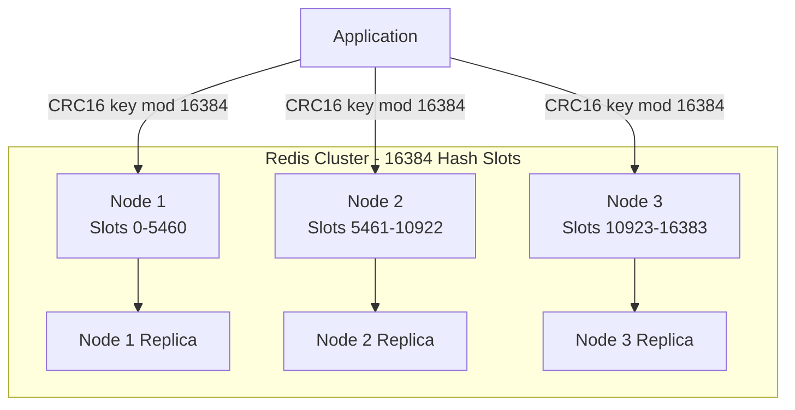
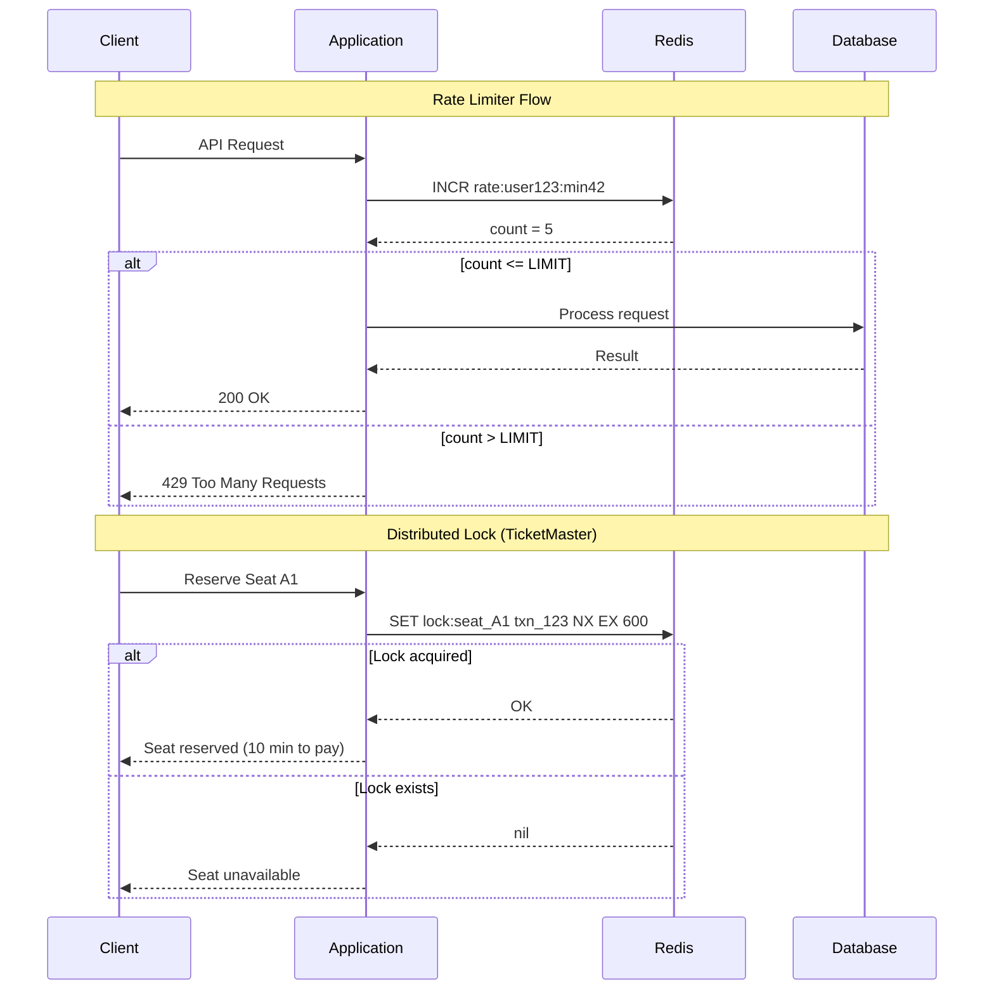

# Redis

## 1. Overview

Redis (Remote Dictionary Server) is an in-memory data structure store that serves as a cache, message broker, and real-time data engine. What sets Redis apart from simple key-value caches like Memcached is its rich set of native data structures --- strings, sorted sets, streams, hashes, lists, sets, bitmaps, and geospatial indexes --- each with atomic operations that execute in microseconds.

Redis is **single-threaded** by design. This is its greatest strength, not a limitation: a single request at a time means every command (INCR, ZADD, XADD) is inherently atomic without locks, mutexes, or transaction isolation concerns. While it sacrifices multi-core utilization on a single instance, the operational simplicity and predictability are worth the tradeoff. For horizontal scaling, Redis Cluster distributes data across multiple nodes using 16,384 hash slots.

For caching strategies and patterns (cache-aside, write-through, etc.), see [Caching Strategies](./01-caching.md). This file covers Redis-specific internals, data structures, and operational patterns.

## 2. Why It Matters

Redis is the Swiss Army knife of distributed systems. It appears in virtually every large-scale architecture:

- **Twitter**: Stores pre-computed home timelines in Redis for O(1) read access.
- **TicketMaster**: Uses Redis TTL locks for distributed seat reservation (10-minute lock expiry).
- **Facebook Live Comments**: Uses Redis pub/sub to route comments to the correct real-time servers.
- **Uber**: Uses Redis for geospatial proximity queries (find nearby drivers).
- **Stripe**: Uses Redis for rate limiting API requests with atomic INCR + TTL.

When you need sub-millisecond operations on structured data in a distributed system, Redis is the default choice.

## 3. Core Concepts

- **Single-threaded execution**: Commands are processed sequentially on a single thread. First-in, first-processed. This guarantees atomicity for individual commands.
- **In-memory storage**: All data resides in RAM. Reads and writes complete in microseconds. Limited by available memory.
- **Redis Cluster**: Distributes data across multiple nodes using 16,384 hash slots. Each key is mapped to a slot via `CRC16(key) % 16384`.
- **Persistence modes**: Optional durability via RDB snapshots or AOF (Append Only File) logging.
- **TTL (Time to Live)**: Any key can be assigned an expiration time, after which it is automatically deleted.
- **Pub/Sub**: Publisher-subscriber messaging where clients subscribe to channels and receive messages in real-time.

## 4. How It Works

### Data Structures and Use Cases

**Strings**

The simplest type: a key maps to a string value (which can represent a number).

```
SET session:abc123 '{"user_id": 456, "role": "admin"}' EX 3600
GET session:abc123
```

Use cases: session storage, feature flags, simple counters.

**Sorted Sets (Z-Sets)**

Each member has a score. Members are unique; scores can repeat. The set is maintained in sorted order by score, backed by a skip list + hash table.

```
ZADD leaderboard_feb_2025 976 "alice"
ZADD leaderboard_feb_2025 965 "bob"
ZINCRBY leaderboard_feb_2025 1 "alice"      # Increment Alice's score
ZREVRANGE leaderboard_feb_2025 0 9 WITHSCORES  # Top 10
ZREVRANK leaderboard_feb_2025 "alice"        # Alice's rank
```

Operations: ZADD, ZINCRBY, ZREVRANGE, ZREVRANK --- all O(log n).

Use cases: **leaderboards** (real-time gaming, social engagement), **priority queues**, **rate limiting with sliding windows**.

**Hashes**

A key maps to a hash map of field-value pairs. Efficient for representing objects.

```
HSET user:123 name "Alice" city "NYC" score 42
HGET user:123 name     # Returns "Alice"
HGETALL user:123       # Returns all fields
HINCRBY user:123 score 1  # Atomic increment
```

Use cases: user profiles, feature flags per user, counters per entity.

**Streams**

An append-only log data structure (introduced in Redis 5.0). Each entry has an auto-generated ID (timestamp-based) and a set of field-value pairs.

```
XADD job_queue * task "process_image" url "s3://bucket/img.jpg"
XREADGROUP GROUP workers worker1 COUNT 1 BLOCK 0 STREAMS job_queue >
XACK job_queue workers 1613707265-0
```

Consumer groups enable multiple workers to process stream entries with at-least-once delivery. If a worker fails to ACK, the entry can be reclaimed by another worker.

Use cases: **async job queues**, event sourcing, activity feeds. For high-reliability needs, **MemoryDB** (a durable Redis-compatible service from AWS) replaces the AOF persistence model.

**Geospatial**

Redis uses geohashing internally to store coordinates in a sorted set, enabling radius-based queries.

```
GEOADD locations -73.935242 40.730610 "store_1"
GEOADD locations -73.990539 40.735657 "store_2"
GEORADIUS locations -73.960 40.733 5 km ASC COUNT 10
```

Use cases: **proximity search** (find nearby drivers, restaurants, stores), location-based features. See [Geospatial Indexing](../11-patterns/06-geospatial-indexing.md) for the underlying algorithms.

### Rate Limiter Pattern

Using atomic INCR + TTL for a fixed-window rate limiter:

```
key = "rate:{user_id}:{current_minute}"
count = INCR key
if count == 1:
    EXPIRE key 60  # Set TTL on first request in window
if count > LIMIT:
    return 429 Too Many Requests
```

This pattern is atomic because INCR is a single Redis command. The TTL ensures the counter self-destructs after the window expires.

### Distributed Locking

Redis TTL locks provide distributed mutual exclusion:

```
SET lock:seat_A1 "txn_123" NX EX 600  # Acquire lock (10 min TTL)
# ... perform booking ...
DEL lock:seat_A1                        # Release lock
```

- `NX`: Only set if key does not exist (prevents double-locking).
- `EX 600`: Automatic expiry if the holder crashes (prevents deadlock).

TicketMaster uses this pattern for seat reservation: the lock auto-expires after 10 minutes if the user does not complete payment.

### Hot Key Solutions

In a Redis Cluster, data is distributed across nodes via `CRC16(key) % 16384`. A "hot key" --- like a viral celebrity's profile --- sends all traffic to a single node, overwhelming it.

**Solution 1: Random suffix sharding**

```
# Instead of one key:
GET celebrity:123

# Distribute across N keys:
suffix = random(0, N-1)
GET celebrity:123:{suffix}
```

Reads must scatter across N keys and merge results. Writes must update all N keys.

**Solution 2: In-process cache fallback**

Cache the hot key in application memory (HashMap) with a very short TTL (1-5 seconds). Reduces Redis traffic for the hottest keys at the cost of slight staleness across app instances.

**Solution 3: Read replicas for hot keys**

Configure Redis read replicas and route hot-key reads to replicas, distributing the load across multiple nodes.

### Persistence Modes

| Mode | Mechanism | Durability | Performance Impact |
|---|---|---|---|
| **No persistence** | Data lost on restart | None | Zero overhead |
| **RDB (Snapshots)** | Point-in-time snapshots at intervals | Last snapshot survives | Fork overhead during snapshot |
| **AOF (Append Only File)** | Logs every write command | Up to last fsync | Slight write latency |
| **RDB + AOF** | Both mechanisms | Best durability | Combined overhead |
| **MemoryDB** | Durable Redis-compatible (AWS) | Full durability | Managed, no tuning needed |

## 5. Architecture / Flow





## 6. Types / Variants

| Variant | Description | Use Case |
|---|---|---|
| **Redis (open-source)** | In-memory data store, single-threaded | General caching, data structures |
| **Redis Cluster** | Sharded across nodes, 16384 hash slots | Horizontal scaling beyond single node |
| **Redis Sentinel** | High-availability monitoring + failover | Production HA without clustering |
| **Amazon ElastiCache (Redis)** | Managed Redis on AWS | Zero-ops Redis with automatic failover |
| **Amazon MemoryDB** | Durable, Redis-compatible, multi-AZ | When you need Redis speed with database durability |
| **KeyDB** | Multi-threaded Redis fork | Higher single-node throughput |
| **Dragonfly** | Multi-threaded, Redis-compatible | Drop-in replacement with better hardware utilization |

### Redis vs Memcached

| Dimension | Redis | Memcached |
|---|---|---|
| **Data structures** | Strings, hashes, sorted sets, streams, geo, bitmaps | Strings only |
| **Persistence** | RDB, AOF, MemoryDB | None (pure cache) |
| **Pub/Sub** | Built-in | Not supported |
| **Clustering** | Redis Cluster (16384 slots) | Client-side consistent hashing |
| **Threading** | Single-threaded (per-instance) | Multi-threaded |
| **Memory efficiency** | Higher (varied data structures) | Lower overhead for simple KV |

## 7. Use Cases

- **Leaderboards (gaming)**: Sorted sets with ZINCRBY for score updates and ZREVRANGE for top-K queries. O(log n) operations serve millions of players in real-time.
- **Rate limiting (API gateway)**: Atomic INCR + TTL implements fixed-window rate limiters. Sliding-window variants use sorted sets with timestamps as scores.
- **Session storage**: Hashes store session data with per-field access. TTL handles session expiry automatically.
- **Real-time chat routing (WhatsApp)**: Pub/Sub channels map to conversation IDs. Servers subscribe to channels for their connected users.
- **Distributed locking (TicketMaster)**: SET with NX + EX implements 10-minute seat reservation locks.
- **Proximity search (Uber)**: Geospatial commands find drivers within a radius of the rider's location.
- **Job queues**: Streams with consumer groups provide reliable, distributed task processing with at-least-once delivery.

## 8. Tradeoffs

| Advantage | Disadvantage |
|---|---|
| Sub-millisecond latency for all operations | Data limited by available RAM (expensive at scale) |
| Rich data structures eliminate application-layer complexity | Single-threaded limits per-instance throughput |
| Atomic operations without explicit locking | Persistence modes involve durability/performance tradeoffs |
| Cluster mode enables horizontal scaling | Hot keys can overwhelm individual cluster nodes |
| Pub/Sub enables real-time server-to-server messaging | Pub/Sub is fire-and-forget (no persistence of messages) |

## 9. Common Pitfalls

- **Using Redis as a primary database without persistence**: Redis data lives in RAM. Without RDB/AOF, a server restart means total data loss. For durable use cases, consider MemoryDB.
- **Large keys or values**: A single 10 MB value blocks the single thread for the entire serialization time. Keep values under 100 KB. For large objects, store a reference to S3.
- **Not using EXPIRE on cache keys**: Without TTL, cache entries accumulate until memory is exhausted and eviction starts. Always set TTL on cache entries.
- **Blocking pub/sub subscribers**: A slow subscriber blocks message delivery for that channel. Use Streams with consumer groups instead of pub/sub for reliable message processing.
- **Ignoring Redis Cluster key restrictions**: In Redis Cluster, multi-key operations (MGET, pipeline) must target keys on the same hash slot. Use hash tags `{user:123}:profile` and `{user:123}:session` to co-locate related keys.

## 10. Real-World Examples

- **Twitter**: Stores home timelines as Redis lists. Fan-out on write pushes tweet IDs to each follower's list. Reading a timeline is a simple LRANGE.
- **GitHub**: Uses Redis (via Resque/Sidekiq) for background job processing --- repository indexing, notification delivery, webhook dispatch.
- **Pinterest**: Uses Redis for real-time recommendation scoring with sorted sets, serving billions of personalized pin recommendations.
- **Slack**: Uses Redis for presence indicators (online/offline/away) and real-time message routing.
- **Stripe**: Uses Redis for API rate limiting, implementing sliding-window counters with sorted sets to enforce per-customer request quotas.

## 11. Related Concepts

- [Caching Strategies](./01-caching.md) --- cache-aside, write-through, and other patterns (not Redis-specific)
- [CDN](./03-cdn.md) --- edge caching layer complementing Redis
- [Rate Limiting](../08-resilience/01-rate-limiting.md) --- rate limiter algorithms implemented with Redis
- [Geospatial Indexing](../11-patterns/06-geospatial-indexing.md) --- geohashing algorithms behind Redis GEO commands
- [Consistent Hashing](../02-scalability/03-consistent-hashing.md) --- CRC16 mod 16384 in Redis Cluster

## 12. Source Traceability

- source/youtube-video-reports/2.md (Facebook Live Comments pub/sub, TicketMaster distributed locking)
- source/youtube-video-reports/3.md (TicketMaster Redis TTL lock, Tinder atomic operations)
- source/youtube-video-reports/4.md (Redis single-threaded model, sorted sets, streams, rate limiters, leaderboards, pub/sub, geospatial, hot key solutions, MemoryDB, 16384 slots)
- source/youtube-video-reports/5.md (WhatsApp Redis pub/sub, consistency models)
- source/youtube-video-reports/7.md (Caching layers, hot key mitigation)
- source/extracted/alex-xu-vol2/ch11-real-time-gaming-leaderboard.md (Sorted sets for leaderboards, ZADD/ZINCRBY/ZREVRANGE, skip list internals, Redis cluster scaling)
- source/extracted/system-design-guide/ch09-distributed-cache.md (Redis vs Memcached, distributed cache design)
