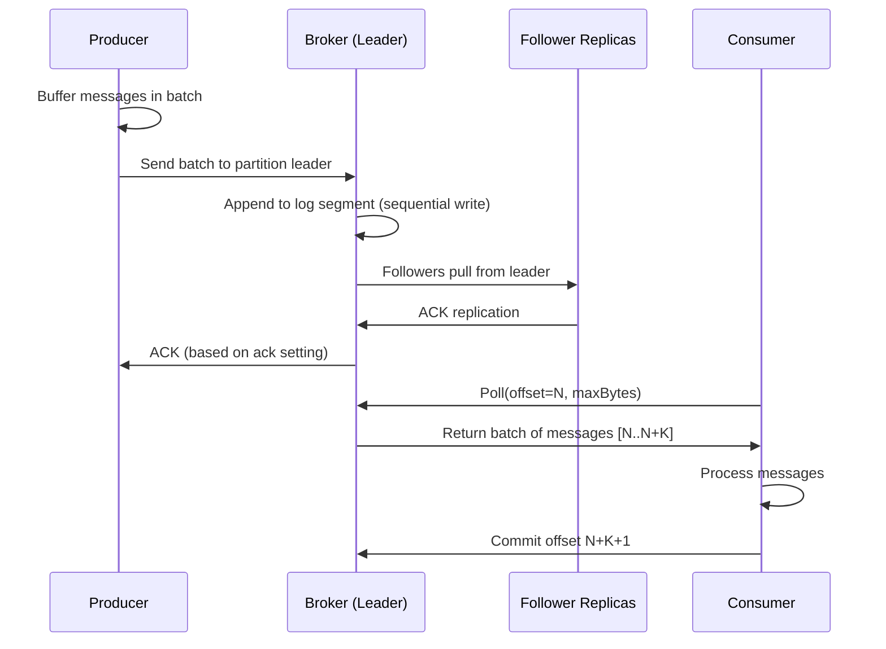
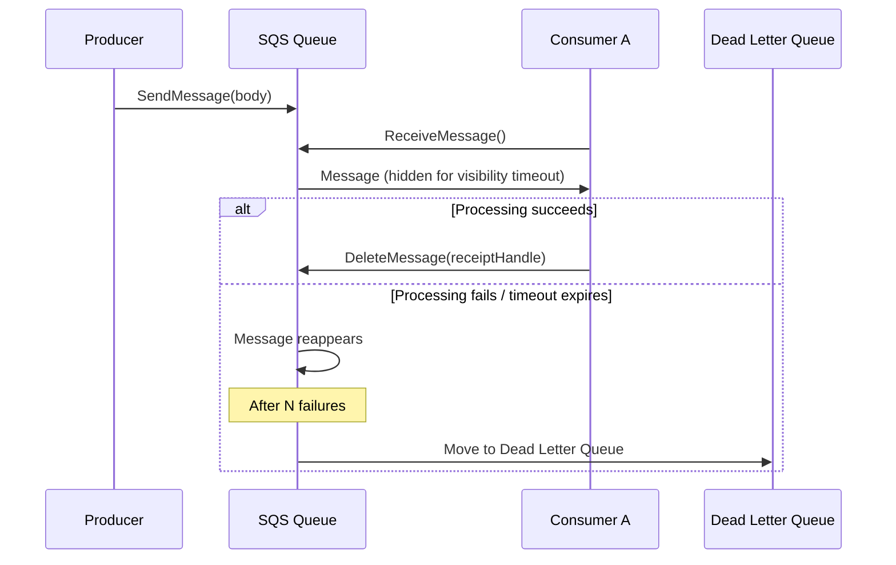

# Message Queues

## 1. Overview

Message queues are the backbone of asynchronous communication in distributed systems. They decouple producers from consumers by introducing an intermediary buffer that absorbs traffic spikes, enables independent scaling, and guarantees that work is not lost during transient failures. When a senior architect says "put a queue in front of it," they are buying time -- the producer drops a message and moves on, the consumer processes it when ready, and the system survives load patterns that would crush a synchronous call chain.

The landscape has converged: traditional message queues (RabbitMQ, SQS) and event streaming platforms (Kafka, Pulsar) increasingly overlap in features. RabbitMQ added append-only streams; Kafka added exactly-once semantics. The distinction today is less about the label and more about your durability, ordering, and replay requirements.

## 2. Why It Matters

- **Decoupling**: Services evolve independently. A payment service does not need to know (or wait for) the notification service. You can replace the notification service entirely without touching the payment service.
- **Resilience**: If a downstream consumer crashes, messages remain in the queue until the consumer recovers -- no data loss, no coordinated restarts. The producer does not even notice the outage.
- **Backpressure absorption**: During traffic spikes (Nike LeBron ad, Taylor Swift on-sale), the queue buffers the burst while consumers process at their sustainable rate. Without a queue, the spike cascades directly into backend services and databases.
- **Cost efficiency**: Instead of provisioning every service for peak load, you provision for average load and let the queue smooth the peaks. A service that handles 1,000 RPS average but spikes to 50,000 RPS can be sized for 2,000 RPS if the queue absorbs the excess.
- **Ordered processing**: Queues with partition-level ordering (Kafka) guarantee that events for the same entity (user, order, account) are processed sequentially, preventing race conditions.
- **Replay and reprocessing**: Log-based queues (Kafka, Pulsar) retain messages for days or weeks. If a consumer has a bug, you can fix the code and replay the messages from any point in time.
- **Polyglot integration**: The queue is a protocol boundary. A Python producer and a Java consumer do not need to share libraries, frameworks, or even API contracts -- they share a message format.

## 3. Core Concepts

- **Producer**: The service that publishes messages to a topic or queue.
- **Consumer**: The service that reads and processes messages.
- **Topic**: A named category of messages. Producers write to a topic; consumers subscribe to it.
- **Partition**: A subdivision of a topic. Each partition is an ordered, append-only log. Partitions are the unit of parallelism.
- **Consumer Group**: A set of consumers that share the work of reading from a topic. Each partition is assigned to exactly one consumer within a group, guaranteeing ordering within a partition.
- **Offset**: The position of a message within a partition. Consumers track their offset to know what has been processed.
- **Broker**: A server that holds partitions and serves reads/writes.
- **Dead Letter Queue (DLQ)**: A secondary queue for messages that repeatedly fail processing.
- **Visibility Timeout**: (SQS) The period during which a message is hidden from other consumers after being read, preventing duplicate processing.
- **Backpressure**: A mechanism to slow producers when consumers cannot keep up.
- **Idempotency**: The guarantee that processing a message more than once produces the same result as processing it once.

## 4. How It Works

### Kafka Architecture

Kafka treats each partition as a sequential, append-only log file on disk. This is the key to its throughput:

1. **Sequential I/O**: Writes append to the end of a log segment. Reads scan forward from an offset. Modern disks deliver 600+ MB/s on sequential access versus 100-200 random IOPS. Kafka exploits this by never performing random writes.
2. **OS page cache**: Kafka delegates caching to the operating system. The OS aggressively caches recently written log segments in RAM, so most consumer reads hit memory, not disk.
3. **Zero-copy transfer**: Kafka uses `sendfile()` to transfer data from the page cache directly to the network socket, bypassing user-space entirely.
4. **Batching**: Producers batch messages in a buffer before sending. Brokers write batches as contiguous blocks. Consumers fetch in batches. This amortizes network round-trip overhead.

**Message routing**: If a message key is set, the partition is determined by `hash(key) % numPartitions`. If no key is set, the partition is chosen round-robin. This guarantees that all messages with the same key land in the same partition and are therefore ordered.

**Consumer group coordination**: A coordinator broker manages partition assignment within a consumer group. When a consumer joins, leaves, or crashes (detected by missing heartbeats), the coordinator triggers a rebalance to redistribute partitions.

### SQS Architecture

SQS takes a different approach -- it is a fully managed, serverless queue with no partitions to manage:

1. **Visibility Timeout**: When a consumer reads a message, SQS hides it for a configurable duration (default 30 seconds). If the consumer acknowledges (deletes) the message within this window, it is gone. If not, the message reappears for another consumer.
2. **Exponential backoff on retries**: SQS can be configured to increase the visibility timeout on each failed attempt (30s, 2m, 5m).
3. **Dead Letter Queue**: After a configurable number of failed receive attempts (e.g., 5), SQS moves the message to a DLQ for manual inspection.
4. **At-least-once delivery**: SQS guarantees that a message is delivered at least once, but duplicates are possible. FIFO queues add exactly-once processing and strict ordering within a message group.

### Delivery Semantics

| Semantic | Producer Config | Consumer Behavior | Use Case |
|---|---|---|---|
| **At-most-once** | ack=0, no retry | Commit offset before processing | Metrics, logging (data loss acceptable) |
| **At-least-once** | ack=1 or ack=all, with retry | Commit offset after processing | Most applications (use idempotent consumers) |
| **Exactly-once** | Idempotent producer + transactions | Transactional offset commit | Financial systems, billing |

### Idempotency

At-least-once delivery means duplicates are inevitable. Consumers must be idempotent:

- **Deduplication key**: Include a unique message ID. On processing, write the ID to a deduplication store (Redis SET, database unique constraint). Reject duplicates.
- **Idempotent operations**: Use `UPSERT` instead of `INSERT`. Use `SET balance = X` instead of `SET balance = balance + delta`.
- **Kafka producer idempotency**: Enable `enable.idempotence=true`. Kafka assigns a producer ID and sequence number to each message, and brokers reject duplicates at the partition level.

### In-Sync Replicas (ISR)

Kafka replicates each partition across multiple brokers for fault tolerance. The leader handles all reads and writes; followers pull data from the leader.

- **ISR (In-Sync Replicas)**: The set of replicas that are fully caught up with the leader. A follower falls out of ISR if it lags behind by more than a configurable threshold (`replica.lag.max.messages` or `replica.lag.time.max.ms`).
- **Committed offset**: A message is considered committed only when all replicas in ISR have received it. Consumers only see committed messages.
- **ACK settings control durability vs. latency**:
  - `ack=0`: Producer does not wait for any acknowledgment. Lowest latency, highest risk of data loss.
  - `ack=1`: Producer waits for the leader to persist the message. If the leader crashes before replication, the message is lost.
  - `ack=all`: Producer waits for all ISR replicas to persist the message. Strongest durability, highest latency.

### Consumer Rebalancing

When a consumer joins or leaves a group, partitions must be redistributed:

1. The coordinator broker detects the change (new heartbeat, missing heartbeat, explicit leave).
2. The coordinator notifies all consumers to rejoin the group.
3. One consumer is elected as the group leader and generates a partition assignment plan.
4. The coordinator distributes the plan to all consumers.
5. Consumers start consuming from their newly assigned partitions.

During rebalancing, no messages are consumed -- this is a "stop-the-world" pause. Minimizing rebalance frequency and duration is critical for throughput-sensitive applications. Kafka 2.4+ introduced incremental cooperative rebalancing to reduce the impact.

### Message Schema and Structure

A Kafka message contains:

| Field | Type | Description |
|---|---|---|
| key | byte[] | Determines partition assignment via `hash(key) % numPartitions` |
| value | byte[] | The message payload (text, JSON, Protobuf, Avro) |
| topic | string | The topic the message belongs to |
| partition | integer | The partition within the topic |
| offset | long | The position within the partition |
| timestamp | long | When the message was produced or stored |
| headers | key-value pairs | Optional metadata (trace IDs, content type) |

The key insight: the message structure is immutable during transit. Kafka never deserializes or modifies the message body. This zero-copy design is critical for throughput.

### Backpressure Mechanisms

When consumers cannot keep up with producers, the system needs a backpressure strategy:

- **Producer-side throttling**: The producer detects that the broker is slow (send buffer full, high latency) and slows down. Kafka's `max.block.ms` controls how long the producer waits when the buffer is full.
- **Consumer-side lag monitoring**: Monitor the gap between the latest offset and the consumer's committed offset. If lag exceeds a threshold, scale out consumers or alert the team.
- **Queue-based backpressure (SQS)**: The queue depth (number of messages waiting) is the backpressure signal. CloudWatch alarms trigger auto-scaling of consumers when depth exceeds a threshold.
- **Reactive pull model**: Kafka uses a pull model -- consumers control the pace. If a consumer is slow, it simply polls less frequently. Messages accumulate in the topic until the consumer catches up or retention expires.

### Scaling Kafka Brokers

Adding a new broker to a Kafka cluster does not automatically rebalance existing partitions. The process:

1. Add the new broker to the cluster.
2. The controller detects the new broker.
3. New partitions (from new topics or topic expansion) can be assigned to the new broker.
4. Existing partitions must be explicitly reassigned using `kafka-reassign-partitions` tool.
5. During reassignment, the new broker creates replicas and catches up with the leader.
6. Once caught up, the old replica can be removed.

This process avoids data loss but requires careful orchestration. Automating it with tools like Cruise Control (LinkedIn) or Confluent's Self-Balancing Clusters is recommended for large deployments.

## 5. Architecture / Flow

### Kafka Producer-Consumer Flow

### SQS Visibility Timeout Flow

## 6. Types / Variants

### Point-to-Point vs. Publish-Subscribe

- **Point-to-Point**: Each message is consumed by exactly one consumer. Traditional queue model (SQS, RabbitMQ default). Once a consumer acknowledges a message, it is removed.
- **Publish-Subscribe**: Each message is delivered to all subscribers. Kafka achieves this via consumer groups -- different consumer groups each get a copy of every message. Within a consumer group, each message goes to exactly one consumer (point-to-point behavior).

Kafka unifies both models: put all consumers in the same group for point-to-point, or put them in different groups for pub/sub.

### Messaging Platform Comparison

| Feature | Apache Kafka | Amazon SQS | RabbitMQ | Apache Pulsar |
|---|---|---|---|---|
| **Model** | Append-only log, pull | Queue, pull (long-poll) | Queue + exchange routing, push/pull | Append-only log, pull |
| **Ordering** | Per-partition | Per-message-group (FIFO) | Per-queue | Per-partition |
| **Retention** | Configurable (days/weeks/forever) | Up to 14 days | Until consumed | Configurable + tiered storage |
| **Replay** | Yes (seek to any offset) | No (consumed = deleted) | No (by default) | Yes |
| **Throughput** | ~10K msgs/sec per broker | Auto-scales (managed) | ~20K msgs/sec | ~10K msgs/sec per broker |
| **Ops burden** | High (manage brokers, ZooKeeper/KRaft) | Zero (fully managed) | Medium | High |
| **Best for** | Event streaming, log aggregation, CDC | Simple task queues, serverless workflows | Complex routing (fanout, headers) | Multi-tenant streaming |

## 7. Use Cases

- **LinkedIn (Kafka origin)**: Kafka was created at LinkedIn to handle activity stream processing -- page views, searches, and ad impressions at hundreds of billions of messages per day. Kafka replaced a fragmented set of custom pipelines with a unified event bus that feeds search indexing, analytics, and recommendation systems.
- **Netflix**: Uses Kafka for real-time event processing across its microservices. Every user interaction (play, pause, skip, browse) flows through Kafka to power personalization, A/B testing, and operational analytics. Netflix operates one of the largest Kafka deployments: 700+ billion messages per day across 6,000+ brokers.
- **Uber**: Uses Kafka to process trip events, driver location updates, and marketplace pricing signals. The backpressure characteristics of Kafka prevent surge events from cascading into downstream services. Uber built a custom cross-datacenter replication tool (uReplicator) on top of Kafka for disaster recovery.
- **Web Crawler (at scale)**: SQS is preferred over Kafka for URL frontier management because SQS provides visibility timeouts and exponential backoff out of the box -- if a crawler fails to fetch a URL, SQS hides and retries it automatically, eventually moving poison URLs to a DLQ. Kafka would require manual implementation of retry topics and backoff logic to achieve the same behavior.
- **Ad Click Aggregation**: Kafka ingests raw click events. Flink consumes from Kafka for 1-minute windowed aggregations (real-time dashboards). Spark reads the same Kafka topic for hourly batch reconciliation (100% accuracy). This is the Lambda architecture pattern in action.
- **WhatsApp**: Uses a message queue pattern for the "inbox" -- messages are stored in the recipient's inbox queue and only deleted upon receiving an ACK from the device. This ensures at-least-once delivery for chat messages.
- **Dropbox**: Uses message queues to coordinate file sync events. When a file changes, a message is published to trigger sync across all connected devices.

## 8. Tradeoffs

### Kafka vs. SQS Decision Matrix

| Dimension | Kafka | SQS |
|---|---|---|
| **Ordering guarantee** | Strong within partition | Only in FIFO queues (300 TPS limit) |
| **Message replay** | Yes -- consumer seeks to any offset | No -- consumed messages are deleted |
| **Operational overhead** | High -- broker management, partition tuning | Zero -- fully managed |
| **Throughput ceiling** | Very high (sequential I/O, zero-copy) | Virtually unlimited (auto-scales) |
| **Retry/backoff** | Manual (retry topics, DLQ topics) | Built-in (visibility timeout, DLQ) |
| **Cost at scale** | Lower (self-managed infra) | Higher (per-request pricing) |
| **Cold start** | None (always running) | None (always running) |
| **Consumer complexity** | Must manage offsets, rebalancing | Simple -- receive, process, delete |
| **Multi-consumer** | Multiple consumer groups read independently | Each message goes to one consumer (unless using SNS fan-out) |
| **Data retention** | Configurable (days/weeks/forever) | Max 14 days |

### When to Choose What

- **Choose Kafka** when you need: message replay, multiple independent consumers, event sourcing, stream processing, high-throughput log aggregation, or CDC pipelines.
- **Choose SQS** when you need: simple task queues, serverless integration (Lambda triggers), built-in retry/DLQ, zero operational overhead, or when throughput is moderate.
- **Choose RabbitMQ** when you need: complex routing logic (topic exchanges, header routing, priority queues), low-latency message delivery, or AMQP protocol compliance.
- **Choose Pulsar** when you need: multi-tenancy, tiered storage (hot/cold), or Kafka-like features with a separation of compute (brokers) and storage (BookKeeper).

### Quantitative Benchmarks

| Metric | Kafka (single broker) | SQS Standard | SQS FIFO |
|---|---|---|---|
| **Write throughput** | ~10,000 msgs/sec (1KB each) | ~3,000 msgs/sec per API call | 300 msgs/sec (3,000 with batching) |
| **Read throughput** | ~30,000 msgs/sec (consumer-side) | ~3,000 msgs/sec per API call | 300 msgs/sec |
| **Latency (P99)** | 5-15ms (end-to-end) | 10-100ms | 10-100ms |
| **Storage cost** | Disk cost (~$0.10/GB/month) | $0.40 per million requests | $0.50 per million requests |
| **Max message size** | 1 MB (configurable) | 256 KB | 256 KB |

These numbers vary significantly with configuration, hardware, and workload. Use them as order-of-magnitude guides, not SLAs.

## 9. Common Pitfalls

- **Hot partitions**: If your partition key has skewed distribution (e.g., a celebrity user ID during a viral event like Nike launching a LeBron James ad), one partition gets hammered while others sit idle. Mitigate with key salting (append a random suffix), removing the key entirely, or implementing backpressure to throttle the producer.
- **Consumer group sizing**: If you have more consumers than partitions, the excess consumers sit idle. Always provision at least as many partitions as your maximum expected consumer count.
- **Ignoring idempotency**: At-least-once delivery means your consumer WILL see duplicates. If your consumer is not idempotent, you will double-charge customers or double-send notifications.
- **Large messages**: Kafka is optimized for messages under 1 MB. Sending 10 MB messages destroys throughput and increases broker memory pressure. Store large payloads in object storage and put a reference (URL) in the message.
- **Unbounded retention without compaction**: Keeping messages forever without log compaction fills disks. Use compacted topics for changelogs (keep latest per key) and time-based retention for event streams.
- **SQS FIFO throughput limits**: FIFO queues are capped at 300 messages/sec (3,000 with batching). If you need higher throughput with ordering, use Kafka or partition your FIFO queues by message group ID.
- **Not monitoring consumer lag**: If consumers fall behind producers, the lag grows silently until you run out of retention. Monitor consumer group lag and alert when it exceeds a threshold.
- **Rebalancing storms**: Frequent consumer restarts or flapping health checks trigger continuous rebalancing, during which no messages are consumed. Use longer session timeouts, implement graceful shutdown (consumer.close() before process exit), and prefer cooperative rebalancing (Kafka 2.4+).
- **Mixing ordered and unordered workloads on the same topic**: If some messages require ordering and others do not, use separate topics. Forcing ordering on messages that do not need it limits parallelism.
- **Over-partitioning**: Creating 1,000 partitions for a topic that has 3 consumers wastes broker resources (each partition has overhead for segment files, file descriptors, and ISR tracking). Start with 2-3x your expected consumer count and scale up when needed.
- **Ignoring message schema evolution**: If producers change the message format without coordinating with consumers, deserialization failures cascade through the system. Use a schema registry (Confluent Schema Registry for Avro/Protobuf) and enforce backward compatibility.

## 10. Real-World Examples

- **LinkedIn (Kafka origin)**: Built Kafka to replace a patchwork of custom pipelines. Today, LinkedIn processes 7+ trillion messages per day through Kafka, feeding search indexing, analytics, and recommendation systems. Kafka was originally designed for LinkedIn's activity stream use case -- page views, searches, ad impressions -- where high throughput and replay capability were essential.
- **Netflix**: Runs one of the largest Kafka deployments: 700+ billion messages/day across 6,000+ brokers. Kafka powers real-time personalization, A/B testing analytics, and operational telemetry. Netflix uses a custom Kafka deployment called "Keystone" that routes events to multiple sinks (Elasticsearch, Hive, real-time stream processors).
- **Uber**: Uses Kafka for marketplace event streaming (trip requests, driver state changes, pricing signals). Uber's custom "uReplicator" handles cross-datacenter Kafka replication for disaster recovery. Uber processes over 4 trillion messages per week through Kafka.
- **AWS (SQS + Lambda)**: Serverless architectures use SQS as the glue between Lambda functions. S3 triggers -> SQS -> Lambda for image processing pipelines. Visibility timeout handles Lambda cold starts gracefully. SQS also integrates with Step Functions for orchestrated workflows.
- **Ticketmaster**: Uses SQS-style queuing with visibility timeouts for the two-phase booking protocol. A seat reservation holds a Redis TTL lock; if payment is not confirmed within the timeout, the seat is released. The virtual waiting room is essentially a queue-based admission control system that meters users into the booking flow during high-demand events.
- **Shopify**: Uses Kafka to process e-commerce events across millions of stores. Order creation, payment, fulfillment, and inventory events all flow through Kafka. During Black Friday / Cyber Monday (BFCM), Shopify's Kafka clusters handle 40+ million messages per minute with no degradation.
- **Pinterest**: Uses Kafka for their "Pin processing pipeline" -- every pin creation, repin, and engagement event flows through Kafka to feed search indexing, recommendations, and spam detection.
- **Apple**: Runs one of the largest Kafka deployments globally for iCloud services. Event streams from hundreds of millions of devices are ingested and processed via Kafka.
- **Walmart**: Uses Kafka + SQS in a hybrid model. Kafka handles high-throughput inventory events; SQS handles order fulfillment task queues where individual item processing with retry/DLQ is needed.

### Kafka at Scale: Operational Numbers

To put Kafka's scale into perspective, here are publicly disclosed figures from major deployments:

| Company | Messages/Day | Brokers | Notes |
|---|---|---|---|
| LinkedIn | 7+ trillion | 4,000+ | Kafka's birthplace; feeds search, analytics, recommendations |
| Netflix | 700+ billion | 6,000+ | Keystone pipeline; multi-sink routing |
| Uber | 4+ trillion/week | Unknown | uReplicator for cross-DC replication |
| Shopify | 40M+/minute (BFCM peak) | Hundreds | E-commerce event backbone |
| Pinterest | Billions/day | Hundreds | Pin processing, spam detection |

### Design Checklist for Message Queue Selection

When evaluating message queues for a system design, answer these questions:

1. **Do consumers need to replay messages?** If yes, use Kafka or Pulsar. If no, SQS or RabbitMQ may suffice.
2. **Do multiple independent systems need to consume the same messages?** If yes, use Kafka's consumer groups or SNS fan-out to SQS.
3. **Is strict ordering required?** If yes, use Kafka with a partition key or SQS FIFO with a message group ID.
4. **What is the acceptable message loss?** If zero loss is required, use `ack=all` in Kafka or SQS with DLQ.
5. **What is the traffic pattern?** If bursty with long idle periods, SQS's pay-per-request model may be cheaper. If sustained high throughput, Kafka's fixed infrastructure cost is more efficient.
6. **Does the team have Kafka operational expertise?** If not, SQS or a managed Kafka service (MSK, Confluent Cloud) reduces risk.
7. **What is the message size?** If messages are large (>256KB), use Kafka (up to 1MB) or store payloads in S3 and pass references.

## 11. Related Concepts

- [Event-Driven Architecture](./event-driven-architecture.md) -- pub/sub patterns, choreography, and stream processing built on message queues
- [Event Sourcing](./event-sourcing.md) -- Kafka as an append-only event store
- [CQRS](./cqrs.md) -- using message queues to propagate commands to read models
- [Rate Limiting](../08-resilience/rate-limiting.md) -- backpressure and throttling at the producer level
- [Redis](../04-caching/redis.md) -- Redis Streams as a lightweight alternative for simple queuing

## 12. Source Traceability

- source/youtube-video-reports/5.md (SQS vs Kafka, visibility timeout, DLQ, web crawler)
- source/youtube-video-reports/6.md (Kafka sequential I/O, consumer groups, hot partition, backpressure)
- source/youtube-video-reports/8.md (message queues, CQRS connection)
- source/extracted/alex-xu-vol2/ch05-distributed-message-queue.md (partitions, brokers, consumer groups, ISR, delivery semantics, batching)
- source/extracted/system-design-guide/ch10-pubsub-and-distributed-queues.md (Kafka architecture, Kinesis, pub/sub design)
- source/extracted/acing-system-design/ch07-distributed-transactions.md (Kafka in saga patterns)
