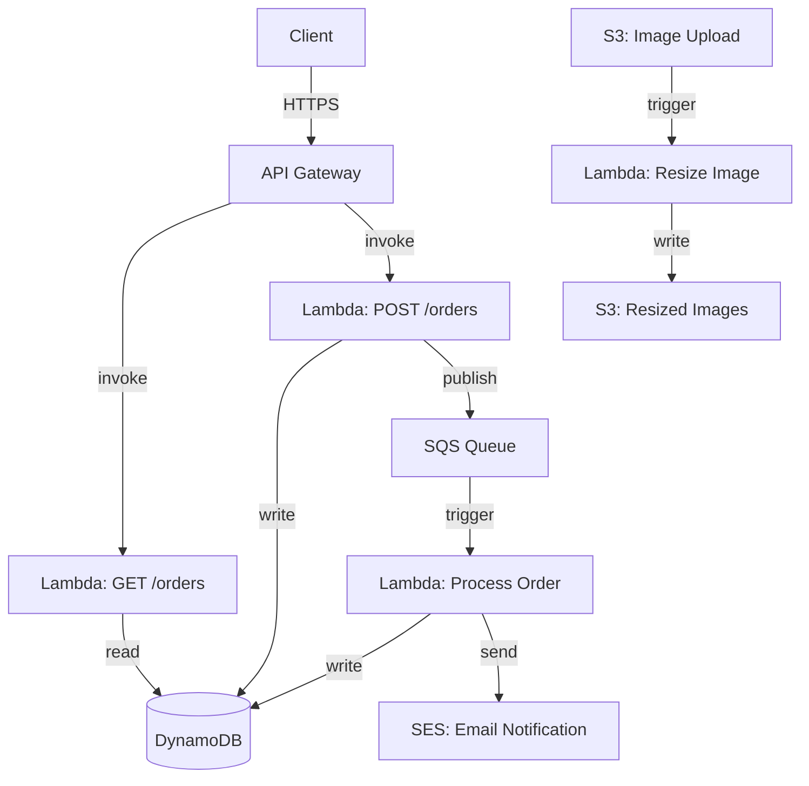
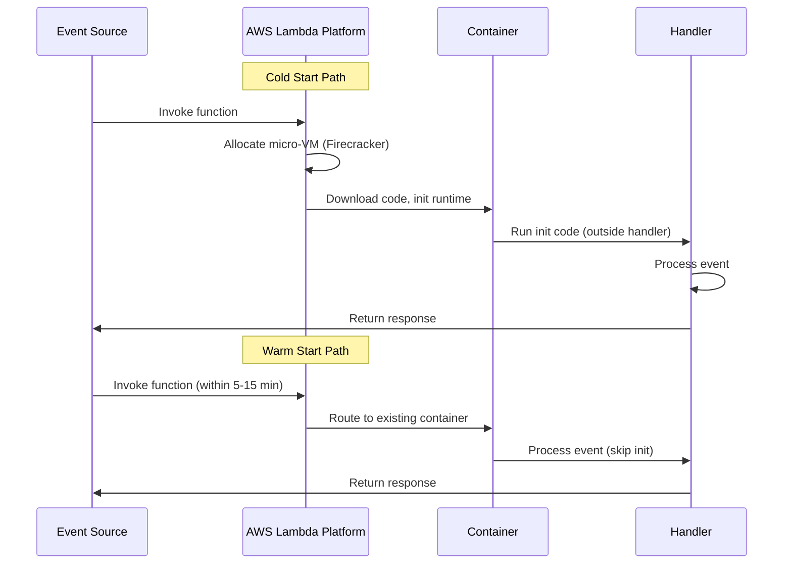
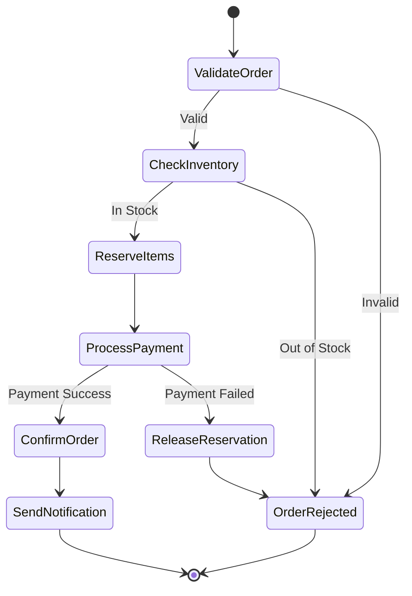
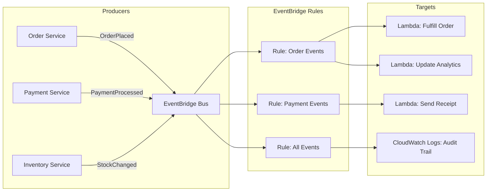
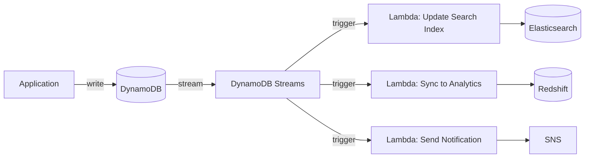

# Serverless

## 1. Overview

Serverless computing is an execution model where the cloud provider manages the infrastructure, automatically provisions compute capacity on demand, and charges only for actual execution time. You write a function, deploy it, and the provider handles everything else -- provisioning, scaling, patching, and decommissioning. AWS Lambda is the canonical example, but the serverless model extends beyond functions to databases (DynamoDB), queues (SQS), and API management (API Gateway).

The senior architect's perspective on serverless is nuanced: it delivers extraordinary speed-to-market and zero operational overhead for event-driven, bursty workloads. But it comes with a Faustian bargain -- vendor lock-in that deepens with every AWS service you adopt. Once your Lambda functions talk to SQS, API Gateway, DynamoDB, S3, Step Functions, and CloudWatch, migrating to another provider requires a near-total rewrite. Serverless is not "no servers" -- it is "not your servers, not your problem, and not your choice to leave."

The key insight: serverless is not about eliminating servers. It is about eliminating the operational burden of managing servers. You stop thinking about instance types, autoscaling policies, OS patches, and capacity planning. The cloud provider handles all of it, and your bill reflects actual usage rather than provisioned capacity. For teams where engineering time is more valuable than infrastructure cost (startups, small teams, prototype-phase products), this trade-off is enormously favorable.

## 2. Why It Matters

- **Zero infrastructure management**: No servers to provision, patch, or monitor. The provider handles OS updates, security patches, and capacity planning.
- **Pay-per-invocation**: You pay only when your code runs. A function that executes 1 million times per month at 128 MB for 200ms costs approximately $0.20. During off-hours, the cost is literally zero.
- **Automatic scaling**: Lambda scales from 0 to thousands of concurrent executions in seconds. No HPA configuration, no cluster management, no capacity planning.
- **Speed to market**: Deploy a production-ready API endpoint in minutes, not days. For startups and prototypes, this speed advantage is enormous.
- **Event-driven by nature**: Lambda functions are triggered by events -- S3 uploads, SQS messages, API Gateway requests, DynamoDB Streams, Kinesis records. This makes serverless a natural fit for event-driven architectures.
- **Operational simplicity for small teams**: A three-person startup can build and operate a production backend without a dedicated DevOps engineer. The cloud provider is your operations team.

## 3. Core Concepts

- **Function as a Service (FaaS)**: The core serverless compute model. You deploy a function (code + handler) that is invoked in response to events. AWS Lambda, Google Cloud Functions, Azure Functions.
- **Cold Start**: The latency penalty when a function is invoked after being idle. The provider must allocate a container, download your code, initialize the runtime, and execute the handler. Cold starts range from 100ms (Python, Node.js) to 1-10 seconds (Java, .NET with large dependencies).
- **Warm Start**: Subsequent invocations reuse the existing container, avoiding initialization overhead. Latency is typically 1-10ms.
- **Provisioned Concurrency**: Pre-warming Lambda instances to eliminate cold starts for latency-sensitive workloads. You pay for the provisioned capacity whether or not it is used.
- **Reserved Concurrency**: A hard cap on the maximum number of concurrent instances for a specific function. Prevents one function from consuming the entire account concurrency pool and throttling other functions. Also acts as a throttle to protect downstream services.
- **Invocation Model**: Synchronous (API Gateway -> Lambda -> response) or asynchronous (SQS -> Lambda, fire-and-forget with retry). Asynchronous invocations use an internal queue with built-in retry (up to 2 retries) and dead-letter queue support.
- **Execution Limits**: Lambda has a maximum execution time (15 minutes), memory (10 GB), deployment package size (250 MB unzipped), and concurrency limits (1,000 default, adjustable).
- **Handler and Context**: The handler is the entry point function that Lambda calls (e.g., `exports.handler = async (event, context) => {...}`). The `event` object carries the trigger payload. The `context` object provides runtime metadata -- function name, remaining time in milliseconds, log group, and request ID. Reusable resources (DB connections, SDK clients) should be initialized outside the handler in the "init phase" to survive across warm invocations.
- **Vendor Lock-in Ecosystem**: The web of AWS services that Lambda depends on -- API Gateway for routing, SQS for queuing, DynamoDB for storage, S3 for static assets, CloudWatch for logs, Step Functions for orchestration, Route 53 for DNS. Each integration deepens the lock-in.
- **Lambda Layers**: Reusable packages of libraries, custom runtimes, or other dependencies. Layers are extracted to `/opt` in the execution environment. Use them to share common code (AWS SDK, utility functions) across multiple Lambda functions without duplicating in each deployment package.
- **Lambda Extensions**: Companion processes that run alongside the function, enabling integration with monitoring, security, and governance tools. Extensions participate in the Lambda lifecycle (init, invoke, shutdown) and can perform background tasks like flushing telemetry.

## 4. How It Works

### Lambda Execution Model (Deep Dive)

The Lambda execution lifecycle has three distinct phases:

**1. Init Phase** (cold start only):
- The Lambda service allocates a Firecracker micro-VM -- a lightweight virtualization technology that provides process-level isolation with VM-level security. Each execution environment runs in its own micro-VM.
- The runtime (Node.js, Python, Java, Go, .NET, or custom) is initialized.
- Lambda downloads the deployment package from S3 and extracts it.
- Any code outside the handler function executes (module-level imports, DB connection pools, SDK client initialization). This code runs once per container lifecycle and is reused across warm invocations.
- Lambda extensions initialize.

**2. Invoke Phase** (every invocation):
- The Lambda service routes the event to an available execution environment.
- The handler function executes with the event payload and context object.
- The function processes the event and returns a response (synchronous) or an acknowledgment (asynchronous).
- Billed duration starts when the handler begins and ends when it returns or times out.

**3. Shutdown Phase** (container recycling):
- After 5-15 minutes of inactivity (varies, not guaranteed), the Lambda service freezes and eventually terminates the execution environment.
- Extensions receive a shutdown event and have up to 2 seconds to perform cleanup (flush logs, close connections).
- The micro-VM is decommissioned.

### Cold Start Breakdown

| Phase | Duration (typical) | Mitigation |
|---|---|---|
| Container allocation | 50-200ms | Provisioned concurrency |
| Runtime initialization | 50-500ms | Use lightweight runtimes (Node.js, Python) |
| Dependency loading | 100ms-5s | Minimize dependencies, use layers |
| Handler init code | Variable | Move expensive init outside the handler |
| **Total cold start** | **200ms-10s** | **Provisioned concurrency, keep functions warm** |

### Concurrency Model

Lambda concurrency is the number of function instances processing events simultaneously. Understanding the concurrency model is critical for capacity planning:

- **Account-level concurrency**: Default 1,000 concurrent executions per region, shared across all functions. Adjustable via AWS support (commonly raised to 10,000+).
- **Reserved concurrency**: Allocates a fixed pool to a specific function. Guarantees capacity for critical functions but reduces the pool available to others. If Function A has 200 reserved and the account limit is 1,000, all other functions share the remaining 800.
- **Provisioned concurrency**: Pre-initializes a specified number of execution environments. These instances are always warm -- no cold starts. You pay ~$0.015 per GB-hour for provisioned capacity, whether invoked or not. Use Application Auto Scaling to adjust provisioned concurrency based on a schedule or utilization metric.
- **Burst concurrency**: Lambda can scale by 500-3,000 instances immediately (varies by region), then adds 500 instances per minute thereafter. A sudden spike from 0 to 10,000 concurrent requests will throttle during the ramp-up period.

```
Account Concurrency Pool: 1,000 (default)
  |
  |-- Function A (Reserved: 200)  --> Guaranteed 200, max 200
  |-- Function B (Reserved: 100)  --> Guaranteed 100, max 100
  |-- Unreserved Pool: 700        --> Shared by all other functions
  |
  |-- Function C (Provisioned: 50 of unreserved)
  |       --> 50 always warm, can burst to unreserved limit
```

### The Vendor Lock-In Ecosystem

```
Lambda Function
  |-- Triggered by: API Gateway, SQS, S3, DynamoDB Streams, Kinesis, EventBridge
  |-- Reads from: DynamoDB, S3, RDS Proxy, ElastiCache
  |-- Writes to: DynamoDB, S3, SQS, SNS, Kinesis
  |-- Orchestrated by: Step Functions
  |-- Monitored by: CloudWatch, X-Ray
  |-- DNS: Route 53
  |-- Auth: Cognito
  |-- Edge compute: Lambda@Edge, CloudFront Functions
```

Each arrow is an integration point. Replacing any one of these requires code changes. Replacing all of them is a multi-quarter migration project.

## 5. Architecture / Flow

### Serverless API Architecture



### Cold Start vs. Warm Start



### Step Functions Orchestration



Step Functions model complex workflows as state machines with explicit states, transitions, error handling, and retry policies. Each state can invoke a Lambda function, make an AWS SDK call, wait for a callback, or branch based on input. This replaces fragile synchronous Lambda-to-Lambda chains with a durable, auditable orchestration layer.

### Event-Driven Serverless with EventBridge



EventBridge is the serverless event bus for decoupling producers from consumers. Services publish structured events to a bus; rules match events by pattern and route them to targets (Lambda, SQS, Step Functions, third-party APIs). Unlike SQS (point-to-point), EventBridge enables many-to-many event routing with content-based filtering.

### DynamoDB Streams + Lambda (CDC Pattern)



DynamoDB Streams captures item-level changes (INSERT, MODIFY, REMOVE) as an ordered sequence of events. Lambda processes these changes in near-real-time, enabling Change Data Capture (CDC) without polling or application-level event publishing.

## 6. Types / Variants

### FaaS Patterns

| Pattern | Description | Example |
|---|---|---|
| **API Backend** | Lambda behind API Gateway serving REST/GraphQL | CRUD microservice |
| **Event Processor** | Lambda triggered by queue/stream events | SQS -> Lambda for order processing |
| **Scheduled Task** | Lambda triggered by cron (EventBridge) | Nightly data cleanup, report generation |
| **Stream Processor** | Lambda consuming Kinesis/DynamoDB Streams | Real-time analytics, CDC processing |
| **File Processor** | Lambda triggered by S3 uploads | Image resizing, video transcoding kickoff |
| **Orchestrated Workflow** | Step Functions coordinating multiple Lambdas | Multi-step order fulfillment |
| **Edge Compute** | Lambda@Edge or CloudFront Functions at CDN edge | A/B testing, auth at edge, URL rewriting |
| **Event Router** | Lambda consuming EventBridge events | Cross-service event-driven architecture |

### Common Serverless Integration Patterns

**Pattern 1: API Gateway + Lambda (Synchronous API)**
The most common pattern. API Gateway handles HTTP routing, request validation, throttling, and authentication. Lambda processes the request and returns a response. Use REST API for full-featured APIs or HTTP API for simpler, cheaper, lower-latency endpoints.

**Pattern 2: S3 Trigger + Lambda (File Processing)**
S3 emits events on object creation/deletion. Lambda processes the file -- resizing images, transcoding video, parsing CSVs, validating uploads. Critical consideration: configure S3 event notifications carefully to avoid recursive triggers (Lambda writes output to the same bucket that triggered it).

**Pattern 3: SQS + Lambda (Asynchronous Processing)**
SQS decouples the producer from the consumer. Lambda polls the queue using long-polling, processes messages in batches (up to 10), and deletes successful messages. Failed messages return to the queue after the visibility timeout and eventually move to a dead-letter queue (DLQ) after exceeding the max receive count.

**Pattern 4: DynamoDB Streams + Lambda (CDC/Event Sourcing)**
DynamoDB Streams provides an ordered sequence of item changes. Lambda processes stream records in order within each shard. Use cases: sync to search indexes (Elasticsearch), replicate to analytics (Redshift), trigger downstream workflows. The IteratorAge metric reveals how far behind the Lambda consumer is from the latest stream record.

**Pattern 5: EventBridge + Lambda (Event-Driven Routing)**
EventBridge rules filter events by source, detail-type, or custom patterns and route them to Lambda targets. Enables loose coupling between services: the order service publishes "OrderPlaced" events without knowing which downstream services consume them.

### Lambda@Edge and CloudFront Functions

Lambda@Edge and CloudFront Functions extend serverless compute to the CDN edge, executing code at CloudFront edge locations closest to the user.

| Dimension | CloudFront Functions | Lambda@Edge |
|---|---|---|
| **Runtime** | JavaScript only | Node.js, Python |
| **Execution time** | < 1ms | Up to 5s (viewer) / 30s (origin) |
| **Memory** | 2 MB | 128-10,240 MB |
| **Network access** | No | Yes |
| **Triggers** | Viewer request/response only | Viewer and origin request/response |
| **Scale** | Millions of RPS | Thousands of RPS |
| **Cost** | ~$0.10 per million | ~$0.60 per million |
| **Use cases** | URL rewrites, header manipulation, cache key normalization, simple A/B testing | Auth validation, origin selection, image transformation, personalization |

CloudFront Functions are for lightweight, high-volume transformations (rewriting URLs, manipulating headers). Lambda@Edge is for heavier logic that needs network access or longer execution (validating JWTs, fetching content from origin, generating dynamic responses).

### When to Use Serverless vs. Containers

| Dimension | Serverless (Lambda) | Containers (ECS/EKS/K8s) |
|---|---|---|
| **Traffic pattern** | Bursty, unpredictable, low baseline | Steady, high-throughput |
| **Execution duration** | < 15 minutes | Long-running processes |
| **Cold start tolerance** | Acceptable or mitigated | Not acceptable |
| **Operational capacity** | Small team, minimal DevOps | Dedicated platform team |
| **Cost at scale** | Expensive at sustained high RPS | More cost-effective at sustained load |
| **Vendor lock-in** | Deep (AWS ecosystem) | Portable (Kubernetes is multi-cloud) |
| **Local development** | Harder (SAM, LocalStack) | Native (Docker) |
| **State management** | Stateless (external state in DynamoDB) | Stateful containers possible |

**Rule of thumb**: If your function executes more than 1 million times per day at sustained load, containers are likely cheaper. If your traffic is bursty with long idle periods, serverless wins on cost.

### Serverless on Other Clouds

| Cloud | FaaS Service | Distinguishing Feature |
|---|---|---|
| **AWS** | Lambda | Deepest ecosystem integration (API Gateway, DynamoDB, Step Functions, EventBridge). Most mature. 15-min timeout. |
| **Azure** | Azure Functions | Durable Functions for stateful orchestration (similar to Step Functions but code-first). Premium plan for VNET integration and pre-warmed instances. Consumption plan for true pay-per-execution. |
| **Google Cloud** | Cloud Functions (2nd gen) | Built on Cloud Run (container-based). Longer timeout (60 min for event-driven). Better local development via standard Docker containers. Eventarc for event routing. |
| **Google Cloud** | Cloud Run | Container-based serverless: deploy any Docker container, scale to zero. Bridges the gap between Lambda (function-level) and ECS (cluster-level). No cold start penalty for pre-warmed instances. Up to 60 min timeout. |

Cloud Run deserves special attention: it accepts any container image, scales to zero, and charges per-request -- effectively offering the economic model of serverless with the flexibility of containers. It eliminates many Lambda limitations (arbitrary runtimes, no deployment size limit, longer timeouts) while retaining the pay-per-use model.

## 7. Use Cases

- **Netflix**: Uses Lambda for media processing pipelines -- encoding validation, metadata extraction, and thumbnail generation triggered by S3 uploads. These are bursty, event-driven workloads that are perfect for serverless.
- **Coca-Cola**: Migrated vending machine telemetry processing to Lambda + Kinesis. Reduced infrastructure costs by 65% compared to EC2-based processing.
- **iRobot (Roomba)**: Uses Lambda to process IoT events from millions of connected vacuum cleaners. Traffic is extremely bursty (most vacuums run during specific hours) and scales to zero at night.
- **Capital One**: Uses Lambda for real-time fraud detection on credit card transactions. Each transaction triggers a Lambda function that evaluates risk models against DynamoDB data.
- **Startup MVP**: A three-person startup builds their entire backend on API Gateway + Lambda + DynamoDB. Zero servers to manage, costs under $50/month, and they can focus entirely on product development.
- **Step Functions for e-commerce**: An order fulfillment workflow: ValidateOrder -> CheckInventory -> ReserveItems -> ProcessPayment -> ConfirmOrder -> SendNotification. Step Functions manages state, retries failed payment attempts with exponential backoff, and routes to compensating transactions (release reservation) on failure. Each step is a Lambda function that takes 100-500ms. The orchestrator replaces fragile synchronous chains with a durable, visible state machine.
- **EventBridge for multi-team decoupling**: A platform team publishes domain events (UserCreated, OrderShipped, SubscriptionRenewed) to EventBridge. Downstream teams create rules to consume only the events they care about -- analytics team captures all events for data warehousing, notifications team triggers on OrderShipped, fraud team monitors PaymentProcessed. No cross-team API dependencies.

## 8. Tradeoffs

| Advantage | Disadvantage |
|---|---|
| Zero infrastructure management | Deep vendor lock-in (AWS ecosystem bind) |
| Pay only for execution time | Cold starts add 200ms-10s latency |
| Automatic scaling (0 to thousands) | 15-minute execution time limit |
| Fast deployment and iteration | Harder to debug locally |
| Built-in HA and fault tolerance | Limited compute (10 GB RAM max) |
| Event-driven integration with cloud services | Stateless model requires external state stores |
| Cost-effective for bursty/low traffic | Expensive at sustained high throughput |
| Step Functions provide durable orchestration | Step Functions add latency per state transition (~50-100ms) |
| Lambda@Edge enables edge compute | Edge functions have strict size/time limits |
| EventBridge enables loose coupling | Event schemas require governance to prevent breaking changes |

## 9. Common Pitfalls

- **Ignoring cold starts in latency-sensitive paths**: If your API has a P99 latency SLA of 200ms, cold starts will violate it. Use provisioned concurrency for user-facing APIs or accept that the first request after idle will be slow.
- **Fat deployment packages**: A 200 MB Lambda package with unused dependencies takes seconds to initialize. Minimize dependencies, use Lambda layers for shared libraries, and prefer lightweight runtimes.
- **Not planning for vendor lock-in**: Every AWS service you integrate makes migration harder. If multi-cloud is a future requirement, abstract your storage, queuing, and API layers behind interfaces. Realistically, most teams accept the lock-in for the productivity gains.
- **Using Lambda for long-running tasks**: Lambda has a 15-minute timeout. Batch jobs, ML training, and video transcoding need containers (ECS, EKS) or Step Functions to break work into smaller steps.
- **Recursive Lambda invocations**: A Lambda writing to S3, which triggers another Lambda, which writes to S3, creates an infinite loop. Use dead-letter queues and invocation limits to prevent runaway costs. Configure S3 event notifications with prefix/suffix filters to isolate input and output buckets.
- **Ignoring concurrency limits**: Lambda has a default concurrency limit of 1,000 per account per region. A traffic spike can exhaust this limit, throttling all functions in the account. Request limit increases proactively.
- **The Lambda Monolith**: A single Lambda function with complex routing logic (its own URL router, middleware chain, and dozens of endpoints). This defeats the purpose of serverless. A 50 MB monolith function has slow cold starts, cannot scale individual endpoints independently, and makes deployments risky. Split into one function per endpoint or use API Gateway routing.
- **Chatty Lambda functions**: A Lambda function that makes 10 sequential HTTP calls to other services. Each call adds latency; any failure fails the entire function. Prefer parallel calls (`Promise.all` in Node.js), batch APIs, or Step Functions for orchestration.
- **Not setting reserved concurrency**: If one Lambda function consumes all 1,000 concurrent executions in your account, other Lambda functions are throttled. Use reserved concurrency to guarantee capacity for critical functions and act as a throttle for non-critical ones.
- **Synchronous chains of Lambdas (Lambda-to-Lambda)**: Lambda A invokes Lambda B, which invokes Lambda C. This creates a chain where cold starts compound, timeouts cascade, and billing doubles (you pay for A while it waits for B). Use SQS or Step Functions to decouple.
- **Storing secrets in environment variables without encryption**: Lambda environment variables are visible in the AWS console. Use AWS Secrets Manager or SSM Parameter Store with encryption for sensitive values. Cache secrets in the init phase to avoid per-invocation API calls.
- **Not testing locally**: Deploying to AWS for every code change is slow and expensive. Use tools like SAM CLI, LocalStack, or Docker to test Lambda functions locally before deployment.
- **Oversized packages with unused SDKs**: The AWS SDK v3 supports tree-shaking -- import only the clients you need (`@aws-sdk/client-dynamodb`) instead of the entire SDK. This alone can reduce package size by 80%.
- **Ignoring DLQs and error handling**: Asynchronous Lambda invocations retry twice by default. Without a dead-letter queue (SQS or SNS), failed events are silently dropped. Always configure DLQs for async functions and monitor DLQ depth.
- **Step Functions without idempotent steps**: Step Functions can retry failed states. If your Lambda function is not idempotent (e.g., it charges a credit card on every invocation), retries will cause duplicate operations. Design every step to be safely re-executable.

## 10. Real-World Examples

- **AWS Lambda at scale**: Lambda processes trillions of invocations per month across AWS customers. Internal AWS services like S3 event notifications and CloudWatch Logs use Lambda for event processing.
- **Netflix (media pipeline)**: Lambda functions handle encoding validation when new content is uploaded. The pipeline processes thousands of titles per day with zero provisioned infrastructure.
- **Fender (Play)**: The guitar lesson platform uses Lambda + DynamoDB for their API. Traffic is highly variable -- peaks during evenings and weekends, near-zero at 3 AM. Serverless saves 60% versus always-on infrastructure.
- **Thomson Reuters**: Processes financial data feeds through Lambda. Incoming market data triggers Lambda functions that normalize, enrich, and route the data to downstream analytics systems.

### Cost Analysis: Serverless vs. Containers (Detailed)

**Scenario 1: Low traffic (bursty)**
A service processing 500K requests/day, concentrated in 8 hours (business hours), idle the other 16 hours. Average duration 150ms, 256 MB memory.

| | Lambda | ECS Fargate (1 task, 0.5 vCPU, 1 GB) |
|---|---|---|
| Compute | 500K * 0.15s * 0.25GB = 18,750 GB-s/day * $0.0000166667 = $0.31/day | 1 task * 24h * $0.04048/vCPU-hr * 0.5 vCPU = $0.49/day |
| Requests | 500K * $0.20/1M = $0.10/day | Included |
| Monthly total | **~$12.30** | **~$14.70** |
| **Verdict** | **Lambda wins** -- scales to zero during 16 idle hours | Paying for 16 hours of idle compute |

**Scenario 2: Sustained high traffic**
A service processing 10 million requests/day at steady rate (116 RPS constant). Average duration 200ms, 256 MB memory.

| | Lambda | ECS Fargate (2 vCPU, 4 GB, 3 tasks) |
|---|---|---|
| Compute | 10M * 0.2s * 0.25GB = 500K GB-s/day * $0.0000166667 = $8.33/day | 3 * ($0.04048 * 2 + $0.004445 * 4) * 24h = $8.84/day |
| Requests | 10M * $0.20/1M = $2.00/day | Included |
| Monthly total | **~$310** | **~$265** |
| **Verdict** | Containers win at steady-state | **ECS saves ~15%** with no cold start risk |

**Scenario 3: Very high traffic**
A service processing 100 million requests/day. Average duration 100ms, 512 MB memory.

| | Lambda | ECS Fargate (4 vCPU, 8 GB, 10 tasks) |
|---|---|---|
| Monthly compute | $2,500 | $1,400 |
| Monthly requests | $600 | Included |
| Monthly total | **~$3,100** | **~$1,400** |
| **Verdict** | Containers win decisively | **ECS saves 55%** |

**The break-even rule of thumb**: Lambda is cheaper below ~3M requests/day at typical durations. Above that threshold with steady traffic, containers win. The exact crossover depends on function duration, memory allocation, and traffic distribution. Bursty traffic shifts the crossover point higher because Lambda scales to zero during idle periods.

**Provisioned concurrency cost impact**: Adding provisioned concurrency erodes the cost advantage of serverless. 100 provisioned instances at 256 MB = 25.6 GB * 730 hours * $0.0000041667/GB-second = ~$280/month in provisioning costs alone, before any invocations. At this point, you are approaching the cost of always-on containers without the flexibility.

### Serverless Ecosystem (AWS)

| Service | Role in Serverless Stack | Alternative (non-serverless) |
|---|---|---|
| **Lambda** | Compute | EC2, ECS, EKS |
| **API Gateway** | HTTP endpoint | ALB, Nginx |
| **DynamoDB** | Database | RDS, Aurora |
| **SQS** | Message queue | Kafka (MSK) |
| **SNS** | Pub/sub notifications | Kafka, EventBridge |
| **Step Functions** | Workflow orchestration | Temporal, Airflow |
| **S3** | Object storage | (No alternative -- S3 is universal) |
| **EventBridge** | Event routing | Custom event bus |
| **CloudWatch** | Monitoring | Prometheus, Datadog |
| **Cognito** | Authentication | Auth0, Keycloak |
| **Lambda@Edge** | Edge compute | Cloudflare Workers |
| **AppSync** | Managed GraphQL | Self-hosted GraphQL server |

Each integration deepens the lock-in. A Lambda function that uses API Gateway, SQS, DynamoDB, S3, and CloudWatch has five AWS-specific integration points that require rewriting for another cloud.

### Step Functions: Orchestration Deep Dive

Step Functions model workflows as JSON-defined state machines with the following state types:

| State Type | Purpose | Example |
|---|---|---|
| **Task** | Invoke a Lambda, SDK call, or ECS task | Process a payment |
| **Choice** | Branch based on input conditions | If amount > $1000, require approval |
| **Parallel** | Execute branches concurrently | Charge payment AND send notification simultaneously |
| **Wait** | Pause for a duration or until a timestamp | Wait 24 hours before sending a reminder |
| **Map** | Iterate over a collection, processing each item | Process each line item in an order |
| **Succeed / Fail** | Terminal states | Mark workflow as complete or failed |

**Error handling in Step Functions**:
- **Retry**: Define retry policies per state with `IntervalSeconds`, `MaxAttempts`, and `BackoffRate`. Example: retry a payment Lambda 3 times with exponential backoff (2s, 4s, 8s).
- **Catch**: Define fallback states for specific error types. If PaymentFailed, transition to ReleaseReservation state. If TaskTimedOut, transition to AlertOps state.
- **Timeouts**: Each state can have a `TimeoutSeconds`. If a Lambda does not respond within the timeout, Step Functions transitions to the error handler rather than waiting indefinitely.

**Standard vs. Express Workflows**:

| Dimension | Standard | Express |
|---|---|---|
| Duration | Up to 1 year | Up to 5 minutes |
| Execution model | Exactly-once | At-least-once (async) or at-most-once (sync) |
| Pricing | Per state transition ($0.025/1000) | Per execution + duration |
| History | Full execution history in console | CloudWatch Logs only |
| Use case | Long-running workflows, human approval | High-volume, short-duration (IoT, streaming) |

### Cold Start Mitigation Strategies

Cold starts are the primary operational concern with serverless. Here are the strategies ranked by effectiveness:

**1. Provisioned Concurrency** (most effective):
- Pre-warms a specified number of Lambda instances.
- Eliminates cold starts for up to the provisioned count.
- You pay for the provisioned capacity whether or not it is used.
- Best for latency-sensitive, user-facing APIs.
- Combine with Application Auto Scaling to adjust provisioned concurrency based on schedule (scale up at 8 AM, scale down at 8 PM) or utilization target.

**2. Keep-warm pings**:
- A CloudWatch Events rule triggers the function every 5 minutes to keep it warm.
- Works for low-traffic functions but does not help during traffic spikes that exceed the warm instance count.
- A hack, not a solution -- but widely used.

**3. Lightweight runtimes**:
- Node.js and Python cold starts: 100-300ms.
- Java cold starts: 1-10 seconds (JVM initialization + class loading).
- Go cold starts: 50-100ms (compiled binary, no runtime initialization).
- Rust cold starts: 50-80ms (compiled, minimal runtime).
- If latency matters, avoid Java on Lambda unless you use GraalVM native images or SnapStart.

**4. Minimize deployment package size**:
- Remove unused dependencies. Use tree-shaking for Node.js.
- Use Lambda layers for shared libraries (AWS SDK, utility functions).
- For Java, use frameworks optimized for Lambda (Quarkus, Micronaut) instead of Spring Boot.
- AWS SDK v3 (JavaScript): import only the clients you need. `@aws-sdk/client-dynamodb` instead of the entire `aws-sdk`.

**5. Lambda SnapStart (Java only)**:
- Takes a snapshot of the initialized JVM after the first cold start.
- Subsequent cold starts restore from the snapshot instead of re-initializing.
- Reduces Java cold starts from seconds to ~200ms.

### Observability Challenges and Solutions

Serverless fundamentally changes observability because you do not own the infrastructure. There are no servers to SSH into, no process lists to inspect, no /var/log to tail.

**Structured Logging**:
Lambda writes stdout/stderr to CloudWatch Logs. Unstructured print statements create a debugging nightmare at scale. Use structured JSON logging with correlation IDs:
```json
{
  "level": "INFO",
  "requestId": "abc-123",
  "correlationId": "order-456",
  "message": "Payment processed",
  "amount": 99.99,
  "duration_ms": 145,
  "cold_start": false
}
```

**Distributed Tracing with X-Ray**:
AWS X-Ray traces requests across API Gateway -> Lambda -> DynamoDB -> SQS -> Lambda. Each service adds a segment to the trace, creating a visual "waterfall" showing where time is spent. X-Ray is essential for diagnosing latency in multi-step serverless flows. Limitation: X-Ray adds ~1ms overhead per subsegment and increases costs at high volume.

**Key Metrics to Monitor**:

| Metric | What It Reveals | Alert Threshold |
|---|---|---|
| ConcurrentExecutions | How close to account limit | > 80% of account limit |
| Throttles | Requests rejected due to concurrency | Any non-zero value |
| Duration (P99) | Tail latency including cold starts | Exceeds SLA target |
| Errors | Function failures | > 1% error rate |
| IteratorAge | Stream consumer lag | > 60 seconds |
| DeadLetterErrors | Failed DLQ deliveries | Any non-zero value |
| Cold start rate | % of invocations with init phase | > 5% for user-facing APIs |

**Cold start metrics**: CloudWatch does not natively report cold start percentage. Use Lambda extensions or custom metrics to track init duration separately from handler duration. The `REPORT` log line includes `Init Duration` for cold starts -- parse this for cold start rate monitoring.

### Serverless Design Patterns

**Event Processing Pipeline**:
```
S3 Upload -> Lambda (validate) -> SQS -> Lambda (process) -> DynamoDB -> DynamoDB Streams -> Lambda (notify) -> SNS -> Email
```

**Fan-Out/Fan-In**:
```
API Gateway -> Lambda (coordinator) -> SQS (fan-out to N queues) -> N Lambdas (parallel processing) -> DynamoDB (collect results) -> Lambda (aggregate) -> Response
```

**Scheduled Data Pipeline**:
```
EventBridge (cron) -> Lambda (extract) -> S3 (raw data) -> Lambda (transform) -> S3 (clean data) -> Lambda (load) -> Redshift
```

**Strangler Fig Migration**:
```
API Gateway -> {
  /v1/* -> Legacy Monolith (EC2)    // Old endpoints stay on monolith
  /v2/* -> Lambda Functions          // New endpoints go serverless
}
```
Gradually migrate endpoints from the monolith to Lambda. API Gateway acts as the router, allowing incremental migration without big-bang rewrites.

**Circuit Breaker with Step Functions**:
```
Step Function -> Try Lambda (call external API) -> {
  Success -> Continue workflow
  Failure (3x) -> Fallback Lambda (return cached/default response) -> Alert Ops
}
```

### Monitoring Serverless Applications

Serverless changes what you monitor:

| Traditional Metric | Serverless Equivalent |
|---|---|
| CPU utilization | Duration (execution time) |
| Memory utilization | Memory used vs. allocated |
| Instance count | Concurrent executions |
| Network throughput | Invocation count |
| Disk I/O | N/A (no persistent disk) |
| Process health | Error rate, throttle count |

Key CloudWatch metrics for Lambda:
- **Invocations**: Total function calls.
- **Duration**: Execution time (billed in 1ms increments).
- **Errors**: Function errors (exceptions, timeouts).
- **Throttles**: Requests rejected due to concurrency limits.
- **ConcurrentExecutions**: Number of functions running simultaneously.
- **IteratorAge** (for stream sources): How far behind the Lambda is from the latest record in the stream.

## 11. Related Concepts

- [API Gateway](./01-api-gateway.md) -- the front door for serverless APIs (AWS API Gateway + Lambda)
- [Microservices](./02-microservices.md) -- serverless is an alternative deployment model for microservices
- [Event-Driven Architecture](../05-messaging/02-event-driven-architecture.md) -- Lambda is inherently event-driven; EventBridge is the serverless event bus
- [Autoscaling](../02-scalability/02-autoscaling.md) -- serverless is the ultimate auto-scaling: scale to zero, scale to thousands
- [Rate Limiting](../08-resilience/01-rate-limiting.md) -- API Gateway rate limiting protects Lambda from overload
- [DynamoDB](../03-storage/08-dynamodb.md) -- the canonical serverless database; Streams enable CDC triggers
- [Message Queues](../05-messaging/01-message-queues.md) -- SQS as a Lambda trigger for asynchronous processing
- [CQRS](../05-messaging/04-cqrs.md) -- serverless naturally supports CQRS with separate read/write Lambda functions
- [Circuit Breaker](../08-resilience/02-circuit-breaker.md) -- Step Functions implement circuit breaker patterns for external API calls
- [Distributed Transactions](../08-resilience/03-distributed-transactions.md) -- Step Functions implement the saga pattern for multi-step workflows

## 12. Source Traceability

- source/youtube-video-reports/4.md (serverless, Lambda trap, vendor lock-in ecosystem, event sourcing, Step Functions orchestration)
- source/youtube-video-reports/5.md (auto scaling, Kubernetes vs serverless, infrastructure maturity model)
- source/youtube-video-reports/6.md (Kubernetes vs serverless, traffic patterns, orchestration vs choreography)
- source/youtube-video-reports/7.md (DynamoDB Streams + Lambda CDC pattern, event-driven architecture)
- source/youtube-video-reports/8.md (caching patterns with Lambda, CDN edge compute)
- source/extracted/acing-system-design/ch03-a-walkthrough-of-system-design-concepts.md (serverless overview, FaaS)
- source/extracted/system-design-guide/ch06-core-components-of-distributed-systems.md (FaaS, cloud computing, serverless model)
- source/extracted/system-design-guide/ch12-design-and-implementation-of-system-components-api-security-.md (API Gateway patterns, authentication)
