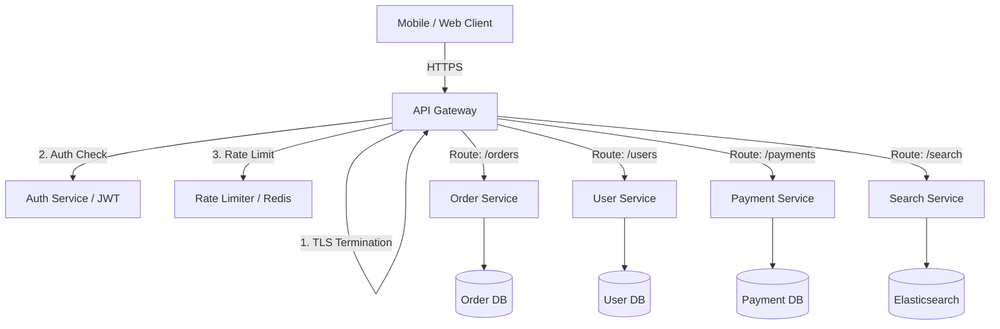
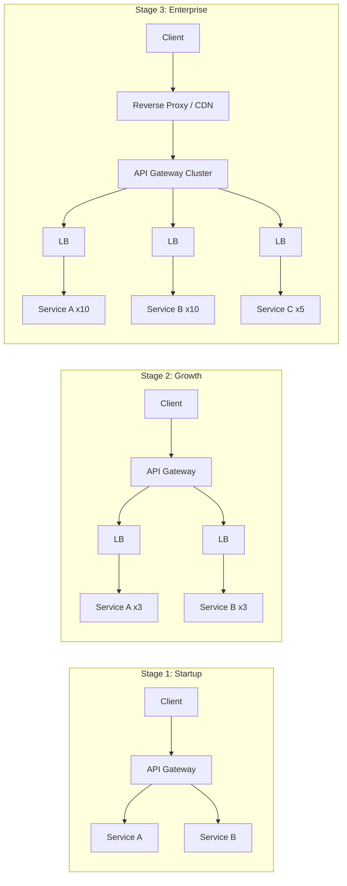

# API Gateway

## 1. Overview

An API gateway is the single entry point for all client requests into a microservices architecture. It sits between external clients and your internal service fleet, handling cross-cutting concerns -- routing, authentication, rate limiting, protocol translation, and request aggregation -- so that individual services do not have to. Think of it as a reverse proxy with opinions: it knows about your API surface and enforces organizational policies at the edge.

The critical architectural decision is not whether to use an API gateway (you will), but when and how much of one you need. A startup with three services and one API gateway is well-served. An enterprise with hundreds of services needs a layered traffic management stack. Over-engineering this layer too early burns capital; under-engineering it too late creates a security and operational liability.

The API gateway pattern emerged from the practical reality that microservices create an explosion of endpoints. A mobile client that previously talked to one monolith endpoint now needs to know about 15 different service URLs, each with its own authentication mechanism, protocol, and error format. The gateway collapses this complexity into a single, stable interface -- one URL, one auth mechanism, one error format -- while the internal topology changes freely behind it.

## 2. Why It Matters

- **Security enforcement**: Authentication (JWT validation, OAuth 2.0 token introspection), authorization, and input validation happen once at the edge rather than being duplicated across every service.
- **Rate limiting at the perimeter**: Malicious or misbehaving clients are rejected before they consume expensive downstream resources (CPU, database connections). See [Rate Limiting](../08-resilience/rate-limiting.md) for algorithmic detail.
- **Client simplification**: Instead of knowing the addresses and protocols of dozens of internal services, clients talk to one endpoint. The gateway handles routing, protocol translation (REST to gRPC), and response aggregation.
- **Operational visibility**: Centralized logging, metrics, and tracing for all inbound traffic. Every request passes through the gateway, making it the natural place to instrument latency, error rates, and traffic patterns.
- **Deployment decoupling**: Internal services can be split, merged, or relocated without changing the client-facing API. The gateway absorbs the routing changes.
- **Traffic management**: The gateway enables canary deployments (route 5% of traffic to the new version), blue-green deployments (instant switch between versions), and A/B testing (route specific users to specific backends).
- **Cross-cutting concern consolidation**: Without a gateway, every service independently implements auth, rate limiting, CORS, logging, and metrics. This leads to inconsistent implementations, security gaps, and duplicated effort. The gateway centralizes these concerns.

### The Complexity Budget Principle

As an architect, you manage a complexity budget. Every infrastructure layer you add has a cost:

- **Cognitive cost**: Developers must understand the layer's behavior, configuration, and failure modes.
- **Operational cost**: The layer must be monitored, maintained, and upgraded.
- **Latency cost**: Each layer adds processing time to every request.
- **Failure cost**: Each layer is a potential point of failure.

The 3-stage maturity model is a direct application of the complexity budget: add layers only when the benefit exceeds the cost. A startup with 3 services and 1,000 RPS does not need an Envoy service mesh, a global load balancer, and a separate WAF. An API Gateway handles it all.

## 3. Core Concepts

- **Request Routing**: Mapping external URL paths to internal services. `/api/v1/orders` routes to the Order Service; `/api/v1/users` routes to the User Service.
- **Authentication / Authorization (AuthN/AuthZ)**: Validating identity (JWT, OAuth tokens, API keys) and enforcing access policies (RBAC, scopes) at the edge.
- **Rate Limiting**: Enforcing request quotas per client, per endpoint, or per API key. Implemented via algorithms like token bucket or sliding window. Cross-link: [Rate Limiting](../08-resilience/rate-limiting.md) owns the canonical detail.
- **Protocol Translation**: Converting between protocols -- e.g., accepting REST/JSON from mobile clients and forwarding gRPC/Protobuf to internal services.
- **Request Aggregation / Composition**: Combining responses from multiple backend services into a single response for the client (the "Backend for Frontend" pattern).
- **Load Shedding**: Rejecting excess requests during overload to protect backend services from cascading failure.
- **Complexity Budget**: The architectural principle that infrastructure layers should be introduced incrementally, matching the current scale of the system -- not the hypothetical future scale.

## 4. How It Works

### Request Lifecycle

1. **Client sends request** to the gateway endpoint (e.g., `api.company.com/v1/orders`).
2. **TLS termination**: The gateway decrypts the HTTPS connection. Internal traffic may use plain HTTP or mutual TLS.
3. **Authentication**: The gateway validates the JWT or OAuth token. Invalid tokens receive a `401 Unauthorized`.
4. **Rate limiting**: The gateway checks the client's request rate against configured limits. Excess requests receive `429 Too Many Requests`.
5. **Routing**: The gateway maps the URL path and HTTP method to the target backend service.
6. **Protocol translation**: If needed, the gateway converts the request format (e.g., JSON to Protobuf).
7. **Load balancing**: The gateway selects a healthy instance of the target service (round robin, least connections, etc.).
8. **Forwarding**: The request is sent to the backend service.
9. **Response**: The backend response flows back through the gateway, which may add CORS headers, compress the response, or cache it.

### Comparison of Traffic Management Layers

| Component | Core Purpose | Scope | OSI Layer | Primary Use Case |
|---|---|---|---|---|
| **API Gateway** | Orchestration and security | Cross-service | Layer 7 | Auth, rate limiting, routing, protocol translation |
| **Load Balancer** | Traffic distribution | Intra-service | Layer 4 or 7 | Distributing requests across identical instances |
| **Reverse Proxy** | Performance and edge optimization | Web edge | Layer 7 | SSL termination, static asset caching, IP masking |

### 3-Stage Infrastructure Maturity Model

Infrastructure should evolve in lockstep with traffic volume and organizational complexity:

**Stage 1 -- Startup (1-10 services, <10K RPS)**:
- A single API gateway handles routing, auth, and basic rate limiting.
- No separate load balancers or reverse proxies needed.
- Managed services (AWS API Gateway, Kong) minimize operational overhead.

**Stage 2 -- Growth (10-50 services, 10K-100K RPS)**:
- Introduce independent load balancers per service for intra-service traffic management and health checking.
- API gateway focuses on edge concerns (auth, rate limiting, routing).
- Separate monitoring and logging infrastructure.

**Stage 3 -- Enterprise (50+ services, 100K+ RPS)**:
- Full stack: dedicated reverse proxies (Nginx/Envoy) at the edge for SSL termination and static caching.
- Centralized API gateway cluster for auth, routing, and policy enforcement.
- Per-service load balancers (or service mesh sidecars) for internal traffic.
- Global load balancers (AWS Global Accelerator, Cloudflare) for geographic routing.

## 5. Architecture / Flow

### API Gateway in a Microservices Architecture

### 3-Stage Infrastructure Evolution

## 6. Types / Variants

| Gateway | Type | Key Strength | Best For |
|---|---|---|---|
| **AWS API Gateway** | Managed (serverless) | Zero ops, Lambda integration | Serverless architectures, low-medium traffic |
| **Kong** | Open-source / Enterprise | Plugin ecosystem, extensibility | Multi-cloud, custom policies |
| **Envoy** | Service proxy | L7 observability, gRPC-native | Service mesh (Istio), high-performance routing |
| **Nginx** | Reverse proxy + gateway | Raw performance, battle-tested | Edge termination, static caching |
| **Apigee** | Enterprise API management | Analytics, developer portal, monetization | API-as-a-product businesses |
| **Zuul (Netflix)** | Application gateway | Dynamic routing, resilience | Netflix-style microservices |

### API Gateway vs. Service Mesh

| Concern | API Gateway | Service Mesh (Istio/Envoy) |
|---|---|---|
| **Traffic** | North-south (client to services) | East-west (service to service) |
| **Auth** | External client auth (JWT, API keys) | Mutual TLS between services |
| **Rate limiting** | Per-client, per-endpoint | Per-service, per-route |
| **Observability** | Edge-level metrics and logs | Full mesh-level distributed tracing |
| **Deployment** | Centralized cluster | Sidecar per service instance |

## 7. Use Cases

- **Netflix (Zuul)**: Netflix built Zuul as their API gateway to handle billions of requests per day. Zuul performs dynamic routing, authentication, monitoring, and resiliency. It routes traffic to different backend services based on URL patterns and can dynamically re-route during deployments.
- **Amazon (AWS API Gateway)**: Powers the API layer for thousands of AWS customer applications. Integrates natively with Lambda for serverless backends, Cognito for auth, and WAF for DDoS protection.
- **Uber**: Uses a custom API gateway to aggregate multiple backend service responses into a single mobile API response. When a rider opens the app, one gateway call fetches ride history, payment methods, and promotions from separate services.
- **Stripe**: Their API gateway enforces strict rate limiting (100 requests/second per API key), validates request schemas, handles API versioning, and provides idempotency keys to prevent duplicate charges.

## 8. Tradeoffs

| Advantage | Disadvantage |
|---|---|
| Single entry point simplifies client logic | Single point of failure if not properly HA |
| Centralized auth and rate limiting | Added latency (1-5ms per hop) |
| Protocol translation (REST/gRPC/GraphQL) | Can become a monolithic bottleneck |
| Centralized logging and observability | Configuration complexity grows with service count |
| Shields internal service topology from clients | Over-reliance on gateway for business logic is an anti-pattern |
| Enables canary deployments and traffic splitting | Vendor lock-in with managed gateways (AWS API GW) |

## 9. Common Pitfalls

- **Gateway as business logic layer**: The gateway should route, authenticate, and rate limit -- not transform data, join responses, or implement business rules. That belongs in backend services. A "fat gateway" becomes an unmaintainable monolith.
- **Over-engineering at startup**: Deploying a full Kong cluster with custom plugins for a three-service startup is wasted effort. Start with a managed gateway (AWS API Gateway) and evolve as complexity warrants.
- **Not making the gateway highly available**: The gateway is a single point of failure by definition. Deploy it as a redundant cluster behind a load balancer. Use health checks and automatic failover.
- **Routing configuration as code but not tested**: Gateway routing rules are effectively code -- a typo routes traffic to the wrong service. Store routing configuration in version control and validate it in CI before deploying.
- **Coupling the gateway to a single vendor**: If your routing rules, rate limiting, and auth logic are expressed in AWS API Gateway-specific configuration, you cannot migrate to another gateway without rewriting everything. Where possible, use standard protocols (OpenAPI, OAuth) that are portable across gateways.
- **No circuit breaker for backend services**: If a backend service is failing, the gateway should stop sending traffic to it (circuit breaker) rather than continuing to forward requests that will fail. Without this, the gateway becomes a conduit for cascading failures. See [Circuit Breaker](../08-resilience/circuit-breaker.md).
- **Allowing unlimited request body size**: Without size limits, attackers can send multi-gigabyte request bodies that exhaust gateway memory. Configure maximum request body size (typically 10-100 MB depending on use case).
- **Not caching at the gateway**: For read-heavy APIs with cacheable responses, the gateway can cache responses (with appropriate cache-control headers) and serve them directly without hitting the backend. This is especially effective for APIs that serve the same data to many clients (product catalogs, configuration endpoints).
- **Missing health check endpoints**: The gateway must expose health check endpoints that load balancers can probe. Without health checks, a crashed gateway instance continues to receive traffic, causing errors for users.
- **Logging sensitive data**: The gateway sees all request/response payloads. Logging credit card numbers, passwords, or PII in access logs creates a compliance and security liability. Implement redaction rules for sensitive fields in gateway logs.
- **Not testing failover**: The gateway is a critical path component. If one instance crashes, the NLB must route traffic to healthy instances within seconds. Test this failover behavior regularly, not just during the initial setup. Chaos engineering tools (Chaos Monkey, Gremlin) can simulate gateway instance failures in production.
- **Ignoring WebSocket support**: If your system uses WebSockets (chat, live updates), the gateway must support persistent connections. Not all gateways handle WebSocket upgrades correctly. Test WebSocket behavior through the gateway before committing to a product.
- **No request correlation ID**: Every request entering the gateway should be tagged with a unique correlation ID (X-Request-ID header). This ID propagates through all downstream services and appears in logs and traces. Without it, correlating a user's complaint to a specific request across 10 services is impossible.
- **Not rate limiting by API key and IP**: Rate limiting only by IP misses the case where multiple API keys share one IP (corporate NAT). Rate limiting only by API key misses unauthenticated abuse. Use a combination: rate limit by API key for authenticated requests and by IP for unauthenticated requests. See [Rate Limiting](../08-resilience/rate-limiting.md) for algorithm details.
- **Ignoring the complexity budget**: Every layer you add (gateway, load balancer, reverse proxy, service mesh) has operational cost. Add layers only when the current architecture demonstrably cannot handle the traffic or security requirements.
- **Rate limiting only at the gateway**: Gateway rate limiting stops external abuse, but internal service-to-service calls also need limits. A misbehaving internal service can DDoS a downstream service through the internal network. Use a service mesh or per-service rate limiters for internal traffic.

## 10. Real-World Examples

- **Netflix Zuul**: Processes 100+ billion requests/day. Features include dynamic routing (routing rules stored in a database, updated without redeployment), canary testing, load shedding, and static response handling.
- **Amazon API Gateway**: Serverless gateway that scales automatically. Charges per API call ($3.50 per million). Integrates with Lambda, Step Functions, and DynamoDB for fully serverless architectures.
- **Kong (Enterprise)**: Used by companies like Nasdaq and Honeywell. Plugin architecture supports custom authentication, rate limiting, logging, and transformation without modifying the gateway core.
- **Envoy at Lyft**: Originally built at Lyft, Envoy serves as both an edge gateway and a service mesh sidecar. Every service instance has an Envoy sidecar that handles retries, circuit breaking, and observability for east-west traffic.
- **Stripe API Gateway**: Enforces strict rate limiting (100 requests/second per API key), validates request schemas, handles API versioning (date-based: `Stripe-Version: 2023-10-16`), and provides idempotency keys for safe retries.

### API Gateway Anti-Patterns

Understanding what NOT to do with an API gateway is as important as understanding what to do:

- **Business logic in the gateway**: The gateway should route, authenticate, and rate limit -- never compute, transform, or join data. If your gateway configuration file is 10,000 lines, you have embedded business logic in the wrong layer.
- **Synchronous aggregation of many backends**: A single gateway request that fans out to 10 backend services and waits for all responses creates latency spikes and partial failure complexity. Prefer the Backend for Frontend (BFF) pattern with purpose-built aggregation services.
- **Gateway as service registry**: The gateway should discover services through an external registry (Consul, etcd, Kubernetes DNS), not maintain a hardcoded mapping of service endpoints.

### Performance Characteristics

| Gateway | Throughput (RPS) | Latency Added (P99) | Notes |
|---|---|---|---|
| **Envoy** | 100K+ | 0.5-2ms | C++ proxy, very low overhead |
| **Kong (OSS)** | 30-50K | 2-5ms | Lua + Nginx, plugin overhead |
| **AWS API Gateway** | 10K per region (default) | 10-30ms | Managed, auto-scaling, higher latency |
| **Nginx** | 100K+ | 0.5-1ms | Raw proxy performance |
| **Zuul 2 (Netflix)** | 50K+ | 1-3ms | Async I/O, Netty-based |

### API Versioning Strategies

The API gateway is the natural place to handle versioning:

- **URL path versioning**: `/v1/orders`, `/v2/orders`. Simple and explicit. The gateway routes to different backend versions based on the path.
- **Header-based versioning**: `Accept: application/vnd.company.v2+json`. Cleaner URLs but harder to test in browsers.
- **Date-based versioning (Stripe model)**: `Stripe-Version: 2023-10-16`. The gateway routes to the backend version active on that date. Allows gradual migration without version numbers.
- **Query parameter versioning**: `/orders?version=2`. Simple but pollutes the query string.

### Gateway Load Testing

The API gateway is a potential bottleneck because all traffic flows through it. Load testing should verify:

- **Throughput ceiling**: How many requests per second can the gateway handle before latency degrades? For self-managed gateways (Kong, Envoy), this depends on instance size and configuration. For managed gateways (AWS API Gateway), this is the service limit (10,000 RPS default per region, adjustable).
- **Latency under load**: The gateway should add no more than 1-5ms of latency per request. If it adds 50ms, the overhead across 10 services is 500ms, which is unacceptable.
- **Failure behavior under overload**: When the gateway is saturated, does it fail gracefully (429 Too Many Requests) or catastrophically (crash, hang, 502)?
- **Rate limiter accuracy under load**: Rate limiting with Redis or in-memory counters may become inaccurate under extreme concurrency. Test that rate limits are enforced within acceptable tolerance (e.g., +/- 10%).

### Request Transformation and Aggregation

The API gateway can transform requests to simplify the client experience:

- **Request aggregation (API composition)**: A single client request maps to multiple backend service calls. The gateway fetches user profile from the User Service, recent orders from the Order Service, and loyalty points from the Rewards Service, then combines them into a single response. This is the "Backend for Frontend" (BFF) pattern.
- **Protocol translation**: Accept REST/JSON from mobile clients and forward as gRPC/Protobuf to internal services. Accept GraphQL queries from web clients and decompose them into multiple REST calls.
- **Request/response transformation**: Add, remove, or rename fields. Convert between date formats. Inject correlation IDs for distributed tracing.

**Warning**: Complex transformation logic in the gateway is an anti-pattern. If the gateway becomes a "smart pipe," it accumulates business logic that should live in backend services. Keep transformations simple (header manipulation, field renaming) and use dedicated BFF services for complex aggregation.

### Security at the Edge

The API gateway is the first (and often only) security checkpoint for external traffic:

- **Authentication**: Validate JWTs, OAuth 2.0 tokens, or API keys. Reject unauthenticated requests before they reach backend services.
- **Authorization**: Check that the authenticated identity has permission to access the requested resource. Coarse-grained authorization (this API key can access the orders API) belongs in the gateway; fine-grained authorization (this user can access this specific order) belongs in the backend service.
- **Input validation**: Reject malformed requests (missing required fields, invalid JSON, oversized payloads) at the edge. This prevents injection attacks and reduces backend processing of garbage requests.
- **IP filtering**: Block known malicious IP ranges. Allow-list trusted partner IPs.
- **CORS enforcement**: Set correct CORS headers to prevent cross-origin attacks from browser clients.
- **DDoS mitigation**: Integrate with WAF (Web Application Firewall) services for Layer 7 DDoS protection.

### High Availability for the Gateway

Since the API gateway is a single point of entry, its availability directly determines system availability:

- **Multi-instance deployment**: Run multiple gateway instances behind a network load balancer (NLB). The NLB is typically a cloud-managed service with built-in HA.
- **Health checks**: The NLB performs health checks on gateway instances and removes unhealthy instances from rotation.
- **Stateless design**: The gateway should not store session state. All state (rate limit counters, auth tokens) should be in external stores (Redis, database). This allows any gateway instance to handle any request.
- **Multi-region deployment**: For global applications, deploy gateway instances in multiple regions with geographic routing (Route 53 latency-based routing, Cloudflare).
- **Graceful degradation**: If the auth service is down, the gateway can temporarily allow requests with cached auth decisions or serve a degraded experience.

## 11. Related Concepts

- [Rate Limiting](../08-resilience/rate-limiting.md) -- algorithmic detail on rate limiting; the gateway is a common placement point
- [Microservices](./microservices.md) -- the API gateway is the front door to a microservices architecture
- [Load Balancing](../02-scalability/load-balancing.md) -- the gateway delegates to load balancers for instance selection
- [Circuit Breaker](../08-resilience/circuit-breaker.md) -- gateways often implement circuit breakers for failing backends
- [Authentication and Authorization](../09-security/authentication-authorization.md) -- auth policies enforced at the gateway

### API Gateway in the Interview Context

When designing a system in an interview, the API gateway is almost always part of the high-level design:

1. **Always include it**: Draw the API gateway as the first box after the client in your architecture diagram. State that it handles auth, rate limiting, and routing.
2. **Do not over-detail early**: In the HLD phase, a single box labeled "API Gateway" is sufficient. Deep dive into gateway specifics only if the interviewer asks.
3. **Know the maturity model**: If asked "how does the infrastructure evolve?", describe the 3-stage model (startup: gateway only, growth: add LBs, enterprise: full stack).
4. **Connect to rate limiting**: When discussing rate limiting, state that the gateway is the standard placement point but cross-link to per-service limits for internal traffic.
5. **Distinguish from reverse proxy**: An API gateway is a smart reverse proxy that knows about your API surface. A reverse proxy (Nginx) is a generic traffic forwarder. In practice, many gateways (Kong, Envoy) serve both roles.

### Gateway Configuration Management

Gateway routing rules are effectively infrastructure-as-code and should be treated with the same rigor:

- **Version control**: All gateway configuration (routes, rate limits, auth policies) should be stored in Git.
- **CI/CD pipeline**: Configuration changes should pass through automated validation (lint, schema check, integration test) before deployment.
- **Canary for config changes**: Deploy config changes to a small percentage of gateway instances first. Monitor for errors before rolling out to all instances.
- **Rollback capability**: The gateway must support instant rollback to the previous configuration version. This is as critical as code rollback.
- **Configuration drift detection**: Periodically compare the running configuration against the version in Git. Alert if they diverge (someone made a manual change).
- **Audit logging for config changes**: Every configuration change (new route, modified rate limit, updated auth policy) must be logged with the actor, timestamp, and diff. This is essential for incident response and compliance.

## 12. Source Traceability

- source/youtube-video-reports/2.md (API gateway, 3-stage infrastructure maturity model, routing, auth, rate limiting)
- source/youtube-video-reports/3.md (API gateway vs reverse proxy, complexity budget, L4/L7 comparison)
- source/youtube-video-reports/5.md (API gateway in system design framework)
- source/extracted/system-design-guide/ch07-distributed-systems-building-blocks-dns-load-balancers-and-a.md (API gateway, load balancing, DNS)
- source/extracted/grokking/ch01-system-design-interviews-a-step-by-step-guide.md (API gateway role)
