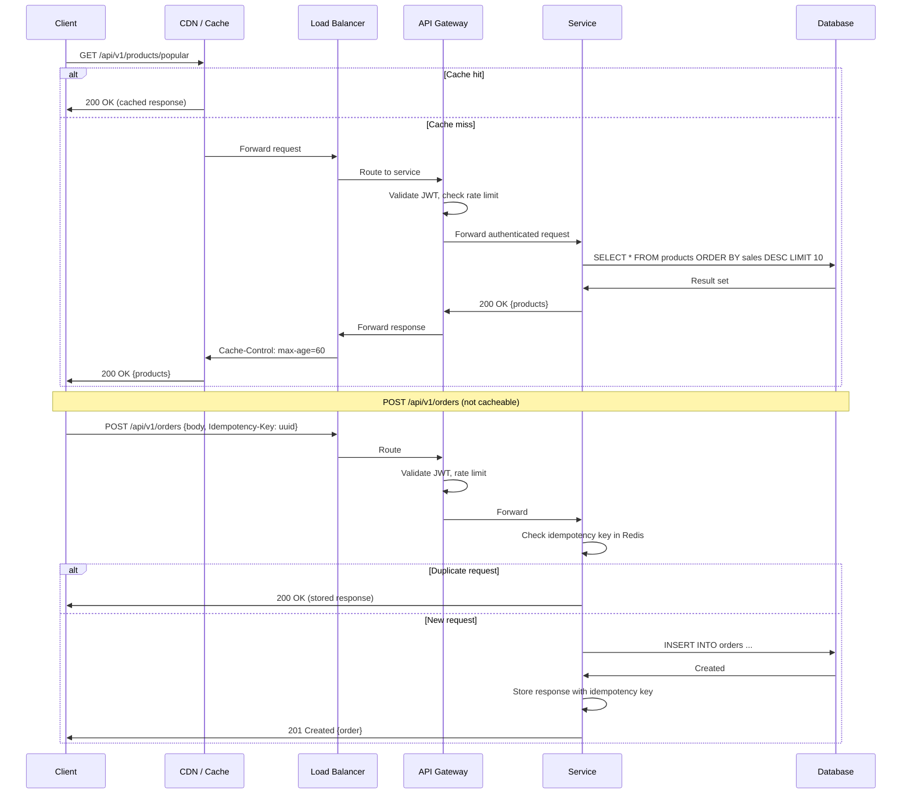
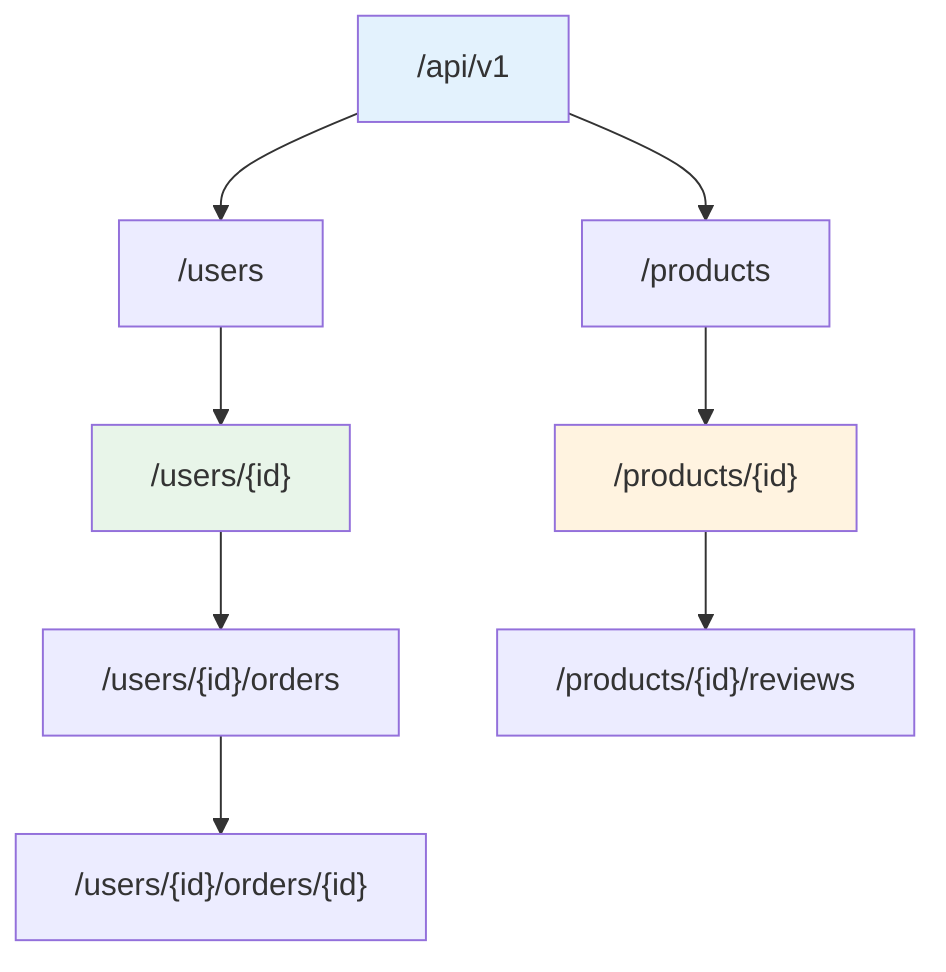

# REST API

## 1. Overview

REST (Representational State Transfer) is an architectural style for designing networked applications. It models the world as **resources** -- nouns like users, orders, and products -- and uses standard HTTP methods to perform operations on them. REST is the dominant API paradigm for public-facing APIs because it leverages the existing HTTP infrastructure that every browser, mobile device, and server already understands.

A REST API is a contract between client and server. The client sends a request with a method, a resource path, headers, and optionally a body. The server processes the request and returns a status code, headers, and optionally a response body. The key constraint is **statelessness**: every request must contain all the information the server needs to process it. The server does not store session state between requests. This is what makes REST APIs horizontally scalable -- any server in the fleet can handle any request.

REST is not a protocol or a standard; it is a set of architectural constraints. An API that uses HTTP but violates these constraints (e.g., encoding actions in the URL like `/getUser` or using POST for everything) is an HTTP API, not a RESTful API. The distinction matters because REST's constraints are what make APIs predictable, cacheable, and evolvable.

## 2. Why It Matters

- **Ubiquity**: Every programming language, framework, and tool supports HTTP. REST APIs are consumable by browsers, mobile apps, CLIs, and other services without special client libraries.
- **Developer experience**: REST's use of standard HTTP methods, status codes, and URL conventions means developers can understand an API's behavior from the URL alone: `DELETE /api/v1/users/123` is self-documenting.
- **Cacheability**: HTTP caching infrastructure (CDNs, browser caches, reverse proxies) works out of the box with GET requests. Ticketmaster caches event search results at the CDN edge for 30-60 seconds during high-traffic surges, bypassing the backend entirely for millions of users.
- **Tooling ecosystem**: OpenAPI/Swagger enables auto-generated documentation, client SDKs, mock servers, and contract testing. Postman, cURL, and browser DevTools make testing trivial.
- **Evolvability**: API versioning, backward-compatible field additions, and HATEOAS (Hypermedia as the Engine of Application State) allow APIs to evolve without breaking existing clients.

## 3. Core Concepts

- **Resource**: Any entity that can be named and addressed. Resources are nouns, not verbs: `/users`, `/orders`, `/products`.
- **URI (Uniform Resource Identifier)**: The address of a resource. Example: `/api/v1/users/123/orders`.
- **HTTP Methods**: The verbs that operate on resources:
  - **GET**: Retrieve a resource. Must be safe (no side effects) and idempotent.
  - **POST**: Create a new resource or trigger a non-idempotent action. NOT idempotent.
  - **PUT**: Replace an entire resource. Idempotent (calling it twice produces the same state).
  - **PATCH**: Partially update a resource. Idempotent.
  - **DELETE**: Remove a resource. Idempotent.
- **Idempotency**: An operation is idempotent if performing it multiple times produces the same result as performing it once. Critical for reliability -- network retries must not create duplicate resources or double-charge customers.
- **Status codes**: Standardized response semantics (see Section 4).
- **Statelessness**: The server stores no client context between requests. All necessary information (auth token, pagination cursor, filters) must be in the request.
- **Content negotiation**: Client specifies desired format via `Accept` header (`application/json`, `application/xml`). Server specifies response format via `Content-Type`.
- **HATEOAS**: Responses include links to related resources and available actions. Enables clients to discover the API dynamically rather than hardcoding URLs.

## 4. How It Works

### Resource Naming Conventions

Good resource naming is the single most impactful design decision in a REST API.

**Rules**:
1. Use **nouns**, not verbs: `/users` not `/getUsers`.
2. Use **plural nouns**: `/users/123` not `/user/123`.
3. Use **hierarchical nesting** for ownership: `/users/123/orders/456`.
4. Limit nesting to 2-3 levels. Beyond that, use query parameters or top-level resources with filters.
5. Use **kebab-case** for multi-word resources: `/order-items` not `/orderItems`.
6. Collections return arrays; individual resources return objects.

**Anti-patterns**:
- `/api/getUserById?id=123` -- verb in URL, action-oriented.
- `/api/users/123/delete` -- action encoded in path. Use `DELETE /api/users/123`.
- `/api/v1/users/123/orders/456/items/789/reviews` -- excessive nesting.

### HTTP Status Codes

| Range | Meaning | Common Codes |
|---|---|---|
| 2xx | Success | `200 OK`, `201 Created`, `204 No Content` |
| 3xx | Redirection | `301 Moved Permanently`, `304 Not Modified` |
| 4xx | Client error | `400 Bad Request`, `401 Unauthorized`, `403 Forbidden`, `404 Not Found`, `409 Conflict`, `429 Too Many Requests` |
| 5xx | Server error | `500 Internal Server Error`, `502 Bad Gateway`, `503 Service Unavailable`, `504 Gateway Timeout` |

**Key distinctions**:
- **401 Unauthorized** vs. **403 Forbidden**: 401 means "I don't know who you are" (missing/invalid auth). 403 means "I know who you are, but you're not allowed."
- **404 Not Found** vs. **410 Gone**: 404 means the resource may exist later. 410 means it existed and was permanently deleted.
- **409 Conflict**: The request conflicts with current server state (e.g., creating a resource that already exists, optimistic concurrency conflict).

### Idempotency

Idempotency is critical for reliability in distributed systems where network failures cause retries.

| Method | Idempotent? | Explanation |
|---|---|---|
| GET | Yes | Reading the same resource returns the same result. |
| PUT | Yes | Replacing a resource with the same data produces the same state. |
| DELETE | Yes | Deleting an already-deleted resource is a no-op (return 204 or 404). |
| PATCH | Yes | Applying the same partial update produces the same result. |
| POST | **No** | Creating a resource twice produces two resources. |

**Making POST idempotent**: Use an **idempotency key**. The client generates a unique key (UUID) and sends it in a header (`Idempotency-Key: abc-123`). The server stores the key with the response. On retry, the server returns the stored response without re-executing. Stripe uses this pattern for all payment creation endpoints.

Twitter's API implements duplicate detection differently: it compares the text of a new tweet against recent tweets from the same user and returns `403` if a duplicate is detected.

### Pagination

APIs that return large collections must paginate to avoid unbounded response sizes.

**Offset-based** (simple but problematic):
```
GET /api/v1/users?offset=20&limit=10
```
- Problem: If a user is inserted at position 5, all subsequent pages shift, causing duplicates or missed items.
- Problem: `OFFSET 1000000 LIMIT 10` requires the database to scan and discard 1M rows.

**Cursor-based** (preferred for large datasets):
```
GET /api/v1/users?cursor=eyJpZCI6MTIzfQ&limit=10
```
Response includes:
```json
{
  "data": [...],
  "next_cursor": "eyJpZCI6MTMzfQ",
  "has_more": true
}
```
- The cursor encodes the last seen ID (or timestamp). The database query uses `WHERE id > cursor_id LIMIT 10`, which is efficient regardless of position.
- Stable under concurrent inserts/deletes.

**Keyset pagination** (cursor-based with explicit fields):
```
GET /api/v1/users?after_id=133&limit=10
```
- Same efficiency as cursor-based but uses explicit fields instead of opaque tokens.

### API Versioning

APIs must evolve without breaking existing clients. Four strategies:

| Strategy | Example | Pros | Cons |
|---|---|---|---|
| URL path | `/api/v1/users` | Explicit, easy to route | Duplicates route definitions |
| Query parameter | `/api/users?version=1` | Flexible | Easy to forget, not cacheable by default |
| Header | `Accept: application/vnd.api.v1+json` | Clean URLs | Hidden, harder to test |
| Content negotiation | `Accept: application/vnd.company.v2+json` | RESTful purist approach | Complex, rarely used |

**URL path versioning** is the industry standard for its simplicity and debuggability.

**Backward compatibility rules** (avoid breaking changes):
- Adding a new optional field to a response: safe.
- Adding a new required field to a request: **breaking**.
- Removing a field from a response: **breaking**.
- Changing a field's type: **breaking**.
- Adding a new endpoint: safe.

### Data Passing Mechanisms

Data is passed to REST APIs through four channels:

1. **Path parameters**: Identify a specific resource. `/users/123` -- the `123` identifies the user.
2. **Query parameters**: Filter, sort, paginate, or provide optional context. `/users?role=admin&sort=created_at`.
3. **Headers**: Metadata -- authentication tokens (`Authorization: Bearer ...`), content type, idempotency keys, correlation IDs.
4. **Request body**: The payload for POST/PUT/PATCH. Contains the resource representation (JSON).

**Security rule**: Sensitive data (passwords, tokens, PII) must NEVER appear in URLs (path or query parameters) because URLs are logged in browser history, server access logs, proxy logs, and referrer headers. Sensitive data belongs in the request body or headers.

## 5. Architecture / Flow

### REST API Request Lifecycle



### REST API Resource Hierarchy



## 6. Types / Variants

### REST Maturity Model (Richardson)

| Level | Name | Description | Example |
|---|---|---|---|
| 0 | The Swamp of POX | Single URI, single method (POST). RPC over HTTP. | `POST /api` with action in body |
| 1 | Resources | Multiple URIs for different resources. Still single method. | `POST /users`, `POST /orders` |
| 2 | HTTP Methods | Proper use of GET/POST/PUT/DELETE + status codes. | `GET /users/123`, `DELETE /users/123` |
| 3 | HATEOAS | Responses include hypermedia links to related resources. | Response includes `{"_links": {"orders": "/users/123/orders"}}` |

Most production APIs operate at Level 2. Level 3 (HATEOAS) is rare in practice but theoretically ideal for API discoverability.

### REST vs. Alternatives

| Dimension | REST | GraphQL | gRPC |
|---|---|---|---|
| Data format | JSON (text) | JSON (text) | Protobuf (binary) |
| Protocol | HTTP/1.1 or HTTP/2 | HTTP/1.1 or HTTP/2 | HTTP/2 required |
| Schema | OpenAPI/Swagger (optional) | Schema-first (mandatory) | .proto file (mandatory) |
| Over/under-fetching | Common (fixed response shape) | Solved (client specifies fields) | N/A (defined by .proto) |
| Caching | Native HTTP caching | Difficult (POST-based) | Not native |
| Browser support | Full | Full | Limited (needs gRPC-Web proxy) |
| Best for | Public APIs, CRUD operations | Mobile apps, complex nested data | Internal microservices, high-perf |

### Payload Formats

| Format | Size | Human-readable | Schema Support | Best For |
|---|---|---|---|---|
| JSON | Large (text + field names) | Yes | JSON Schema (optional) | REST APIs, general-purpose |
| XML | Very large | Somewhat | XSD (mature) | SOAP/legacy, enterprise |
| Protobuf | Small (binary + field tags) | No | .proto (mandatory) | gRPC, internal services |
| MessagePack | Medium (binary JSON) | No | No | Optimization of JSON APIs |

## 7. Use Cases

- **Twitter API**: RESTful API with OAuth 2.0. Tweet creation (`POST /2/tweets`) includes idempotency via duplicate text detection. Rate limits of 300 app / 900 user per 15-minute window enforce fair usage. Cursor-based pagination for timeline endpoints.
- **Stripe API**: The gold standard for REST API design. URL-path versioning (`/v1/charges`), idempotency keys for all POST endpoints, cursor-based pagination, expandable nested objects (`?expand[]=customer`), and comprehensive error responses with machine-readable error codes.
- **GitHub API**: Provides both REST (v3) and GraphQL (v4) APIs. REST API uses Link headers for pagination, ETags for conditional requests, and rate limiting based on authenticated identity (5,000/hour).
- **Ticketmaster**: Event search API (`GET /events?keyword=taylor+swift`) is cached at the CDN edge during surges. Seat booking uses a two-phase protocol -- `POST /reservations` (reserve) followed by `POST /confirmations` (confirm after payment).
- **AWS S3 API**: REST API for object storage. PUT for upload, GET for download, DELETE for removal. Pre-signed URLs generate time-limited, authenticated access tokens embedded in the URL itself.

## 8. Tradeoffs

| Decision | Tradeoff |
|---|---|
| JSON vs. binary format | Readability and tooling (JSON) vs. performance and payload size (Protobuf is 5-10x smaller). JSON is correct for public APIs; Protobuf for internal high-throughput services. |
| Offset vs. cursor pagination | Simplicity and random access (offset) vs. stability and performance at scale (cursor). Use cursor for any collection that may exceed 10K items. |
| URL versioning vs. header versioning | Explicitness and cacheability (URL) vs. clean URLs (header). URL versioning wins for simplicity; use it unless you have a specific reason not to. |
| Flat vs. nested resource URLs | Discoverability (`/users/123/orders`) vs. simplicity (`/orders?user_id=123`). Nest for strong ownership (user's orders); use flat with filters for many-to-many or cross-entity queries. |
| HATEOAS vs. hardcoded URLs | API discoverability and evolvability vs. implementation complexity and client overhead. In practice, most teams document endpoints and skip HATEOAS. |
| REST vs. GraphQL | Simplicity and caching vs. flexibility and efficiency for complex queries. REST when you control both client and server and data shapes are predictable; GraphQL when mobile clients need field-level control. |

## 9. Common Pitfalls

- **Using POST for everything**: POST defeats caching, idempotency, and semantic clarity. Use the correct HTTP method for each operation.
- **Encoding actions in URLs**: `/api/users/123/activate` is RPC, not REST. Use `PATCH /api/users/123 {"status": "active"}` instead.
- **Ignoring idempotency for POST**: Without idempotency keys, network retries create duplicate orders, duplicate payments, and duplicate accounts. Stripe learned this early; your API should too.
- **Returning 200 for errors**: `200 OK {"error": "not found"}` breaks HTTP semantics and confuses every client, proxy, and monitoring tool. Use proper 4xx/5xx status codes.
- **Exposing database IDs directly**: Auto-incrementing integer IDs leak information (total count, creation order) and enable enumeration attacks. Use UUIDs or opaque identifiers for public APIs.
- **No pagination on collection endpoints**: `GET /users` that returns 10M records will OOM the server, timeout the client, and bring down the database. Always paginate. Always set a maximum page size.
- **Breaking changes without versioning**: Removing a response field, changing a field type, or making an optional request field required without a version bump will break existing clients.
- **Sensitive data in URLs**: `GET /api/users?password=secret123` -- URLs are logged everywhere. Credentials and PII belong in headers or the request body.

## 10. Real-World Examples

- **Stripe**: Maintains backward compatibility for years. When evolving the API, they add new fields as optional and deprecate old ones gracefully. Their changelog documents every change. Webhook event versions allow consumers to opt into new payload formats.
- **Slack Web API**: Over 200 RESTful endpoints. Uses token-based auth with granular OAuth scopes. Rate limits are tiered by endpoint category (Tier 1: 1 req/min for workspace-wide operations; Tier 4: 100+ req/min for message sending).
- **Shopify API**: Uses cursor-based pagination with opaque cursors for all list endpoints. Webhook delivery includes HMAC signature validation. GraphQL Admin API complements the REST API for complex queries.
- **Twilio**: REST API with sub-resource nesting (`/Accounts/{sid}/Messages`). Every resource has a unique SID (String ID). API versioning is date-based (`/2010-04-01/Accounts`), pinning clients to a specific API shape until they explicitly migrate.
- **Netflix**: Internal APIs use gRPC for performance, but public-facing APIs (device registration, content metadata) use REST with JSON for maximum client compatibility across TVs, phones, and game consoles.

## 11. Related Concepts

- [gRPC](02-grpc.md) -- binary alternative for internal microservice communication; see comparison in Section 6
- [GraphQL](03-graphql.md) -- query-based alternative that solves over/under-fetching
- [API Gateway](../06-architecture/01-api-gateway.md) -- the infrastructure that routes, authenticates, and rate-limits REST API traffic
- [Authentication and Authorization](../09-security/01-authentication-authorization.md) -- OAuth 2.0 and JWT for securing REST APIs
- [Rate Limiting](../08-resilience/01-rate-limiting.md) -- protecting REST APIs from abuse (cross-link only)

## 12. Source Traceability

- source/youtube-video-reports/1.md (Section 2: API as a contract, Twitter API case study, idempotency, HTTP methods)
- source/youtube-video-reports/3.md (Section 1.2: Core Entities and API Design, RESTful conventions)
- source/youtube-video-reports/9.md (Section 3: REST as "restaurant menu," GET/POST/PUT/PATCH/DELETE, path/query/header/body parameters, sensitive data in body)
- source/extracted/system-design-guide/ch12-design-and-implementation-of-system-components-api-security-.md (REST API design principles: resources, URIs, HTTP methods, statelessness, strengths/weaknesses, use cases)
- source/extracted/ddia/ch05-encoding-and-evolution.md (JSON encoding, binary encodings, forward/backward compatibility)
- source/extracted/grokking/ch37-system-apis.md (System API design patterns)
