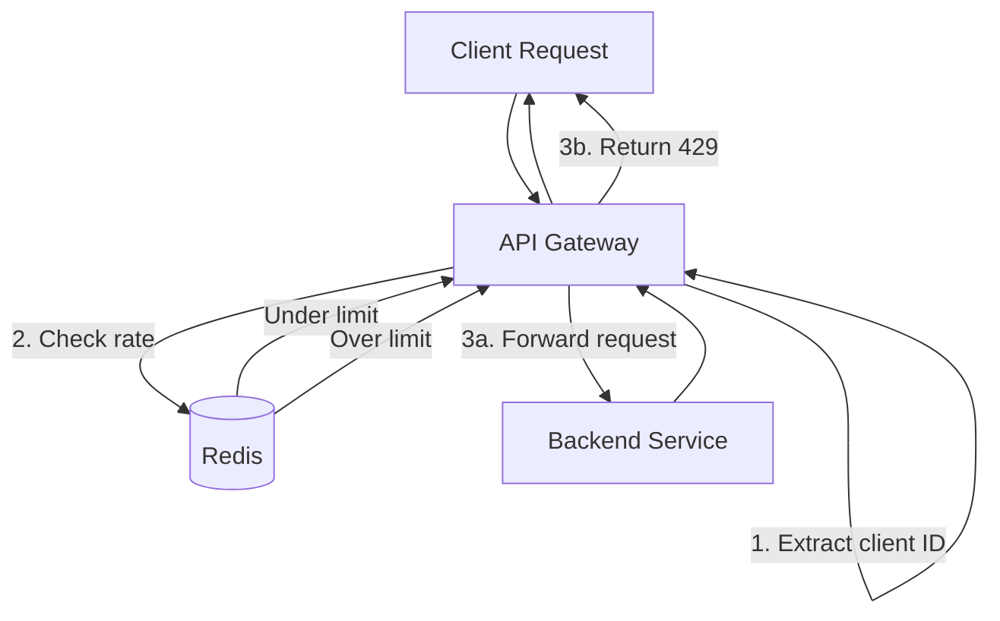
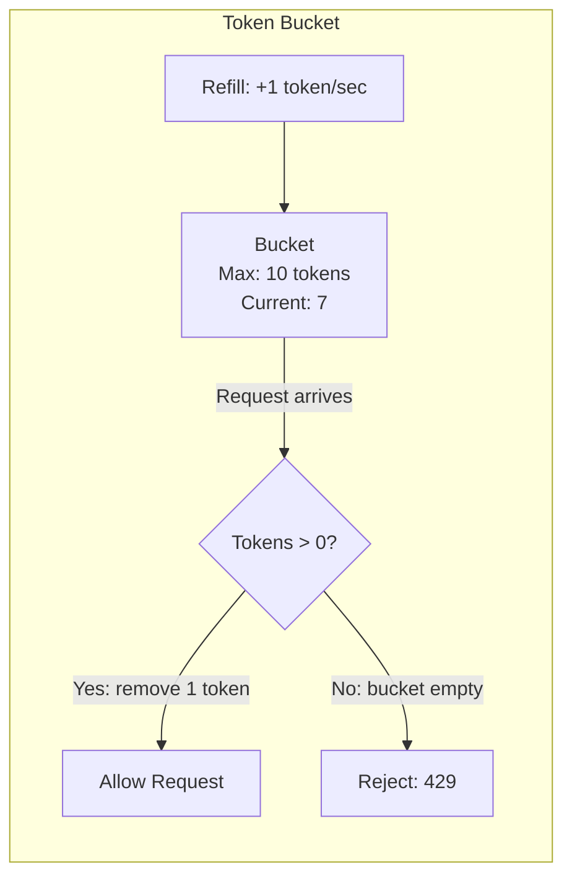
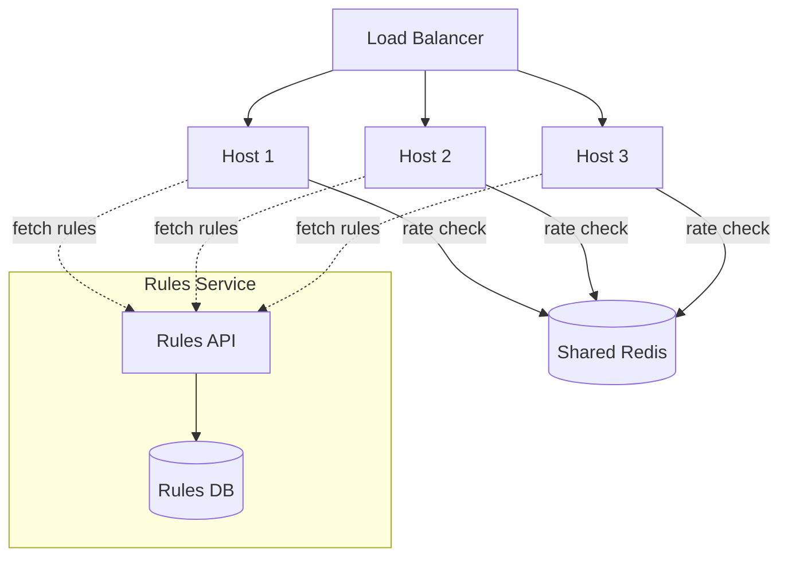

# Rate Limiting

## 1. Overview

Rate limiting controls how many requests a client can make to an API within a given time window. It is a strategic defense mechanism that protects service integrity, enforces SLAs, prevents abuse, and controls infrastructure costs. When a client exceeds its allowed rate, the service responds with `429 Too Many Requests` (or silently drops the request for suspected attackers).

Rate limiting is not optional for any production API. Without it, a single misbehaving client -- whether a developer running a load test against production, a bot scraping your catalog, or a DDoS attack -- can exhaust your backend resources (CPU, database connections, memory) and degrade the experience for every other user. Rate limiting is the cheapest insurance you can buy against cascading failure.

## 2. Why It Matters

- **DDoS protection**: Rate limiting is the first line of defense against denial-of-service attacks. It drops excess requests at the edge before they consume expensive downstream resources.
- **SLA enforcement**: Maintaining consistent response times (e.g., P99 < 100ms) requires preventing any single client from monopolizing capacity. The Twitter API, for example, allows 300 requests per 15-minute window for applications and 900 for users.
- **Cost control**: Cloud infrastructure bills scale with request volume. An unthrottled scraper can generate millions of requests and a five-figure bill overnight.
- **Noisy neighbor prevention**: In multi-tenant systems, rate limiting ensures that one tenant's traffic spike does not starve other tenants of resources.
- **Fairness**: Distributes available capacity equitably across all clients.

## 3. Core Concepts

- **Rate**: The maximum number of requests allowed in a time window (e.g., 100 requests per 10 seconds).
- **Window**: The time interval over which requests are counted.
- **Client identifier**: The key used to track rate -- typically IP address, API key, user ID, or a combination.
- **429 Too Many Requests**: The HTTP status code returned when a client exceeds its rate limit.
- **Retry-After header**: Tells the client how long to wait before retrying.
- **Shadow ban**: For suspected attackers, return `200 OK` with empty or misleading responses instead of `429`, preventing the attacker from knowing they are being rate limited.
- **Virtual Waiting Room**: During extreme surges (Taylor Swift ticket sales), a queue-based admission system that throttles ingress to a manageable rate. Users wait in a virtual queue and are admitted to the booking flow at a controlled pace. Cross-link only -- owned by this file.

## 4. How It Works

### Algorithms

#### Fixed Window Counter

Divide time into fixed intervals (e.g., per minute). Maintain a counter per client per window. Increment on each request; reject when the counter exceeds the limit.

**Implementation**: Key = `{client_id}:{window_timestamp}`, Value = request count. Use Redis `INCR` with TTL equal to the window size.

**Flaw**: A client can make up to 2x the rate limit across a window boundary. Example: with a limit of 100/minute, a client sends 100 requests at 8:00:59 and 100 more at 8:01:01 -- 200 requests in 2 seconds, all within limits.

#### Sliding Window Log

Store a timestamp for every request in a sorted list. On each new request, remove timestamps older than the window, then check if the list size exceeds the limit.

**Implementation**: Redis sorted set with timestamps as scores. `ZADD` the new timestamp, `ZREMRANGEBYSCORE` to remove expired entries, `ZCARD` to count.

**Accurate** but **memory-intensive**: stores a timestamp per request per client.

#### Sliding Window Counter

A hybrid of fixed window and sliding window log. Uses multiple small fixed windows (e.g., 60 one-second windows for a 1-minute rate limit). The current rate is the sum of the counters in the last N windows.

**Less memory** than sliding window log, **more accurate** than fixed window counter. May slightly undercount requests at the boundary of the smallest window.

#### Token Bucket

A bucket holds up to `B` tokens (burst capacity). Tokens are added at a constant rate `R` (sustain rate). Each request removes one token. If the bucket is empty, the request is rejected.

**Key properties**:
- **Burst**: The bucket size `B` determines the maximum burst size.
- **Sustain**: The refill rate `R` determines the steady-state throughput.
- If traffic equals the refill rate, the bucket stays at a constant level and the system runs indefinitely.
- Allows short bursts above the average rate, which is often desirable for real user behavior.

**Implementation**: Store `{tokens_remaining, last_refill_timestamp}` per client. On each request, calculate tokens to add since last refill, update tokens, check if > 0.

#### Leaky Bucket

A fixed-size FIFO queue that leaks (processes) at a constant rate. Incoming requests are added to the queue. If the queue is full, the request is rejected. Requests are dequeued at a fixed rate.

**Key properties**:
- Smooths traffic to a constant output rate regardless of input burstiness.
- Less burst-friendly than token bucket.
- Common implementation uses a counter and timer rather than an actual queue.

### Algorithm Comparison

| Algorithm | Accuracy | Memory | Burst Handling | Complexity |
|---|---|---|---|---|
| Fixed Window | Low (2x burst at boundary) | Very low (one counter) | Poor | Very simple |
| Sliding Window Log | High | High (timestamp per request) | Good | Moderate |
| Sliding Window Counter | Medium-high | Low-medium | Good | Moderate |
| Token Bucket | High | Very low (two values) | Excellent (configurable) | Simple |
| Leaky Bucket | High | Low (queue/counter) | Smooths bursts | Simple |

### Redis Implementation

Token bucket with Redis (pseudocode):

```
function is_rate_limited(client_id, max_tokens, refill_rate):
    key = "ratelimit:" + client_id
    now = current_timestamp_ms()

    # Atomic Lua script in Redis
    tokens, last_refill = GET key  # or defaults: max_tokens, now
    elapsed = now - last_refill
    tokens_to_add = elapsed * refill_rate / 1000
    tokens = min(max_tokens, tokens + tokens_to_add)

    if tokens >= 1:
        tokens -= 1
        SET key (tokens, now) EX ttl
        return false  # not limited
    else:
        SET key (tokens, now) EX ttl
        return true   # rate limited
```

Using a Lua script ensures atomicity -- no race conditions between the read and write.

Fixed window with Redis:

```
function is_rate_limited(client_id, limit, window_seconds):
    key = "ratelimit:" + client_id + ":" + (now / window_seconds)
    count = INCR key
    if count == 1:
        EXPIRE key window_seconds
    return count > limit
```

## 5. Architecture / Flow

### Rate Limiting at the API Gateway



### Token Bucket Algorithm Visualization



### Distributed Rate Limiting Architecture



## 6. Types / Variants

### Placement Options

| Placement | Pros | Cons |
|---|---|---|
| **API Gateway** | Centralized, catches abuse at the edge | Single point, may not know service-specific limits |
| **Service-level (sidecar)** | Per-service limits, fine-grained control | Duplicated logic across services |
| **Client library** | Reduces network calls to rate limiter | Client can be bypassed; harder to update |
| **Load balancer** | L7 LB can enforce basic limits | Limited flexibility, no per-user granularity |

### Rate Limiting Approaches

| Approach | Description | Best For |
|---|---|---|
| **Stateless (shared Redis)** | All hosts query a shared Redis for counts | Default approach, high accuracy |
| **Stateful (sharded)** | Each host stores counts for assigned clients (L7 sticky) | Lower cost, no external dependency |
| **Replicated counts** | Every host stores all counts, synced via gossip | Lowest latency, eventual consistency |

Yahoo's Cloud Bouncer uses a gossip-protocol-based distributed token bucket, trading accuracy for low latency and no external database dependency.

## 7. Use Cases

- **Twitter API**: 300 requests per 15-minute window for app-auth, 900 for user-auth. Different endpoints have different limits (search is more expensive than timeline reads).
- **Stripe**: 100 requests/second per API key in live mode. Idempotency keys prevent duplicate charges even if a client retries after a timeout.
- **GitHub API**: 5,000 requests/hour for authenticated users, 60/hour for unauthenticated. Rate limit headers (`X-RateLimit-Limit`, `X-RateLimit-Remaining`, `X-RateLimit-Reset`) inform clients.
- **Ticketmaster (Virtual Waiting Room)**: During Taylor Swift-level surges, a virtual queue throttles ingress. Users are admitted to the booking flow at a controlled rate, protecting the backend from being overwhelmed. The waiting room is both a rate limiter and a psychological buffer.
- **Cloudflare**: Operates at the CDN edge. DDoS protection drops traffic from abusive IPs before it reaches the origin server. Supports both rate limiting (token bucket) and challenge-based mitigation (CAPTCHAs).

## 8. Tradeoffs

| Dimension | Token Bucket | Fixed Window | Sliding Window Log | Sliding Window Counter |
|---|---|---|---|---|
| **Burst tolerance** | Excellent (configurable) | Poor (2x at boundary) | Good | Good |
| **Memory per client** | 2 values | 1 counter | N timestamps | K counters |
| **Accuracy** | High | Low | Highest | Medium-high |
| **Implementation** | Simple | Simplest | Moderate | Moderate |
| **Redis operations** | 1 Lua call | INCR + EXPIRE | ZADD + ZREMRANGE + ZCARD | Multiple INCR |
| **Real-world adoption** | Most common (AWS, Stripe) | Common for simple cases | Used when precision matters | Good balance |

## 9. Common Pitfalls

- **Rate limiting only on IP**: NATs and shared IPs mean thousands of legitimate users share one IP. Rate limit on authenticated user ID or API key when possible, falling back to IP for unauthenticated traffic.
- **Not returning Retry-After**: If you reject a request with `429` but do not tell the client when to retry, clients will retry immediately, creating a retry storm. Always include the `Retry-After` header.
- **Ignoring exponential backoff on the client**: Rate-limited clients must implement exponential backoff with jitter. Without jitter, all throttled clients retry at the exact same time, creating a thundering herd. See [Circuit Breaker](./02-circuit-breaker.md).
- **Fixed window boundary burst**: The fixed window algorithm allows 2x the limit across a window boundary. If your rate limit is 100/minute and a client sends 100 at 8:00:59 and 100 at 8:01:00, both pass. Use sliding window or token bucket for accuracy.
- **Rate limiter as a single point of failure**: If the rate limiter (Redis) goes down, do you fail open (allow all traffic) or fail closed (reject all traffic)? Most systems fail open -- it is better to temporarily lose rate limiting than to reject all traffic.
- **Not rate limiting internal services**: External rate limiting stops abuse, but an internal misbehaving service can DDoS a downstream service through the internal network. Apply rate limits at both the edge and service-to-service boundaries.
- **Overly aggressive limits**: Setting limits too low frustrates legitimate users. Start permissive, monitor actual traffic patterns, and tighten gradually. Provide a way for power users to request higher limits.

## 10. Real-World Examples

- **Stripe**: Uses token bucket rate limiting at 100 requests/second per API key. Rate limit state is stored in Redis. Stripe's client libraries implement exponential backoff with jitter automatically.
- **GitHub**: Uses a fixed window of 1 hour with 5,000 requests for authenticated users. GraphQL API has a separate point-based budget (each query costs points based on complexity).
- **Yahoo Cloud Bouncer**: A distributed rate limiter using gossip protocol to synchronize token bucket state across hosts without a centralized database. Trades accuracy for low latency and no external dependency.
- **Cloudflare**: Rate limiting at the CDN edge. Supports fixed window, sliding window, and token bucket. Can rate limit by IP, header, cookie, or ASN. Mitigates DDoS attacks that generate millions of requests per second.
- **AWS API Gateway**: Built-in rate limiting with token bucket algorithm. Configurable per API key, per method, per stage. Integrates with WAF for DDoS protection.

### Virtual Waiting Room (Queue-Based Admission Control)

During extreme demand events (Taylor Swift ticket sales, console launches, flash sales), even rate limiting is insufficient -- the entire backend would need to be provisioned for peak demand. The virtual waiting room solves this by placing users in a queue before they reach the application:

1. When the system detects surge traffic, new users are redirected to a waiting room page.
2. The waiting room assigns each user a position in the queue.
3. Users are admitted to the application at a controlled rate that matches backend capacity.
4. The waiting room provides a psychological benefit: users know they are in line rather than seeing error pages.

**Implementation considerations**:
- The waiting room itself must handle the full surge traffic (it is a static page with a WebSocket or polling connection).
- Queue position must be fair (first-come-first-served) and resistant to manipulation (no refreshing to get a better position).
- Admitted users receive a time-limited token that grants access to the application.
- A CDN (CloudFront, Cloudflare) can serve the waiting room page, absorbing the traffic at the edge.

This pattern was made famous by Ticketmaster during Taylor Swift's Eras Tour on-sale, where millions of users were queued simultaneously.

### Rate Limiting Response Headers

Well-behaved APIs communicate rate limit state to clients via standard headers:

| Header | Description | Example |
|---|---|---|
| `X-RateLimit-Limit` | Maximum requests allowed in the window | 100 |
| `X-RateLimit-Remaining` | Requests remaining in the current window | 42 |
| `X-RateLimit-Reset` | Unix timestamp when the window resets | 1672531200 |
| `Retry-After` | Seconds to wait before retrying (on 429) | 30 |

Providing these headers allows well-behaved clients to self-throttle before hitting the limit, reducing the load on the rate limiter itself.

### Distributed Rate Limiting Challenges

In a multi-instance deployment, rate limiting must account for requests landing on different hosts:

**Challenge**: If the limit is 100 requests/minute and you have 10 instances, a naive per-instance limit of 10/minute is too restrictive (a client hitting one instance gets only 10 requests) or too permissive (a client spreading requests across all instances gets 100 from each).

**Solutions**:

1. **Centralized counter (Redis)**: All instances query a shared Redis for the rate limit counter. This is the most accurate approach but adds a network hop per request (~1ms). Use Lua scripts for atomic read-check-write operations.

2. **Sticky sessions**: Route all requests from a client to the same instance (IP hash at the load balancer). Each instance maintains a local counter. Simple but breaks if instances restart.

3. **Gossip-based synchronization**: Each instance maintains a local counter and periodically gossips its counts to other instances. Less accurate but no external dependency. Used by Yahoo's Cloud Bouncer.

4. **Sliding window with Redis**: Combine a Redis sorted set (for sliding window log) or Redis hash (for fixed window counter) with atomic Lua scripts. This is the production-standard approach:

```lua
-- Token bucket in Redis (Lua script for atomicity)
local key = KEYS[1]
local max_tokens = tonumber(ARGV[1])
local refill_rate = tonumber(ARGV[2])
local now = tonumber(ARGV[3])

local bucket = redis.call('hmget', key, 'tokens', 'last_refill')
local tokens = tonumber(bucket[1]) or max_tokens
local last_refill = tonumber(bucket[2]) or now

local elapsed = now - last_refill
local new_tokens = math.min(max_tokens, tokens + elapsed * refill_rate)

if new_tokens >= 1 then
    redis.call('hmset', key, 'tokens', new_tokens - 1, 'last_refill', now)
    redis.call('expire', key, 60)
    return 0  -- allowed
else
    redis.call('hmset', key, 'tokens', new_tokens, 'last_refill', now)
    redis.call('expire', key, 60)
    return 1  -- rate limited
end
```

## 11. Related Concepts

- [API Gateway](../06-architecture/01-api-gateway.md) -- the most common placement point for rate limiting
- [Circuit Breaker](./02-circuit-breaker.md) -- exponential backoff and jitter for retry storms (canonical detail there)
- [Redis](../04-caching/02-redis.md) -- the standard backing store for rate limit state (atomic INCR, Lua scripts)
- [Feature Flags](./04-feature-flags.md) -- can be used to dynamically adjust rate limits during incidents
- [Load Balancing](../02-scalability/01-load-balancing.md) -- load balancers can enforce basic rate limits at L7

## 12. Source Traceability

- source/youtube-video-reports/1.md (fixed window, token bucket, burst/sustain, exponential backoff, jitter, Twitter API rates)
- source/youtube-video-reports/3.md (rate limiting at API gateway, strategic placement)
- source/extracted/acing-system-design/ch11-design-a-rate-limiting-service.md (all five algorithms, Redis implementation, stateful vs stateless, distributed approaches, Yahoo Cloud Bouncer)
- source/extracted/system-design-guide/ch12-design-and-implementation-of-system-components-api-security-.md (API rate limiting)
- source/extracted/grokking/ch119-system-apis.md (API rate limiting design)
