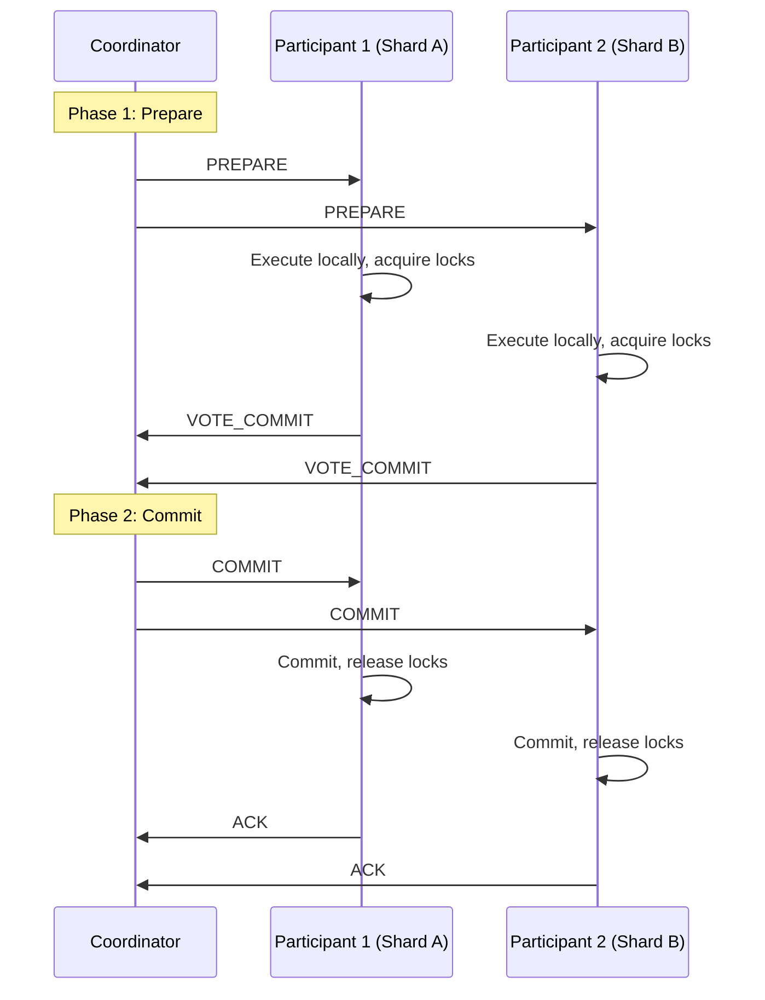
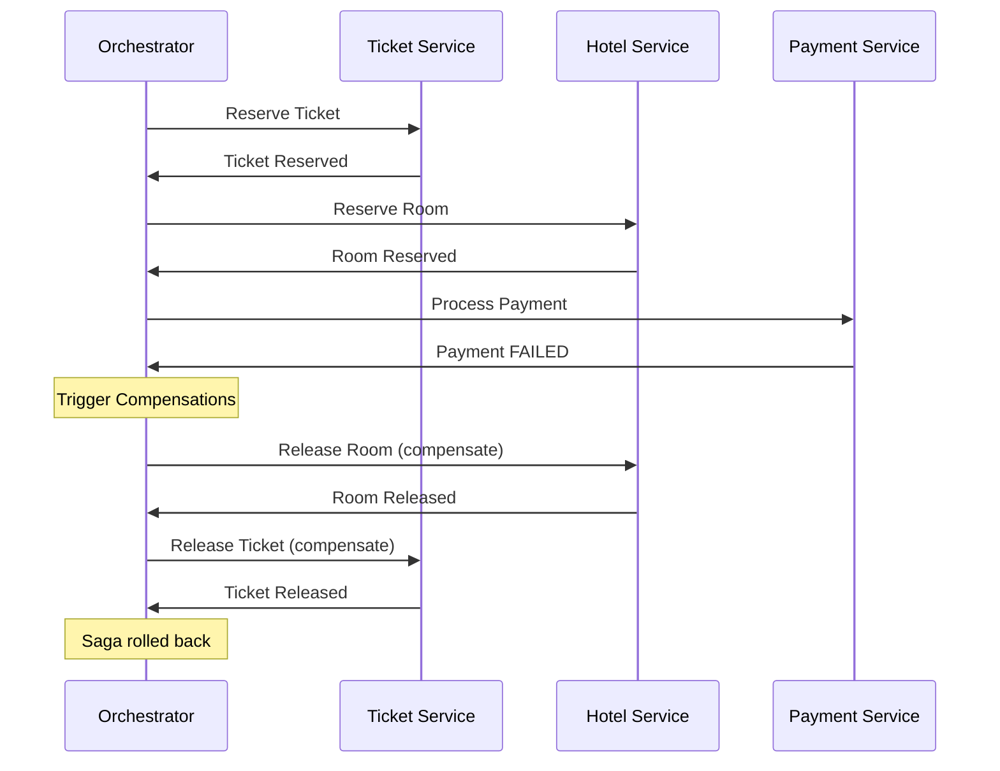
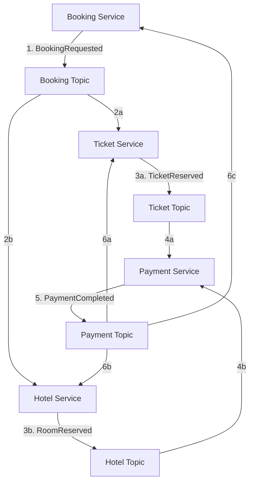

# Distributed Transactions

## 1. Overview

A distributed transaction is a unit of work that spans multiple services or databases and must either fully succeed or fully roll back to maintain data consistency. In a monolith with a single database, ACID transactions handle this natively. In a microservices architecture where each service owns its database, there is no single transaction manager that can atomically commit across service boundaries. This is the fundamental problem of distributed transactions: how do you maintain consistency when a failure can occur between any two steps?

Two primary approaches exist. **Two-Phase Commit (2PC)** provides strong consistency through a central coordinator, at the cost of availability and performance. The **Saga pattern** provides eventual consistency through a sequence of local transactions with compensating actions, at the cost of complexity. In modern distributed systems, sagas are the dominant pattern because 2PC's blocking nature and single-point-of-failure coordinator make it impractical at scale.

## 2. Why It Matters

- **Data integrity across services**: When a customer books a tour package (airline ticket + hotel room + payment), all three services must agree. A payment without a confirmed ticket, or a confirmed ticket without payment, is unacceptable.
- **Partial failure is the norm**: Network partitions, service crashes, and timeouts happen constantly in distributed systems. Any step in a multi-service transaction can fail independently.
- **Business consequences**: Double-charging customers, selling phantom inventory, or losing payment records are not just bugs -- they are business-critical failures that erode trust and may violate regulations.
- **Regulatory compliance**: Financial systems, healthcare, and payment processing require provable consistency. Auditors need evidence that transactions either completed fully or were properly reversed.

## 3. Core Concepts

- **Distributed Transaction**: A transaction that spans multiple services, databases, or shards.
- **Coordinator**: In 2PC, the central process that manages the commit/abort decision across all participants.
- **Participant**: A service or database shard that holds part of the transaction's data.
- **Compensating Transaction (Undo)**: A reverse operation that semantically undoes a previously committed local transaction. For example, if "reserve seat" was committed, the compensating action is "release seat."
- **Pivot Transaction**: In a saga, the transaction after which the saga commits to completing. Before the pivot, the saga can be rolled back via compensations. After the pivot, remaining steps are retriable until they succeed.
- **Retriable Transaction**: A transaction after the pivot point that can be retried indefinitely until it succeeds.
- **Idempotency**: The guarantee that executing an operation multiple times produces the same result. Essential for safe retries in both 2PC and sagas.

## 4. How It Works

### Two-Phase Commit (2PC)

2PC is a protocol for achieving atomic commitment across multiple participants, coordinated by a central transaction manager.

**Phase 1 -- Prepare (Voting)**:
1. The coordinator sends a `PREPARE` message to all participants.
2. Each participant executes the transaction locally (acquires locks, writes to WAL) but does NOT commit.
3. Each participant responds with `VOTE_COMMIT` (ready to commit) or `VOTE_ABORT` (cannot proceed).

**Phase 2 -- Commit or Abort (Decision)**:
4. If ALL participants voted `COMMIT`, the coordinator sends a `COMMIT` message to all participants.
5. If ANY participant voted `ABORT`, the coordinator sends an `ABORT` message to all participants.
6. Participants commit or rollback their local transactions and release locks.

**The blocking problem**: If the coordinator crashes after sending `PREPARE` but before sending the `COMMIT/ABORT` decision, all participants are stuck holding locks. They cannot commit (they do not know the decision) and they cannot abort (another participant might have received a commit). The system is blocked until the coordinator recovers. This makes 2PC a single point of failure and fundamentally unsuitable for systems requiring high availability.

**Cross-shard transactions**: 2PC is commonly used within a single database system for cross-shard transactions (e.g., transferring money between accounts on different shards). In this context, the database engine acts as the coordinator, and the failure modes are more contained than in a cross-service scenario.

### Saga Pattern

A saga is a sequence of local transactions where each step is an independent database transaction. If any step fails, previously completed steps are undone via compensating transactions.

**Key properties**:
- Each step is a local ACID transaction within a single service.
- There is no global lock -- other transactions can read intermediate states.
- Consistency is eventually achieved (either all steps complete, or all compensations run).
- The saga itself is stateless -- coordination state lives in the message broker or orchestrator.

**Transaction types within a saga**:
1. **Compensable transactions**: Steps 1 through N-1 that can be rolled back via compensating transactions.
2. **Pivot transaction**: The decision point. If this succeeds, the saga commits to completing.
3. **Retriable transactions**: Steps after the pivot that are guaranteed to eventually succeed (retry until complete).

#### Choreography (Parallel / Decentralized)

Services communicate directly via message topics. No central coordinator.

**Tour package booking (choreography)**:
1. Booking Service publishes `BookingRequested` to the booking topic.
2. Ticket Service and Hotel Service consume the event in parallel.
   - Ticket Service reserves a ticket (state: `AWAITING_PAYMENT`), publishes `TicketReserved`.
   - Hotel Service reserves a room (state: `AWAITING_PAYMENT`), publishes `RoomReserved`.
3. Payment Service consumes both events. When both are received, it processes the payment.
4. On success, Payment Service publishes `PaymentCompleted`.
5. Ticket Service, Hotel Service, and Booking Service consume `PaymentCompleted` and confirm.

**On failure**: If payment fails, Payment Service publishes `PaymentFailed`. Ticket Service releases the ticket; Hotel Service releases the room.

#### Orchestration (Linear / Centralized)

A central orchestrator (state machine) directs each step sequentially.

**Tour package booking (orchestration)**:
1. Orchestrator sends `ReserveTicket` to Ticket Service.
2. Ticket Service responds `TicketReserved`.
3. Orchestrator sends `ReserveRoom` to Hotel Service.
4. Hotel Service responds `RoomReserved`.
5. Orchestrator sends `ProcessPayment` to Payment Service.
6. Payment Service responds `PaymentCompleted`.
7. Orchestrator sends `ConfirmTicket` and `ConfirmRoom`.

**On failure**: If step 5 (payment) fails, the orchestrator explicitly sends `ReleaseTicket` and `ReleaseRoom` compensation commands.

### Comparison: 2PC vs. Saga

| Dimension | Two-Phase Commit (2PC) | Saga Pattern |
|---|---|---|
| **Consistency** | Strong (atomic commit) | Eventual (compensations restore consistency) |
| **Isolation** | Full (locks held during prepare) | None (intermediate states visible) |
| **Availability** | Low (blocking if coordinator fails) | High (no global locks) |
| **Latency** | High (two network round-trips + locks) | Lower (local commits, async) |
| **Scalability** | Poor (global lock contention) | Good (local transactions only) |
| **Failure handling** | Coordinator recovery required | Compensating transactions |
| **Complexity** | Protocol complexity | Business logic complexity (compensations) |
| **Use case** | Cross-shard DB transactions | Cross-service business workflows |

## 5. Architecture / Flow

### Two-Phase Commit Protocol

### Saga with Orchestration and Compensation

### Choreography Saga Flow

## 6. Types / Variants

### Choreography vs. Orchestration

| Dimension | Choreography | Orchestration |
|---|---|---|
| **Execution** | Parallel (services react independently) | Linear (orchestrator directs each step) |
| **Coupling** | Loose -- services know only event schemas | Tighter -- orchestrator knows all services |
| **Visibility** | Low -- must read all services' code to understand flow | High -- orchestrator has the complete workflow |
| **Latency** | Lower (parallel steps) | Higher (sequential through orchestrator) |
| **Network traffic** | Lower (fewer hops) | Higher (every step passes through orchestrator) |
| **Single point of failure** | None (except message broker) | Orchestrator must be highly available |
| **Compensation trigger** | Each service handles its own compensations | Orchestrator triggers all compensations |
| **Scalability** | Better for simple sagas (few services) | Better for complex sagas (many services, conditional logic) |

### Transaction Supervisor

A transaction supervisor is a background process that periodically audits cross-service consistency. It compares the state across services (e.g., "does every confirmed ticket have a matching payment?") and triggers compensating transactions for any inconsistencies. This is a safety net for when sagas fail silently.

Transaction supervisors should start as manual review tools before being automated. Automated compensations are risky and must be extensively tested.

## 7. Use Cases

- **Ticketmaster**: The two-phase booking protocol (Reserve + Confirm) is essentially a saga. The seat is reserved with a Redis TTL lock. If payment is not confirmed within the timeout, the lock expires and the seat is automatically released (compensating action via TTL expiry).
- **Uber**: The trip lifecycle is a saga: match driver -> start trip -> complete trip -> process payment. If payment fails after the trip, a compensation flow issues a credit or adjusts the fare.
- **Amazon**: Order fulfillment is an orchestrated saga via Step Functions: reserve inventory -> authorize payment -> pick and pack -> ship -> capture payment. If any step fails, explicit compensating steps run (release inventory, void payment authorization).
- **Banking (Cross-Shard Transfer)**: Transferring $100 from Account A (Shard 1) to Account B (Shard 2) uses 2PC within the database. The database coordinator ensures both the debit and credit either commit or abort atomically.
- **UPI Payments (India)**: NPCI orchestrates a saga: App -> Partner Bank -> NPCI -> Payee's Bank. If the payee's bank fails to acknowledge the credit, NPCI triggers an automatic rollback to the sender.

## 8. Tradeoffs

| Dimension | 2PC | Saga (Choreography) | Saga (Orchestration) |
|---|---|---|---|
| **Consistency** | Strong (ACID) | Eventual | Eventual |
| **Availability** | Low (blocking) | High | High (if orchestrator is HA) |
| **Performance** | Low (lock duration) | High (parallel) | Medium (sequential) |
| **Complexity** | Protocol complexity | Distributed logic complexity | Centralized but complex state machine |
| **Debugging** | Straightforward (one coordinator) | Very hard (distributed events) | Moderate (orchestrator has full state) |
| **Scalability** | Poor | Good | Good |
| **Data isolation** | Full | None (dirty reads possible) | None |
| **Recovery** | Coordinator must recover | Compensations run automatically | Orchestrator retries/compensates |

## 9. Common Pitfalls

- **Incomplete compensating transactions**: For every forward action, you must implement and test a compensating action. Forgetting to compensate one step leaves the system in a permanently inconsistent state.
- **Non-idempotent compensations**: Compensating transactions may be retried (due to network failures). If "release seat" is not idempotent, retrying it might release a seat that was already re-booked.
- **Mixing 2PC and sagas**: Using 2PC for some steps and sagas for others in the same workflow creates confusing failure semantics. Pick one approach per workflow.
- **Ignoring intermediate state visibility**: In a saga, other transactions can read intermediate states (e.g., a ticket that is reserved but not yet paid). Design your system to handle or explicitly fence these states (e.g., show "pending" status to users).
- **Choreography with too many services**: When more than 4-5 services participate in a choreographed saga, the event flow becomes nearly impossible to reason about. Switch to orchestration for complex workflows.
- **Not logging compensating transactions**: Every compensating transaction must be logged with the original transaction ID, the reason for compensation, and the outcome. Without this audit trail, debugging and compliance are impossible.
- **2PC in cross-service scenarios**: Using 2PC across microservices over the network is almost always a mistake. The coordinator's failure mode (blocking all participants) is too dangerous for services that need high availability. Reserve 2PC for cross-shard transactions within a single database system.

## 10. Real-World Examples

- **Amazon Step Functions**: AWS's managed orchestration service. Used for sagas in e-commerce (order -> inventory -> payment -> shipping). Provides built-in retry, catch, and compensation steps via a JSON-based state machine definition (Amazon States Language).
- **Ticketmaster**: Two-phase booking with Redis TTL locks. The seat is "soft-locked" during payment. If the payment times out, the Redis key expires, automatically releasing the seat without an explicit compensating transaction. This elegant design uses infrastructure TTL as the compensation mechanism.
- **Uber Cadence / Temporal**: Uber built Cadence (now open-sourced as Temporal) specifically for long-running distributed transactions. Temporal provides durable execution of workflows, automatic retries, and exactly-once semantics for saga orchestration.
- **UPI (India)**: NPCI acts as the orchestrator for payment sagas. The flow (App -> PSP Bank -> NPCI -> Payee Bank) has explicit acknowledgment and rollback steps. If the payee bank does not acknowledge within a timeout, NPCI triggers an automatic refund.
- **Eventuate Tram**: An open-source framework for sagas in Java microservices. Provides both choreography and orchestration implementations with Kafka as the message broker.

### Cross-Shard Transactions in Practice

Within a single database system, 2PC is commonly used for cross-shard operations:

**Example: Bank transfer between shards**
- Account A (Shard 1): Balance $1,000
- Account B (Shard 2): Balance $500
- Transfer $200 from A to B

The database coordinator:
1. Sends PREPARE to Shard 1 (debit $200) and Shard 2 (credit $200).
2. Both shards acquire row locks and write to their WAL.
3. Both shards vote COMMIT.
4. Coordinator sends COMMIT; both shards finalize and release locks.

If Shard 2 is unavailable, the coordinator sends ABORT, and Shard 1 rolls back the debit. The key difference from cross-service 2PC is that the database coordinator is a reliable, co-located process, not a remote service.

### Idempotency in Distributed Transactions

Every step in a saga must be idempotent because messages may be delivered more than once:

- **Generate idempotency keys at the source**: The originating service generates a unique transaction ID that accompanies every message in the saga. Downstream services use this ID to detect and reject duplicates.
- **State-based idempotency**: Before executing a step, check the current state. If the entity is already in the target state (e.g., ticket already CONFIRMED), skip the operation.
- **Database constraints**: Use unique constraints on transaction IDs in the database to prevent duplicate writes at the storage layer.

### Semantic Locking

Because sagas do not provide isolation (unlike 2PC), intermediate states are visible to other transactions. The "semantic locking" countermeasure adds a `state` field to entities:

1. The first step of the saga sets the entity state to `PENDING` (a semantic lock).
2. Other transactions that see `PENDING` know a saga is in progress and can either wait, fail, or skip.
3. The final step of the saga sets the state to `CONFIRMED` or `CANCELLED`.
4. Compensating transactions set the state back to `AVAILABLE`.

This is how Ticketmaster handles seat reservations: a seat in `RESERVED` state cannot be booked by another user. If the saga completes, it becomes `CONFIRMED`. If it fails, compensation returns it to `AVAILABLE`.

### Decision Framework: Choosing a Distributed Transaction Pattern

| Question | If Yes | If No |
|---|---|---|
| Is it within a single database (cross-shard)? | Use 2PC (database-managed) | Use saga |
| Do you need strong consistency? | Consider 2PC (accept availability cost) | Use saga with eventual consistency |
| Are there > 3 participating services? | Use orchestrated saga | Choreographed saga may work |
| Is the workflow conditional (branching logic)? | Orchestration (state machine) | Either approach |
| Can the team implement compensating transactions? | Saga is viable | Simplify the workflow to avoid distributed transactions |
| Is the transaction latency-sensitive? | Choreography (parallel) | Orchestration is acceptable |

### Common Saga Implementations

| Framework / Service | Language | Orchestration | Choreography | Message Broker |
|---|---|---|---|---|
| **AWS Step Functions** | Any (JSON state machine) | Yes | No | N/A (integrated) |
| **Temporal** | Go, Java, Python, TypeScript | Yes | No | Internal |
| **Cadence (Uber)** | Go, Java | Yes | No | Internal |
| **Eventuate Tram** | Java | Yes | Yes | Kafka |
| **MassTransit** | .NET | Yes | Yes | RabbitMQ, Azure SB |
| **Axon Framework** | Java | Yes | Yes | Axon Server, Kafka |

### Testing Distributed Transactions

Testing sagas is fundamentally harder than testing local transactions because you must verify:

1. **Happy path**: All steps complete successfully. The final state is consistent across all services.
2. **Each failure point**: For every step, simulate failure and verify that compensating transactions run correctly and restore consistency.
3. **Partial compensation failure**: What happens if the compensating transaction itself fails? This is the hardest scenario. Solutions include retry-until-success (with idempotency) and manual intervention queues.
4. **Concurrent sagas**: Two sagas operating on the same entities simultaneously. Verify that semantic locks prevent conflicts.
5. **Message ordering**: Events arriving out of order should not corrupt state. Test with artificial delays and reordering.

## 11. Related Concepts

- [Event Sourcing](../05-messaging/03-event-sourcing.md) -- event logs provide the audit trail and replay capability for sagas
- [Event-Driven Architecture](../05-messaging/02-event-driven-architecture.md) -- choreography and orchestration are EDA patterns
- [Message Queues](../05-messaging/01-message-queues.md) -- Kafka as the communication backbone for sagas
- [Microservices](../06-architecture/02-microservices.md) -- distributed transactions are a core challenge in microservices
- [SQL Databases](../03-storage/01-sql-databases.md) -- ACID transactions within a single database; 2PC for cross-shard

## 12. Source Traceability

- source/youtube-video-reports/4.md (2PC, saga pattern, compensating actions, cross-shard transactions)
- source/youtube-video-reports/6.md (choreography vs orchestration, saga, Step Functions)
- source/extracted/acing-system-design/ch07-03-distributed-transactions.md (event sourcing, CDC, choreography vs orchestration comparison table, saga, compensating transactions, transaction supervisor)
- source/extracted/ddia/ch09-transactions.md (ACID, distributed transactions, 2PC)
- source/extracted/ddia/ch11-consistency-and-consensus.md (consensus, 2PC, atomic commit)
