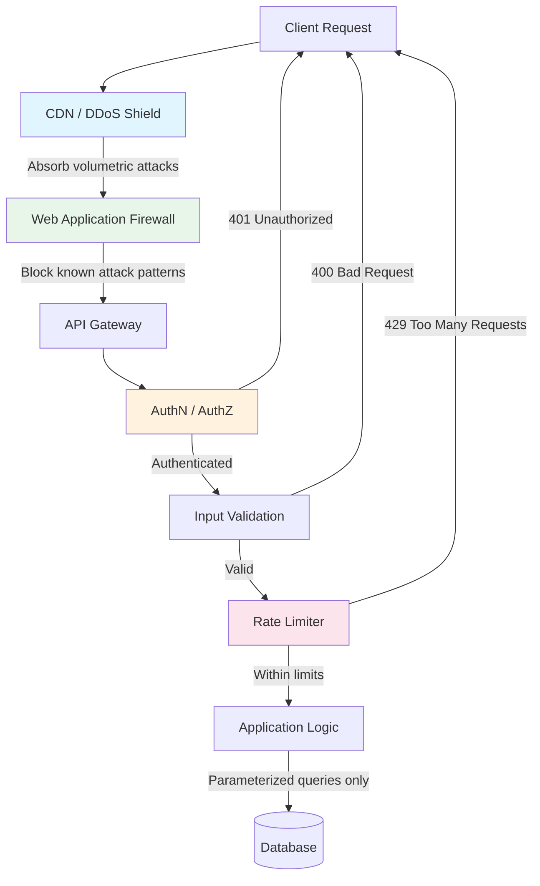
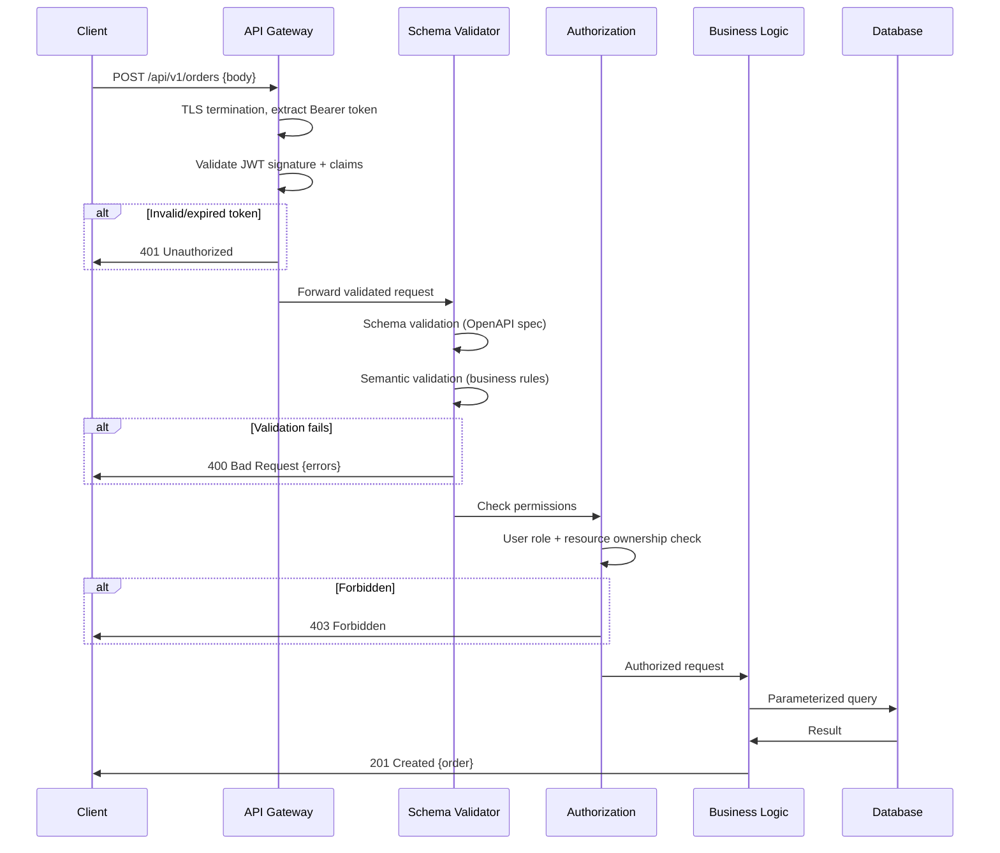

# API Security

## 1. Overview

API security is the discipline of protecting application programming interfaces from exploitation, abuse, and unauthorized access. APIs are the surface area of your system -- every endpoint you expose is an attack vector. Unlike traditional web security where the browser provides some built-in protections, APIs are consumed by arbitrary clients (scripts, bots, mobile apps, other services), making them inherently more exposed.

A well-secured API enforces a layered defense: it validates every input, authenticates every caller, authorizes every action, encrypts every byte in transit, limits every client's request rate, and logs every operation. The principle of least privilege governs every decision: clients should have access to exactly the resources and operations they need, nothing more. Security is not a feature your team adds before launch; it is a constraint that shapes every design decision from day one.

## 2. Why It Matters

- **Attack surface**: APIs account for over 80% of web traffic. OWASP lists Broken Object Level Authorization (BOLA) and Injection as the top API vulnerabilities. A single unvalidated endpoint can expose your entire database.
- **Financial impact**: API breaches are expensive. Equifax's 2017 breach (unpatched API vulnerability) cost $700M+ in settlements. Capital One's 2019 breach (SSRF through a misconfigured API) exposed 100M+ records.
- **DDoS amplification**: Unsecured APIs with computationally expensive operations (search, aggregation, joins) are force multipliers for attackers. A single malicious request to an unprotected endpoint can generate seconds of CPU time and megabytes of I/O.
- **Bot economy**: Credential stuffing, scraping, and inventory hoarding are automated at scale. Ticketmaster-style systems must defend against bots that can generate millions of requests during a Taylor Swift ticket sale.
- **Supply chain risk**: APIs interconnect systems across organizational boundaries. A vulnerability in one API can cascade through partner integrations.

## 3. Core Concepts

- **Input validation**: Verifying that every piece of client-supplied data (path params, query params, headers, body) conforms to expected types, lengths, ranges, and formats before processing.
- **Injection**: A class of attacks where malicious input is interpreted as code -- SQL injection, NoSQL injection, command injection, LDAP injection. Prevented by parameterized queries and input sanitization.
- **Cross-Site Scripting (XSS)**: Injecting malicious scripts into responses that execute in other users' browsers. APIs returning HTML or rendering user-generated content must sanitize output.
- **Cross-Origin Resource Sharing (CORS)**: A browser-enforced mechanism that restricts which domains can call your API from client-side JavaScript. Misconfigured CORS (e.g., `Access-Control-Allow-Origin: *` with credentials) is a common vulnerability.
- **Principle of Least Privilege**: Every client, service, and internal component should have the minimum permissions required for its function. Overly permissive service accounts are a top finding in security audits.
- **Defense in Depth**: Multiple independent security layers so that the failure of any single layer does not result in a breach. Input validation, authentication, authorization, encryption, rate limiting, and monitoring each provide independent protection.
- **DDoS (Distributed Denial of Service)**: Overwhelming a service with traffic volume to make it unavailable. Mitigated through rate limiting, CDN-based filtering, and auto-scaling.
- **OWASP API Security Top 10**: The industry standard list of API-specific vulnerabilities. BOLA, Broken Authentication, Excessive Data Exposure, and Injection consistently appear.

## 4. How It Works

### Input Validation Strategy

Input validation is the first line of defense. It operates at three levels:

**1. Schema Validation**: Validate the request structure against an OpenAPI/Swagger spec or gRPC protobuf definition before the request reaches business logic. Reject malformed requests with `400 Bad Request`. Schema validation catches:
- Missing required fields
- Wrong data types (string where integer expected)
- Unexpected additional fields (reject or strip)
- Invalid enum values

**2. Semantic Validation**: Beyond structure, validate business rules:
- Amount must be positive
- Date must be in the future
- User ID in the path must match the authenticated user's ID (prevents BOLA)
- Email must match RFC 5322 format

**3. Sanitization**: For any input that will be reflected in output, stored in a database, or used in a query:
- **Parameterized queries** (prepared statements): The ONLY reliable defense against SQL injection. Never concatenate user input into SQL strings.
- **HTML encoding**: Escape `<`, `>`, `&`, `"`, `'` before rendering user input in HTML contexts.
- **Content-Type enforcement**: Reject requests with unexpected Content-Type headers.

### SQL Injection Prevention

SQL injection remains the most exploited vulnerability because it is easy to introduce and devastating when exploited.

**Vulnerable code** (string concatenation):
```
query = "SELECT * FROM users WHERE id = '" + user_input + "'"
# Input: ' OR '1'='1
# Result: SELECT * FROM users WHERE id = '' OR '1'='1'  -- returns all users
```

**Secure code** (parameterized query):
```
query = "SELECT * FROM users WHERE id = $1"
params = [user_input]
# Input is treated as data, never as SQL code
```

### DDoS Protection Layers

DDoS protection is a layered strategy, not a single component:

1. **CDN/Edge (Cloudflare, AWS Shield)**: Absorbs volumetric attacks (SYN floods, UDP amplification) at the network edge. Can handle terabits of attack traffic without it reaching your infrastructure.

2. **API Gateway rate limiting**: Enforces per-client request rate limits. See [Rate Limiting](../08-resilience/rate-limiting.md) for algorithms (token bucket, sliding window). Rate limits should be keyed to authenticated identity, not just IP, since attackers rotate IPs.

3. **WAF (Web Application Firewall)**: Inspects HTTP request content for known attack patterns (SQL injection signatures, XSS payloads, malicious user agents). Operates at Layer 7.

4. **Application-level throttling**: For computationally expensive operations (search, report generation), implement request queuing or circuit breakers that reject excess load before it consumes backend resources.

5. **Virtual Waiting Room**: For predictable surge events (ticket sales, product launches), a queue-based admission system admits users at a controlled rate. See [Rate Limiting](../08-resilience/rate-limiting.md) for details.

### IP-Based Filtering

- **Allowlists**: For internal APIs and partner integrations, restrict access to known IP ranges.
- **Blocklists**: Dynamically block IPs exhibiting malicious behavior (e.g., 1000+ failed auth attempts in 5 minutes).
- **Geo-blocking**: Block or challenge requests from regions where you do not operate.
- **Limitation**: IP filtering alone is insufficient because attackers use botnets with millions of unique IPs and legitimate users share IPs behind NAT/VPN.

### Secure API Design Patterns

**Principle of Least Data**: APIs should return only the fields the caller needs and is authorized to see. Returning an entire user object (including email, phone, internal IDs) when the client only needs the display name is an excessive data exposure vulnerability (OWASP #3).

**Request signing**: For high-security operations (payments, credential changes), require the client to sign the request body with HMAC-SHA256 using a shared secret. The server recomputes the signature and compares. This prevents tampering in transit, even if TLS is terminated at a proxy. Stripe webhook verification uses this pattern.

**Idempotency keys**: For non-idempotent operations (POST), require the client to send a unique `Idempotency-Key` header. The server stores the response keyed by this value and replays it on retry. This prevents double-charging, double-booking, and other duplication bugs caused by network retries. See [REST API](../07-api-design/rest-api.md) for implementation details.

**Request/response validation**: Validate both incoming requests AND outgoing responses against a schema. Response validation catches bugs where internal data leaks into API responses (stack traces, internal IDs, SQL error messages).

**Dependency timeout enforcement**: Every outbound call (database queries, downstream service calls, third-party APIs) must have a timeout. Without timeouts, a slow dependency holds connections open indefinitely, eventually exhausting the connection pool and causing a cascading outage. This is a security concern because an attacker who can slow a single dependency can bring down the entire service.

### DevSecOps and Shift-Left Security

Security testing should be integrated into the CI/CD pipeline, not performed as a one-time audit before launch.

1. **Pre-commit**: Secrets scanning (prevent API keys, passwords in code). Tools: git-secrets, detect-secrets.
2. **Build**: SAST (static analysis) for injection vulnerabilities and insecure patterns. Dependency scanning for known CVEs. Tools: SonarQube, Snyk, Dependabot.
3. **Test**: DAST (dynamic analysis) against a running staging environment. API fuzzing to discover edge cases. Tools: OWASP ZAP, Burp Suite.
4. **Deploy**: Container image scanning for vulnerabilities. Infrastructure-as-code scanning for misconfigurations (open security groups, missing encryption). Tools: Trivy, Checkov.
5. **Runtime**: WAF rules, anomaly detection, and continuous monitoring. Penetration testing quarterly. Bug bounty program ongoing.

## 5. Architecture / Flow

### API Security Layers



### Request Validation Flow



## 6. Types / Variants

### API Security Mechanisms

| Mechanism | Layer | Protects Against | Implementation |
|---|---|---|---|
| TLS 1.3 | Transport | Eavesdropping, MITM, tampering | Load balancer / reverse proxy config |
| Authentication (JWT/OAuth) | Application | Unauthorized access, impersonation | API Gateway or middleware |
| Authorization (RBAC/ABAC) | Application | Privilege escalation, data leakage | Policy engine (OPA, custom) |
| Input validation | Application | Injection, malformed data, type confusion | Schema validation middleware |
| Rate limiting | Application/Network | DDoS, brute force, resource exhaustion | API Gateway, Redis-backed limiter |
| WAF | Network/Application | Known attack patterns, zero-days | Cloudflare, AWS WAF, ModSecurity |
| CORS | Browser | Cross-origin request forgery | HTTP response headers |
| IP filtering | Network | Known bad actors, geographic restrictions | Firewall, CDN, API Gateway |

### OWASP API Security Top 10 (2023)

| Rank | Vulnerability | Prevention |
|---|---|---|
| 1 | Broken Object Level Authorization (BOLA) | Check resource ownership on every request, not just authentication |
| 2 | Broken Authentication | Strong token validation, rate limit login endpoints, MFA |
| 3 | Broken Object Property Level Authorization | Return only fields the client is authorized to see |
| 4 | Unrestricted Resource Consumption | Rate limiting, pagination limits, query complexity limits |
| 5 | Broken Function Level Authorization | Enforce role checks on admin/privileged endpoints |
| 6 | Unrestricted Access to Sensitive Business Flows | Bot detection, CAPTCHA, device fingerprinting |
| 7 | Server-Side Request Forgery (SSRF) | Validate/allowlist outbound URLs, block internal IPs |
| 8 | Security Misconfiguration | Automated config scanning, least-privilege defaults |
| 9 | Improper Inventory Management | API catalog, deprecation policies, version management |
| 10 | Unsafe Consumption of APIs | Validate responses from third-party APIs, timeout policies |

### Security Testing Approaches

| Approach | When | What It Catches |
|---|---|---|
| SAST (Static Analysis) | Build time | SQL injection, hardcoded secrets, insecure patterns |
| DAST (Dynamic Analysis) | Runtime / staging | XSS, injection, misconfigurations against running app |
| Dependency scanning | Build time | Known CVEs in libraries (Log4Shell, etc.) |
| Penetration testing | Pre-release / periodic | Business logic flaws, complex attack chains |
| Bug bounty | Ongoing | Zero-days, creative attack vectors |

### API Security Checklist for Production

A practical checklist for hardening an API before production deployment:

1. **Transport**: TLS 1.2+ mandatory. HSTS header set. No mixed content.
2. **Authentication**: All endpoints require authentication except explicitly public ones. Token validation includes signature, expiration, issuer, and audience.
3. **Authorization**: Every endpoint checks resource ownership (prevents BOLA). Admin endpoints require elevated roles.
4. **Input validation**: Schema validation on all request bodies. Path and query parameters validated for type and range. Reject unexpected fields.
5. **Rate limiting**: Per-client rate limits on all endpoints. Stricter limits on authentication endpoints (prevent brute force). Separate limits for expensive operations.
6. **Error handling**: Generic error messages externally. No stack traces, file paths, or SQL errors in responses. Detailed errors logged internally with correlation IDs.
7. **CORS**: Explicit origin allowlist. No wildcard with credentials.
8. **Headers**: `X-Content-Type-Options: nosniff`, `X-Frame-Options: DENY`, `Content-Security-Policy` set.
9. **Logging**: All requests logged with timestamp, method, path, status, user ID, and correlation ID. No sensitive data in logs.
10. **Dependencies**: All libraries scanned for known CVEs. No vulnerable versions in production.

## 7. Use Cases

- **Ticketmaster**: During high-demand events, the virtual waiting room acts as both a security and capacity control mechanism. Bot detection uses device fingerprinting, CAPTCHA challenges, and behavioral analysis (click patterns, mouse movement). Rate limiting at the API gateway prevents automated tools from reserving seats faster than humans.
- **Stripe API**: Every request requires authentication via API key. Keys are scoped (restricted keys with specific permissions). All responses are filtered to return only fields the caller is authorized to see. Webhook payloads are signed with HMAC-SHA256 so receivers can verify authenticity.
- **Twitter/X API**: Enforces OAuth 2.0 with per-application and per-user rate limits (300 app / 900 user per 15-minute window). Idempotency check on tweet creation prevents duplicate posts (returns `403` on duplicate text).
- **Netflix**: API gateway enforces device-specific authentication and custom binary access control for DRM-protected content. Edge-level rate limiting absorbs traffic spikes without propagating load to origin services.
- **Google Cloud APIs**: Every API call requires an API key or OAuth token. IAM policies enforce least privilege at the resource level. VPC Service Controls create a security perimeter around API access, preventing data exfiltration even with valid credentials from outside the perimeter.

## 8. Tradeoffs

| Decision | Tradeoff |
|---|---|
| Strict input validation vs. flexibility | Rejecting unexpected fields prevents injection but breaks forward compatibility when clients send new fields. Prefer allowlisting known fields and stripping unknown ones. |
| Rate limiting strictness | Aggressive limits prevent abuse but may block legitimate high-volume users (API integrators, batch operations). Provide tiered rate limits and contact paths for limit increases. |
| WAF rules vs. false positives | Broad WAF rules catch more attacks but generate false positives that block legitimate requests. Tuning is ongoing and environment-specific. |
| CORS permissiveness | Restrictive CORS breaks legitimate cross-origin integrations. Overly permissive CORS (`*` with credentials) creates vulnerabilities. Maintain an explicit allowlist of trusted origins. |
| Security vs. developer experience | MFA, strict token scoping, and IP allowlisting improve security but slow down development workflows. Provide sandbox environments with relaxed policies. |
| Centralized vs. per-service security | Gateway-level enforcement is simpler but coarse-grained. Per-service authorization provides fine-grained control but requires every team to implement it correctly. Most organizations use both. |

## 9. Common Pitfalls

- **Relying solely on client-side validation**: Any validation in the browser or mobile app can be bypassed. All validation must be duplicated server-side.
- **Returning detailed error messages to clients**: Error messages like "SQL syntax error at position 42" or "user admin not found" leak implementation details to attackers. Return generic error codes externally; log details internally.
- **CORS misconfiguration**: Setting `Access-Control-Allow-Origin: *` while also allowing `Access-Control-Allow-Credentials: true` is a critical vulnerability. These headers are mutually exclusive for security.
- **Rate limiting by IP alone**: Attackers use botnets with millions of IPs. Rate limit by authenticated identity (API key, user ID) in addition to IP.
- **Missing authorization on internal APIs**: Services behind a VPN or API gateway are not automatically secure. A compromised internal service can access any unprotected endpoint. Apply AuthZ to every API, internal or external.
- **Using GET for state-changing operations**: GET requests are cached, logged in browser history, bookmarked, and pre-fetched by browsers. State-changing operations (delete, transfer) must use POST/PUT/DELETE.
- **Exposing stack traces in production**: Framework default error handlers often include stack traces, dependency versions, and file paths. Configure production error handlers to return sanitized responses.
- **Forgetting to validate path parameters**: `/api/users/{userId}/orders` -- if `userId` is not validated against the authenticated user's ID, any authenticated user can read any other user's orders (BOLA).

## 10. Real-World Examples

- **Capital One (2019 breach)**: A misconfigured WAF allowed Server-Side Request Forgery (SSRF) through an API endpoint. The attacker exploited it to access AWS metadata service and retrieve IAM role credentials, exfiltrating 100M+ customer records. Lessons: validate all outbound URLs, block access to cloud metadata endpoints (169.254.169.254), and apply least privilege to IAM roles.
- **Log4Shell (2021)**: A critical vulnerability in the Log4j logging library allowed remote code execution via specially crafted input. APIs that logged user-controlled data (user agents, headers, form fields) were vulnerable. Lessons: keep dependencies updated, implement dependency scanning in CI, and sanitize input before logging.
- **Uber**: After multiple security incidents, Uber implemented a custom binary access control system where every inter-service call carries a cryptographically signed context describing the caller's identity and the user's identity. Services make authorization decisions locally using this context, achieving fine-grained access control without centralized policy queries.
- **Cloudflare**: Processes an average of 55M+ HTTP requests per second. Their WAF uses a combination of managed rulesets, rate limiting, bot scoring, and ML-based anomaly detection. Their API Gateway product enforces schema validation against OpenAPI specs at the edge.
- **Stripe**: Implements idempotency keys for all POST endpoints. Clients send an `Idempotency-Key` header; Stripe stores the response and replays it for duplicate requests. This prevents double-charges due to network retries.
- **GitHub API**: Rate limits are 5,000 requests/hour for authenticated users and 60/hour for unauthenticated. GraphQL API limits are based on query complexity (points), not just request count, preventing abuse through expensive nested queries.
- **AWS API Gateway**: Provides per-method rate limiting, request/response validation against JSON Schema, API keys for usage tracking, and integration with WAF. Usage plans tie API keys to throttling limits and quota periods.
- **Coinbase**: Implements request signing for all API calls. Every request includes a timestamp, signature (HMAC-SHA256 of timestamp + method + path + body), and API key. The server rejects requests with timestamps older than 30 seconds, preventing replay attacks.

### Security Headers Reference

A well-configured API should return these security-related HTTP headers:

| Header | Value | Purpose |
|---|---|---|
| `Strict-Transport-Security` | `max-age=31536000; includeSubDomains` | Force HTTPS for 1 year |
| `X-Content-Type-Options` | `nosniff` | Prevent MIME type sniffing |
| `X-Frame-Options` | `DENY` | Prevent clickjacking |
| `Content-Security-Policy` | `default-src 'self'` | Restrict resource loading origins |
| `X-Request-ID` | `<uuid>` | Correlation ID for tracing |
| `Cache-Control` | `no-store` (for sensitive data) | Prevent caching of auth responses |
| `Referrer-Policy` | `strict-origin-when-cross-origin` | Limit referrer information leakage |

These headers should be set at the API gateway or reverse proxy level to ensure consistent application across all endpoints.

## 11. Related Concepts

- [Authentication and Authorization](authentication-authorization.md) -- AuthN/AuthZ is the identity foundation that API security builds upon
- [Encryption](encryption.md) -- TLS encryption is the transport security layer for all API communication
- [Rate Limiting](../08-resilience/rate-limiting.md) -- algorithms and patterns for request throttling (cross-link only; rate limiting details live there)
- [API Gateway](../06-architecture/api-gateway.md) -- the centralized enforcement point for API security policies
- [REST API](../07-api-design/rest-api.md) -- secure design patterns for RESTful APIs
- [Circuit Breaker](../08-resilience/circuit-breaker.md) -- protects services from cascading failures when security-related checks timeout

## 12. Source Traceability

- source/youtube-video-reports/1.md (Section 4: Rate limiting, DDoS protection, token bucket algorithm)
- source/youtube-video-reports/2.md (Section 10: IP-based rate limiting, input validation, DDoS mitigation at API Gateway)
- source/youtube-video-reports/3.md (Section 7: AuthN/AuthZ, Encryption, Rate Limiting, Input Validation as four security pillars)
- source/youtube-video-reports/9.md (Section 3: API anatomy, sensitive data in body not URL, JWTs in headers)
- source/extracted/system-design-guide/ch12-design-and-implementation-of-system-components-api-security-.md (API security section: Authentication, Authorization, Secure communication, Rate limiting, OWASP principles)
- source/extracted/acing-system-design/ch11-design-a-rate-limiting-service.md (Rate limiting service design)
- source/extracted/grokking/ch28-security-and-permissions.md (Permission levels, HTTP 401)
