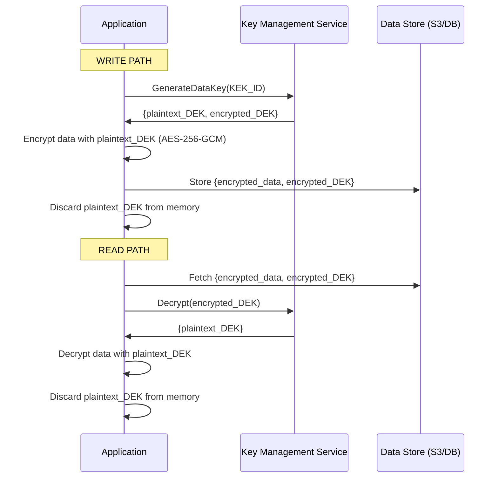
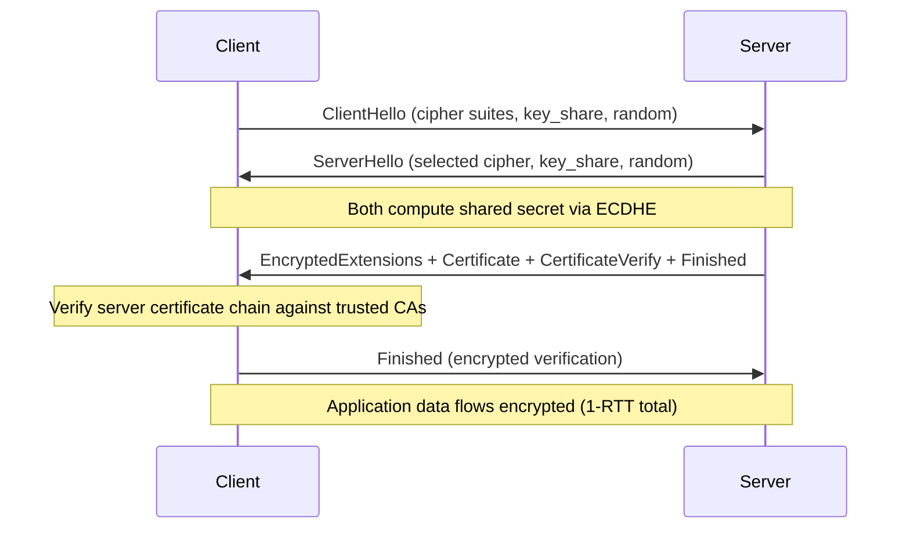
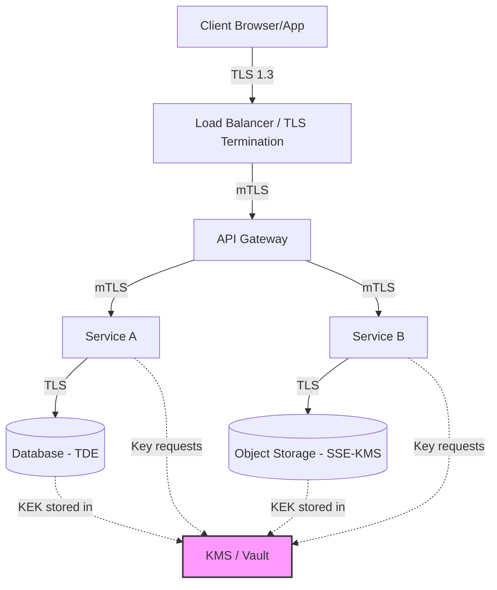

# Encryption

## 1. Overview

Encryption transforms readable data (plaintext) into an unreadable format (ciphertext) using a cryptographic algorithm and a key. Only someone with the correct key can reverse the process. In system design, encryption operates at two critical boundaries: **at rest** (data sitting on disk or in a database) and **in transit** (data moving across a network between services or between a client and server).

Encryption is not a feature you bolt on at the end. It is a foundational architectural decision that affects key management infrastructure, performance budgets, compliance posture, and operational complexity. A system that encrypts everything with a single key is barely better than one that encrypts nothing -- because a single key compromise exposes everything. Effective encryption requires a layered strategy with distinct keys, rotation policies, and access controls at each layer.

## 2. Why It Matters

- **Data breach mitigation**: Encrypted data is useless to an attacker who gains access to storage but not the keys. This is the difference between a "data exposure" (PR crisis) and a "data breach" (regulatory penalty + lawsuits).
- **Regulatory compliance**: PCI-DSS mandates encryption of cardholder data at rest and in transit. HIPAA requires encryption of PHI. GDPR considers encryption a safeguard that can reduce breach notification obligations.
- **Man-in-the-middle prevention**: TLS encryption prevents attackers on the network path from reading or tampering with data in transit. Without TLS, any intermediate router, proxy, or Wi-Fi access point can intercept credentials, tokens, and business data.
- **Multi-tenant isolation**: Encrypting each tenant's data with a distinct key ensures that even a bug exposing raw storage does not leak data across tenants.
- **Supply chain security**: Encrypting inter-service communication (mTLS) prevents compromised infrastructure components from eavesdropping on internal traffic.

## 3. Core Concepts

- **Plaintext**: The original, readable data before encryption.
- **Ciphertext**: The encrypted, unreadable output.
- **Encryption key**: A secret value used by the algorithm to encrypt and decrypt data.
- **Symmetric encryption**: Same key encrypts and decrypts. Fast. Examples: AES-256, ChaCha20.
- **Asymmetric encryption**: A public key encrypts; a private key decrypts. Slower but enables key exchange without shared secrets. Examples: RSA, ECDSA, Ed25519.
- **Key Management Service (KMS)**: A centralized service for generating, storing, rotating, and auditing encryption keys. Examples: AWS KMS, Google Cloud KMS, HashiCorp Vault.
- **Envelope encryption**: Data is encrypted with a Data Encryption Key (DEK). The DEK itself is encrypted with a Key Encryption Key (KEK) stored in KMS. This allows bulk data encryption with fast symmetric ciphers while protecting the DEK with centralized key management.
- **Key rotation**: Periodically replacing encryption keys. Old data may remain encrypted with the old key (lazy re-encryption) or be re-encrypted with the new key (eager re-encryption).
- **Certificate**: A digital document that binds a public key to an identity (domain name, organization). Issued by a Certificate Authority (CA).
- **HSM (Hardware Security Module)**: A tamper-resistant physical device that stores keys and performs cryptographic operations. Keys never leave the HSM.

## 4. How It Works

### Encryption at Rest

Data at rest includes database files, object storage blobs, backups, logs, and local disk. Encryption at rest protects against physical theft, unauthorized disk access, and storage-layer breaches.

**Layers of encryption at rest**:

1. **Full-disk encryption (FDE)**: The operating system or hypervisor encrypts the entire volume. Transparent to applications. Examples: AWS EBS encryption, LUKS, BitLocker. Protects against physical disk theft but not against a compromised OS.

2. **Database-level encryption (TDE)**: The database engine encrypts data files before writing to disk and decrypts on read. Transparent Data Encryption in Postgres, MySQL, and SQL Server. Protects against unauthorized access to database files but not against SQL injection (the query engine decrypts before returning results).

3. **Application-level encryption**: The application encrypts sensitive fields (SSN, credit card, PHI) before storing them. The database stores ciphertext and cannot decrypt it. Provides the strongest protection -- even a DBA with full database access sees only ciphertext. However, encrypted fields cannot be indexed or searched without additional techniques (deterministic encryption for exact match, order-preserving encryption for range queries -- both with security tradeoffs).

4. **Object storage encryption**: S3 supports server-side encryption with Amazon-managed keys (SSE-S3), customer-managed KMS keys (SSE-KMS), or customer-provided keys (SSE-C). SSE-KMS provides audit logging of every key usage via CloudTrail.

**Envelope encryption flow**:

1. Application requests a new DEK from KMS.
2. KMS generates a DEK and returns both the plaintext DEK and the DEK encrypted with the KEK.
3. Application encrypts data with the plaintext DEK using AES-256-GCM.
4. Application stores the encrypted data alongside the encrypted DEK.
5. Application discards the plaintext DEK from memory.
6. On read: application sends the encrypted DEK to KMS for decryption, uses the plaintext DEK to decrypt the data.

### Encryption in Transit

Data in transit is vulnerable to eavesdropping, tampering, and replay attacks. TLS (Transport Layer Security) is the standard protocol for encrypting data in transit.

**TLS 1.3 handshake** (significantly simplified from TLS 1.2):

1. **Client Hello**: Client sends supported cipher suites and a key share (Diffie-Hellman public value).
2. **Server Hello**: Server selects a cipher suite, sends its key share, its certificate, and encrypted extensions.
3. **Key derivation**: Both sides compute the shared secret from the Diffie-Hellman exchange. All subsequent data is encrypted.
4. **Client Finished**: Client sends a verification message encrypted with the derived keys.

**TLS 1.3 improvements over TLS 1.2**:
- **1-RTT handshake** (vs. 2-RTT in TLS 1.2) -- reduces connection latency by ~50ms.
- **0-RTT resumption** -- returning clients can send data in the first packet using a pre-shared key, though this is vulnerable to replay attacks and should not be used for non-idempotent operations.
- **Removed insecure algorithms** -- no more RC4, DES, 3DES, static RSA key exchange, or CBC mode ciphers.
- **Mandatory forward secrecy** -- all key exchanges use ephemeral Diffie-Hellman (DHE or ECDHE). If the server's long-term private key is later compromised, past sessions remain protected.

**mTLS (Mutual TLS)**: Standard TLS authenticates only the server. mTLS requires the client to also present a certificate, enabling cryptographic identity verification for service-to-service communication. Used in service meshes (Istio, Linkerd) and zero-trust architectures.

### Certificate Management

Certificates are the trust anchors for TLS. Mismanaged certificates cause outages and security vulnerabilities.

**Certificate chain of trust**:
1. **Root CA**: Self-signed certificate trusted by operating systems and browsers. Stored offline in HSMs.
2. **Intermediate CA**: Signed by the root CA. Issues end-entity certificates. Limits the blast radius of a compromise.
3. **End-entity certificate**: Signed by the intermediate CA. Installed on servers and bound to a specific domain name.

**Certificate lifecycle**:
- **Issuance**: Request a certificate from a CA (Let's Encrypt for public, internal PKI for private).
- **Deployment**: Install the certificate and private key on load balancers, API gateways, or service instances.
- **Monitoring**: Track expiration dates. An expired certificate causes a hard outage -- TLS handshakes fail and clients refuse to connect. Multiple high-profile outages (Microsoft Teams 2020, Spotify 2020) have been caused by expired certificates.
- **Renewal**: Automate with ACME protocol (Let's Encrypt) or internal PKI tools (Vault PKI, cert-manager in Kubernetes). Target renewal at 2/3 of the certificate's lifetime.
- **Revocation**: If a private key is compromised, revoke the certificate via CRL (Certificate Revocation List) or OCSP (Online Certificate Status Protocol).

**Short-lived certificates** (recommended for internal services): Issue certificates with 4-24 hour lifetimes. Frequent rotation limits the damage window of a key compromise and eliminates the need for revocation infrastructure. Uber and Netflix use this approach for inter-service mTLS.

### End-to-End Encryption (E2EE)

In standard client-server encryption, the server terminates TLS and has access to plaintext data. E2EE ensures that only the communicating endpoints (sender and recipient) can read the data. The server transports ciphertext it cannot decrypt.

**Signal Protocol** (used by WhatsApp, Signal):
- **Double Ratchet Algorithm**: Generates a new encryption key for every message using a combination of Diffie-Hellman key exchanges and symmetric key derivation.
- **Forward secrecy**: Compromise of a current key cannot decrypt past messages.
- **Future secrecy (post-compromise security)**: After a key compromise, new keys are derived from fresh Diffie-Hellman exchanges, locking out the attacker.
- **Sealed sender**: Even the server does not know who sent a message to whom (metadata protection).

E2EE is critical for messaging (WhatsApp, Signal), health data (Apple Health), and financial data. It is not appropriate when the server needs to process data content (search, analytics, spam filtering).

## 5. Architecture / Flow

### Envelope Encryption with KMS

### TLS 1.3 Handshake

### Defense-in-Depth Encryption Architecture

## 6. Types / Variants

### Encryption Algorithms

| Algorithm | Type | Key Size | Speed | Use Case |
|---|---|---|---|---|
| AES-256-GCM | Symmetric | 256 bits | Very fast | Data at rest, bulk encryption |
| ChaCha20-Poly1305 | Symmetric | 256 bits | Fast (esp. on mobile) | TLS, mobile devices without AES hardware |
| RSA-2048/4096 | Asymmetric | 2048-4096 bits | Slow | Key exchange (legacy), digital signatures |
| ECDSA (P-256) | Asymmetric | 256 bits | Moderate | TLS certificates, JWT signing |
| Ed25519 | Asymmetric | 256 bits | Fast | SSH keys, modern digital signatures |
| X25519 | Key exchange | 256 bits | Fast | ECDHE in TLS 1.3 |

### Encryption at Rest Strategies

| Strategy | Protects Against | Transparent to App | Searchable |
|---|---|---|---|
| Full-disk encryption | Physical theft, decommissioned disks | Yes | Yes |
| Database TDE | Unauthorized file access, backup theft | Yes | Yes |
| Application-level (field) | SQL injection, DBA access, storage breaches | No | Limited |
| Client-side encryption | Server compromise, insider threats | No | No |

### Key Management Approaches

| Approach | Security | Operational Overhead | Cost |
|---|---|---|---|
| Application-managed keys | Low (keys in config files) | Low | Free |
| Cloud KMS (AWS/GCP/Azure) | High (HSM-backed, audit logs) | Medium | Pay-per-use |
| HashiCorp Vault | High (self-hosted, dynamic secrets) | High | Infrastructure cost |
| HSM (CloudHSM, on-prem) | Very high (FIPS 140-2 Level 3) | Very high | Expensive |

### Cryptographic Hashing (Related but Distinct)

Hashing is a one-way function that maps data to a fixed-size digest. Unlike encryption, hashing is irreversible -- you cannot recover the original data from the hash. Hashing is used for:

- **Password storage**: Never store passwords in plaintext or encrypted form (encryption can be reversed). Store bcrypt, scrypt, or Argon2 hashes. These algorithms are intentionally slow to resist brute-force attacks.
- **Data integrity verification**: Hash a file or message to detect tampering. Pre-signed URLs include a signature (HMAC hash) that the server recomputes to verify the URL has not been modified.
- **Content-addressable storage**: Dropbox uses content hashing (fingerprinting) to identify file chunks. Two users uploading the same file produce the same hash, enabling deduplication without the server reading the content.
- **Bloom filters and HyperLogLog**: Probabilistic data structures that rely on hash functions for space-efficient approximate operations.

**Common algorithms**: SHA-256 (general purpose), SHA-3 (latest NIST standard), BLAKE3 (modern, fast), bcrypt/Argon2 (password hashing).

### Data Classification and Encryption Policy

Not all data requires the same level of encryption. A practical encryption policy classifies data into tiers:

| Classification | Examples | At Rest | In Transit | Key Management |
|---|---|---|---|---|
| Public | Marketing pages, public API docs | Optional (FDE) | TLS | Standard |
| Internal | Employee directories, internal tools | FDE + TDE | TLS | Cloud KMS |
| Confidential | User PII, financial data | Application-level + FDE | TLS + mTLS | Cloud KMS with access logging |
| Restricted | Payment cards, health records, secrets | Application-level with per-tenant keys | TLS + mTLS | HSM-backed KMS, strict audit |

This tiered approach ensures that the highest security overhead is applied only where the risk justifies it, while maintaining a baseline of protection across all data.

## 7. Use Cases

- **Stripe**: Every credit card number is encrypted at the application layer with per-merchant keys before storage. Card numbers are never stored in plaintext, even in the database. Stripe manages a custom KMS infrastructure and rotates keys automatically.
- **WhatsApp**: End-to-end encryption (E2EE) using the Signal Protocol. Messages are encrypted on the sender's device and decrypted only on the recipient's device. WhatsApp servers transport ciphertext they cannot decrypt. Group chats use a "sender key" distributed via pairwise encrypted channels.
- **Netflix**: Uses mTLS for all inter-service communication within their microservices mesh. TLS certificates are short-lived (~4 hours) and automatically rotated. Sensitive data at rest is encrypted with AWS KMS using envelope encryption.
- **AWS S3**: Achieves 11 nines of durability using erasure coding across multiple AZs. Server-side encryption with KMS-managed keys (SSE-KMS) provides auditable access control -- every decryption is logged in CloudTrail.
- **UPI Payments (India)**: Transaction data is encrypted in transit using TLS between PSPs, partner banks, and the NPCI network. The closed-loop architecture means encryption keys are managed within the regulated banking ecosystem.

## 8. Tradeoffs

| Decision | Tradeoff |
|---|---|
| TLS termination at load balancer vs. end-to-end | Performance (terminate once, forward plaintext internally) vs. security (data unencrypted on internal network). Compromise: mTLS between internal services. |
| Application-level vs. database-level encryption | Stronger security (app-level) vs. operational simplicity (TDE). App-level breaks database indexing and search unless using specialized encryption modes. |
| Symmetric vs. asymmetric encryption | Speed (symmetric, ~1000x faster) vs. key distribution (asymmetric, no shared secret needed). In practice: use asymmetric for key exchange, symmetric for bulk data. |
| Eager vs. lazy key rotation | Immediate compliance (eager re-encrypt all data) vs. operational cost (lazy re-encrypt on access). Most systems use lazy rotation with a re-encryption background job. |
| Cloud KMS vs. self-managed (Vault) | Simplicity and integration (cloud KMS) vs. portability and control (Vault). Cloud KMS ties you to a vendor; Vault requires operational expertise. |
| 0-RTT TLS resumption | Lower latency (one fewer round trip) vs. replay vulnerability. Safe only for idempotent requests (GET). |

## 9. Common Pitfalls

- **Not encrypting database backups**: Production data may be encrypted at rest, but automated backups, snapshots, and replication streams may write to unencrypted destinations. Ensure encryption covers the full data lifecycle including backups, cross-region replication, and disaster recovery sites.
- **Hardcoded encryption keys in source code**: Keys committed to Git repositories are permanently compromised, even if the commit is later deleted (it remains in history). Use secrets management tools and scan repositories with tools like git-secrets or truffleHog.
- **Using the same key for all tenants**: A single-tenant key compromise exposes every tenant's data. Use per-tenant Data Encryption Keys (DEKs) wrapped by a shared Key Encryption Key (KEK) in KMS. This limits the blast radius of a key compromise to a single tenant.
- **Encrypting data but storing keys alongside it**: If the encryption key is in the same database, S3 bucket, or config file as the encrypted data, encryption provides zero protection. Keys must be in a separate trust domain (KMS, HSM).
- **Using ECB mode**: Electronic Codebook mode encrypts identical plaintext blocks to identical ciphertext blocks, leaking patterns. Always use authenticated encryption modes like GCM or CCM.
- **Rolling your own crypto**: Implementing custom encryption algorithms or protocols is virtually guaranteed to introduce vulnerabilities. Use established libraries (libsodium, AWS Encryption SDK, Google Tink).
- **Ignoring key rotation**: Keys that never rotate become permanent secrets. A single compromise exposes all data ever encrypted with that key. Automate rotation with a maximum key age policy.
- **TLS without certificate validation**: Disabling certificate validation (`verify=False`) to "make it work" in development is a habit that leaks into production, enabling trivial MITM attacks.
- **Encrypting only "sensitive" fields**: Classification errors are common. Metadata (timestamps, access patterns, data sizes) can leak significant information even when field values are encrypted.
- **Forgetting backups**: Encrypted production data backed up to an unencrypted backup store provides a plaintext copy for attackers. Ensure encryption covers backups, snapshots, and replication targets.

## 10. Real-World Examples

- **Google**: All data at rest in Google Cloud is encrypted by default using AES-256. Google uses a layered key hierarchy: data is encrypted with a DEK, DEKs are encrypted with KEKs, and KEKs are protected by a root key stored in a global KMS backed by HSMs. Keys are rotated automatically every 90 days.
- **Uber**: After a 2016 breach exposed 57 million records, Uber rebuilt their encryption architecture. They now use per-table encryption keys managed through a centralized secrets service, with all inter-service communication encrypted via mTLS.
- **Signal/WhatsApp**: The Signal Protocol uses a double ratchet algorithm that generates a new encryption key for every single message. Even if one message key is compromised, it cannot decrypt past or future messages (forward secrecy + future secrecy).
- **Dropbox**: Files are chunked into ~4MB blocks, each encrypted independently with AES-256. Block keys are encrypted with a user-specific namespace key. Delta sync only re-encrypts and transfers changed blocks, not the entire file.
- **Apple iCloud**: Advanced Data Protection uses end-to-end encryption for most iCloud data categories. Apple's servers store only ciphertext and encrypted keys. The user's device-specific keys are the only decryption path.

### Encryption Performance Considerations

Encryption is not free. Understanding the performance cost helps architects make informed decisions:

- **AES-256-GCM** with hardware acceleration (AES-NI instructions on modern CPUs): ~5-10 GB/s throughput. Negligible overhead for typical API payloads. For bulk data (video transcoding, ML training data), the overhead is measurable but rarely the bottleneck.
- **TLS handshake**: ~1-2ms for TLS 1.3 (1-RTT). TLS 1.2 adds ~2-4ms (2-RTT). 0-RTT resumption adds 0ms but has replay risks. Connection pooling and keep-alive connections amortize handshake cost across multiple requests.
- **RSA-2048 signing**: ~1ms. ECDSA P-256 signing: ~0.1ms. For high-throughput JWT issuance, ECDSA is preferred.
- **KMS round-trip**: ~5-20ms for cloud KMS decryption. This is why envelope encryption is essential -- the KMS call happens once per DEK, not once per record. Cache plaintext DEKs in memory (with appropriate protections) for the duration of their rotation period.
- **mTLS overhead**: ~2-5% additional CPU for TLS termination at the service mesh sidecar (Envoy). At Uber's scale this translates to meaningful infrastructure cost, which is why they use short-lived certificates that do not require OCSP/CRL checks.

## 11. Related Concepts

- [Authentication and Authorization](authentication-authorization.md) -- encryption secures the transport layer that carries auth tokens
- [API Security](api-security.md) -- HTTPS/TLS is the foundation of secure API communication
- [Networking Fundamentals](../01-fundamentals/networking-fundamentals.md) -- TLS operates at the transport/application layer boundary
- [Database Replication](../03-storage/database-replication.md) -- replication traffic must be encrypted; WAL shipping should use TLS
- [Object Storage](../03-storage/object-storage.md) -- server-side encryption and pre-signed URLs for secure blob access

### Encryption Decision Matrix

Use this matrix to determine the appropriate encryption strategy for a given scenario:

| Scenario | Recommended Approach | Why |
|---|---|---|
| Database storing user profiles | TDE (Transparent Data Encryption) | Protects against disk theft and unauthorized file access without app changes |
| Credit card numbers in database | Application-level encryption with per-merchant DEKs | Even a DBA or SQL injection cannot access plaintext card numbers |
| File uploads to S3 | SSE-KMS with customer-managed keys | Audit trail of every access via CloudTrail; tenant-level key isolation |
| Inter-service communication | mTLS with short-lived certificates | Cryptographic identity verification; prevents impersonation of services |
| User-to-user messaging | End-to-end encryption (Signal Protocol) | Server never sees plaintext; strongest privacy guarantee |
| Database backups | Same or stronger encryption as source | Backups are a copy of production data and must be equally protected |
| Logs containing PII | Field-level encryption or tokenization | Logs are often accessible to broader teams; encrypt sensitive fields |

## 12. Source Traceability

- source/youtube-video-reports/2.md (Section 10: Mandatory encryption at rest and TLS 1.3 for data in transit)
- source/youtube-video-reports/3.md (Section 7: Encryption At Rest/In Transit as a security pillar)
- source/youtube-video-reports/5.md (Section 2: Network Infrastructure, Security-in-Depth model)
- source/youtube-video-reports/9.md (Section 1: Networking, HTTPS)
- source/extracted/system-design-guide/ch12-design-and-implementation-of-system-components-api-security-.md (Secure communication, HTTPS, TLS configurations)
- source/extracted/ddia/ch05-encoding-and-evolution.md (Encoding formats context -- JSON, Protobuf, Thrift)
- source/extracted/acing-system-design/ch05-non-functional-requirements.md (Security as non-functional requirement)
