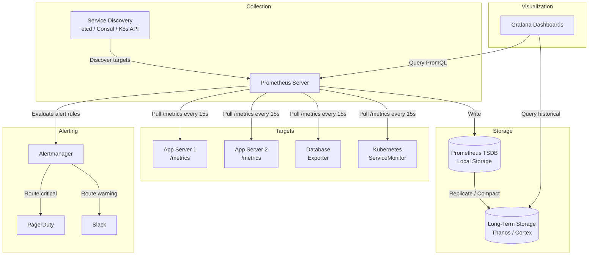
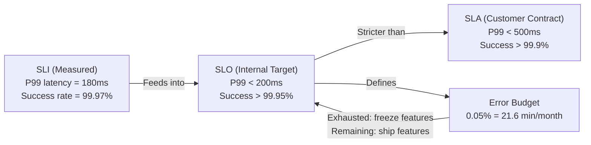

# Monitoring

## 1. Overview

Monitoring is the practice of collecting, aggregating, and analyzing quantitative metrics about your system's behavior over time. Metrics are numerical measurements sampled at regular intervals -- CPU load at 14:32:05, request count over the last minute, P99 latency for the `/checkout` endpoint. Unlike logs (discrete events) or traces (request journeys), metrics are time-series data optimized for aggregation, trending, and alerting.

A system you cannot monitor is a system you cannot operate. Monitoring answers three questions in sequence: "Is the system healthy right now?" (dashboards), "Is the system about to have a problem?" (alerting), and "Where is the bottleneck?" (drill-down). Without monitoring, you discover outages from your users, and you debug them by reading through millions of log lines. With monitoring, you discover degradation before it becomes an outage, and you localize it to a specific service, endpoint, or resource within minutes.

## 2. Why It Matters

- **Availability enforcement**: Monitoring is how you prove you are meeting your SLAs. If your SLA promises 99.99% uptime, you need a monitoring system that measures it, not a PM who guesses it.
- **Cost optimization**: Metrics on CPU, memory, and network utilization reveal over-provisioned infrastructure. Kubernetes cost management tools like OpenCost integrate with Prometheus to translate resource usage into actual currency.
- **Incident response**: Mean Time to Detect (MTTD) and Mean Time to Resolve (MTTR) are directly proportional to monitoring quality. A P99 latency alert that fires 30 seconds after degradation starts is worth more than an on-call engineer who notices an hour later.
- **Capacity planning**: Historical metrics predict when you will exhaust storage, hit connection limits, or need to add nodes. Reactive scaling after an outage is more expensive than proactive scaling informed by trend data.
- **Autoscaling feedback loop**: Horizontal Pod Autoscaler (HPA) in Kubernetes scales based on metrics (CPU utilization, custom metrics). Without accurate metrics, autoscaling either under-provisions (outage) or over-provisions (wasted spend).

## 3. Core Concepts

- **Metric**: A named time series of numerical values with associated labels/tags. Example: `http_request_duration_seconds{method="GET", endpoint="/api/users", status="200"}`.
- **Label/Tag**: Key-value pairs that add dimensionality to a metric. Labels enable filtering (`status=500`), grouping (`GROUP BY endpoint`), and aggregation.
- **Four Golden Signals** (from Google SRE Handbook):
  - **Latency**: Time to serve a request. Distinguish between successful and failed requests (a fast `500` is not a healthy signal).
  - **Traffic**: Demand on the system -- requests per second, concurrent connections, messages consumed per second.
  - **Errors**: Rate of failed requests -- explicit (HTTP 5xx) and implicit (HTTP 200 with wrong content, timeout-induced retries).
  - **Saturation**: How "full" the system is -- CPU utilization, memory pressure, disk I/O queue depth, connection pool exhaustion.
- **Percentiles (P50/P95/P99)**: P99 latency means 99% of requests complete faster than this value. P99 reveals tail latency that averages hide. A system with 50ms average but 2s P99 has a serious problem affecting 1% of users.
- **SLA (Service Level Agreement)**: A contractual commitment to customers (e.g., "99.95% uptime or we credit your account").
- **SLO (Service Level Objective)**: An internal target stricter than the SLA (e.g., "99.99% uptime"). The buffer between SLO and SLA is your error budget.
- **SLI (Service Level Indicator)**: The actual measured metric that backs the SLO (e.g., "proportion of requests completing in < 300ms").
- **Error budget**: The allowed amount of unreliability. If your SLO is 99.9%, your error budget is 0.1% -- about 43 minutes per month. When the budget is exhausted, feature development pauses and reliability work takes priority.
- **Cardinality**: The number of unique label combinations for a metric. High cardinality (e.g., labeling by user_id) explodes storage and query cost in time-series databases.

## 4. How It Works

### Metrics Collection: Pull vs. Push

**Pull model** (Prometheus): The monitoring server scrapes metrics from target endpoints at a configured interval (typically 15-60 seconds). Targets expose a `/metrics` HTTP endpoint.

- Advantages: Easy debugging (curl the endpoint), automatic health checking (no response = target down), data authenticity (known targets only).
- Disadvantages: Requires network reachability to all targets; problematic across firewalls or in multi-datacenter setups. Short-lived jobs may terminate before being scraped (mitigated by Pushgateway).
- Coordination: Multiple Prometheus instances use consistent hashing to partition scrape targets, avoiding duplicate collection.

**Push model** (Datadog, CloudWatch, Graphite): Agents on each machine push metrics to a collector endpoint at regular intervals.

- Advantages: Works across firewalls (outbound-only), handles short-lived processes (push before exit), simpler network topology.
- Disadvantages: Harder to distinguish "target down" from "network issue." Any client can push (authenticity requires whitelisting or auth).

Most large organizations support both models. Prometheus is the de facto standard for Kubernetes environments. CloudWatch is standard for AWS-native infrastructure.

### Time-Series Data Model

Each metric data point consists of:
- **Metric name**: `cpu_usage_percent`
- **Labels**: `{host: "web-01", region: "us-east-1", env: "prod"}`
- **Timestamp**: `1613707265` (Unix epoch)
- **Value**: `0.73`

Time-series databases (InfluxDB, Prometheus TSDB) optimize for this access pattern:
- **Write-heavy**: 10M+ metrics written per day in a 1000-server environment.
- **Read pattern**: Bursty -- dashboard refreshes and alert evaluations trigger range queries.
- **Compression**: Delta-of-delta encoding for timestamps, Gorilla compression for values. InfluxDB with 8 cores / 32GB RAM handles 250,000+ writes per second.
- **Downsampling**: Raw data (10s resolution) kept for 7 days; 1-minute rollups kept for 30 days; 1-hour rollups kept for 1 year. Reduces storage 100x for historical data.

### PromQL (Prometheus Query Language)

Prometheus provides PromQL for querying time-series data:

- **Instant vector**: `http_requests_total{status="500"}` -- current value of each matching series.
- **Range vector**: `http_requests_total{status="500"}[5m]` -- values over the last 5 minutes.
- **Rate**: `rate(http_requests_total[5m])` -- per-second rate of increase over 5 minutes.
- **Percentile**: `histogram_quantile(0.99, rate(http_request_duration_bucket[5m]))` -- P99 latency.
- **Aggregation**: `sum by (endpoint) (rate(http_requests_total[5m]))` -- request rate grouped by endpoint.

### Alerting Pipeline

Alerting transforms metrics into actionable notifications:

1. **Alert rules** (defined in YAML): conditions evaluated against PromQL queries at fixed intervals.
   ```yaml
   - alert: HighErrorRate
     expr: rate(http_requests_total{status=~"5.."}[5m]) / rate(http_requests_total[5m]) > 0.05
     for: 5m
     labels:
       severity: critical
   ```
2. **Alertmanager** (Prometheus ecosystem): Receives firing alerts and handles deduplication, grouping (merge related alerts), silencing (suppress known issues during maintenance), and routing (critical -> PagerDuty, warning -> Slack).
3. **Notification channels**: PagerDuty, Slack, email, OpsGenie, webhooks.
4. **Alert state machine**: `inactive` -> `pending` (condition true but `for` duration not elapsed) -> `firing` (condition sustained) -> `resolved` (condition no longer true).

### Visualization with Grafana

Grafana connects to Prometheus (and 50+ other data sources) to render dashboards:

- **Panels**: Time-series graphs, stat panels, tables, heatmaps, and logs panels.
- **Variables**: Template variables (e.g., dropdown for `$environment`) enable one dashboard to serve multiple environments.
- **Annotations**: Mark deployments, incidents, and config changes on graphs to correlate metrics with events.
- **Alerting**: Grafana also supports native alerting with multi-data-source evaluation.
- **Dashboard-as-code**: Grafana dashboards can be defined in JSON and provisioned via ConfigMaps in Kubernetes, enabling version control and consistent dashboards across environments.

### Scaling Prometheus: Long-Term Storage

Prometheus's local TSDB is designed for short-term storage (15 days to 30 days). For long-term retention and multi-cluster aggregation:

- **Thanos**: Adds a sidecar to each Prometheus instance that uploads blocks to object storage (S3, GCS). A query component provides a unified PromQL interface across all Prometheus instances and historical data. Supports downsampling (5-minute and 1-hour rollups) for efficient long-term queries.
- **Cortex**: A horizontally scalable, multi-tenant Prometheus service. Ingests metrics via the Prometheus remote write API and stores them in object storage with a configurable index (DynamoDB, Cassandra, or BoltDB).
- **VictoriaMetrics**: A drop-in Prometheus replacement that offers better compression (up to 70x vs. raw) and faster queries on large datasets.

### Kubernetes-Specific Monitoring

Kubernetes introduces monitoring patterns unique to container orchestration:

- **ServiceMonitor CRD**: A Prometheus Operator custom resource that defines which Kubernetes services to scrape and at what interval. New services are automatically discovered when they match label selectors.
- **kube-state-metrics**: Exposes cluster-level metrics (pod phase, deployment replicas desired vs. available, node conditions) that the kubelet does not provide.
- **Metrics Server**: Lightweight, in-memory aggregator of resource metrics (CPU, memory) from kubelets. Required by HPA for scaling decisions.
- **OpenCost**: Integrates with Prometheus to allocate cloud costs to individual pods, namespaces, and teams. Translates CPU/memory utilization into actual dollar amounts, enabling teams to understand the cost of their services.

### The RED and USE Methods

Beyond the Four Golden Signals, two complementary frameworks help structure monitoring:

**RED Method** (for request-driven services):
- **Rate**: Requests per second.
- **Errors**: Failed requests per second.
- **Duration**: Distribution of response times (histogram).

**USE Method** (for infrastructure resources -- CPU, memory, disk, network):
- **Utilization**: Percentage of time the resource is busy.
- **Saturation**: Queue depth or degree of extra work not being serviced.
- **Errors**: Count of error events for the resource.

Use RED for application services (web servers, API endpoints) and USE for infrastructure (hosts, databases, message brokers). Together, they provide comprehensive coverage.

## 5. Architecture / Flow

### Monitoring System Architecture



### SLA/SLO/SLI Relationship



## 6. Types / Variants

### Metric Types

| Type | Description | Example | PromQL Operation |
|---|---|---|---|
| Counter | Monotonically increasing value. Resets to 0 on restart. | `http_requests_total` | `rate()` to get per-second rate |
| Gauge | Value that goes up and down. | `temperature_celsius`, `active_connections` | Direct query or `avg_over_time()` |
| Histogram | Counts observations in configurable buckets. | `http_request_duration_seconds` | `histogram_quantile()` for percentiles |
| Summary | Client-side calculated percentiles. | `rpc_duration_seconds{quantile="0.99"}` | Direct query (pre-computed) |

### Monitoring Tools Comparison

| Tool | Type | Deployment | Query Language | Best For |
|---|---|---|---|---|
| Prometheus | Pull-based TSDB | Self-hosted / K8s | PromQL | Kubernetes, dynamic environments |
| Grafana | Visualization | Self-hosted / Cloud | N/A (multi-source) | Dashboards, multi-source correlation |
| Datadog | SaaS (push) | Agent-based | Proprietary | Full-stack SaaS monitoring |
| CloudWatch | AWS-native | Managed | Metrics Insights | AWS infrastructure |
| InfluxDB | Push TSDB | Self-hosted / Cloud | Flux / InfluxQL | IoT, high-write-volume metrics |
| Thanos / Cortex | Long-term Prometheus | Self-hosted | PromQL | Multi-cluster, long-term storage |
| OpenCost | Cost monitoring | K8s sidecar | PromQL | Kubernetes cost allocation |

### Pull vs. Push Comparison

| Dimension | Pull (Prometheus) | Push (CloudWatch, Datadog) |
|---|---|---|
| Debugging | Easy (curl /metrics) | Harder (inspect agent output) |
| Health detection | No response = down | No data = ambiguous (down vs. network) |
| Short-lived jobs | Needs Pushgateway | Native support |
| Firewall/multi-DC | Requires reachability | Outbound-only (easier) |
| Data authenticity | High (known targets) | Lower (any client can push) |
| Performance | TCP (reliable) | UDP option (lower latency) |

### Anomaly Detection and Burn-Rate Alerts

Static threshold alerts ("alert when error rate > 5%") are simple but brittle. They generate false positives during traffic dips and miss slow degradation.

**Burn-rate alerts** (SLO-based alerting): Instead of alerting on absolute values, alert on the rate at which the error budget is being consumed. If the SLO is 99.9% over 30 days (error budget = 43 minutes), a burn rate of 1x means the budget will be exhausted at exactly 30 days. A burn rate of 14.4x means the budget will be exhausted in 2 hours -- this should page someone immediately.

Typical burn-rate alert configuration:
- **Fast burn (14.4x over 1 hour)**: Pages on-call immediately. Likely a major incident.
- **Slow burn (6x over 6 hours)**: Creates a ticket for investigation during business hours. Could be a gradual degradation.
- **Budget almost exhausted (< 10% remaining)**: Triggers a review of recent changes and a deployment freeze.

**ML-based anomaly detection**: Services like Netflix's Atlas and Datadog use machine learning to learn "normal" metric behavior (accounting for daily/weekly seasonality) and alert on deviations. This reduces the need for manually tuning thresholds per metric.

## 7. Use Cases

- **Netflix**: Uses Atlas, their custom time-series database, to collect ~2 billion metrics per minute across 100,000+ instances. Dashboards are organized by microservice owner. Anomaly detection alerts on deviations from learned baselines rather than static thresholds.
- **Twitter**: MetricsDB is their custom time-series database designed for the scale of ~200 billion metrics per day. It uses in-memory caching for recent data and tiered storage for historical queries.
- **Uber**: Uses M3, an open-source metrics platform built on top of Prometheus, designed for multi-datacenter aggregation. M3 handles 500M+ metrics per second with cross-region query federation.
- **Google**: Monarch (internal) collects metrics from every service in Google's fleet. The SRE book's "Four Golden Signals" framework was born from Monarch's operational experience.
- **Kubernetes HPA**: Metrics Server collects CPU/memory from kubelets. HPA evaluates these metrics to scale deployments. Custom metrics (via Prometheus Adapter) enable scaling on application-specific signals like queue depth.

## 8. Tradeoffs

| Decision | Tradeoff |
|---|---|
| High scrape frequency (5s) vs. low (60s) | More granular data and faster alerting vs. higher storage cost and scrape load. 15s is the common default. |
| High label cardinality | More dimensions for analysis vs. exponential storage/query cost. Never use user_id as a label; use it as a log field. |
| SLO strictness | Tighter SLOs (99.99% vs. 99.9%) drive higher reliability investment but consume more engineering time and reduce deployment velocity. |
| Alert sensitivity | Low thresholds catch problems early but generate alert fatigue. High thresholds reduce noise but increase MTTD. Use burn-rate alerts (error budget consumption rate) instead of static thresholds. |
| Self-hosted (Prometheus) vs. SaaS (Datadog) | Full control and no per-host pricing vs. zero operational overhead. Prometheus is free but requires expertise to scale (Thanos/Cortex for HA and long-term storage). Datadog costs $23+/host/month but is turnkey. |
| Downsampling aggressiveness | More aggressive downsampling saves storage but loses granularity for historical investigations. Keep raw data for at least the SLO evaluation window. |

## 9. Common Pitfalls

- **Alerting on averages instead of percentiles**: Average latency hides tail latency. A system with 50ms average and 5s P99 is broken for 1% of users. Alert on P99 and P95.
- **Too many alerts (alert fatigue)**: Teams that receive hundreds of non-actionable alerts per week start ignoring all of them. Every alert must be actionable. If it does not require human intervention, it should not page anyone.
- **Monitoring only infrastructure, not user experience**: CPU at 30% means nothing if P99 latency is 10 seconds. Prioritize application-level SLIs (request latency, error rate) over infrastructure metrics.
- **No runbooks for alerts**: An alert without a documented response procedure is a notification, not an alert. Each critical alert should link to a runbook with diagnostic steps and remediation actions.
- **Dashboard sprawl without ownership**: Hundreds of dashboards where nobody knows which ones matter. Assign each service an SLO dashboard as the single source of truth for health.
- **Confusing SLAs with SLOs**: SLAs are external contracts with financial penalties. SLOs are internal targets that should be stricter. If your SLO equals your SLA, you have no error budget.
- **Ignoring metric cardinality**: Adding a `request_id` label to a counter creates millions of unique time series. Prometheus will OOM. Use labels only for low-cardinality dimensions (method, status_code, endpoint).
- **No baseline before alerting**: Alerting without understanding normal behavior leads to thresholds that are either too sensitive (constant alerts) or too lenient (miss real problems). Run monitoring for 2+ weeks to establish baselines before configuring alerts.
- **Monitoring only happy paths**: Monitoring request latency without monitoring dependency health (database connection pool, cache hit rate, downstream service availability) misses the root cause. Monitor both the symptoms (user-facing latency) and the causes (resource utilization, dependency errors).

## 10. Real-World Examples

- **Facebook (Meta)**: The Gorilla paper describes their in-memory time-series database that stores the most recent 26 hours of data in RAM for sub-millisecond queries. 85% of queries target data less than 26 hours old, making this caching strategy highly effective.
- **Spotify**: Uses a Prometheus + Thanos stack for their Kubernetes-based infrastructure. Service owners define SLOs in code, and Thanos provides cross-cluster query federation for global SLO dashboards.
- **LinkedIn**: Operates InGraphs, a custom metrics platform that handles trillions of data points per day. Metrics are used to power autoscaling decisions and capacity planning models that forecast resource needs weeks in advance.
- **Cloudflare**: Monitors 55M+ requests per second across 300+ data centers. Uses a custom time-series system with 10-second granularity for real-time dashboards and 1-minute rollups for historical analysis.
- **Kubernetes ecosystem**: ServiceMonitor CRDs allow Prometheus to auto-discover and scrape new services. kube-state-metrics exposes cluster state (pod status, deployment replicas) as Prometheus metrics. OpenCost provides per-pod cost attribution using cloud billing APIs + Prometheus utilization data.

### Building an Effective On-Call Dashboard

A well-designed on-call dashboard answers "Is the system healthy?" in under 10 seconds. Structure it in three tiers:

**Tier 1 -- SLO Summary** (top of dashboard):
- Current SLI values vs. SLO targets for each critical service (green/yellow/red).
- Error budget remaining (percentage and time).
- Active alerts count by severity.

**Tier 2 -- Golden Signals** (middle):
- Request rate (traffic), error rate, P50/P95/P99 latency, and saturation (CPU, memory, connection pools) for each service.
- Time-series graphs with deployment annotations and incident markers.

**Tier 3 -- Dependency Health** (bottom):
- Database query latency and connection pool utilization.
- Cache hit rate and eviction rate.
- Message queue depth and consumer lag.
- Downstream service health (circuit breaker state, error rates).

Each panel should link to a runbook or deeper drill-down dashboard for the specific component.

## 11. Related Concepts

- [Logging](02-logging.md) -- logs provide event-level detail that metrics aggregate away; the two are complementary
- [Autoscaling](../02-scalability/02-autoscaling.md) -- HPA scales based on metrics; accurate monitoring is a prerequisite for effective autoscaling
- [Availability and Reliability](../01-fundamentals/04-availability-reliability.md) -- SLAs, SLOs, and nines of availability are defined and measured through monitoring
- [Time-Series Databases](../03-storage/06-time-series-databases.md) -- the storage engines underlying monitoring systems (LSM trees, Gorilla compression, downsampling)
- [Circuit Breaker](../08-resilience/02-circuit-breaker.md) -- circuit breaker state transitions are driven by error rate metrics

## 12. Source Traceability

- source/youtube-video-reports/2.md (Section 10: Prometheus/Grafana for real-time health monitoring)
- source/youtube-video-reports/3.md (Section 7: ELK Stack, Prometheus/Grafana, monitoring as architectural mandate)
- source/youtube-video-reports/5.md (Section 1: P99 as the metric that matters, nines of availability, latency vs. throughput)
- source/youtube-video-reports/6.md (Section 1: Four Golden Signals from Google SRE, observability pillar)
- source/youtube-video-reports/9.md (Section 7: Four Golden Signals, monitoring as "security camera")
- source/extracted/alex-xu-vol2/ch06-metrics-monitoring-and-alerting-system.md (Full monitoring system design: pull vs. push, time-series DB, alerting pipeline, downsampling, Grafana visualization)
- source/extracted/system-design-guide/ch12-design-and-implementation-of-system-components-api-security-.md (Metrics types, Prometheus, Grafana, alerting best practices)
- source/extracted/acing-system-design/ch05-non-functional-requirements.md (Performance/latency/P99, availability targets)
