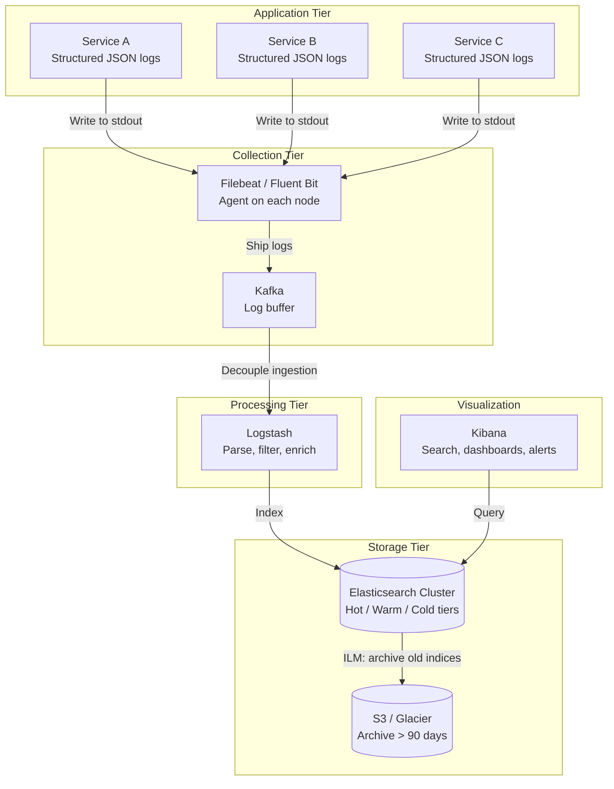
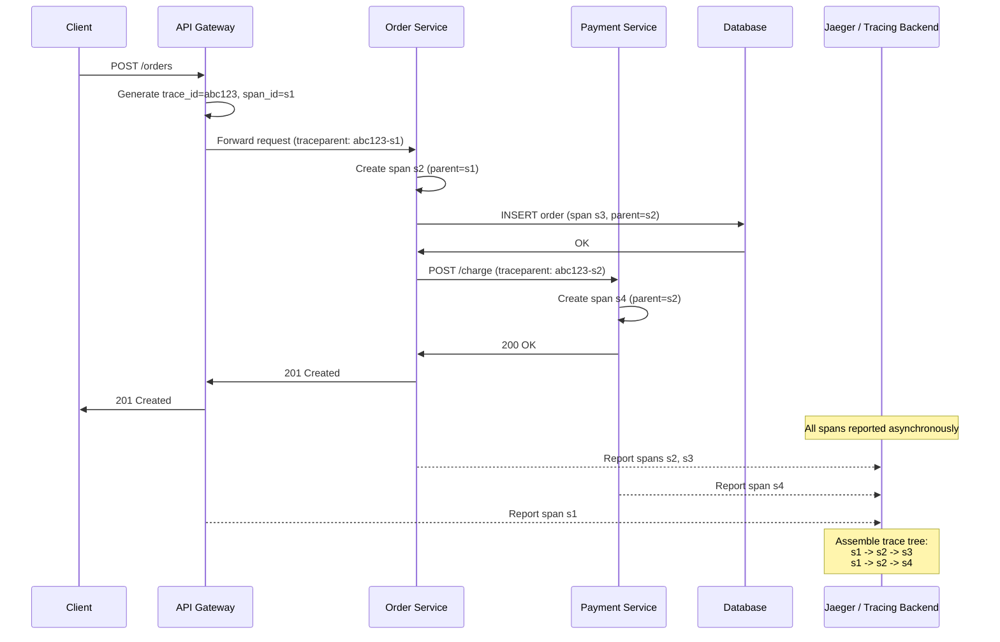

# Logging

## 1. Overview

Logging is the practice of recording discrete events as they occur in a system -- an HTTP request received, a database query executed, an exception thrown, a user action performed. Unlike metrics (numerical time-series data aggregated over intervals), logs capture the full context of individual events: what happened, when, where, why, and who was involved.

In a distributed system with dozens of microservices, a single user request may traverse 10+ services. Without centralized, structured logging with correlation IDs, debugging that request is like reading 10 different novels simultaneously and trying to reconstruct a single storyline. Logging is the foundation of post-mortem analysis, audit trails, compliance reporting, and the "why" behind the "what" that monitoring reveals.

## 2. Why It Matters

- **Incident investigation**: When monitoring alerts fire, logs provide the detailed context needed to diagnose root cause. Metrics tell you "error rate spiked at 14:32." Logs tell you "the database connection pool was exhausted because Service B started sending 10x its normal query volume after a bad deployment at 14:31."
- **Audit trails**: Regulatory frameworks (SOX, HIPAA, PCI-DSS, GDPR) require immutable records of who accessed what data and when. Logs are the primary evidence in compliance audits and security investigations.
- **Post-mortem analysis**: After an incident is resolved, logs enable timeline reconstruction. The ELK stack allows engineers to search across all services, filter by time window, and build a narrative of what went wrong.
- **Debugging in production**: You cannot attach a debugger to a production service serving millions of users. Structured logs with request context are your debugger.
- **Business intelligence**: Application-level logs (user signups, purchases, feature usage) feed into analytics pipelines. Clickstream logs power recommendation engines and A/B test analysis.

## 3. Core Concepts

- **Log entry**: A single recorded event containing a timestamp, severity, message, and structured metadata.
- **Structured logging**: Emitting logs as machine-parseable key-value pairs (typically JSON) rather than free-form text. Enables filtering, aggregation, and indexing.
- **Log levels**: Severity classification that controls verbosity:
  - **TRACE/DEBUG**: Detailed diagnostic data. Never enabled in production by default.
  - **INFO**: Significant business events (user logged in, order placed). The default production level.
  - **WARN**: Unexpected but recoverable situations (retry triggered, cache miss on hot key).
  - **ERROR**: Failures requiring attention (unhandled exception, dependency timeout).
  - **FATAL/CRITICAL**: System-level failures requiring immediate intervention (OOM, data corruption detected).
- **Correlation ID (Trace ID)**: A unique identifier generated at the entry point of a request and propagated through every service in the call chain. Enables reconstructing the full journey of a single request across all services.
- **Span**: A named, timed segment of work within a trace. A trace is a tree of spans. Each span records the service, operation, duration, and status.
- **Centralized logging**: Collecting logs from all services into a single searchable store. Without centralization, debugging requires SSH-ing into individual servers and grepping through local files -- impossible at scale.
- **Log aggregation**: The pipeline that collects, transforms, and ships logs from sources to the central store.
- **Log rotation**: Automatically archiving or deleting old log files to prevent disk exhaustion. Typically time-based (daily) or size-based (100MB).
- **Retention policy**: How long logs are kept. Balances compliance requirements (years) against storage costs.

## 4. How It Works

### The ELK Stack

The ELK stack (Elasticsearch, Logstash, Kibana) is the most widely adopted open-source centralized logging platform.

**Elasticsearch**: A distributed search and analytics engine built on Apache Lucene. Stores logs as JSON documents in sharded indices. Provides full-text search, structured queries, and aggregations.

- **Inverted index**: Maps tokens (words) to the documents containing them, enabling millisecond full-text search across billions of log entries.
- **Index lifecycle management (ILM)**: Automatically rotates indices (daily), moves old indices to cheaper storage tiers (hot -> warm -> cold -> frozen), and deletes indices past retention.
- **Sharding**: Each index is split into shards distributed across the cluster. Typical: 1 shard per 30-50GB.

**Logstash**: A server-side data processing pipeline that ingests logs from multiple sources, transforms them (parse, filter, enrich), and ships them to Elasticsearch.

- **Input plugins**: Read from files, syslog, Kafka, Beats agents, HTTP endpoints.
- **Filter plugins**: Grok (regex parsing of unstructured logs), mutate (rename/remove fields), date (parse timestamps), geoip (enrich with geolocation).
- **Output plugins**: Write to Elasticsearch, S3, Kafka, or other destinations.

**Kibana**: Visualization and exploration UI for Elasticsearch.

- **Discover**: Free-form log search and filtering by time range, fields, and KQL (Kibana Query Language).
- **Dashboards**: Panels showing log volume over time, error rate by service, top error messages, geographic distribution.
- **Lens**: Drag-and-drop visualization builder.

**Alternatives to ELK**:
- **Fluentd / Fluent Bit**: Lightweight log collectors, often used instead of Logstash in Kubernetes (CNCF project).
- **Loki** (Grafana): "Like Prometheus, but for logs." Indexes only labels (not full text), storing log lines in object storage. Much cheaper at scale but less powerful search.
- **Graylog**: Centralized log management with built-in alerting and pipeline processing.

### Structured Logging

Unstructured logs are human-readable but machine-hostile:
```
2024-03-15 14:32:05 ERROR Failed to process order 12345 for user abc-789 - timeout connecting to payment service
```

Structured logs encode the same information as key-value pairs:
```json
{
  "timestamp": "2024-03-15T14:32:05.123Z",
  "level": "ERROR",
  "service": "order-service",
  "trace_id": "a1b2c3d4e5f6",
  "span_id": "7890abcd",
  "user_id": "abc-789",
  "order_id": "12345",
  "message": "Failed to process order",
  "error": "timeout connecting to payment service",
  "duration_ms": 5003,
  "retry_count": 3
}
```

Benefits of structured logging:
- **Searchable**: `user_id:abc-789 AND level:ERROR` in Kibana.
- **Aggregatable**: Count errors by service, average duration by endpoint.
- **Alertable**: Trigger alerts on `level:ERROR AND service:payment-service rate > 10/min`.
- **Correlatable**: Filter by `trace_id` to see the complete request journey.

### Distributed Tracing

Distributed tracing tracks a request as it flows through multiple services. It extends logging from "what happened in this service" to "what happened across all services for this request."

**How it works**:

1. The entry point (API gateway or first service) generates a **trace ID** and injects it into the request context (typically an HTTP header: `X-Trace-ID` or `traceparent`).
2. Each service extracts the trace ID from the incoming request and includes it in all log entries.
3. Each service creates a **span** for each unit of work (handling the request, calling another service, querying a database).
4. Spans are reported to a tracing backend (Jaeger, Zipkin, or via OpenTelemetry).
5. The tracing backend assembles spans into a **trace tree**, showing the full call graph with timing.

**OpenTelemetry (OTel)**: The CNCF standard for instrumentation. Provides APIs, SDKs, and a collector for traces, metrics, and logs. Vendor-neutral -- export to Jaeger, Zipkin, Datadog, or any OTLP-compatible backend.

**Span structure**:
- `trace_id`: Unique ID for the entire request.
- `span_id`: Unique ID for this span.
- `parent_span_id`: The span that initiated this span (forms the tree).
- `operation_name`: e.g., "HTTP GET /api/orders".
- `start_time`, `duration`: Timing data.
- `tags/attributes`: Key-value pairs (http.method, http.status_code, db.statement).
- `status`: OK, ERROR.

### Correlation ID Propagation

The correlation ID (trace ID) must be propagated across every communication boundary:

- **HTTP**: `X-Request-ID` or W3C `traceparent` header.
- **gRPC**: Metadata field.
- **Kafka/Message queues**: Message header.
- **Database queries**: Comment or application_name connection parameter.
- **Background jobs**: Included in the job payload.

Without propagation at every boundary, the trace breaks and you lose visibility into downstream behavior.

### Sampling Strategies for Distributed Tracing

At scale (millions of requests per second), tracing every request is prohibitively expensive. Sampling strategies control which requests are traced:

**Head-based sampling**: The decision to trace is made at the entry point (API gateway or first service) before the request is processed. All subsequent spans inherit the decision. Simple to implement but may miss interesting requests (errors, slow responses) that were not selected.

- **Probabilistic**: Trace 1% of requests. Simple, uniform, but statistically representative only at high volume.
- **Rate-limiting**: Trace up to N requests per second per service. Ensures a baseline of traces regardless of traffic volume.

**Tail-based sampling**: The decision to trace is deferred until the request completes. The collector sees the full trace (including errors and latency) and decides whether to keep it. More expensive (must buffer all spans temporarily) but ensures that interesting traces are always captured.

- **Error-biased**: Always keep traces that contain error spans.
- **Latency-biased**: Always keep traces where total duration exceeds a threshold (e.g., > 2 seconds).
- **Combined**: Keep 100% of error traces, 100% of slow traces, and 1% of successful traces.

OpenTelemetry Collector supports tail-based sampling via its `tail_sampling` processor, enabling these strategies without modifying application code.

### Log Levels and Dynamic Verbosity

In production, the default log level should be INFO. DEBUG and TRACE levels generate orders of magnitude more data and are too expensive to run continuously. However, during incident investigation, you need DEBUG-level detail for the affected service.

**Dynamic log level adjustment**: Feature flags or configuration services (AWS AppConfig, LaunchDarkly) allow operators to increase log verbosity for a specific service, endpoint, or even a specific user/request in real-time without redeployment. After the investigation, verbosity is reduced back to INFO.

**Per-request log levels**: Advanced logging frameworks support propagating a log level via request headers. A debug header (`X-Log-Level: DEBUG`) triggers verbose logging for that specific request path only, leaving all other requests at the default level.

## 5. Architecture / Flow

### Centralized Logging Architecture (ELK)



### Distributed Tracing Flow



## 6. Types / Variants

### Logging Pipeline Components

| Component | Role | Examples |
|---|---|---|
| Log shipper (agent) | Lightweight agent on each node that tails log files and forwards | Filebeat, Fluent Bit, Vector |
| Log buffer | Decouples collection from processing; absorbs spikes | Kafka, Redis, AWS Kinesis |
| Log processor | Parses, filters, enriches, and transforms log entries | Logstash, Fluentd, Vector |
| Log store | Indexes and stores logs for search and analysis | Elasticsearch, Loki, Splunk, CloudWatch Logs |
| Visualization | Search UI, dashboards, and alerting | Kibana, Grafana, Splunk Web |

### Tracing Tools Comparison

| Tool | Origin | Protocol | Storage Backends | Strengths |
|---|---|---|---|---|
| Jaeger | Uber | OpenTelemetry, Jaeger native | Elasticsearch, Cassandra, Kafka | Production-proven at Uber scale, rich UI |
| Zipkin | Twitter | Zipkin, OpenTelemetry | Elasticsearch, MySQL, Cassandra | Simpler setup, wide language support |
| OpenTelemetry Collector | CNCF | OTLP | Exports to any backend | Vendor-neutral, unified traces+metrics+logs |
| AWS X-Ray | AWS | X-Ray SDK | Managed | Tight AWS integration |
| Datadog APM | Datadog | dd-trace | Managed | Full-stack correlation (metrics+logs+traces) |

### Logging Approaches Comparison

| Approach | Storage Cost | Search Capability | Operational Overhead |
|---|---|---|---|
| ELK Stack | High (full-text indexing) | Excellent (inverted index) | High (cluster management) |
| Loki + Grafana | Low (label indexing only) | Good for label queries, limited full-text | Medium |
| CloudWatch Logs | Medium (pay per GB ingested) | Basic (Log Insights queries) | Low (managed) |
| Splunk | Very high (license per GB/day) | Excellent | Low (managed) |

## 7. Use Cases

- **Netflix**: Uses a centralized logging platform called Edgar that allows engineers to search logs across thousands of microservices with sub-second latency. Correlation IDs propagated via Zuul gateway enable end-to-end request tracing. Logs are retained for 7 days in hot storage and archived to S3 for long-term compliance.
- **Uber**: Built Jaeger specifically to solve the distributed tracing problem across their microservices (>4,000 services). Jaeger processes millions of spans per second and helps engineers identify latency bottlenecks in ride-matching, pricing, and dispatch flows.
- **Twitter**: Developed Zipkin for distributed tracing, inspired by Google's Dapper paper. Zipkin tracks requests across Twitter's microservices to identify the service responsible for elevated latency on the timeline rendering path.
- **Dropbox**: Uses structured logging with correlation IDs across their sync infrastructure. When a file sync fails, engineers can trace the request from the client's sync agent through the metadata service, block storage, and reconciliation service to identify exactly where the failure occurred.
- **Stripe**: Maintains detailed audit logs for every API call (who, what, when, from where). These logs are immutable and retained for years to satisfy PCI-DSS compliance requirements and enable dispute resolution.

## 8. Tradeoffs

| Decision | Tradeoff |
|---|---|
| Structured vs. unstructured logs | Machine-parseable (structured) vs. human-readable (unstructured). Structured logging costs slightly more development effort but massively reduces debugging time. Always choose structured in production. |
| Full-text indexing (ELK) vs. label-only (Loki) | Powerful search vs. 10x lower storage cost. If your primary access pattern is filtering by service/level/trace_id, Loki is sufficient. If you need to search within log messages, use ELK. |
| Log verbosity (DEBUG vs. INFO) | More data for debugging vs. higher storage cost and noise. Use dynamic log levels (increase verbosity for a specific service during an incident via feature flag). |
| Sampling traces (1% vs. 100%) | Storage and cost savings vs. missing the specific request that caused an issue. Sample 100% of error traces and a configurable percentage of successful traces. |
| Centralized vs. per-service log storage | Single pane of glass vs. reduced blast radius. Centralized is almost always correct; per-service storage makes cross-service debugging impossible. |
| Kafka buffer vs. direct shipping | Resilience (Kafka absorbs spikes, prevents log loss) vs. complexity (another system to manage). Use Kafka for large-scale deployments (>100 services). |

## 9. Common Pitfalls

- **Logging sensitive data**: PII (names, emails, SSNs), passwords, credit card numbers, and tokens must never appear in logs. Use redaction filters in your logging pipeline and include only opaque identifiers (user_id, token hash).
- **Unstructured log messages**: `log.info("Processing order " + orderId + " for user " + userId)` is unsearchable. Use structured fields: `log.info("Processing order", {"order_id": orderId, "user_id": userId})`.
- **Missing correlation IDs**: Without a trace ID propagated across every service boundary, you cannot reconstruct a distributed request. Make correlation ID injection a framework-level concern, not something each developer remembers to do.
- **Logging at the wrong level**: ERROR logs that are not errors (e.g., "user not found" during a legitimate lookup) create noise and desensitize teams to real errors. Reserve ERROR for conditions that require investigation.
- **No log rotation or retention policy**: Logs that grow unbounded will fill disks and crash services. In Kubernetes, containers writing to stdout have logs managed by the container runtime, but sidecar log files need explicit rotation.
- **Ignoring log pipeline backpressure**: If Elasticsearch cannot keep up with ingestion, log shippers buffer locally and may drop logs or fill disk. Size your logging infrastructure for peak load, not average.
- **Sampling 100% of traces in production**: At scale (millions of requests/second), storing every span is prohibitively expensive. Implement adaptive sampling: always sample errors and slow requests; probabilistically sample the rest.

## 10. Real-World Examples

- **Google (Dapper)**: Published the seminal distributed tracing paper in 2010. Dapper uses adaptive sampling (sampling 1 in 1024 requests) to manage overhead while still capturing representative traces. All Google services instrument trace context propagation.
- **Facebook (Scuba)**: A real-time log analysis system that ingests millions of events per second into an in-memory database. Engineers query recent logs with sub-second latency for incident response. Older data is tiered to cheaper storage.
- **Spotify**: Uses a Fluentd-based log pipeline that ships to Elasticsearch. Service teams own their log schemas and define alerting rules on structured fields. Correlation IDs enable tracing a "play" request from the mobile app through the content delivery stack.
- **Airbnb**: Uses OpenTelemetry for distributed tracing across their booking flow. A single booking request touches search, pricing, availability, payment, and notification services. Traces help identify which service contributes the most latency and guide optimization efforts.
- **Elastic (the company)**: Elastic Observability unifies logs, metrics, and traces in a single platform. Their APM agents auto-instrument popular frameworks (Spring, Express, Django) to generate traces without code changes.

## 11. Related Concepts

- [Monitoring](monitoring.md) -- metrics provide the quantitative "what"; logs provide the qualitative "why"
- [Search and Indexing](../11-patterns/search-and-indexing.md) -- Elasticsearch's inverted index is the same technology powering full-text log search
- [Event-Driven Architecture](../05-messaging/event-driven-architecture.md) -- event logs and application logs often share infrastructure (Kafka as log buffer)
- [Microservices](../06-architecture/microservices.md) -- distributed tracing is essential for debugging microservices architectures
- [Availability and Reliability](../01-fundamentals/availability-reliability.md) -- MTTD and MTTR are directly impacted by logging and tracing quality

## 12. Source Traceability

- source/youtube-video-reports/2.md (Section 10: ELK Stack for centralized logging across microservices, Prometheus/Grafana for monitoring)
- source/youtube-video-reports/3.md (Section 7: ELK Stack for post-mortem analysis and debugging)
- source/youtube-video-reports/6.md (Section on observability: five pillars of Kubernetes including observability)
- source/youtube-video-reports/9.md (Section 7: Four Golden Signals -- Metrics, Logs, Traces, Events; logging as server's "diary")
- source/extracted/system-design-guide/ch12-design-and-implementation-of-system-components-api-security-.md (Distributed logging: centralized logging, ELK, Fluentd, Graylog; distributed tracing: Jaeger, Zipkin, OpenTelemetry; best practices for log format, context, levels)
- source/extracted/alex-xu-vol2/ch06-metrics-monitoring-and-alerting-system.md (ELK stack mentioned as out-of-scope for metrics but standard for log monitoring)
