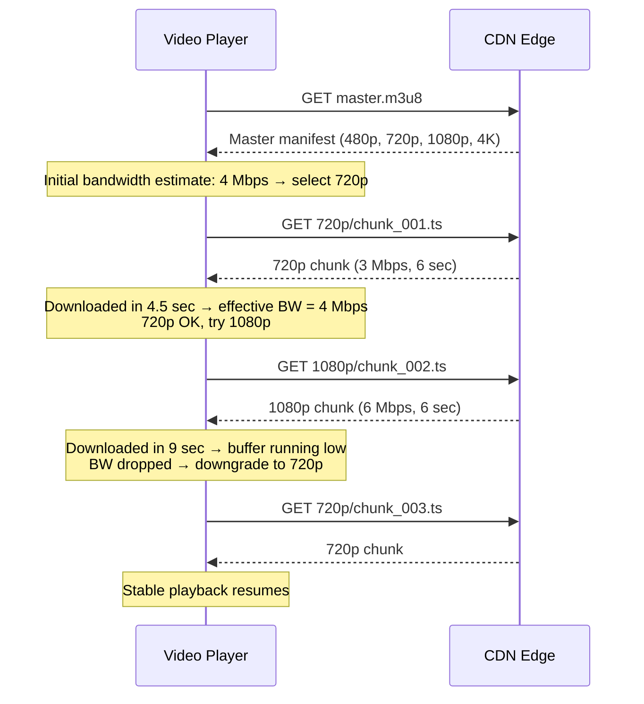

# Video Streaming

## 1. Overview

Video streaming is one of the most bandwidth-intensive engineering challenges in system design. A single 4K video stream consumes ~25 Mbps, and platforms like Netflix and YouTube serve hundreds of millions of concurrent streams globally. The fundamental problem is delivering massive files over unreliable, variable-bandwidth networks while providing an experience that feels instant and seamless.

Modern video delivery has converged on Adaptive Bitrate Streaming (ABS), where the source video is pre-encoded at multiple quality levels, segmented into small chunks, and delivered over standard HTTP. The client dynamically switches quality based on real-time bandwidth measurements, eliminating buffering while maximizing visual quality. This approach replaced both progressive download (wasteful) and proprietary streaming protocols like RTMP (inflexible and not HTTP-native).

## 2. Why It Matters

Video accounts for over 80% of internet traffic. Netflix alone consumes 15% of global downstream bandwidth. The architecture decisions around video encoding, chunking, and delivery directly determine:

- **User experience**: Buffering is the top reason users abandon a video. Adaptive bitrate eliminates most buffering by downgrading quality before the buffer runs dry.
- **Infrastructure cost**: Transcoding a single video into a full resolution ladder (480p through 4K) at multiple codecs costs significant compute. Netflix processes ~140,000 hours of content, requiring massive transcoding farms.
- **CDN bandwidth bills**: Video is the largest line item in CDN costs. Efficient encoding (choosing the right codec, not over-encoding static scenes) directly reduces bandwidth spend.
- **Global reach**: Users in rural India on 2G and users in Seoul on fiber must both have a smooth experience. ABS makes this possible without separate infrastructure.

## 3. Core Concepts

- **Transcoding / Encoding**: Converting raw video into compressed formats at various quality levels. A single upload is transcoded into a "resolution ladder" (e.g., 240p, 360p, 480p, 720p, 1080p, 4K) using codecs like H.264, H.265 (HEVC), VP9, or AV1.
- **Chunking / Segmentation**: Splitting each encoded rendition into small files (typically 2-10 seconds each). Chunks are independently decodable, enabling the client to switch quality at chunk boundaries.
- **Manifest / Index File**: A metadata file (M3U8 for HLS, MPD for DASH) that tells the client where to find each chunk at each quality level. The client reads this file first, then requests chunks sequentially.
- **Adaptive Bitrate Streaming (ABS)**: The client monitors its download speed. If bandwidth drops, it requests the next chunk at a lower quality. If bandwidth improves, it upgrades. Transitions happen at chunk boundaries (every 2-10 seconds).
- **Resolution Ladder**: The set of quality levels a video is available in. Each level has a specific resolution and bitrate. Example: 480p@1.5Mbps, 720p@3Mbps, 1080p@6Mbps, 4K@25Mbps.
- **CDN (Content Delivery Network)**: Edge servers that cache video chunks close to users. A user in Tokyo fetches chunks from a Tokyo edge server, not from the origin in Virginia.
- **DRM (Digital Rights Management)**: Encryption and licensing that prevents unauthorized copying. Widevine (Google), FairPlay (Apple), and PlayReady (Microsoft) are the major DRM systems.

## 4. How It Works

### Video Upload and Processing Pipeline

1. **Upload**: The creator uploads a raw video file. For large files (>100MB), multipart upload is used -- the file is split into ~5MB parts, uploaded in parallel, and reassembled by the storage provider (S3).
2. **Transcoding**: A transcoding farm (e.g., AWS Elemental MediaConvert, FFmpeg clusters) encodes the video into multiple renditions. Each rendition is a different resolution + bitrate combination. This is CPU-intensive and typically parallelized across multiple workers.
3. **Chunking**: Each rendition is segmented into small chunks (typically 2-6 seconds for HLS, 2-10 seconds for DASH). Each chunk is a standalone playable file.
4. **Manifest Generation**: An M3U8 (HLS) or MPD (DASH) manifest file is generated that indexes all chunks across all quality levels, with URLs pointing to the CDN.
5. **CDN Distribution**: Chunks and manifests are pushed to or pulled by CDN edge servers. Popular content is pre-warmed across many edge locations.

### Playback Flow

1. The client requests the manifest file from the CDN.
2. The client parses the manifest, which lists all available quality levels and their chunk URLs.
3. The client estimates current bandwidth (or starts with a low quality for fast start).
4. The client requests the first chunk at the selected quality.
5. After downloading, the client measures the actual download speed (bytes received / time elapsed).
6. If bandwidth is sufficient for a higher quality, the next chunk is requested at a higher bitrate. If bandwidth dropped, the next chunk is requested at a lower bitrate.
7. This cycle continues for every chunk, producing seamless quality adaptation throughout playback.

### ABR Algorithm Strategies

The Adaptive Bitrate algorithm is the intelligence that decides which quality to request for each chunk. Three main strategies exist:

1. **Throughput-based**: Measure the download speed of the last N chunks and select the highest quality whose bitrate is below the measured throughput (with a safety margin, typically 0.8x). Simple but oscillates when bandwidth is volatile.
2. **Buffer-based**: Make decisions based on the player's buffer occupancy. If the buffer is nearly empty, download the lowest quality (prevent buffering). If the buffer is full, download the highest quality (maximize visual experience). Netflix's algorithm (BOLA) is buffer-based.
3. **Hybrid (Model Predictive Control)**: Combines throughput estimation and buffer state with a prediction model. YouTube uses a hybrid approach that factors in throughput history, buffer level, and device capabilities.

### Transcoding Pipeline Details

Transcoding is the most compute-intensive step. A single 2-hour 4K movie requires roughly 8-12 hours of CPU time to encode across all quality levels with H.264. Modern pipelines use:

- **Parallel chunk encoding**: The raw video is split into scenes or fixed-length segments, and each segment is encoded independently across a fleet of machines. Results are stitched back together.
- **Per-title encoding (Netflix)**: Rather than using a fixed bitrate ladder, Netflix analyzes each title's visual complexity. An animated show achieves reference quality at 1.5 Mbps, while an action movie might need 8 Mbps at the same resolution. This optimization saves 20-30% bandwidth.
- **Two-pass encoding**: The first pass analyzes the video to build a complexity map. The second pass allocates bits based on scene complexity -- more bits for complex scenes (fast motion, fine detail), fewer for simple scenes (static shots, black frames).

### HLS M3U8 Structure

A master M3U8 playlist points to variant playlists for each quality level:

```
#EXTM3U
#EXT-X-STREAM-INF:BANDWIDTH=1500000,RESOLUTION=854x480
480p/playlist.m3u8
#EXT-X-STREAM-INF:BANDWIDTH=3000000,RESOLUTION=1280x720
720p/playlist.m3u8
#EXT-X-STREAM-INF:BANDWIDTH=6000000,RESOLUTION=1920x1080
1080p/playlist.m3u8
```

Each variant playlist lists the chunk files:

```
#EXTM3U
#EXT-X-TARGETDURATION:6
#EXTINF:6.0,
chunk_001.ts
#EXTINF:6.0,
chunk_002.ts
#EXTINF:6.0,
chunk_003.ts
```

## 5. Architecture / Flow

### End-to-End Video Streaming Architecture

```mermaid
flowchart TB
    subgraph Upload
        CREATOR[Creator] -->|Raw video| UPLOAD[Upload Service]
        UPLOAD -->|Multipart upload| S3[(Object Storage / S3)]
    end

    subgraph Processing
        S3 -->|Trigger| MQ[Message Queue]
        MQ --> TRANSCODE[Transcoding Farm]
        TRANSCODE -->|480p chunks| S3_OUT[(Processed Storage)]
        TRANSCODE -->|720p chunks| S3_OUT
        TRANSCODE -->|1080p chunks| S3_OUT
        TRANSCODE -->|4K chunks| S3_OUT
        TRANSCODE -->|M3U8 manifest| S3_OUT
    end

    subgraph Delivery
        S3_OUT --> CDN[CDN Edge Servers]
    end

    subgraph Playback
        CLIENT[Video Player] -->|1. GET manifest.m3u8| CDN
        CDN -->|2. Master playlist| CLIENT
        CLIENT -->|3. GET chunk_001.ts at 720p| CDN
        CDN -->|4. Chunk data| CLIENT
        Note over CLIENT: Measure download speed
        CLIENT -->|5. GET chunk_002.ts at 1080p| CDN
        Note over CLIENT: Bandwidth improved → upgrade quality
    end
```

### Adaptive Bitrate Selection



## 6. Types / Variants

### Streaming Protocol Comparison

| Protocol | Transport | Latency | Adaptive | HTTP-native | Use Case |
|----------|-----------|---------|----------|-------------|----------|
| Progressive Download | HTTP | High (full file first) | No | Yes | Legacy; simple static hosting |
| RTMP | TCP (custom) | Low (~1-3s) | No | No | Live ingest (OBS → server) |
| RTSP/RTP | UDP | Very low (~500ms) | No | No | Surveillance, IPTV |
| HLS (Apple) | HTTP | Medium (~6-30s) | Yes | Yes | VOD, live; dominant on Apple devices |
| MPEG-DASH | HTTP | Medium (~6-20s) | Yes | Yes | VOD, live; codec-agnostic, open standard |
| CMAF | HTTP | Low (~2-5s) | Yes | Yes | Low-latency live; unified HLS+DASH |
| WebRTC | UDP/DTLS | Ultra-low (~200ms) | Limited | No | Video calls, sub-second live |

### HLS vs MPEG-DASH

| Feature | HLS | MPEG-DASH |
|---------|-----|-----------|
| Developed by | Apple | MPEG (ISO standard) |
| Container format | MPEG-TS (.ts) or fMP4 (.m4s) | fMP4 (.m4s) |
| Manifest format | M3U8 (text-based playlist) | MPD (XML-based) |
| Codec support | H.264, H.265, limited | Codec-agnostic (H.264, H.265, VP9, AV1) |
| DRM | FairPlay (Apple) + Widevine/PlayReady via fMP4 | Widevine, PlayReady natively |
| Browser support | Native on Safari/iOS; via JS elsewhere | Via JS (dash.js) on all browsers |
| Typical latency (live) | 6-30 seconds | 2-10 seconds |
| Industry adoption | Dominant for iOS/tvOS; widely supported | Dominant for Android/Smart TVs |

### Video Codec Comparison

| Codec | Compression Efficiency | Encoding Speed | Royalty | Adoption |
|-------|----------------------|----------------|---------|----------|
| H.264 (AVC) | Baseline | Fast | Royalty-bearing | Universal (>95% devices) |
| H.265 (HEVC) | ~50% better than H.264 | Slow | Royalty-bearing (complex) | Growing (hardware decode required) |
| VP9 (Google) | Similar to H.265 | Medium | Royalty-free | YouTube, Android, Chrome |
| AV1 (Alliance) | ~30% better than H.265 | Very slow | Royalty-free | Netflix, YouTube (growing) |

## 7. Use Cases

- **Netflix**: Pre-transcodes all content into 1,200+ renditions (multiple resolutions, bitrates, and codecs). Uses a per-title encoding approach where the resolution ladder is optimized for each piece of content -- a static talking-head video needs fewer bits than an action movie at the same resolution. Netflix's Open Connect CDN deploys custom hardware at ISP data centers to serve traffic as close to the user as possible.
- **YouTube**: Handles 500+ hours of video uploaded per minute. Transcoding is distributed across massive GPU farms. YouTube uses VP9 and AV1 codecs to reduce bandwidth costs. The player uses DASH with a custom ABR algorithm that aggressively buffers ahead to minimize rebuffering.
- **Twitch / Live Streaming**: Ingest via RTMP from OBS/streaming software. The ingest server transcodes to HLS with low-latency extensions. Typical glass-to-glass latency is 2-5 seconds with Low-Latency HLS, compared to 15-30 seconds with standard HLS.
- **Zoom / Google Meet**: Uses WebRTC for sub-second latency. Not chunked/manifest-based -- raw media frames are sent via UDP. Quality adapts per-frame based on congestion control (Google's GCC algorithm), not per-chunk as in HLS/DASH.
- **Disney+ / HBO Max**: HLS with FairPlay (iOS) and DASH with Widevine (Android/web). Content is pre-positioned on CDN edge servers before major premieres (pre-warming) to handle millions of concurrent viewers at launch.

## 8. Tradeoffs

| Factor | Progressive Download | RTMP | HLS/DASH (ABS) | WebRTC |
|--------|---------------------|------|-----------------|--------|
| Start time | Slow (download first) | Fast | Fast (first chunk only) | Instant |
| Bandwidth waste | High (downloads unseen content) | Low | Low (only downloads what's watched) | Minimal |
| Quality adaptation | None | None | Automatic per-chunk | Per-frame (congestion control) |
| CDN compatibility | Yes | No (custom protocol) | Yes (standard HTTP) | No (UDP, requires TURN) |
| Latency (live) | N/A | 1-3 seconds | 6-30 seconds (2-5s with LL-HLS) | <500ms |
| Scalability | Excellent (static files) | Limited (stateful connections) | Excellent (stateless HTTP) | Limited (P2P or SFU) |

### Chunk Size Tradeoffs

| Chunk Duration | Start Latency | Quality Switching Speed | HTTP Overhead | Encoding Efficiency |
|---------------|---------------|------------------------|---------------|-------------------|
| 2 seconds | Very low | Fast (every 2s) | High (many small requests) | Lower (less inter-frame compression) |
| 6 seconds | Medium | Medium (every 6s) | Medium | Good |
| 10 seconds | Higher | Slow (every 10s) | Low | Highest (more inter-frame compression) |

## 9. Common Pitfalls

- **Not using adaptive bitrate**: Serving a single quality level guarantees either buffering (on slow connections) or wasted bandwidth (on fast connections). ABS is mandatory for any production video platform.
- **Chunk size too large**: 30-second chunks mean the player cannot adapt quality for 30 seconds. If bandwidth drops mid-chunk, the user experiences buffering. Keep chunks at 2-6 seconds for responsive adaptation.
- **Chunk size too small**: 1-second chunks generate excessive HTTP requests, increasing CDN load and overhead. The per-request overhead (TCP/TLS handshake if not using HTTP/2) can exceed the chunk payload.
- **Transcoding synchronously on upload**: Transcoding is CPU-intensive and can take 1-5x the video duration. Always process asynchronously via a message queue. The user should not wait for transcoding to complete before the upload is acknowledged.
- **Missing CDN pre-warming for premieres**: When Netflix drops a new season or Disney+ launches a Marvel movie, millions of users request the same content simultaneously. If the CDN has not pre-warmed (pre-cached) the content, all requests fall through to the origin, causing a thundering herd.
- **Over-encoding the resolution ladder**: Not every video needs 4K. A screen recording or podcast with a static image can be efficiently encoded at 720p max. Netflix's per-title encoding optimizes the ladder for each piece of content, saving significant bandwidth.
- **Ignoring DRM**: Without encryption, content is trivially downloadable from the CDN (chunks are just HTTP files). Premium content requires DRM (Widevine/FairPlay/PlayReady), which adds complexity to the encoding and playback pipeline.

## 10. Real-World Examples

- **Netflix (Open Connect + Per-Title Encoding)**: Netflix operates its own CDN called Open Connect, with custom hardware deployed inside ISP networks. Content is pre-positioned based on predicted demand. Netflix uses per-title encoding to optimize the bitrate ladder for each title -- an animated show achieves reference quality at much lower bitrates than a live-action sports event. Netflix has been a leading adopter of AV1, achieving 20-30% bandwidth savings over VP9.
- **YouTube (VP9/AV1 + DASH)**: YouTube transcodes uploaded videos into VP9 (and increasingly AV1) at multiple quality levels. The player uses DASH with a proprietary ABR algorithm that factors in buffer occupancy, throughput history, and device capabilities. YouTube processes over 500 hours of video per minute, requiring massive distributed transcoding infrastructure.
- **Twitch (RTMP Ingest + HLS Delivery)**: Streamers send video to Twitch via RTMP. Twitch's ingest servers transcode the stream into multiple HLS renditions in real-time. Viewers receive HLS streams with low-latency extensions, achieving 2-5 second glass-to-glass latency.
- **Hotstar (Cricket + Predictable Spikes)**: During cricket matches, Hotstar handles 25+ million concurrent viewers. The infrastructure is pre-scaled based on match schedules. Content is aggressively cached at CDN edges. A key challenge is the "back-button spike" -- when a key event happens (a wicket falls), millions of users simultaneously navigate back to the home page, requiring the home page service to scale in tandem.

### Live Streaming vs VOD Architecture Differences

| Aspect | Video On Demand (VOD) | Live Streaming |
|--------|----------------------|----------------|
| Transcoding | Offline (batch, before playback) | Real-time (as ingest occurs) |
| Manifest | Static (all chunks known upfront) | Dynamic (new chunks appended every 2-6 seconds) |
| CDN caching | Highly cacheable (immutable chunks) | Short TTL (new chunks every few seconds) |
| Latency tolerance | Not applicable | Critical (2-30 seconds glass-to-glass) |
| Failure impact | Retry/rebuffer (chunk already exists) | Lost frames (cannot be recovered) |
| Storage | All chunks stored permanently | Chunks stored for DVR window, then archived or deleted |

For live streaming, the ingest path is:
1. Streamer sends video via RTMP to the ingest server.
2. Ingest server transcodes in real-time to multiple HLS/DASH renditions.
3. Chunks are pushed to CDN edge servers as they are produced.
4. The manifest file is updated every chunk interval (2-6 seconds) to include the new chunk.
5. Viewers' players poll the manifest for new chunks.

Low-Latency HLS (LL-HLS) and Low-Latency DASH reduce the chunk size and use HTTP/2 push or chunked transfer encoding to deliver partial chunks before they are complete, reducing glass-to-glass latency from 15-30 seconds to 2-5 seconds.

### Cost Optimization Strategies

Video infrastructure is expensive. Key optimization strategies:

- **Lazy transcoding**: Do not transcode all videos into all quality levels immediately. For user-generated content, initially transcode only 480p and 720p. Transcode higher resolutions (1080p, 4K) only if the video receives significant views.
- **Codec migration**: Migrate popular content from H.264 to AV1 to reduce CDN bandwidth by 30%. Keep H.264 for long-tail content that does not justify the re-encoding cost.
- **CDN tiering**: Use premium CDN (Akamai, CloudFront) for popular content and cheaper storage-backed delivery for long-tail content.
- **Client-side caching**: For content the user has previously watched (e.g., rewatching a scene), the player can serve from local storage instead of re-fetching from the CDN.

## 11. Related Concepts

- [CDN](../04-caching/03-cdn.md) -- edge caching of video chunks is the delivery backbone
- [Object Storage](../03-storage/03-object-storage.md) -- S3/GCS stores raw uploads and processed chunks
- [Message Queues](../05-messaging/01-message-queues.md) -- asynchronous transcoding job orchestration
- [Real-Time Protocols](../07-api-design/04-real-time-protocols.md) -- WebRTC for live video; SSE/WS for chat alongside streams
- [Load Balancing](../02-scalability/01-load-balancing.md) -- distributing transcoding jobs and viewer traffic

### Key Metrics for Video Streaming Systems

| Metric | Definition | Target |
|--------|-----------|--------|
| Time to First Byte (TTFB) | Time from play press to first video byte received | <500ms |
| Buffer Ratio | Percentage of playback time spent buffering | <0.5% |
| Rebuffer Rate | Number of rebuffering events per hour | <0.5 |
| Video Start Time | Time from play press to first frame rendered | <2 seconds |
| Bitrate Stability | Frequency of quality switches per minute | <2 switches/min |
| Join Failure Rate | Percentage of play attempts that fail completely | <0.1% |
| ABR Efficiency | Average bitrate delivered / available bandwidth | >70% |

Netflix reports that a 1% increase in rebuffer ratio leads to a measurable increase in user churn. This is why their ABR algorithm (BOLA and its successors) is optimized to minimize rebuffering even at the cost of lower average quality.

## 12. Source Traceability

| Concept | Source |
|---------|--------|
| Progressive download vs RTMP vs ABS evolution | YouTube Report 6 (Section 6) |
| Adaptive bitrate streaming, HLS, MPEG-DASH, chunking | YouTube Report 6 (Section 6) |
| M3U8 index file as lookup table | YouTube Report 6 (Section 6) |
| Why chunks (fast start, quality switching, bandwidth savings) | YouTube Report 6 (Section 6) |
| Predictable vs unpredictable traffic spikes (Netflix, Hotstar) | YouTube Report 4 (Section 6) |
| Pre-signed URLs, multipart uploads for large files | YouTube Report 4 (Section 1) |
| CDN edge caching for static media | YouTube Report 2 (Section 3) |
| System Design Guide: Netflix design | System Design Guide (ch18) |
| Grokking: YouTube/Netflix design | Grokking System Design (YouTube/Netflix chapter) |
