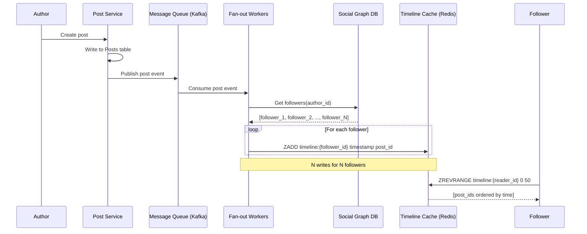
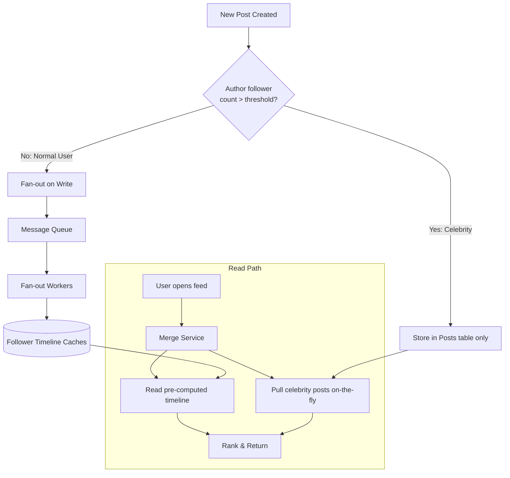

# Fan-Out

## 1. Overview

Fan-out describes the pattern of delivering a single piece of content (a post, a message, a notification) to many recipients. In social systems, when a user publishes a post, the system must make that post appear in the timelines or feeds of every follower. How and when this delivery happens -- at write time or at read time -- is one of the most consequential architectural decisions in social media and notification systems.

The term "fan-out" comes from the shape of the data flow: one input fans out to N outputs. The fan-out factor (the number of recipients per event) determines the system's write amplification, read latency, and infrastructure cost profile.

## 2. Why It Matters

Fan-out is the core scalability bottleneck for any system with a social graph. Twitter processes hundreds of thousands of tweets per second, each of which must reach the timelines of all followers. Facebook's News Feed must aggregate posts from hundreds of friends in real-time. A poorly chosen fan-out strategy will either crush the write path (write amplification) or make reads unacceptably slow (read-time aggregation).

The fan-out decision directly impacts:
- **Timeline latency**: Sub-second delivery vs. multi-second aggregation
- **Infrastructure cost**: Pre-computed storage vs. compute-on-demand
- **Celebrity handling**: A single post from an account with 100M followers can trigger 100M writes
- **System stability**: Write spikes can overwhelm queues, caches, and databases

## 3. Core Concepts

- **Fan-out on Write (Push Model)**: When a user publishes content, the system immediately writes a copy (or pointer) to every follower's pre-computed feed/inbox. Reads are trivially fast (O(1) lookup) because the feed is already assembled.
- **Fan-out on Read (Pull Model)**: The feed is not pre-computed. When a user requests their timeline, the system queries all followed accounts, fetches recent posts, merges and ranks them in real-time. Writes are cheap (single insert) but reads are expensive.
- **Hybrid Fan-out**: Combines both strategies based on the poster's follower count. Normal users use fan-out on write; celebrities use fan-out on read. At read time, the pre-computed feed is merged with freshly pulled celebrity posts.
- **Celebrity Problem (Hot Key)**: An account with millions of followers causes a "write thunderstorm" under fan-out on write. A single tweet from a celebrity can generate 100M+ write operations, overwhelming queues and caches.
- **Write Amplification**: The multiplication factor between one logical write (a post) and the physical writes required to deliver it. A user with 10,000 followers has a write amplification factor of 10,000x under fan-out on write.
- **Pre-computed Flag**: A per-follow relationship flag that determines whether to use push or pull for that specific edge. This enables per-user strategy selection in hybrid systems.

## 4. How It Works

### Fan-Out on Write (Push)

1. User A publishes a post. The post is written to the Posts table.
2. The system looks up all followers of User A from the Social Graph.
3. For each follower, the system appends the post ID (and metadata) to that follower's pre-computed timeline cache (typically Redis sorted sets, ordered by timestamp).
4. When a follower opens their app, the timeline is read directly from cache -- no aggregation needed.

**Write cost**: O(F) where F = number of followers
**Read cost**: O(1) -- single cache read
**Storage**: Each post is referenced F times across all follower timelines

### Fan-Out on Read (Pull)

1. User A publishes a post. The post is written to the Posts table. Done.
2. When Follower B opens their app, the system:
   a. Fetches the list of accounts B follows
   b. For each followed account, retrieves recent posts
   c. Merges all posts by timestamp/rank
   d. Returns the top N results
3. This aggregation runs on every read request.

**Write cost**: O(1) -- single insert
**Read cost**: O(N) where N = number of followed accounts, with merge overhead
**Storage**: Each post stored once

### Hybrid Fan-Out (Twitter/Facebook)

1. User A publishes a post. The system checks a threshold (e.g., follower count > 500,000).
2. If below threshold: **Fan-out on write**. Push the post to all followers' timelines.
3. If above threshold: **Skip fan-out**. Store the post only in the Posts table.
4. When Follower B opens their feed:
   a. Fetch pre-computed timeline from cache (contains posts from normal users)
   b. Fetch recent posts from followed celebrities (fan-out on read)
   c. Merge the two result sets, rank, and return

The hybrid approach bounds write amplification while maintaining fast reads for the common case. Facebook implements this via a `pre_computed` flag on each follow relationship.

### The Math

For a system with:
- 500M users
- Average 200 followers per user
- 500 tweets/sec average

Fan-out on write generates: 500 * 200 = 100,000 cache writes/sec on average. This is manageable. But if a celebrity with 50M followers tweets, a single event generates 50M writes -- a spike that can overwhelm the system for minutes.

### Timeline Cache Management

The pre-computed timeline is typically stored in Redis sorted sets, where the score is the timestamp and the member is the post ID (or a lightweight struct containing post_id, author_id, and a creation timestamp):

```
ZADD timeline:user_456 1679000000 "post:789"
ZADD timeline:user_456 1679000060 "post:790"
```

Reading the timeline: `ZREVRANGE timeline:user_456 0 49` returns the 50 most recent post IDs in O(log N + K) time, where K is the number of items returned.

**Cache size management**: Without a cap, timelines grow unboundedly. Use `ZREMRANGEBYRANK timeline:user_456 0 -(MAX_SIZE+1)` after each insert to keep only the most recent MAX_SIZE entries (e.g., 800). This bounds Redis memory usage per user.

**Inactive user optimization**: Pushing posts to timelines of users who have not logged in for 30+ days wastes writes. The fan-out workers should check a "last active" timestamp before writing. When an inactive user returns, their timeline is rehydrated by running fan-out on read for missed content.

### Fan-Out Worker Architecture

Fan-out is always asynchronous. The post creation endpoint writes to the Posts table and publishes an event to a message queue (Kafka), then immediately returns to the user. Fan-out workers consume from the queue and process the social graph:

1. Worker dequeues a post event.
2. Worker queries the Social Graph service for the author's follower list.
3. For each follower (or batch of followers), the worker issues a `ZADD` to that follower's timeline cache.
4. If the author has more than the celebrity threshold of followers, the worker skips fan-out and marks the post as "pull-only."

Workers are horizontally scalable. The queue is partitioned by author_id so that all fan-out work for a given author is processed sequentially (preventing duplicate writes), but different authors' fan-outs proceed in parallel.

**Failure handling**: If a worker crashes mid-fan-out, the message is redelivered (at-least-once semantics). The timeline cache must be idempotent -- `ZADD` with the same score and member is a no-op, so duplicate writes are safe.

## 5. Architecture / Flow

### Fan-Out on Write



### Hybrid Fan-Out (Twitter Model)



## 6. Types / Variants

| Strategy | Write Cost | Read Cost | Storage | Latency (Read) | Celebrity Handling |
|----------|-----------|-----------|---------|-----------------|-------------------|
| Fan-out on Write (Push) | O(F) per post | O(1) | High (F copies per post) | Ultra-low (cache read) | Catastrophic (write thunderstorm) |
| Fan-out on Read (Pull) | O(1) per post | O(N) per read | Low (1 copy per post) | High (runtime aggregation) | Natural (no write amplification) |
| Hybrid | O(F) for normal, O(1) for celebrities | O(1) + O(C) merge | Medium | Low (cache + small merge) | Handled (pull for celebrities) |

### When to Use Each

| Scenario | Best Strategy | Rationale |
|----------|--------------|-----------|
| Social media (Twitter, Facebook) | Hybrid | Celebrity problem makes pure push infeasible; pure pull is too slow |
| Group messaging (WhatsApp, Slack) | Fan-out on Write | Groups are bounded (max ~1,000 members); write amplification is controlled |
| Notifications (system alerts) | Fan-out on Write | Notification count per event is typically bounded |
| News aggregator (Google News) | Fan-out on Read | Content sources are followed accounts; feed is ranked by relevance, not recency |
| Email (inbox) | Fan-out on Write | Sender delivers to recipient inboxes; read is a simple inbox fetch |

## 7. Use Cases

- **Twitter (Hybrid Fan-Out)**: Twitter's home timeline uses fan-out on write for normal users (pushing tweets to follower timelines in Redis). For accounts with millions of followers (celebrities, politicians), the system uses fan-out on read. When a user opens their timeline, the pre-computed feed is merged with freshly pulled celebrity tweets. This was one of Twitter's most critical architectural decisions, solving the problem of a single Katy Perry tweet (100M+ followers) generating a write thunderstorm.
- **Facebook News Feed (Hybrid with Pre-Computed Flag)**: Facebook stores a `pre_computed` flag on each follow relationship. For normal users, the system uses fan-out on write to pre-generate feeds. For mega-accounts, the system switches to fan-out on read. At request time, both sources are merged and ranked.
- **Facebook Live Comments**: Uses fan-out on write via Redis Pub/Sub. When a comment is posted, it is published to a partitioned topic. SSE servers subscribe to relevant partitions and push comments to connected viewers.
- **Instagram**: Feed generation uses a hybrid model similar to Facebook. The Explore page uses fan-out on read since it aggregates content from accounts the user does not follow.
- **LinkedIn**: Feed uses fan-out on write for first-degree connections. Content from second-degree connections and suggested posts are pulled at read time.

## 8. Tradeoffs

| Factor | Fan-out on Write | Fan-out on Read |
|--------|-----------------|-----------------|
| Read latency | ~1-5ms (cache read) | ~50-500ms (aggregation) |
| Write latency | ~100ms-seconds (depending on F) | ~5ms (single write) |
| Write throughput | Limited by fan-out factor | Excellent (constant) |
| Storage cost | High (N copies of pointers) | Low (single copy) |
| Cache pressure | High (every follower's cache updated) | Low (computed on demand) |
| Freshness | Immediate (pushed on write) | Always fresh (computed on read) |
| Celebrity spike | Dangerous (write thunderstorm) | Naturally handled |
| Complexity | Queue management, retry logic | Merge/rank logic, read-path optimization |

### Write Amplification Numbers

| Author's Follower Count | Cache Writes per Post (Push) | Approximate Latency |
|------------------------|------------------------------|---------------------|
| 200 (average user) | 200 | ~10ms |
| 10,000 (micro-influencer) | 10,000 | ~100ms |
| 1,000,000 (celebrity) | 1,000,000 | ~10-30 seconds |
| 100,000,000 (mega-celebrity) | 100,000,000 | Minutes (infeasible) |

## 9. Common Pitfalls

- **Using pure fan-out on write without a celebrity threshold**: Any system with an unbounded follower model will eventually have a user with millions of followers. A single post from this user will overwhelm the write pipeline. Always implement a follower-count threshold to switch to pull for high-fan-out accounts.
- **Setting the celebrity threshold too low**: If the threshold is too aggressive (e.g., 1,000 followers), too many users are pulled at read time, and read latency degrades for everyone. The threshold should be high enough that only a small fraction of followed accounts require pull (e.g., 500,000+).
- **Not bounding timeline cache size**: Fan-out on write will continuously append to follower timelines. Without a cap (e.g., keep only the latest 800 posts), Redis memory grows unboundedly. Use `ZREMRANGEBYRANK` to evict old entries.
- **Ignoring inactive users**: Pushing posts to timelines of users who have not logged in for months wastes writes. Exclude inactive users from fan-out and rehydrate their timelines on next login.
- **Synchronous fan-out**: Fan-out must be asynchronous (via message queues). Synchronous fan-out blocks the post creation response until all followers are updated, which is unacceptable for accounts with more than a few hundred followers.
- **Not partitioning the fan-out queue**: A single Kafka partition receiving all fan-out work creates a hot partition. Partition by author_id or use random partitioning to distribute the load.

## 10. Real-World Examples

- **Twitter**: The canonical example of hybrid fan-out. Early Twitter used pure fan-out on write, which worked until celebrities joined and a single tweet could generate 300M+ cache writes. The migration to hybrid fan-out (pre-compute for normal users, pull for celebrities, merge at read time) was one of the most significant re-architectures in Twitter's history. Redis sorted sets store each user's timeline, capped at ~800 entries.
- **Facebook News Feed**: Uses a hybrid model with a `pre_computed` flag on follow relationships. The ranking algorithm runs at read time to incorporate recency, engagement signals, and content type. The pre-computed portion provides the candidate set; the ranker provides the final order.
- **Facebook Live Comments**: Fan-out on write via Redis Pub/Sub. The system partitions the Pub/Sub layer using `hash(video_id) % N` so that each SSE server only subscribes to partitions relevant to the videos its connected clients are watching, mitigating the "firehose" effect for viral videos with millions of concurrent viewers.
- **LinkedIn**: Uses a "write-ahead log" approach where fan-out workers process the social graph asynchronously. Content from second-degree connections is pulled at read time and blended with the pre-computed first-degree feed.

### Ranking and Relevance at Read Time

Pre-computed timelines provide the candidate set, but the final order shown to the user is determined by a ranking algorithm at read time. This is critical for engagement:

- **Chronological feed (no ranking)**: Simply show posts in reverse chronological order. This is what early Twitter used. Simple but poor for engagement -- a user who follows 500 accounts will miss important posts buried under a flood of less relevant content.
- **Ranked feed**: A lightweight scoring model runs at read time on the merged candidate set. Features include recency, engagement signals (likes, retweets, comments on this post), affinity (how often the user interacts with the author), and content type preferences. The model produces a score per post, and the feed is sorted by score.
- **Hybrid chronological + ranked**: Show a ranked section at the top ("In case you missed it") followed by a chronological section. This satisfies users who want both relevance and recency.

The ranking model must be fast enough to run on 100-200 candidates within 10-20ms. This is why it is applied after fan-out narrows the candidate set, not on the full post corpus.

### Notification Fan-Out vs Timeline Fan-Out

Fan-out patterns differ between timelines and notifications:

- **Timeline fan-out** is "fire and forget" -- a missed post in the timeline is an acceptable failure. Users scroll and discover content organically.
- **Notification fan-out** requires at-least-once delivery. Push notifications for mentions, DMs, and alerts must reach every recipient's device. This means notifications use a durable message queue with retry logic (SQS with DLQ), while timeline fan-out uses Redis (best-effort, in-memory).

The infrastructure cost difference is significant: timeline fan-out to 10,000 followers is 10,000 Redis writes (fast, cheap). Notification fan-out to 10,000 users is 10,000 push notification API calls to APNs/FCM (slow, rate-limited, costly).

### Measuring Fan-Out Health

Key metrics to monitor in a fan-out system:

| Metric | What It Measures | Alert Threshold |
|--------|-----------------|-----------------|
| Fan-out latency (P99) | Time from post creation to last follower's cache update | >5 seconds |
| Queue depth | Number of unprocessed fan-out events in Kafka | >100,000 messages |
| Cache write throughput | Fan-out writes per second to Redis | >80% of cluster capacity |
| Timeline freshness | Time since last update for active users | >30 seconds |
| Celebrity fan-out duration | Time to complete fan-out for users above the threshold | N/A (should be skipped) |

## 11. Related Concepts

- [Caching](../04-caching/caching.md) -- timeline caches (Redis sorted sets) are the storage layer for fan-out on write
- [Redis](../04-caching/redis.md) -- sorted sets for timeline storage, Pub/Sub for real-time fan-out
- [Message Queues](../05-messaging/message-queues.md) -- Kafka/SQS decouple post creation from asynchronous fan-out processing
- [Real-Time Protocols](../07-api-design/real-time-protocols.md) -- SSE/WebSockets deliver fan-out results to connected clients
- [Sharding](../02-scalability/sharding.md) -- celebrity hot keys require sharding strategies (random suffixes, dedicated shards)

### Hybrid Fan-Out Implementation Checklist

For engineers implementing hybrid fan-out, this checklist captures the key decision points:

1. **Define the celebrity threshold**: Typically 500K-5M followers. This should be configurable and adjustable without code deployment.
2. **Implement the pre-computed flag**: Store a boolean on each follow relationship indicating whether the author's posts are pushed (fan-out on write) or pulled (fan-out on read) for this follower.
3. **Design the merge logic**: At read time, the merge service fetches from two sources: (a) the pre-computed timeline cache and (b) a pull query for followed celebrities' recent posts. These are merged by timestamp and truncated to the requested page size.
4. **Handle threshold crossings**: When a user's follower count crosses the threshold (in either direction), update the pre-computed flag on all their follow relationships. This can be done as a background job, not in real-time.
5. **Implement timeline cache eviction**: Cap each user's timeline at 800-1000 entries. Evict old entries on every fan-out write.
6. **Monitor fan-out queue depth**: Alert if the message queue depth exceeds a threshold, indicating the fan-out workers are falling behind.
7. **Exclude inactive users**: Do not push to users inactive for >30 days. Rehydrate their timeline on next login.
8. **Idempotent writes**: Use Redis `ZADD` (which is idempotent for the same score+member pair) to ensure duplicate messages from the queue do not corrupt the timeline.

## 12. Source Traceability

| Concept | Source |
|---------|--------|
| Fan-out on write vs read, hybrid approach | YouTube Report 2 (Section 4), YouTube Report 3 (Section 6) |
| Twitter hybrid timeline, celebrity problem | YouTube Report 2 (Section 5), YouTube Report 5 (Section 2.1) |
| Facebook News Feed hybrid with pre-computed flag | YouTube Report 5 (Section 4.1) |
| Write amplification, hot shard/celebrity problem | YouTube Report 5 (Section 2.2) |
| Facebook Live Comments, Redis Pub/Sub partitioning | YouTube Report 2 (Section 6) |
| Fan-out on write/read comparison table | YouTube Report 5 (Section 2.1) |
| Acing System Design: News feed fan-out patterns | Acing System Design (ch19) |
| Grokking: Twitter and Instagram feed design | Grokking System Design (Twitter, Instagram chapters) |
