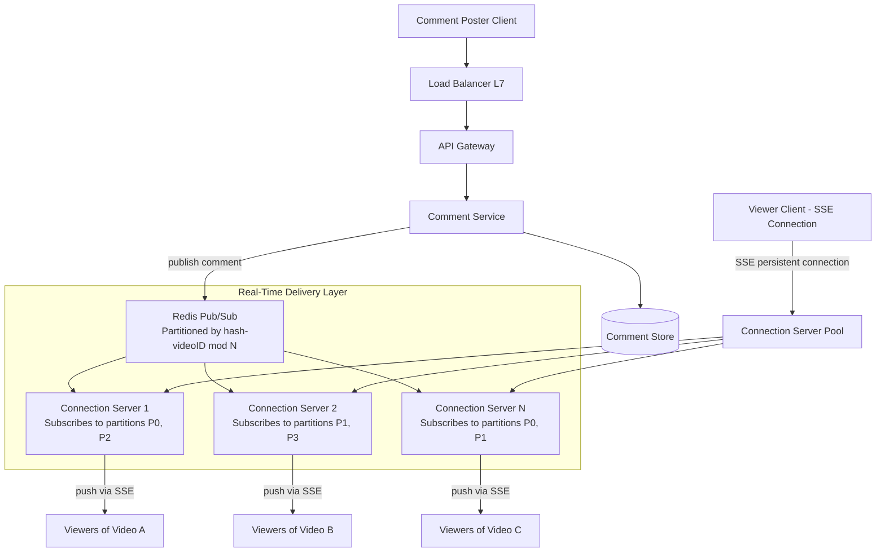
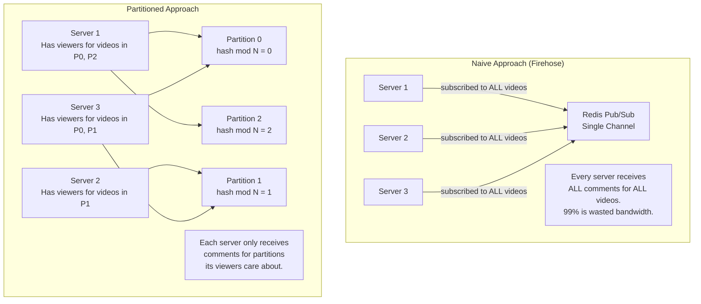

# Facebook Live Comments

## 1. Overview

Facebook Live Comments is a real-time broadcasting system that synchronizes comment streams across millions of concurrent viewers watching the same live video. The defining moment was the "Chewbacca Mom" video, which reached 180 million viewers. The core challenge is delivering every comment to every viewer of a given video within 200 milliseconds, while preventing individual servers from drowning in a global "firehose" of comment traffic. This system is a canonical study in SSE vs. WebSocket trade-offs, partitioned pub/sub, and connection-to-video mapping at scale.

## 2. Requirements

### Functional Requirements
- Users watching a live video can see comments from other viewers in real time.
- Users can post a comment on a live video.
- Comments appear in approximately chronological order across all viewers.
- The system supports hundreds of thousands of concurrent live videos.

### Non-Functional Requirements
- **Scale**: Single popular video can attract 1M+ concurrent viewers; platform-wide: 10M+ concurrent SSE connections.
- **Latency**: Sub-200ms comment delivery from post to display on viewer screens.
- **Availability**: 99.9% uptime. Eventual consistency is acceptable -- missing a comment for a second or seeing comments slightly out of order is tolerable (AP system).
- **Throughput**: A viral live video can generate 10K+ comments per second.
- **Connection efficiency**: Must support millions of persistent connections without exhausting server resources.

## 3. High-Level Architecture



## 4. Core Design Decisions

### SSE Over WebSockets
Live comments are a fundamentally **unidirectional** stream -- the server pushes comments to the client. The client's only "write" action (posting a comment) is a standard HTTP POST, not a persistent bidirectional channel. [Server-Sent Events (SSE)](../07-api-design/04-real-time-protocols.md) is the preferred protocol because:

- SSE operates over standard HTTP, avoiding the protocol-upgrade handshake that WebSockets require.
- Corporate firewalls and proxies that block WebSocket upgrades do not affect SSE connections.
- SSE has built-in reconnection with `Last-Event-ID`, enabling automatic recovery after disconnects.
- For a read-to-write ratio of 1000:1 (millions watching, thousands commenting), SSE's unidirectional model is a natural fit.

WebSockets would add unnecessary complexity for a use case that does not need client-to-server streaming.

### Partitioned Redis Pub/Sub
A naive pub/sub implementation would have every connection server subscribing to every video topic. With 100K+ concurrent live videos, each server would receive a firehose of comments for videos none of its clients are watching. This is the **firehose problem**.

The solution is to partition the [Redis pub/sub](../04-caching/02-redis.md) layer using `hash(videoID) % N`:

- The comment stream is split into N partitions (e.g., 64 or 128).
- Each connection server subscribes **only** to the partitions that contain videos its connected clients are watching.
- When a comment is published, it is routed to partition `hash(videoID) % N`, and only servers subscribed to that partition receive it.

This transforms O(videos) subscriptions into O(partitions) subscriptions per server, dramatically reducing cross-talk.

### Connection-to-Video Mapping
Each connection server maintains an in-memory mapping of `userID -> videoID`. When a viewer opens a live video, the connection server:
1. Registers the user-to-video mapping locally.
2. Determines the partition for that video (`hash(videoID) % N`).
3. Subscribes to that partition in Redis if not already subscribed.
4. Begins forwarding comments from that partition to the viewer's SSE connection.

When the viewer leaves, the mapping is removed. If no viewers on that server are watching videos in a given partition, the server unsubscribes.

## 5. Deep Dives

### 5.1 The Firehose Problem and Partition Strategy



**Partition count selection:**
- Too few partitions (e.g., 4): Each partition contains many videos, so servers still receive irrelevant comments.
- Too many partitions (e.g., 10,000): Connection servers need to manage thousands of subscriptions; Redis pub/sub overhead increases.
- Sweet spot: 64-256 partitions. This balances granularity against subscription management overhead.

**Hot video handling:**
A single viral video (Chewbacca Mom, 180M viewers) concentrates load on one partition. Mitigation strategies:
- **Sub-partitioning**: For detected hot videos, create additional sub-partitions (e.g., `hash(videoID + shard_suffix) % M`).
- **Comment sampling**: For extremely high-volume streams (>50K comments/sec), sample comments on the server side before pushing to clients. No viewer reads every comment at that rate anyway.
- **Dedicated Redis instances**: Route hot video partitions to dedicated, higher-capacity Redis nodes.

### 5.2 Comment Delivery Pipeline

When a viewer posts a comment:

1. **Client sends HTTP POST** to the comment service via the API gateway.
2. **Comment service** validates the comment (length, content moderation), persists it to the comment store, and publishes it to Redis partition `hash(videoID) % N`.
3. **Redis** delivers the message to all connection servers subscribed to that partition.
4. **Connection servers** inspect the incoming comment's videoID, look up which of their connected clients are watching that video, and push the comment to those clients via SSE.
5. **Client renders** the comment in the UI.

The end-to-end latency budget:
- POST to comment service: ~20ms
- Persist + publish to Redis: ~5ms
- Redis to connection server: ~2ms
- Connection server fan-out to SSE clients: ~10ms
- **Total: ~37ms** well within the 200ms target.

### 5.3 Connection Server Scaling

Each connection server holds thousands of persistent SSE connections. Scaling considerations:

- **Connection limits**: A single server can handle ~100K concurrent SSE connections (SSE is lightweight -- each connection is a single HTTP response that stays open). This is significantly better than WebSockets, which require per-connection protocol state.
- **Horizontal scaling**: New connection servers are added behind the [load balancer](../02-scalability/01-load-balancing.md). When a viewer connects, the LB assigns them to the least-loaded server.
- **Connection rebalancing**: When a server is drained (for deployment or scaling down), it closes SSE connections gracefully. Clients auto-reconnect to a new server via the built-in SSE reconnection mechanism.
- **State management**: The user-to-video mapping is local to each connection server (not shared globally). This avoids the need for a distributed connection registry, which would be a bottleneck at this scale.

### 5.4 Handling Viewer Transitions

When a viewer switches from Video A to Video B on the same SSE connection:

1. The client sends a lightweight "switch" message (this can be a new SSE connection or a sideband HTTP request).
2. The connection server updates its local mapping: removes `userID -> videoA`, adds `userID -> videoB`.
3. If no other clients on this server are watching videoA's partition, the server unsubscribes from that partition.
4. If the server is not already subscribed to videoB's partition, it subscribes.
5. Comments for videoB begin flowing to the client.

This dynamic subscription management ensures that connection servers are never subscribed to stale partitions, keeping bandwidth usage minimal.

### 5.5 Back-of-Envelope Estimation

**Connection server fleet sizing:**
- Peak concurrent viewers: 10M (across all live videos).
- Connections per server: 100K (SSE is lightweight -- each is an open HTTP response).
- Servers needed: 10M / 100K = 100 connection servers.

**Comment throughput:**
- Average live video: 100 comments/minute.
- Popular live video: 10K comments/minute.
- Viral live video (Chewbacca Mom level): 100K+ comments/minute.
- Platform-wide peak: 1M comments/minute = ~16,700 comments/sec.

**Redis pub/sub capacity:**
- 64 partitions, each handled by a dedicated Redis channel.
- Average load per partition: 16,700 / 64 = ~261 messages/sec.
- A single Redis instance can handle 100K+ pub/sub messages/sec, so each partition is far from capacity.
- Hot partitions (viral video): may receive 10K+ messages/sec -- still within Redis single-instance capacity.

**Bandwidth per connection server:**
- Each comment: ~500 bytes (user_id, text, metadata, JSON encoding).
- Popular video with 10K viewers on one server: 100 comments/min x 500B x 10K viewers = 500MB/min = 8.3MB/sec outbound.
- With 1,000 videos active on one server: bandwidth scales with the total comment rate, not the viewer count.

### 5.6 Content Moderation Pipeline

Live comments require real-time content moderation to prevent abuse:

1. **Pre-publish check**: Before publishing to Redis, the comment service runs the comment text through a lightweight ML classifier (hate speech, spam, profanity detection). This adds ~10-20ms of latency.
2. **Post-publish review**: Comments that pass the pre-publish check but are flagged by viewers are queued for human review. Flagged comments can be retroactively deleted by publishing a "delete" event to the same Redis channel.
3. **Rate limiting**: Users are limited to N comments per minute per video (e.g., 10 comments/minute) via a [Redis-based rate limiter](../04-caching/02-redis.md). This prevents spam bots from flooding a popular video.
4. **User blocking**: If a user is blocked by the video creator, their comments are filtered server-side before publishing to the channel.

The moderation pipeline adds minimal latency to the happy path (non-flagged comments) while providing safety rails for the community.

## 6. Data Model

### Comment Store (NoSQL -- DynamoDB or Cassandra)
```
{
  comment_id:   UUID (partition key),
  video_id:     UUID (GSI partition key for DynamoDB, or separate table partitioned by video_id),
  user_id:      UUID,
  user_name:    String (denormalized for display performance),
  text:         String (500 chars max),
  created_at:   Timestamp (sort key in GSI),
  is_deleted:   Boolean,
  is_pinned:    Boolean,
  reactions:    Map<String, Integer>  -- e.g., {"like": 5, "love": 2}
}
```

### Video Live State (Redis)
```
Key:   live_video:{video_id}
Hash fields:
  streamer_id:      UUID
  viewer_count:     Integer (approximate, via HyperLogLog)
  comment_count:    Integer (approximate)
  started_at:       Timestamp
  status:           "live" | "ended"
TTL:   None while live; set to 3600 after stream ends
```

### API Endpoints
```
POST /v1/videos/{video_id}/comments
  Headers: Authorization: Bearer <token>
  Body: { text: string }
  Response: { comment_id, created_at }
  Rate limit: 10 comments per minute per user per video

GET /v1/videos/{video_id}/comments?since={event_id}
  Response: { comments: [Comment], last_event_id: string }
  (Used for reconnection: client passes last received event_id)

SSE /v1/videos/{video_id}/stream
  Event format: data: { comment_id, user_id, user_name, text, created_at }
  Reconnection: Client sends Last-Event-ID header on reconnect
```

### Connection Server In-Memory State
```
Map<user_id, video_id>           -- which video each connected user watches
Map<video_id, Set<user_id>>      -- reverse index: which users watch each video (for fan-out)
Map<partition_id, Set<video_id>> -- which videos are in each partition
Set<partition_id>                -- currently subscribed Redis partitions
```

### Viewer Count (Redis HyperLogLog)
```
Key:   viewers:{video_id}
Type:  HyperLogLog
Operation: PFADD viewers:{video_id} {user_id}
Query:     PFCOUNT viewers:{video_id}
Accuracy:  0.81% standard error
Memory:    ~12KB per video regardless of viewer count
```

Using [HyperLogLog](../11-patterns/02-probabilistic-data-structures.md) for viewer counts provides bounded memory usage (~12KB per video) regardless of whether the video has 100 viewers or 100M viewers. The ~1% error is invisible in the UI ("1.2M viewers" vs "1.21M viewers").

### Comment Rate Limiter (Redis)
```
Key:   comment_rate:{user_id}:{video_id}
Type:  String (atomic counter)
TTL:   60 seconds
Operation: INCR + check against threshold (10 per minute)
```

### SSE Event Format
```
SSE stream format (compliant with EventSource API):

id: comment_abc123
event: comment
data: {"comment_id":"abc123","video_id":"vid456","user_id":"u789","user_name":"Jane","text":"Great stream!","created_at":"2024-01-15T14:30:00Z"}

id: comment_abc124
event: comment
data: {"comment_id":"abc124","video_id":"vid456","user_id":"u012","user_name":"Bob","text":"Amazing!","created_at":"2024-01-15T14:30:01Z"}

id: delete_abc123
event: delete
data: {"comment_id":"abc123","video_id":"vid456","reason":"moderation"}
```

The `id` field is critical for reconnection. When a client's SSE connection drops and auto-reconnects, it sends the `Last-Event-ID` header. The connection server uses this to replay any events the client missed during the disconnection window (events are buffered in memory for a short period, typically 60 seconds).

### Comment Replay After Stream Ends
When a live stream ends and becomes a VOD (video on demand), viewers can still see comments:
1. The comment store retains all comments for the video, keyed by `video_id` and sorted by `created_at`.
2. The VOD player synchronizes comments with the video timeline -- comments appear at the timestamp they were originally posted.
3. This is a read-only, non-real-time access pattern served directly from the comment store (Cassandra query: `SELECT * FROM comments WHERE video_id = ? AND created_at BETWEEN ? AND ?`).

### Redis Pub/Sub Channel Naming
```
Channel: live_comments:partition:{partition_id}
Message: { video_id, comment_id, user_id, text, created_at }
```

## 7. Scaling Considerations

### Redis Pub/Sub Scaling
Redis pub/sub is not persistent -- messages are fire-and-forget. For the live comments use case, this is acceptable (a missed comment during a brief network blip is tolerable). If durability were required, [Kafka](../05-messaging/01-message-queues.md) would replace Redis, but at the cost of higher latency (Kafka's batching adds 10-50ms vs. Redis's sub-millisecond delivery).

The Redis pub/sub layer is deployed as a cluster of independent Redis instances, each owning a subset of partitions. Redis Sentinel or Cluster mode provides automatic failover for individual instances.

### Connection Server Fleet
At 100K connections per server, supporting 10M concurrent viewers requires ~100 connection servers. This is a modest fleet for a Meta-scale deployment. Each server is provisioned with high memory (64GB+) and high network bandwidth (10Gbps+) to handle the fan-out of comments to thousands of SSE connections simultaneously.

Connection servers are stateless in the sense that they hold no persistent data -- if a server dies, clients reconnect to another server and resume receiving comments with minimal interruption (SSE auto-reconnect with `Last-Event-ID`).

### Comment Store Scaling
Comments are written at high velocity during popular streams. The comment store is partitioned by `video_id`, ensuring all comments for a single video land on the same [Cassandra](../03-storage/07-cassandra.md) partition. This enables efficient range queries (fetch comments by time range for replay) and avoids cross-partition reads.

After a live stream ends, comments can be archived to cold storage (S3) and removed from the hot store, keeping the active dataset small.

### Geographic Distribution
Connection servers are deployed in multiple regions (US-East, US-West, EU, APAC). Viewers connect to the nearest region via DNS-based [load balancing](../02-scalability/01-load-balancing.md). Comments posted in one region are published to the local Redis instance and replicated to other regions' Redis instances via a cross-region pub/sub bridge. This adds ~50-100ms of latency for cross-region viewers, which is within the 200ms total budget.

### Dynamic Scaling During Viral Events
When a video goes viral, the system auto-scales:
1. [Autoscaling](../02-scalability/02-autoscaling.md) groups detect increased connection counts and spin up additional connection servers.
2. Redis instances for the hot video's partition are scaled vertically (more memory) or the partition is sub-divided.
3. The comment service rate limits per-user comment frequency to prevent the firehose effect even within a single popular video.

## 8. Failure Modes & Mitigations

| Failure | Impact | Mitigation |
|---------|--------|------------|
| Redis pub/sub node failure | Comments stop flowing to connection servers subscribed to affected partitions | Redis Cluster failover; connection servers detect subscription failure and reconnect to replica |
| Connection server crash | All SSE connections on that server are dropped | SSE auto-reconnect on client side; LB routes reconnections to healthy servers |
| Comment service overload | Comments are rejected or delayed | [Rate limiting](../08-resilience/01-rate-limiting.md) per user; back-pressure via message queue between API and comment service |
| Hot video overwhelms a partition | Single partition becomes a bottleneck | Sub-partitioning for detected hot videos; comment sampling for extreme cases |
| Network partition between regions | Viewers in one region see delayed comments | Local Redis instances per region with cross-region replication; eventual consistency is acceptable |

## 9. Key Takeaways

- SSE is the superior protocol for unidirectional server-to-client streams. It avoids the operational complexity of WebSockets (firewall issues, protocol upgrades) while providing built-in reconnection via `Last-Event-ID`.
- Partitioned Redis pub/sub (`hash(videoID) % N`) solves the firehose problem by ensuring each connection server only receives comments relevant to its connected viewers. This is the single most important architectural decision in the system.
- The connection-to-video mapping is local to each server, avoiding the bottleneck of a centralized connection registry. This local-state approach trades global knowledge for simplicity and performance.
- For viral videos, sub-partitioning and comment sampling provide escape valves that prevent a single video from overwhelming the system. The sampling threshold is tunable based on video popularity.
- Eventual consistency is explicitly acceptable for live comments -- users tolerate missing or slightly delayed comments in exchange for a responsive, high-availability experience. This is an AP choice per the [CAP theorem](../01-fundamentals/05-cap-theorem.md).
- The partition count (N) is a tuning parameter that balances granularity against subscription management overhead. 64-256 is a practical range for a platform with 100K+ concurrent live videos.
- Content moderation in real-time requires a lightweight ML classifier on the hot path with a heavier post-publish review pipeline for flagged content. The moderation architecture must not add significant latency to the comment delivery path.
- SSE connections are far cheaper than WebSocket connections in terms of server resources. A single server can handle 100K+ SSE connections versus 10-50K WebSockets, making SSE the clear winner for this read-heavy, write-light use case.
- HyperLogLog provides bounded-memory viewer count estimation (~12KB per video regardless of viewer count). The ~1% error is invisible to users but eliminates the memory scaling problem of exact unique counts.
- Comment replay for VOD (video on demand) is a natural extension of the comment store. Since comments are persisted with timestamps and video IDs, replaying them synchronized with the video timeline is a simple range query against the comment store.
- Dynamic partition subscription management (subscribe/unsubscribe as viewers join/leave) keeps bandwidth usage proportional to actual viewership rather than total platform activity.

### Architectural Lessons

1. **Use SSE for unidirectional streams; reserve WebSocket for bidirectional**: This decision saves significant operational complexity. SSE operates over standard HTTP, works through corporate proxies, and provides built-in reconnection. WebSocket should only be used when the client needs to stream data back to the server (e.g., chat, collaborative editing).

2. **Partition pub/sub channels to avoid the firehose**: Naive "subscribe to everything" approaches fail at scale. Hash-based partitioning (`hash(key) % N`) is the standard technique for ensuring consumers only receive relevant messages.

3. **Local state over global state when possible**: Maintaining the user-to-video mapping locally on each connection server avoids the bottleneck and consistency challenges of a centralized connection registry. The trade-off is that no single service knows the complete mapping, but this global view is not needed for the core functionality.

4. **Fire-and-forget delivery is acceptable for entertainment use cases**: Not every system needs at-least-once or exactly-once delivery. For live comments, the cost of a missed comment (minor UX blip) is far lower than the cost of guaranteed delivery infrastructure (higher latency, more complex architecture).

5. **Viewer counts do not need to be exact**: HyperLogLog provides approximate unique counts with ~1% error in constant memory. For display purposes ("1.2M viewers"), this is indistinguishable from exact counts and avoids the linear memory growth of exact counting.

## 10. Related Concepts

- [Real-time protocols (SSE vs. WebSockets, reconnection semantics)](../07-api-design/04-real-time-protocols.md)
- [Redis (pub/sub, channel partitioning, fire-and-forget delivery)](../04-caching/02-redis.md)
- [Fan-out (server-side fan-out to connected clients)](../11-patterns/01-fan-out.md)
- [Load balancing (distributing SSE connections across servers)](../02-scalability/01-load-balancing.md)
- [Rate limiting (protecting comment service from abuse)](../08-resilience/01-rate-limiting.md)
- [Message queues (Kafka as alternative for durable comment streams)](../05-messaging/01-message-queues.md)
- [CAP theorem (AP choice for live comments)](../01-fundamentals/05-cap-theorem.md)
- [CDN (edge deployment of connection servers)](../04-caching/03-cdn.md)

## 11. Comparison with Related Real-Time Systems

| Aspect | Facebook Live Comments | Twitch Chat | WhatsApp (Group) | Twitter (Timeline) |
|--------|----------------------|-------------|------------------|-------------------|
| Protocol | SSE (unidirectional) | WebSocket (bidirectional) | WebSocket | HTTP polling |
| Delivery guarantee | Fire-and-forget (best effort) | Best effort | At-least-once (inbox) | N/A (cache-based) |
| Fan-out direction | Server -> many viewers | Server -> many viewers | Server -> group members | Write-time cache push |
| Partitioning | hash(videoID) % N | Per-channel | Per-user inbox | Per-user timeline |
| Persistence | Comments stored, delivery not | Chat logs optional | Messages in inbox | Tweets in store |
| Hot event handling | Sub-partitioning, sampling | Chat mode restrictions | Group size limit | Hybrid fan-out |
| Content moderation | Real-time ML + post-review | AutoMod + manual | Report-based | Automated + manual |
| Max concurrent | 180M viewers (Chewbacca Mom) | ~2M per stream | 1,000 per group | N/A |

The key architectural distinction is the **fan-out topology**. Live comments and Twitch chat are one-to-many broadcast problems (one video, many viewers), while WhatsApp is a many-to-many messaging problem (every user both sends and receives). This is why live comments use fire-and-forget pub/sub (lost comments are tolerable) while WhatsApp uses the inbox pattern (lost messages are not).

## 12. Source Traceability

| Section | Source |
|---------|--------|
| SSE over WebSockets for live comments | YouTube Report 2 (Section 4), YouTube Report 3 (Section 5) |
| Partitioned Redis pub/sub, hash(videoID) % N | YouTube Report 2 (Section 6) |
| Connection mapping (userID -> videoID) | YouTube Report 2 (Section 6) |
| Firehose mitigation | YouTube Report 2 (Section 6) |
| Chewbacca Mom scale reference (180M viewers) | YouTube Report 2 (Section 6) |
| AP consistency choice for live systems | YouTube Report 3 (Section 2), YouTube Report 5 (Section 2.4) |
| SSE vs WebSocket firewall issues | YouTube Report 2 (Section 4), YouTube Report 3 (Section 5) |
