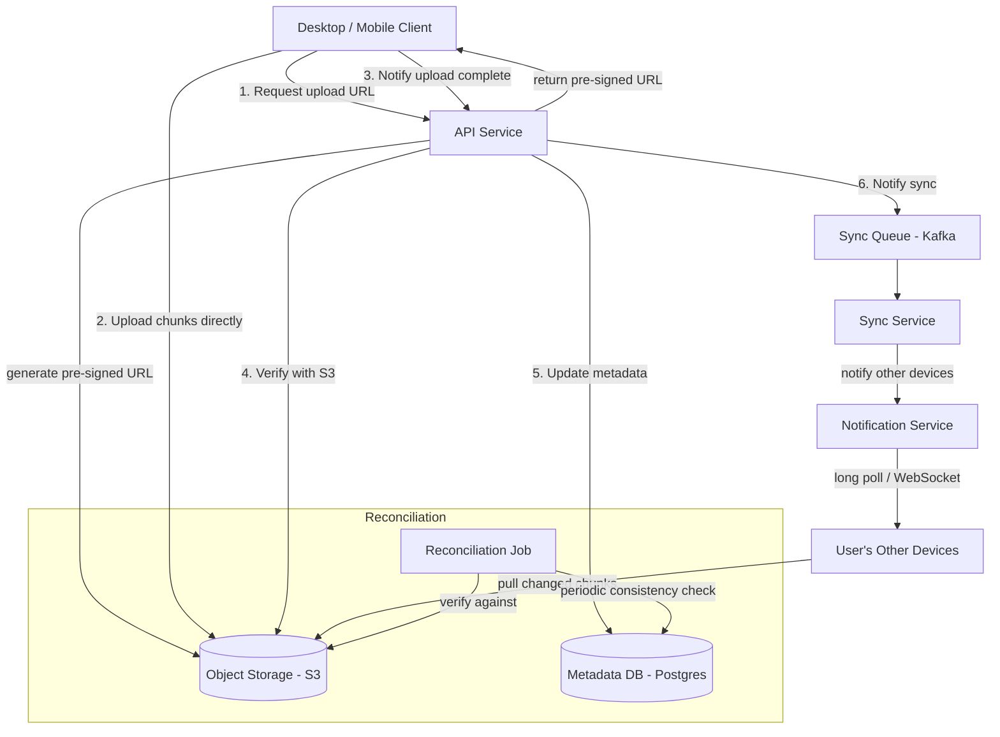
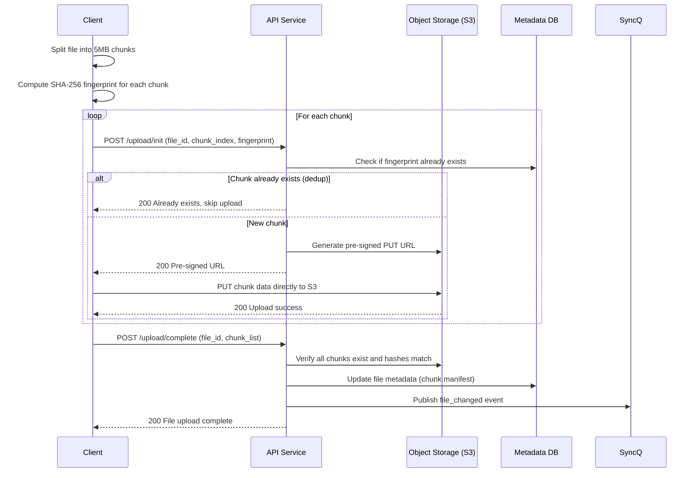

# Dropbox

## 1. Overview

Dropbox is a cloud file storage and synchronization service that allows users to upload files from any device and have those files automatically synchronized across all their devices. The core architectural challenge is handling large files (up to 50GB) efficiently -- standard HTTP uploads fail at this scale due to timeouts, network interruptions, and bandwidth waste. Dropbox solves this with a chunking and fingerprinting strategy: files are split into 5MB parts, each hashed for deduplication, and uploaded directly to object storage via pre-signed URLs. Synchronization is achieved through delta sync (only changed chunks are transferred) and adaptive polling. Dropbox is a canonical study in chunked upload design, content-addressable storage, and multi-device reconciliation.

## 2. Requirements

### Functional Requirements
- Users can upload files from any device (mobile, desktop, web).
- Users can download files to any device.
- Files are automatically synchronized across all of a user's devices.
- Users can share files or folders with other users.
- The system supports offline editing -- changes sync when the device comes back online.
- File versioning: users can revert to previous versions.

### Non-Functional Requirements
- **Scale**: 500M+ registered users, 100M daily active users, 1M+ active connections per minute.
- **File size**: Support files up to 50GB.
- **Storage**: 10PB+ total storage (100M users x 200 files avg x 100KB avg file size = 2PB; larger files push this higher).
- **Latency**: Small file sync in < 5 seconds; large file upload throughput limited only by user bandwidth.
- **Durability**: 11 nines (99.999999999%) -- file loss is unacceptable.
- **Consistency**: ACID semantics for file operations. A file must never be partially synced or corrupted.

## 3. High-Level Architecture



## 4. Core Design Decisions

### Chunking (5MB Parts)
Large files are split into fixed-size chunks (~5MB each) before upload. This provides multiple benefits:
- **Resumability**: If a network interruption occurs during a 10GB upload, only the current chunk needs to be re-uploaded, not the entire file.
- **Parallel upload**: Multiple chunks can be uploaded simultaneously, saturating the user's bandwidth.
- **Deduplication**: Identical chunks across files (or across users) are stored only once, saving storage.
- **Delta sync**: When a file is modified, only the changed chunks are re-uploaded, not the entire file.

This is an application of [multipart uploads](../03-storage/03-object-storage.md), which are native to S3 and similar object storage services.

### Fingerprinting (Content Hashing)
Each chunk is hashed (SHA-256) to produce a fingerprint. This fingerprint serves as the chunk's unique identifier in the object store. Benefits:
- **Content-addressable storage**: Two chunks with identical content produce the same hash, enabling automatic deduplication.
- **Integrity verification**: After upload, the server recomputes the hash and compares it to the client's claimed hash. A mismatch indicates corruption.
- **Delta detection**: The client computes hashes locally for each chunk. On modification, only chunks with changed hashes need re-uploading.

### Pre-signed URLs for Direct Upload
To prevent the API service from becoming a bandwidth bottleneck, the upload flow uses [pre-signed URLs](../03-storage/03-object-storage.md):
1. The client requests an upload URL from the API service.
2. The API service generates a time-limited, authenticated URL for S3.
3. The client uploads the chunk directly to S3, bypassing the API service entirely.

This offloads bandwidth from the application tier to the object storage tier, which is purpose-built for high-throughput data transfer.

### Delta Sync
When a user edits a file, the client:
1. Re-chunks the file and recomputes fingerprints.
2. Compares new fingerprints to the stored fingerprints.
3. Uploads only the chunks with changed fingerprints.
4. Updates the metadata to point to the new chunk list.

For a 1GB file where the user edits a single paragraph, delta sync might upload a single 5MB chunk instead of the full 1GB -- a 200x reduction in transfer.

### Adaptive Polling for Change Notification
Clients need to know when files have changed on the server (edited by another device or shared user). The notification strategy uses adaptive polling:
- **Active user**: Poll every 5-10 seconds (the user is currently editing files).
- **Idle user**: Poll every 30-60 seconds (the device is open but not actively used).
- **Background**: Poll every 5-15 minutes (the app is in the background).

For high-priority sync (e.g., active collaboration), the system can upgrade to [long polling or WebSocket](../07-api-design/04-real-time-protocols.md) connections where the server pushes change notifications immediately.

## 5. Deep Dives

### 5.1 Chunked Upload Pipeline



**Deduplication in action**: If User A and User B both upload the same 100MB PDF, the system stores it once (20 chunks x 5MB). User B's upload is nearly instant because every chunk fingerprint matches an existing chunk. The metadata DB simply records that User B's file points to the same chunk IDs.

### 5.2 Delta Sync in Practice

Consider a 500MB video project file. The user adds a 2-second clip:

1. **Client-side diff**: The client re-chunks the file. Most chunks produce the same fingerprints as before. Perhaps 2 out of 100 chunks have changed fingerprints.
2. **Upload only deltas**: Only the 2 changed chunks (10MB total) are uploaded.
3. **Metadata update**: The file's chunk manifest is updated to point to 98 old chunks + 2 new chunks.
4. **Other device sync**: The other device receives a sync notification, fetches the new chunk manifest, identifies the 2 new chunk IDs, downloads only those 2 chunks, and reconstructs the file locally.

**Net transfer**: 10MB instead of 500MB -- a 50x reduction.

### 5.3 Reconciliation

Despite best efforts, inconsistencies can arise between the client's local state, the metadata DB, and S3:
- A client crashes mid-upload, leaving orphaned chunks in S3.
- A metadata DB write succeeds but the S3 verification fails.
- Network partitions cause two devices to edit the same file simultaneously.

**Reconciliation strategy:**
1. **Periodic server-side job**: A batch job compares the metadata DB against the actual chunks in S3. Orphaned chunks (present in S3 but not referenced by any file) are garbage-collected. Missing chunks (referenced in metadata but absent in S3) trigger alerts.
2. **Client-side reconciliation**: On app startup, the client computes fingerprints for all local files and compares them against the server's metadata. Mismatches trigger re-sync.
3. **Conflict resolution**: When two devices edit the same file concurrently, the system creates a "conflicted copy" (e.g., `report (User A's conflicted copy).docx`) rather than silently overwriting.

### 5.4 "Trust but Verify" Pattern

The API service does **not** blindly trust the client's claim that an upload succeeded. After the client reports upload completion:

1. The API service independently verifies with S3 that all claimed chunks exist and their hashes match.
2. Only after verification does it update the metadata DB.
3. If verification fails (chunk missing or hash mismatch), the API returns an error and the client retries the affected chunks.

This prevents metadata corruption from buggy or malicious clients.

### 5.5 Back-of-Envelope Estimation

**Upload throughput:**
- 100M DAU, 10% upload a file per day = 10M uploads/day
- Average file size: 10MB (mix of small documents and larger media)
- Total upload volume: 10M x 10MB = 100TB/day
- Upload QPS: 10M / 86,400 = ~115 uploads/sec
- With chunking (5MB parts): 115 x 2 chunks avg = ~230 chunk uploads/sec

**Storage growth:**
- 100TB/day of new data
- With deduplication (~30% savings): 70TB/day net new storage
- Annual: 70TB x 365 = ~25PB/year
- S3 cost at $0.023/GB/month: 25PB x $23/TB/month = ~$575K/month (before lifecycle policies)

**Metadata DB sizing:**
- 500M users x 200 files avg = 100B file records
- Each file record: ~500 bytes (metadata + chunk manifest)
- Total metadata: 100B x 500B = 50TB
- Chunk registry: ~10B unique chunks x 100B per record = 1TB
- Postgres sharded across ~50 nodes (1TB per shard)

**Sync notification volume:**
- 100M DAU checking for changes
- Polling interval: 30 seconds average (adaptive)
- QPS: 100M / 30 = ~3.3M polls/sec
- This is the highest-volume endpoint, best served with long polling or WebSocket to reduce unnecessary traffic.

### 5.6 File Versioning

Dropbox supports file versioning (revert to any previous version):

1. Each file has an incrementing `version` number.
2. When a file is updated, the old chunk manifest is preserved as a version entry. The new chunk manifest becomes the current version.
3. Shared chunks between versions are not duplicated -- they are referenced by both manifests.
4. Version metadata: `{ version: integer, chunk_manifest: [fingerprint], updated_at: timestamp, updated_by: user_id }`.
5. Older versions can be cleaned up after a retention period (e.g., 180 days for free users, unlimited for paid).

**Storage efficiency**: If a user edits a 100MB file (20 chunks) and only 1 chunk changes, the new version adds only 5MB of net new storage (the one changed chunk). The other 19 chunks are shared between the old and new versions, costing zero additional storage.

### 5.7 Sharing and Permissions

File sharing introduces multi-user access to the same chunk manifest:

1. **Shared folder model**: User A shares a folder with User B. Both users' file trees reference the same chunk IDs in S3.
2. **Permission levels**: Owner, editor (read/write), viewer (read-only).
3. **Conflict handling**: When two editors modify the same file simultaneously, the system creates a "conflicted copy" for the second writer. The file tree shows both versions, and the users resolve manually.
4. **Notification**: When a shared file is modified, all collaborators receive a sync notification via the Kafka event queue.

## 6. Data Model

### File Metadata (Postgres)
```sql
files:
  file_id        UUID PK
  user_id        UUID FK -> users
  file_name      VARCHAR
  file_path      VARCHAR  -- e.g., /Documents/report.pdf
  file_size      BIGINT
  version        INTEGER
  chunk_manifest JSONB    -- ordered list of chunk fingerprints
  created_at     TIMESTAMP
  updated_at     TIMESTAMP
  is_deleted     BOOLEAN

  INDEX (user_id, file_path)  -- fast lookup by owner + path
```

### Chunk Store (S3)
```
Key:    chunks/{fingerprint_sha256}
Value:  raw chunk bytes (5MB)
Metadata:
  content_length: INTEGER
  upload_timestamp: TIMESTAMP
```

### Chunk Registry (Postgres)
```sql
chunks:
  fingerprint    VARCHAR(64) PK  -- SHA-256 hex
  s3_key         VARCHAR
  size_bytes     INTEGER
  ref_count      INTEGER  -- number of files referencing this chunk
  created_at     TIMESTAMP
```

### Sync Events (Kafka)
```
Topic: file_changes
Key:   user_id
Value: { file_id, event_type: "created"|"updated"|"deleted", chunk_manifest, timestamp }
```

### Version History (Postgres)
```sql
file_versions:
  file_id        UUID FK -> files
  version        INTEGER
  chunk_manifest JSONB
  size_bytes     BIGINT
  updated_by     UUID FK -> users
  updated_at     TIMESTAMP
  PRIMARY KEY (file_id, version)
```

### Sharing Permissions (Postgres)
```sql
shared_files:
  share_id       UUID PK
  file_id        UUID FK -> files  (or folder_id for folder sharing)
  owner_id       UUID FK -> users
  shared_with    UUID FK -> users
  permission     ENUM('viewer', 'editor')
  created_at     TIMESTAMP
  UNIQUE (file_id, shared_with)
```

### Conflict Detection Logic
When the sync service receives an upload completion notification:
1. Check the file's `updated_at` timestamp in the metadata DB.
2. If the incoming update's base version does not match the current version:
   a. Create a "conflicted copy" entry in the files table.
   b. The conflicted copy has a modified file name (e.g., `report (User B's conflicted copy 2024-01-15).docx`).
   c. Both versions coexist in the user's file tree.
   d. The user manually resolves by keeping one or merging both.
3. If versions match, apply the update normally.

## 7. Scaling Considerations

### Object Storage
[S3](../03-storage/03-object-storage.md) scales horizontally and provides 11 nines of durability via erasure coding across racks and data centers. No manual sharding is needed. S3's flat namespace and partition-prefix strategy handle the 10B+ chunk objects without performance degradation.

Chunks are keyed by SHA-256 hash, which provides natural distribution across S3's internal partitions (avoiding the "sequential key" hot-prefix problem that occurs with timestamp-based keys).

### Metadata DB
[Postgres](../03-storage/01-sql-databases.md) is [sharded](../02-scalability/04-sharding.md) by `user_id`. Each user's file metadata lives on a single shard, enabling ACID operations (rename, move, delete) within a single partition. The chunk registry (fingerprint -> S3 key mapping) is a separate table that can be sharded by fingerprint, since it is accessed independently.

Read replicas handle the high volume of metadata reads (file listings, version history) while the primary handles writes (upload completion, file modification).

### Upload Throughput
Pre-signed URLs offload all data transfer to S3. The API service only handles lightweight metadata operations (generate URL, verify upload, update metadata), making it easy to scale horizontally. The API service itself processes ~230 requests/sec for uploads, which is trivial for a fleet of stateless servers behind a [load balancer](../02-scalability/01-load-balancing.md).

### Deduplication Savings
In practice, deduplication reduces storage by 20-40% across the user base. Common sources of deduplication include:
- Corporate environments where thousands of employees receive the same email attachment.
- Shared file folders where the same file appears in multiple users' directories.
- Version history where most chunks remain unchanged between versions.

The chunk registry's `ref_count` field tracks how many file manifests reference each chunk. When `ref_count` drops to zero (all referencing files deleted), the chunk is eligible for garbage collection.

### Notification Scaling
For 100M DAU, the notification service handles ~3.3M polls/sec (adaptive polling) or ~10M concurrent long-poll/WebSocket connections. The notification service architecture is similar to the connection server pattern in [WhatsApp](./03-whatsapp.md) -- stateful connection servers that hold persistent connections and forward change events from Kafka to connected clients.

## 8. Failure Modes & Mitigations

| Failure | Impact | Mitigation |
|---------|--------|------------|
| Upload interrupted mid-chunk | Single chunk fails, not entire file | Client retries only the failed chunk; S3 multipart upload handles partial writes |
| S3 region outage | File downloads fail for affected region | Cross-region replication; CDN edge caches serve recently accessed files |
| Metadata DB failure | Cannot look up file locations | Postgres replication (leader-follower); read replicas serve queries during failover |
| Concurrent edits on two devices | File conflict | Conflict resolution creates "conflicted copy" files; user resolves manually |
| Client reports false upload success | Metadata points to missing chunks | "Trust but verify" pattern catches this; API verifies with S3 before committing metadata |
| Orphaned chunks in S3 | Wasted storage | Reconciliation job garbage-collects unreferenced chunks by checking ref_count |

## 9. Key Takeaways

- Chunking transforms the large-file problem from "upload 50GB or fail" to "upload 10,000 idempotent 5MB parts." Each chunk is independently retryable, uploadable in parallel, and deduplicated.
- Content-addressable storage via fingerprinting enables automatic deduplication across files and users, providing significant storage savings.
- Pre-signed URLs are essential for offloading data transfer from the application tier to the object storage tier. The API service should never be in the data path for large file transfers.
- Delta sync reduces transfer volume by orders of magnitude for incremental edits. The client-side diff (comparing fingerprints) is the key enabler.
- Adaptive polling balances freshness against resource consumption. Active users get near-real-time sync; idle users conserve bandwidth and battery.
- Reconciliation is not optional. Distributed systems inevitably drift, and a periodic consistency check between metadata and actual storage is the safety net.
- "Trust but verify" is a defensive pattern: always confirm the client's claims against the source of truth (S3) before committing metadata.

## 10. Related Concepts

- [Object storage (S3, pre-signed URLs, multipart uploads, erasure coding)](../03-storage/03-object-storage.md)
- [Caching strategies (content-addressable dedup, cache warming)](../04-caching/01-caching.md)
- [Message queues (Kafka for sync event propagation)](../05-messaging/01-message-queues.md)
- [SQL databases (Postgres for ACID file metadata)](../03-storage/01-sql-databases.md)
- [Sharding (user_id-based metadata partitioning)](../02-scalability/04-sharding.md)
- [Real-time protocols (long polling, WebSocket for sync notifications)](../07-api-design/04-real-time-protocols.md)
- [Database replication (leader-follower for metadata DB)](../03-storage/05-database-replication.md)
- [Back-of-envelope estimation (storage, bandwidth calculations)](../01-fundamentals/07-back-of-envelope-estimation.md)

## 11. Comparison with Related Storage Systems

| Aspect | Dropbox | Google Drive | iCloud Drive | OneDrive |
|--------|---------|-------------|-------------|---------|
| Sync mechanism | Delta sync (chunk fingerprinting) | Block-level differential sync | Full file sync (earlier) / delta | Block-level differential |
| Chunk size | ~5MB | ~256KB - 8MB (adaptive) | Variable | 64KB blocks |
| Deduplication | Cross-user + cross-file | Cross-file per user | Per-file versions | Cross-file per user |
| Offline editing | Full (local copy + queue) | Full (local copy + queue) | Limited (selective sync) | Full |
| Conflict resolution | "Conflicted copy" files | "Keep both" or last-write-wins | Last-write-wins | "Conflicted copy" |
| Change notification | Adaptive polling + long poll | Push (Firebase Cloud Messaging) | Push (APNs) | Push (SignalR) |
| Object storage backend | S3 (AWS) + proprietary | GCS (Google Cloud Storage) | iCloud containers | Azure Blob Storage |

Dropbox's key innovation was the content-addressable chunk model with SHA-256 fingerprinting. By making the chunk's address its content hash, deduplication becomes automatic and zero-coordination -- if two users upload the same file, the second upload is essentially free because every chunk fingerprint already exists in the chunk store.

### Architectural Lessons

1. **Content-addressable storage enables automatic deduplication**: By using the SHA-256 hash of content as the storage key, identical chunks are stored exactly once regardless of how many files or users reference them. This is a zero-coordination dedup mechanism -- no central dedup service is needed.

2. **Pre-signed URLs are essential for large file transfers**: The application server should never be in the data path for large file uploads. Pre-signed URLs offload bandwidth to the object storage tier, which is purpose-built for high-throughput data transfer.

3. **Delta sync reduces transfer volume by orders of magnitude**: For incremental edits, only changed chunks need to be transferred. This is the difference between syncing 5MB and syncing 500MB for a single paragraph edit in a large file.

4. **Trust but verify is a defensive pattern**: Never trust client-reported state. Always verify against the source of truth (S3) before committing metadata changes. This prevents metadata corruption from buggy or malicious clients.

### API Endpoints

```
POST /v1/files/upload/init
  Body: { file_path, file_size, chunk_count, chunk_manifests: [{ index, fingerprint, size }] }
  Response: { file_id, upload_urls: [{ chunk_index, pre_signed_url, already_exists: boolean }] }

POST /v1/files/upload/complete
  Body: { file_id, chunk_manifest: [fingerprint] }
  Response: { version, updated_at }

GET /v1/files/{file_id}/metadata
  Response: { file_id, file_name, file_path, size, version, updated_at }

GET /v1/files/{file_id}/download
  Response: { download_urls: [{ chunk_index, pre_signed_url }] }

GET /v1/sync/changes?cursor={cursor}
  Response: { changes: [{ file_id, event_type, version }], new_cursor }

POST /v1/files/{file_id}/share
  Body: { shared_with: [{ user_id, permission: "editor" | "viewer" }] }
  Response: { share_id }
```

## 12. Source Traceability

| Section | Source |
|---------|--------|
| Chunking (5MB parts), fingerprinting, pre-signed URLs | YouTube Report 8 (Section 7), YouTube Report 4 (Section 1: Pre-signed URLs, Multipart Uploads) |
| Delta sync, adaptive polling | YouTube Report 8 (Section 7) |
| Reconciliation and "trust but verify" | YouTube Report 8 (Section 7) |
| Capacity estimation (10PB, 100M DAU) | Grokking Ch. 72 (Dropbox Component Design) |
| Object storage mechanics (flat namespaces, erasure coding) | YouTube Report 4 (Section 1: Object Storage) |
| Sync service and notification patterns | Grokking Ch. 72, YouTube Report 8 (Section 7) |
