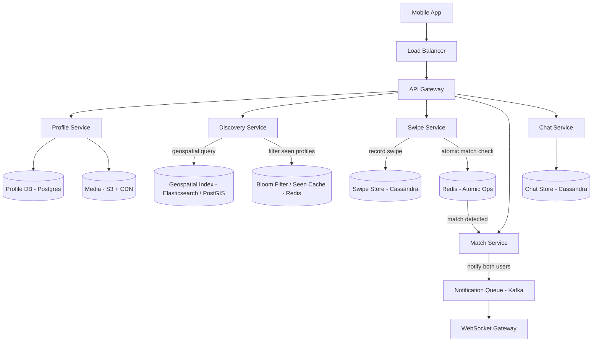
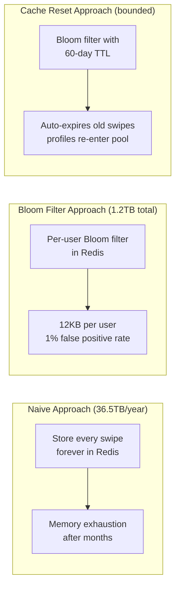
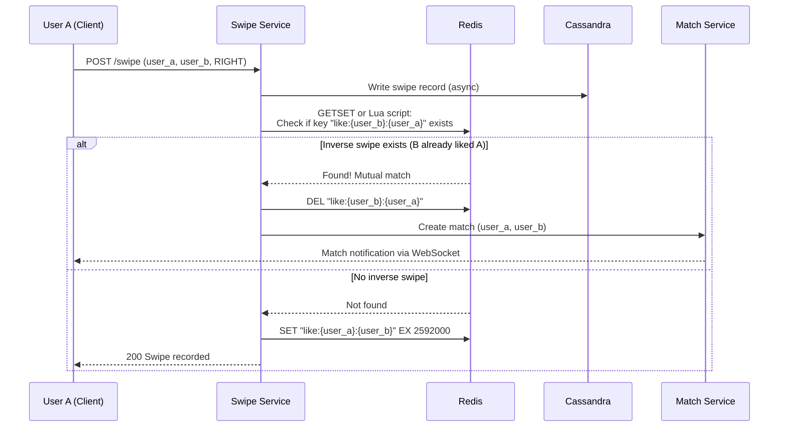

# Tinder

## 1. Overview

Tinder is a location-based dating application where users swipe through nearby profiles, indicating interest (right swipe) or disinterest (left swipe). When two users both swipe right on each other, a "match" is created. The system faces three intertwined challenges: efficient 2D geospatial querying to find nearby users, atomic match detection when concurrent swipes occur, and a staggering cache growth problem -- with 100M+ users swiping daily, the "already seen" profile set grows at a rate that could reach 36.5TB per year if naively stored. Tinder is a canonical study in geospatial indexing, atomic operations in memory stores, and pragmatic memory optimization through bloom filters and business-driven cache resets.

## 2. Requirements

### Functional Requirements
- Users can create and edit a profile (photos, bio, age, preferences).
- Users can set a search radius and age/gender filters.
- Users are shown nearby profiles they have not previously swiped on.
- Users can swipe right (like) or left (pass) on a profile.
- When two users mutually swipe right, a match is created and both are notified instantly.
- Users can view their matches and chat with matched users.

### Non-Functional Requirements
- **Scale**: 100M+ daily active users, 2B+ swipes per day.
- **Latency**: Profile fetch in < 200ms (p99); match notification in < 500ms.
- **Availability**: 99.99% uptime. Swiping must never feel "broken."
- **Consistency**: Eventual consistency for profile discovery is acceptable. Match detection requires strong consistency -- a mutual swipe must always produce a match.
- **Storage**: Swipe history grows at approximately 100M users x 100 swipes/day x 100 bytes = ~1TB/day. Annualized: ~365TB without pruning.

## 3. High-Level Architecture



## 4. Core Design Decisions

### Geospatial Indexing for Proximity Search
Standard 1D B-tree indexes in SQL databases fail for 2D proximity queries because latitude and longitude are independent axes. Tinder employs [geospatial indexing](../11-patterns/06-geospatial-indexing.md) using one of two approaches:
- **Quad-trees in Elasticsearch**: Recursively subdivides space into quadrants, creating denser grids in populated areas (downtown Manhattan) and sparse grids in low-density areas.
- **R-trees in PostGIS**: Groups nearby locations into bounding boxes, enabling efficient "find all profiles within 50km" queries.

Both approaches reduce the search space from millions of profiles to thousands in a single indexed lookup.

### Cassandra for Swipe Storage
Swipes are high-velocity, append-only writes (2B+/day). [Cassandra](../03-storage/07-cassandra.md) is purpose-built for this pattern -- its append-only commit log + MemTable + SSTable architecture avoids the disk-seek overhead of relational databases. The partition key is `user_id`, with the clustering key being `swiped_user_id`, enabling efficient lookups like "did User A already swipe on User B?"

### Atomic Match Detection in Redis
To prevent race conditions during simultaneous mutual swipes, Tinder uses atomic operations in [Redis](../04-caching/02-redis.md). When User A swipes right on User B, the swipe service atomically checks if B has already swiped right on A. Because Redis is single-threaded, the check-and-write operation is inherently serialized, eliminating the race condition that would occur with a distributed NoSQL read-then-write.

### Bloom Filters for Repeat Profile Prevention
To avoid showing users profiles they have already swiped on, the system maintains a per-user [Bloom filter](../11-patterns/02-probabilistic-data-structures.md) in Redis. A Bloom filter returns "definitely not seen" or "probably seen" -- the false positive rate means a small percentage of valid profiles are incorrectly skipped, but no already-seen profile is ever reshown. This is a massive space saving compared to storing the complete set of swiped user IDs.

## 5. Deep Dives

### 5.1 The 36.5TB Cache Problem

This is the defining staff-level challenge of the Tinder design.

**The math:**
- 100M daily active users
- Average 100 swipes per day per user
- Each swipe record: ~100 bytes (two UUIDs + timestamp)
- Daily: 100M x 100 x 100B = 1TB/day
- Yearly: 365TB

Storing the complete "seen" history for all users indefinitely is economically and operationally infeasible.

**Solution options:**

1. **Bloom filters**: A Bloom filter with a 1% false positive rate uses approximately 9.6 bits per element. For a user who has swiped 10,000 times: 9.6 x 10,000 = 96,000 bits = 12KB per user. For 100M users: 1.2TB total -- a 300x reduction from storing raw swipe pairs. However, Bloom filters cannot be "un-set" (no deletion), so they grow monotonically.

2. **Business-driven cache reset (recommended)**: The pragmatic solution is to relax the business requirement. Reset the "seen" cache every 30-90 days. After 60 days, profiles re-enter the discovery pool. This approach:
   - Keeps the Bloom filter size bounded (each user only tracks ~60 days of swipes)
   - Aligns with real user behavior (preferences change, profiles are updated)
   - Eliminates the need for complex eviction logic
   - Reduces infrastructure costs by orders of magnitude



### 5.2 Atomic Swipe and Match Detection



**Why Redis for match detection?**

The critical operation is: "At the moment User A swipes right on User B, does a record exist showing B swiped right on A?" This is a classic check-and-act pattern that is prone to race conditions in distributed databases with eventual consistency. Cassandra, for instance, could return stale data during a read, causing a missed match.

Redis solves this because:
- **Single-threaded execution**: The check and write are atomic without explicit locking.
- **Sub-millisecond latency**: Match detection must be instantaneous for the user experience.
- **TTL**: The `like:{a}:{b}` key has a TTL (e.g., 30 days). If User B does not swipe right within 30 days, the like expires, consistent with the cache reset strategy.

### 5.3 Discovery Pipeline

When a user opens the app:

1. **Location update**: The client sends the user's current GPS coordinates to the profile service, which updates the geospatial index.
2. **Candidate generation**: The discovery service queries the geospatial index for users within the configured radius, filtered by age and gender preferences. This returns a set of ~1,000 candidate user IDs.
3. **Seen filtering**: Each candidate is checked against the user's Bloom filter in Redis. "Probably seen" candidates are removed.
4. **Ranking**: Remaining candidates are ranked by a scoring algorithm (profile completeness, activity recency, mutual interest signals from the [recommendation engine](../11-patterns/03-recommendation-engines.md)).
5. **Batch delivery**: The top 50-100 profiles are hydrated (photos, bio) and delivered to the client for local caching.

### 5.4 Profile Ranking and the Elo System

Tinder's ranking algorithm is a simplified version of a [recommendation engine](../11-patterns/03-recommendation-engines.md):

- **Elo-like scoring**: Each user has a desirability score influenced by the ratio of right-to-left swipes they receive and the scores of users who swipe on them. If a high-score user swipes right on you, your score increases more than if a low-score user does.
- **Mutual matching**: Users with similar scores are shown to each other, improving match rates and reducing the frustration of asymmetric attractiveness perception.
- **Freshness boost**: New or recently active profiles receive a temporary ranking boost to ensure visibility and encourage engagement.
- **Diversity injection**: The algorithm intentionally mixes in profiles from different score tiers to prevent "filter bubbles" where a user only sees people with identical scores.

This scoring is computed offline in batch and stored as a field on the profile, not computed at query time.

### 5.5 Back-of-Envelope Estimation

**Swipe storage:**
- 100M DAU x 100 swipes/day = 10B swipes/day
- Each swipe record: user_id (16B) + swiped_user_id (16B) + direction (1B) + timestamp (8B) = 41B, rounded to ~50B with overhead
- Daily: 10B x 50B = 500GB/day
- Monthly: ~15TB/month
- With Cassandra replication factor 3: ~45TB/month

**Bloom filter sizing (per user):**
- Average user swipes on 10,000 profiles over 60 days
- Bloom filter at 1% FP rate: 9.6 bits/element x 10,000 = 96,000 bits = 12KB
- For 100M users: 100M x 12KB = 1.2TB
- Redis cluster with 100 nodes: ~12GB per node -- easily manageable

**Geospatial query volume:**
- 100M DAU x 10 feed refreshes/day = 1B geospatial queries/day
- QPS: 1B / 86,400 = ~11,500 QPS
- Each query returns ~1,000 candidates from the geospatial index
- After Bloom filter dedup and ranking: ~100 profiles delivered per batch

**Match detection volume:**
- Assume 30% of swipes are right-swipes: 10B x 0.3 = 3B right-swipes/day
- Each right-swipe triggers one Redis GET (check inverse) + one Redis SET (store the like)
- Redis operations: 6B/day = ~70K ops/sec -- well within a Redis cluster's capacity

### 5.6 Multi-Device and Session Management

Users may access Tinder from multiple devices (phone and tablet). The system handles this by:

1. **Single active session**: Only one device can have an active swiping session at a time. Opening the app on a second device pauses the first.
2. **Centralized swipe state**: All swipe records and Bloom filter updates are server-side. Device switching does not cause data inconsistencies.
3. **Push notifications**: Match notifications are sent to all registered devices via the notification queue, ensuring the user sees the match regardless of which device they used for swiping.

## 6. Data Model

### Profile (Postgres)
```sql
profiles:
  user_id        UUID PK
  display_name   VARCHAR
  age            INTEGER
  gender         ENUM
  bio            TEXT
  photo_urls     TEXT[]
  location       GEOGRAPHY(POINT, 4326)
  elo_score      FLOAT
  last_active    TIMESTAMP
  discovery_prefs JSONB  -- { radius_km, age_min, age_max, gender_pref }
```

### Swipe Store (Cassandra)
```
partition_key:  user_id
clustering_key: swiped_user_id
columns:
  direction:    ENUM('left', 'right')
  created_at:   TIMESTAMP
```

### Match Table (Postgres)
```sql
matches:
  match_id     UUID PK
  user_a_id    UUID FK
  user_b_id    UUID FK
  created_at   TIMESTAMP
  UNIQUE (user_a_id, user_b_id)
```

### Redis Structures
```
Bloom filter:  seen:{user_id}    (probabilistic set of swiped user IDs)
Like key:      like:{liker_id}:{liked_id}  TTL 30 days
```

### Chat Store (Cassandra)
```
partition_key:   match_id
clustering_key:  message_id (TIMEUUID)
columns:
  sender_id:     UUID
  text:          TEXT (encrypted)
  created_at:    TIMESTAMP
  read:          BOOLEAN
```

### Notification Queue (Kafka)
```
Topic: match_notifications
Key:   user_id
Value: {
  match_id:       UUID,
  matched_user_id: UUID,
  matched_at:     timestamp,
  notification_type: "new_match" | "new_message"
}
```

### Discovery Pipeline Sequence

The complete discovery pipeline when a user opens the app:

```
1. Client sends GET /v1/discovery with current lat/lng
2. Discovery service receives request
3. Query geospatial index: "profiles within 50km, age 25-35, gender female"
   -> Returns ~2,000 candidate user IDs
4. Filter through Bloom filter: remove already-swiped profiles
   -> ~1,200 candidates remain (after ~40% are filtered as "seen")
5. Apply preference compatibility: remove profiles whose preferences
   exclude the requesting user (e.g., they seek a different age range)
   -> ~800 candidates remain
6. Rank by Elo score + freshness boost + diversity injection
   -> Top 100 selected
7. Hydrate: batch-fetch profiles (photos, bio) from profile DB + CDN URLs
8. Return batch to client for local caching and swiping
```

The client-side cache holds ~100 profiles. When the cache drops below 20 profiles, the client prefetches another batch to ensure smooth swiping without visible loading delays.

### Operational Considerations

**Bloom filter rebuild on corruption:**
If a user's Bloom filter becomes corrupted (Redis node failure, memory error), it can be rebuilt from the Cassandra swipe history:
1. Query `SELECT swiped_user_id FROM swipes WHERE user_id = ? AND created_at > ?` for the last 60 days.
2. Insert each swiped user ID into a new Bloom filter.
3. Replace the corrupted filter in Redis.
This rebuild takes ~1-5 seconds per user (depending on swipe count) and can be performed lazily on the next discovery request.

**Geospatial index refresh latency:**
When a user moves to a new city, their geospatial index entry must be updated. The update propagates through Kafka to the geospatial index with a delay of 1-5 seconds. During this window, the user might still appear in discovery results for their previous location. This is acceptable -- the user has not teleported, and the few-second lag is invisible in practice.

**Photo moderation pipeline:**
Profile photos pass through a moderation pipeline before becoming visible:
1. User uploads photo via [pre-signed URL](../03-storage/03-object-storage.md) to S3.
2. An async moderation service (ML classifier) checks for nudity, violence, and policy violations.
3. Approved photos are marked as "visible" in the profile DB.
4. Rejected photos are flagged, and the user is notified with a reason.
5. The CDN only serves photos marked as "visible," preventing unapproved content from appearing in discovery.

## 7. Scaling Considerations

### Geospatial Index Scaling
The geospatial index is [sharded](../02-scalability/04-sharding.md) by geographic region (geohash prefix). Dense urban areas (Manhattan, Tokyo) have more shards than sparse rural areas. This mirrors the quad-tree's dynamic splitting behavior -- more resolution where more users exist.

The index must handle both high read volume (discovery queries) and high write volume (location updates). Reads and writes are separated: writes update a primary geospatial store, while reads query a replicated read-optimized copy. This is an application of [CQRS](../05-messaging/04-cqrs.md) at the data layer.

### Swipe Write Throughput
[Cassandra's](../03-storage/07-cassandra.md) append-only architecture handles 10B+ swipes/day across a modest cluster. Writes hit the commit log and MemTable and return immediately -- no disk seeks on the write path. Cassandra's tunable consistency is set to `ONE` for swipe writes (fast, best-effort) since swipe data loss for a single swipe is a minor UX issue, not a critical failure.

Compaction must be monitored carefully. With 10B+ writes/day, SSTable accumulation is rapid. Time-windowed compaction strategy works well here, as older swipes (beyond the 60-day reset window) can be efficiently dropped during compaction.

### Redis Memory Management
Bloom filters use 12KB per user. For 100M users: 1.2TB of Redis memory. This is distributed across a Redis cluster using [consistent hashing](../02-scalability/03-consistent-hashing.md) across 16,384 slots. With 100 Redis nodes, each node holds ~12GB of Bloom filter data -- comfortably within typical Redis instance memory (64-128GB).

The `like:{a}:{b}` keys for match detection are lighter: each key is ~50 bytes with a 30-day TTL. At 3B right-swipes/day with 30-day retention: ~90B keys x 50B = ~4.5TB. This requires careful Redis capacity planning and may benefit from a dedicated cluster separate from the Bloom filter cluster.

### Photo Delivery
Profile photos are served via [CDN](../04-caching/03-cdn.md). With 100M users x 5 photos avg = 500M photos, CDN edge caching is essential. Photos are uploaded via [pre-signed URLs](../03-storage/03-object-storage.md) to S3 and served through CloudFront or equivalent. The CDN cache hit ratio for frequently viewed profiles (those with high Elo scores shown to many users) approaches 99%.

### Location Updates
Users update their location on every app open and periodically while browsing. At 100M DAU x ~10 location updates/day = 1B location writes/day (~11.5K writes/sec). These are batched and written to the geospatial index via a [Kafka](../05-messaging/01-message-queues.md) queue, smoothing out spikes when millions of users open the app simultaneously (e.g., evening commute hours).

## 8. Failure Modes & Mitigations

| Failure | Impact | Mitigation |
|---------|--------|------------|
| Redis match node failure | Missed matches during failover | Redis Cluster replication; Cassandra swipe records serve as fallback for reconciliation |
| Bloom filter corruption | Users re-see already-swiped profiles | Bloom filters are rebuilt from Cassandra swipe history; brief re-show is a minor UX issue |
| Geospatial index lag | Stale location data in discovery | Users are shown slightly out-of-date results; acceptable since people don't teleport |
| Cassandra write timeout | Swipe not persisted | At-least-once delivery via retry; Redis still captures the like key for match detection |
| CDN origin failure | Photos fail to load | Multiple CDN providers; fallback to lower-resolution cached versions |

## 9. Key Takeaways

- Geospatial problems require specialized indexes (quad-trees, R-trees, geohashes) -- standard B-tree indexes on latitude/longitude fail for 2D proximity queries.
- Atomic operations in Redis solve the mutual-swipe race condition elegantly because of single-threaded execution semantics.
- The 36.5TB cache problem is best solved through a business-driven cache reset (30-90 day TTL) rather than pure engineering. Bloom filters reduce memory further but the business solution is the pragmatic staff-level recommendation.
- Cassandra's append-only architecture is the natural fit for high-velocity swipe writes (2B+/day).
- The discovery pipeline is a simplified recommendation engine: candidate generation (geospatial), filtering (bloom filter), ranking (elo score), delivery (batch hydration).

## 10. Related Concepts

- [Geospatial indexing (geohashing, quad-trees, R-trees)](../11-patterns/06-geospatial-indexing.md)
- [Redis (atomic ops, bloom filter storage, TTL, pub/sub)](../04-caching/02-redis.md)
- [Probabilistic data structures (Bloom filters)](../11-patterns/02-probabilistic-data-structures.md)
- [Cassandra (append-only writes, partition key, clustering key)](../03-storage/07-cassandra.md)
- [Recommendation engines (candidate generation, ranking)](../11-patterns/03-recommendation-engines.md)
- [CDN (photo delivery at scale)](../04-caching/03-cdn.md)
- [Consistent hashing (Redis cluster, geospatial shard distribution)](../02-scalability/03-consistent-hashing.md)
- [Sharding (geographic partitioning)](../02-scalability/04-sharding.md)
- [Message queues (async swipe processing)](../05-messaging/01-message-queues.md)
- [Real-time protocols (WebSocket for match notifications)](../07-api-design/04-real-time-protocols.md)

## 11. Comparison with Related Systems

| Aspect | Tinder | Uber (Driver Matching) | Yelp (Proximity Search) |
|--------|--------|----------------------|------------------------|
| Geospatial index | Quad-tree / R-tree | Geohash + Redis | Geohash + quad-tree |
| Update frequency | On app open (~10/day) | Continuous (every few seconds) | On business creation (rare) |
| Query pattern | "Find profiles within radius" | "Find nearest driver" | "Find restaurants nearby" |
| Matching logic | Mutual swipe (bidirectional) | Assignment (unidirectional) | N/A (browse only) |
| Dedup requirement | Avoid repeat profiles (Bloom filter) | N/A | N/A |
| Ranking | Elo-based desirability | ETA and surge pricing | Review score and distance |
| Write volume | 2B+ swipes/day | 10M+ location updates/day | Minimal |

The key distinction is that Tinder's geospatial queries are **bidirectional** -- both users must be within each other's radius and preferences for a profile to appear. This doubles the filter complexity compared to Yelp's unidirectional "show me nearby restaurants" query.

### API Endpoints

```
GET /v1/discovery?lat={lat}&lng={lng}&radius_km={radius}
  Response: { profiles: [{ user_id, display_name, age, bio, photo_urls, distance_km }] }
  Returns batch of 50-100 pre-ranked, unseen profiles

POST /v1/swipe
  Body: { target_user_id, direction: "left" | "right" }
  Response: { match: boolean, match_id: UUID? }

GET /v1/matches?cursor={cursor}
  Response: { matches: [{ match_id, user_id, display_name, matched_at }] }

PUT /v1/profile
  Body: { display_name, bio, age, photo_urls, discovery_prefs }
  Response: { updated: true }

POST /v1/location
  Body: { lat, lng }
  Response: { updated: true }
```

## 12. Source Traceability

| Section | Source |
|---------|--------|
| Geospatial optimization, quad-trees, PostGIS | YouTube Report 2 (Section 8), YouTube Report 8 (Section 2: Geospatial Indexing) |
| Reciprocal swipe atomic logic in Redis | YouTube Report 2 (Section 8), YouTube Report 3 (Section 6) |
| 36.5TB cache problem, Bloom filter, 30-90 day reset | YouTube Report 2 (Section 8), YouTube Report 3 (Section 6) |
| Cassandra for swipe writes | YouTube Report 2 (Section 3), YouTube Report 3 (Section 4) |
| Bloom filter mechanics | YouTube Report 8 (Section 6), YouTube Report 6 (Section 4) |
| Recommendation engine pipeline | YouTube Report 4 (Section 4) |
