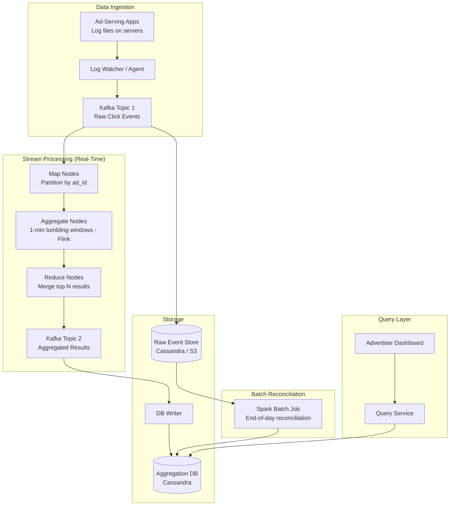
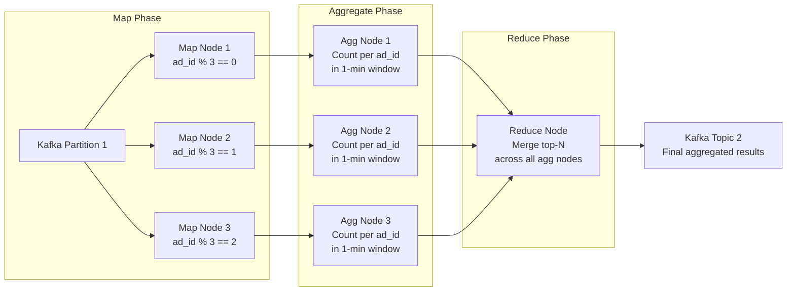

# Ad Click Aggregator

## 1. Overview

An ad click aggregator is a real-time analytics system that counts and aggregates billions of ad click events per day for billing, reporting, and campaign optimization. At Facebook or Google scale, the system processes ~10,000 QPS sustained (50,000 peak) of click events and must produce aggregated counts within minutes for advertiser dashboards. The core challenges are achieving end-to-end exactly-once processing (because aggregation errors directly translate to billing discrepancies worth millions of dollars), handling late-arriving events, and reconciling real-time stream results against batch-computed ground truth. This system is a canonical study in Lambda/Kappa architecture, Flink windowed aggregation, Spark batch reconciliation, and logarithmic counting for write reduction.

## 2. Requirements

### Functional Requirements
- Aggregate the number of clicks per ad_id in configurable time windows (e.g., last M minutes).
- Return the top N most-clicked ads in the last M minutes.
- Support filtering by attributes (country, IP, user_id).
- Handle late-arriving events and duplicate events.
- Provide data recalculation capability when bugs are discovered in aggregation logic.

### Non-Functional Requirements
- **Scale**: 1 billion ad clicks per day (10,000 QPS average, 50,000 QPS peak). 2 million total ads.
- **Latency**: End-to-end aggregation latency of a few minutes (not real-time in the sub-second sense).
- **Accuracy**: Critical. Aggregation results are used for billing (RTB) and campaign management. A few percent error could mean millions of dollars in discrepancies.
- **Storage**: Raw events: ~100GB/day (0.1KB per event x 1B events). Monthly: ~3TB.
- **Fault tolerance**: The system must recover from node failures without data loss.
- **Growth**: 30% year-over-year growth, doubling capacity every ~3 years.

## 3. High-Level Architecture



## 4. Core Design Decisions

### Kappa Architecture (Stream-First)
The system uses a [Kappa architecture](../05-messaging/02-event-driven-architecture.md) where both real-time processing and historical reprocessing flow through the same stream processing engine (Flink). This avoids the dual-codebase problem of Lambda architecture, where separate stream and batch paths must be maintained and kept in sync.

In Kappa:
- Real-time events flow from Kafka through Flink aggregation to the aggregation DB.
- When reprocessing is needed (e.g., bug fix), raw events are replayed from the raw store through the same Flink pipeline.

### Flink for 1-Minute Windowed Aggregation
Apache Flink provides exactly-once processing semantics through its checkpoint mechanism. The aggregation uses:
- **Tumbling windows**: 1-minute non-overlapping windows for per-ad click counts.
- **Sliding windows**: For top-N most-clicked ads over the last M minutes.
- **Watermarks**: Extended aggregation windows (e.g., +15 seconds) to capture slightly late events.

### Dual Storage: Raw + Aggregated
Both raw events and aggregated results are stored:
- **Raw events**: Full fidelity data in Cassandra or S3. Used for debugging, data science, and reprocessing when bugs are found.
- **Aggregated data**: Compact, pre-computed results in Cassandra optimized for dashboard queries.

This is the foundational trade-off: raw data provides full fidelity but is too large for real-time queries; aggregated data provides fast queries but is lossy (10 events become 1 count). Keeping both covers all needs.

### Spark Batch Reconciliation
Despite Flink's exactly-once guarantees, real-world systems have edge cases: late events that arrive hours after the aggregation window closes, client-side duplicates, and Flink checkpoint failures during rolling deployments. A nightly Spark batch job recomputes aggregations from raw data and compares them against the streaming results. Discrepancies are corrected in the aggregation DB.

## 5. Deep Dives

### 5.1 MapReduce Aggregation Pipeline

The aggregation follows a DAG (Directed Acyclic Graph) pattern:



**Map nodes**: Partition incoming events by `ad_id % N`, ensuring all events for a given ad land on the same aggregate node. Map nodes also handle data cleaning (filtering invalid events, normalizing timestamps).

**Aggregate nodes**: Each maintains an in-memory heap (for top-N) and counters (for per-ad counts) within a 1-minute tumbling window. At window close, results are emitted downstream.

**Reduce nodes**: Merge partial results from all aggregate nodes. For top-100 most-clicked ads, each of 3 aggregate nodes contributes its local top-100, and the reduce node selects the global top-100 from 300 candidates.

### 5.2 Handling Late and Duplicate Events

**Late events:**
Events can arrive after their aggregation window has closed due to network delays, client-side batching, or message queue lag.

- **Watermark technique**: Each aggregation window is extended by a configurable watermark (e.g., 15 seconds). Events arriving within the watermark period are included in the correct window.
- **Beyond watermark**: Events arriving later than the watermark are dropped from real-time aggregation but are captured in raw storage. The nightly Spark reconciliation incorporates them.
- **Trade-off**: A longer watermark improves accuracy but increases end-to-end latency. A 15-second watermark is a practical balance.

**Duplicate events:**
Duplicates arise from client retries and aggregator node failures.
- **Client-side dedup**: Events include a unique `click_id`. The aggregation service deduplicates within the window using a sliding set of recently seen IDs.
- **Exactly-once via Flink checkpoints**: Flink's checkpoint mechanism ensures that if an aggregator node fails, it recovers from the last checkpoint and replays only unprocessed events from Kafka. The atomic commit of offset + aggregation result prevents double-counting.

### 5.3 Logarithmic Counting for Search Index Updates

When aggregation results change, downstream systems (like a search index of "most popular ads") need to be updated. Naively writing to the search index on every count change creates a write thunderstorm -- with 10K QPS, the index would receive 10K writes per second.

**Logarithmic counting** reduces this dramatically: the system only writes to the search index when the count crosses a power of two (1, 2, 4, 8, 16, 32, ...). This means:
- The first 1,000 clicks generate only 10 index writes (log2(1000) ~ 10).
- The first 1,000,000 clicks generate only 20 index writes.

The ranking in the search index is "mostly correct" -- it may lag by up to a factor of 2 at any point, but for ad ranking purposes this is more than sufficient. This technique trades perfect accuracy for orders-of-magnitude write reduction. It is a specific application of approximate counting using [probabilistic data structures](../11-patterns/02-probabilistic-data-structures.md) principles.

### 5.4 Hotspot Mitigation

Major advertisers (Nike, Apple) generate disproportionate click volumes, creating hot partitions in the aggregation layer.

**Detection**: Monitor per-partition event rates. If a partition exceeds a threshold (e.g., 100 events/sec when average is 10), flag it as hot.

**Mitigation**:
1. **Resource manager**: The hot aggregate node requests additional compute resources from the cluster manager (YARN or Kubernetes).
2. **Sub-partitioning**: The hot node splits its events across 3 sub-aggregate nodes (each handling 1/3 of the events).
3. **Re-merge**: Results from sub-aggregate nodes are merged back at the reduce phase.

This dynamic scaling ensures that no single advertiser's traffic can overwhelm the aggregation pipeline.

### 5.5 Data Recalculation (Historical Replay)

When a bug is discovered in the aggregation logic (e.g., an incorrect filter was applied), the system must recalculate aggregations from raw data:

1. The recalculation service reads raw events from the raw event store (Cassandra or S3) for the affected time range.
2. Events are fed into a **dedicated** Flink pipeline (separate from the real-time pipeline to avoid impacting live aggregation).
3. The dedicated pipeline reprocesses events through the same Map/Aggregate/Reduce DAG with the corrected logic.
4. Corrected aggregation results are written to Kafka Topic 2 and from there to the aggregation DB, overwriting the incorrect data.

**Key design choice**: Using the same Flink pipeline code for both real-time and recalculation (Kappa architecture) ensures that the recalculated results are consistent with the real-time results. A separate Spark batch pipeline (Lambda architecture) would risk codepath divergence.

### 5.6 Exactly-Once Processing Deep Dive

Achieving exactly-once processing in a distributed streaming system requires coordinating three operations atomically:

1. **Read offset from Kafka**: The aggregation node reads events starting from the last committed offset.
2. **Process and aggregate**: Events are counted, windowed, and reduced.
3. **Write results + commit offset**: The aggregation result is written to the downstream Kafka topic AND the consumer offset is committed in a single atomic transaction.

If any of these three steps fails:
- If step 1 or 2 fails, no offset is committed, so the events will be replayed from the last committed offset.
- If step 3 fails (crash during write), Flink's checkpoint mechanism ensures the aggregation state is recovered from the last checkpoint. Events from the last committed offset are replayed.

The atomic commit of offset + result is implemented via Kafka's transactional producer API, which Flink uses internally. This is the mechanism that provides the "exactly-once" guarantee -- events may be processed more than once (during recovery), but the final result reflects each event exactly once.

### 5.7 Filtering with Star Schema

To support queries like "clicks on ad001 from the US only," the aggregation pre-computes filtered views using a star schema:

```
ad_id    | click_minute     | filter_id | count
---------|-----------------|-----------|------
ad001    | 202401151430    | us_only   | 150
ad001    | 202401151430    | eu_only   | 89
ad001    | 202401151430    | all       | 523
```

Each filter is defined in a filter table:
```
filter_id | region | ip_range    | user_segment
----------|--------|------------|-------------
us_only   | US     | *          | *
eu_only   | EU     | *          | *
mobile    | *      | *          | mobile_users
```

The aggregation pipeline maintains separate counters for each (ad_id, filter_id) combination. This multiplies the number of records but provides instant query response for any pre-defined filter. Ad-hoc filters that are not pre-defined must fall back to querying raw data.

## 6. API Design & Data Model

```
GET /v1/ads/{ad_id}/aggregated_count?from={timestamp}&to={timestamp}&filter={filter_id}
  Response: {
    ad_id:   string,
    count:   long,
    from:    timestamp,
    to:      timestamp,
    filter:  string
  }
  Latency target: < 100ms (reads from pre-computed aggregation DB)

GET /v1/ads/popular_ads?count={N}&window={M_minutes}&filter={filter_id}
  Response: {
    ad_ids:  [string],
    window:  integer,
    updated_at: timestamp
  }
  Latency target: < 100ms

POST /internal/recalculate
  Body: { from: timestamp, to: timestamp, reason: string }
  Response: { job_id: UUID, status: "submitted" }
  Triggers batch recalculation from raw event store
```

**Dashboard auto-refresh:** The advertiser dashboard polls the aggregated count endpoint every 60 seconds. With 2M ads and ~10K active advertisers, the query QPS is ~10K/min = ~170 QPS -- easily handled by the aggregation DB with caching.

### Data Model

### Raw Event (Kafka / Cassandra)
```
ad_id:            String
click_timestamp:  Timestamp (event time)
user_id:          String
ip:               String
country:          String
click_id:         UUID (for dedup)
```

### Aggregated Click Count (Cassandra)
```
partition_key:   ad_id
clustering_key:  click_minute (YYYYMMDDHHMM)
columns:
  count:         BIGINT
  filter_id:     String (optional, for filtered aggregations)
```

### Top-N Most Clicked (Cassandra)
```
partition_key:   window_size (e.g., "1min", "5min", "1hour")
clustering_key:  update_time_minute
columns:
  most_clicked_ads: LIST<String>  -- JSON array of ad_ids
```

### Filter Definitions
```
filter_id:  String PK
region:     String (e.g., "US", "*")
ip:         String (e.g., specific IP, "*")
user_id:    String (e.g., specific user, "*")
```

## 7. Scaling Considerations


### Kafka Scaling
Use `ad_id` as the partition key so events for the same ad land in the same Kafka partition. Pre-allocate enough partitions (e.g., 256) to avoid rebalancing in production. Topic physical sharding by geography (`topic_north_america`, `topic_europe`) further improves throughput and isolates regional failures.

**Consumer group management**: With hundreds of Flink consumers, consumer rebalancing can take minutes. To minimize impact:
- Scale during off-peak hours.
- Use static group membership (Kafka 2.3+) to avoid full rebalance on every consumer restart.
- Monitor consumer lag metrics to detect when a consumer group is falling behind.

### Flink Scaling
Aggregate nodes are horizontally scalable. Each Flink task manager handles a subset of Kafka partitions. The parallelism level should match the number of Kafka partitions (e.g., 256 partitions = 256 Flink subtasks).

Flink's checkpoint interval is a tuning parameter:
- Short interval (30s): More frequent checkpoints reduce data loss on failure but add overhead.
- Long interval (5min): Less overhead but more data to replay on recovery.
- Recommended: 1-2 minute checkpoint interval for this use case.

### Database Scaling
[Cassandra](../03-storage/07-cassandra.md) natively supports horizontal scaling via [consistent hashing](../02-scalability/03-consistent-hashing.md) with virtual nodes. Adding a node automatically rebalances data. The aggregation table is partitioned by `ad_id`, ensuring even distribution (ad IDs have high cardinality).

For the raw event store, time-windowed compaction is used to efficiently manage the append-only write pattern. Events older than the retention period (e.g., 90 days) are automatically removed during compaction.

### 30% YoY Growth
Capacity doubles every ~3 years. The decoupled architecture (Kafka -> Flink -> Cassandra) allows each component to be scaled independently:
- Kafka: Add brokers and partitions.
- Flink: Increase parallelism and add task managers.
- Cassandra: Add nodes to the cluster.

No architectural changes are needed to handle 2x-4x growth -- only operational scaling of existing components.

### Cost Optimization
- **Raw event cold storage**: After 30 days, raw events are migrated from Cassandra to S3 (Parquet format) for a 90% cost reduction. A separate query engine (Spark SQL, Athena) provides access for historical analysis.
- **Aggregation compaction**: Minute-level aggregations are rolled up to hour-level after 7 days and day-level after 30 days. This reduces the row count in the aggregation DB by 60x after one month.

## 8. Failure Modes & Mitigations

| Failure | Impact | Mitigation |
|---------|--------|------------|
| Flink aggregate node crash | In-memory counts lost | Flink checkpoints to external storage (S3/HDFS); new node recovers from last checkpoint + replays Kafka |
| Kafka broker failure | Event ingestion stalls | Kafka replication factor 3; producers retry to surviving brokers |
| Late events beyond watermark | Missed in real-time aggregation | Nightly Spark reconciliation captures them from raw store |
| Duplicate events from client | Double-counted clicks | In-window dedup via click_id set; exactly-once Flink commits |
| Hot ad overwhelms aggregate node | Aggregation backlog | Dynamic sub-partitioning; resource manager allocates additional nodes |
| Aggregation DB failure | Dashboard queries fail | Cassandra replication factor 3; query service reads from replicas |

## 9. Back-of-Envelope Estimation

**Event ingestion:**
- 1B clicks/day = ~11,574 events/sec average
- Peak (5x): ~57,870 events/sec
- Event size: ~100 bytes
- Daily raw storage: 1B x 100B = 100GB
- Monthly: ~3TB
- With Cassandra replication factor 3: ~9TB/month

**Aggregation output:**
- 2M ads x 1,440 minutes/day = 2.88B minute-level aggregation records/day
- Each record: ~50 bytes (ad_id + click_minute + count)
- Daily aggregation storage: 2.88B x 50B = 144GB
- After 30-day rollup to hourly: 2M x 24 x 30 = 1.44B records = ~72GB

**Flink cluster sizing:**
- 256 Kafka partitions = 256 Flink subtasks
- Each subtask processes ~45 events/sec average (11,574 / 256)
- With a single Flink task manager running 4 subtasks: 64 task managers needed
- Plus overhead for reduce nodes, checkpointing: ~80 task managers total

**Kafka cluster sizing:**
- 256 partitions across 3 brokers (replication factor 3)
- Peak ingestion: ~58K events/sec x 100B = 5.8MB/sec
- With replication: 5.8MB x 3 = 17.4MB/sec sustained write throughput
- A modest 3-broker Kafka cluster handles this easily (each broker supports 100MB/sec+)

## 10. Key Takeaways


- Kappa architecture unifies real-time and reprocessing into a single stream pipeline, avoiding the dual-codebase maintenance burden of Lambda architecture.
- Flink's exactly-once semantics (via checkpoints + atomic commits) are essential when aggregation results drive billing. At-least-once processing with downstream dedup is the practical implementation.
- Store both raw and aggregated data. Raw data is the insurance policy for bugs and reprocessing; aggregated data is the performance layer for dashboards.
- Spark batch reconciliation is the safety net. No matter how good the streaming pipeline, end-of-day reconciliation against raw data catches the edge cases that streaming misses.
- Logarithmic counting (write on 2^n crossings) reduces index write volume by orders of magnitude while maintaining "mostly correct" rankings -- a critical optimization for high-throughput systems.
- Watermarks provide a configurable trade-off between accuracy and latency for handling late events. The right watermark value is a business decision, not a technical one.

## 11. Related Concepts

- [Event-driven architecture (Lambda/Kappa, stream processing, Flink, Spark)](../05-messaging/02-event-driven-architecture.md)
- [Message queues (Kafka for event ingestion, consumer groups, partitioning)](../05-messaging/01-message-queues.md)
- [Probabilistic data structures (logarithmic counting for index updates)](../11-patterns/02-probabilistic-data-structures.md)
- [Cassandra (time-series aggregation storage, consistent hashing)](../03-storage/07-cassandra.md)
- [Consistent hashing (Cassandra scaling, Kafka partition distribution)](../02-scalability/03-consistent-hashing.md)
- [Back-of-envelope estimation (QPS, storage, peak calculations)](../01-fundamentals/07-back-of-envelope-estimation.md)
- [CQRS (separate read/write models for raw vs. aggregated data)](../05-messaging/04-cqrs.md)
- [Database replication (Cassandra replication for fault tolerance)](../03-storage/05-database-replication.md)

## 12. Comparison with Related Analytics Systems

| Aspect | Ad Click Aggregator | Metrics/Monitoring (Prometheus) | Real-Time Leaderboard |
|--------|--------------------|-----------------------------|---------------------|
| Data model | Event stream -> windowed counts | Time-series -> pull-based scraping | Score updates -> sorted sets |
| Processing | Flink (stream) + Spark (batch) | PromQL aggregation | Redis ZADD + ZRANGEBYSCORE |
| Latency target | Minutes (billing accuracy) | Seconds (alerting) | Sub-second (user-facing) |
| Accuracy requirement | Critical ($$$ billing) | Approximate OK (alerting) | Approximate OK (display) |
| Dedup strategy | Exactly-once via Flink checkpoints | N/A (idempotent scraping) | Last-write-wins |
| Storage | Cassandra (time-series) | TSDB (Gorilla-compressed) | Redis sorted sets |
| Reconciliation | Spark batch nightly | N/A | N/A |
| Windowing | Tumbling + sliding | Range queries | Real-time |

The ad click aggregator is distinguished from simpler analytics systems by its **billing-grade accuracy requirement**. While a monitoring system can tolerate a few percent error in metrics, the ad click aggregator cannot -- because those counts directly determine how much advertisers are charged. This drives the need for exactly-once processing, end-of-day reconciliation, and dual storage (raw + aggregated).

### Architectural Lessons

1. **Store both raw and aggregated data**: Raw data is the insurance policy. If aggregation logic has a bug, raw data enables reprocessing. Aggregated data is the performance layer for dashboard queries. Keeping both eliminates the trade-off between queryability and recoverability.

2. **Kappa over Lambda when possible**: Maintaining two separate processing paths (batch and stream) doubles the codebase and the surface area for bugs. Kappa architecture unifies both into a single stream pipeline, with reprocessing achieved by replaying raw events through the same pipeline.

3. **Logarithmic counting for downstream index writes**: When engagement counts change frequently, updating downstream systems on every change creates a write thunderstorm. Writing only on power-of-2 crossings reduces write volume by orders of magnitude while maintaining "mostly correct" rankings.

4. **Watermarks are business decisions**: The length of the aggregation window extension (watermark) trades accuracy for latency. A 15-second watermark catches most late events; a 5-minute watermark catches more but delays results. The right value depends on business tolerance for late data.

## 13. Source Traceability

| Section | Source |
|---------|--------|
| Kappa/Lambda architecture, Flink windowed aggregation | YouTube Report 6 (Section 4.5), Alex Xu Vol 2 Ch. 7 |
| MapReduce DAG pipeline, Map/Aggregate/Reduce nodes | Alex Xu Vol 2 Ch. 7 (Aggregation Service section) |
| Spark reconciliation, end-of-day batch | Alex Xu Vol 2 Ch. 7 (Reconciliation section) |
| Logarithmic counting for index updates | YouTube Report 6 (Section 4.5) |
| Exactly-once delivery, Flink checkpoints | Alex Xu Vol 2 Ch. 7 (Delivery Guarantees section) |
| Watermark technique for late events | Alex Xu Vol 2 Ch. 7 (Time section) |
| Hotspot mitigation, dynamic sub-partitioning | Alex Xu Vol 2 Ch. 7 (Hotspot Issue section) |
| Back-of-envelope (10K QPS, 100GB/day, 3TB/month) | Alex Xu Vol 2 Ch. 7 (Estimation section) |
| Count-Min Sketch for hot terms (related) | YouTube Report 6 (Section 4.2, 5.1) |
