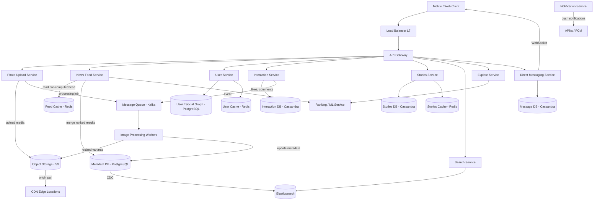
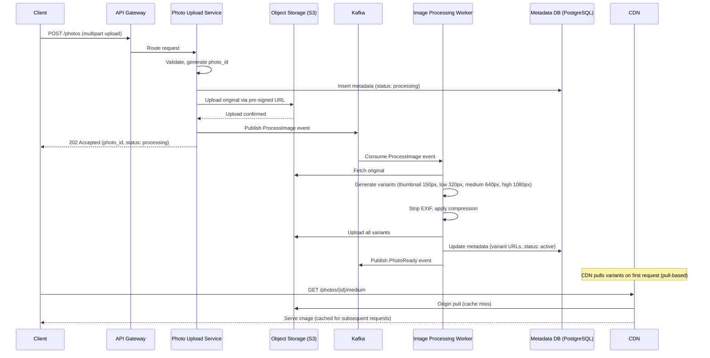

# Instagram

## 1. Overview

Instagram is a photo and video sharing social network where users upload visual content, follow other accounts, and consume a personalized feed of posts from the people they follow. With over 2 billion monthly active users and 500 million daily active users, Instagram processes approximately 100 million photo uploads per day, generates billions of feed impressions, and serves media from a CDN spanning hundreds of global points of presence.

The core architectural challenges are:

1. **Image storage pipeline at petabyte scale** -- ingesting, processing (compression, resizing, thumbnail generation), and durably storing tens of petabytes of image data per year while keeping uploads responsive.
2. **Feed generation for a massive social graph** -- constructing a personalized, ranked feed in real time for 500M+ daily users, each following hundreds of accounts with wildly varying follower counts.
3. **Low-latency media delivery** -- serving images globally in under 200ms via a multi-tier caching and CDN strategy.
4. **Stories (ephemeral content)** -- a fundamentally different access pattern from the permanent feed, requiring TTL-based storage, sequential playback ordering, and view tracking for 500M+ daily Stories users.
5. **Explore and discovery** -- surfacing relevant content to users from accounts they do not follow, using recommendation models that must evaluate billions of candidate posts in real time.

Instagram's architecture is a canonical study in how to separate the metadata path (small, structured, transactional) from the media path (large, immutable, streaming) and how to apply different caching and distribution strategies to each.

## 2. Requirements

### Functional Requirements
- Users can upload photos and short videos (with captions, filters, tags, and location data).
- Users can follow/unfollow other users.
- Users can view a personalized home feed (ranked posts from followed accounts).
- Users can like, comment on, and save posts.
- Users can publish and view Stories (ephemeral content that expires after 24 hours).
- Users can search for accounts, hashtags, and locations.
- Users can browse an Explore page with personalized content recommendations.
- Users receive real-time notifications for likes, comments, follows, and direct messages.
- Users can send direct messages (text, photos, video) to other users or groups.

### Non-Functional Requirements
- **Scale**: 2B+ MAU, 500M+ DAU, ~100M photo uploads/day, ~95M videos/day, ~500M Stories/day.
- **Storage**: ~100TB of new media per day; cumulative storage exceeds 100 PB.
- **Latency**: Feed load in < 300ms (p99); image delivery in < 200ms (p99 via CDN); photo upload acknowledgment in < 2s (p99).
- **Availability**: 99.99% uptime (four nines) -- downtime costs millions in ad revenue per hour.
- **Consistency**: Eventual consistency acceptable for feeds and like counts; strong consistency for direct messages and account state changes.
- **Read-to-write ratio**: Approximately 100:1. The system is heavily read-dominant (feed impressions vastly outnumber uploads).
- **Media processing**: Each uploaded photo must be processed into 4-6 resolution variants within 30 seconds.

## 3. High-Level Architecture



## 4. Core Design Decisions

### Metadata/Media Split
The most fundamental decision in Instagram's architecture is separating small structured metadata (user profiles, photo records, social graph, comments) from large immutable binary data (image files). Metadata lives in [PostgreSQL](../03-storage/01-sql-databases.md) for ACID guarantees and complex queries (joins across users, photos, hashtags). Media lives in [object storage (S3)](../03-storage/03-object-storage.md) with a flat namespace, immutable writes, and 11 nines of durability. This prevents blob replication overhead from crippling database performance.

### Asynchronous Image Processing via Message Queue
Photo processing (compression, resizing to 4-6 variants, thumbnail generation, EXIF stripping) is performed asynchronously. The upload service persists the original to object storage and publishes a processing job to [Kafka](../05-messaging/01-message-queues.md). Background workers consume these jobs, generate variants, and update metadata. This keeps the upload response time under 2 seconds while decoupling the critical write path from the computationally expensive image pipeline. The pattern mirrors the [saga approach](../08-resilience/03-distributed-transactions.md) described for Flickr's thumbnail generation choreography.

### Hybrid Fan-out for Feed Generation
Instagram uses a [hybrid fan-out](../11-patterns/01-fan-out.md) model for feed construction. For normal users (< 10K followers), a fan-out on write approach pushes new post IDs into each follower's pre-computed feed cache. For mega-accounts (celebrities, brand pages with millions of followers), fan-out on read is used -- posts are stored once and merged into the feed at read time. This avoids the write amplification problem for celebrity posts while keeping read latency low for the common case.

### Feed Ranking with ML
Unlike Twitter's historically chronological feed, Instagram's feed is ranked by a machine learning model. The ranking service scores candidate posts by predicted engagement (probability of like, comment, save, time-spent) using features such as user affinity, post recency, content type, and historical interaction patterns. This is implemented as a [three-stage recommendation pipeline](../11-patterns/03-recommendation-engines.md): candidate generation (posts from followed accounts), ranking (ML scoring), and reranking (diversity, freshness, ad injection).

### CDN-First Media Delivery
All image and video reads are served via [CDN edge caching](../04-caching/03-cdn.md). The CDN absorbs 99%+ of media read traffic. Only cold or newly uploaded content results in an origin pull to S3. For a platform generating 100M+ uploads per day, this architecture is essential -- without the CDN, the origin storage would be overwhelmed by the read volume.

### Cassandra for High-Write Interaction Data
Likes, comments, and Stories are stored in [Cassandra](../03-storage/07-cassandra.md), which is optimized for high-volume write workloads with tunable consistency. Cassandra's leaderless architecture and LSM-tree write path handle the 23,000+ likes per second and 2,300+ comments per second without write contention. The partition key is typically the photo_id or story_id, ensuring all interactions for a single piece of content are co-located.

## 5. Deep Dives

### 5.1 Image Storage and Processing Pipeline

The image pipeline is the backbone of Instagram. Every photo upload triggers a multi-stage processing workflow:



**Resolution variants**: Each photo is stored in 4-6 sizes. The client selects the appropriate variant based on the device's screen density and the rendering context (thumbnail grid vs. full-screen view). This minimizes bandwidth consumption -- serving a 150px thumbnail instead of a 1080px original saves 98% of bytes transferred.

**Pre-signed URLs**: For uploads exceeding 5MB, the client obtains a [pre-signed URL](../03-storage/03-object-storage.md) from the upload service and uploads directly to S3, bypassing the application server. This prevents the app server from becoming a bottleneck during traffic spikes and enables [multipart uploads](../03-storage/03-object-storage.md) for large video files.

**Deduplication**: Before processing, the worker computes a perceptual hash of the image. If a near-duplicate already exists in the system (same image uploaded by the same user), the worker skips reprocessing and links the new metadata record to the existing variants. This saves storage and processing costs.

**Storage cost management**: Older, less-accessed content is migrated to cheaper storage tiers (S3 Infrequent Access, then Glacier). A lifecycle policy automates this tiering based on the last access timestamp stored in the metadata DB.

### 5.2 Feed Generation and Ranking

Feed generation is Instagram's most latency-sensitive operation. It must produce a ranked, personalized feed in under 300ms for 500M+ daily users.

**Two-phase architecture:**

1. **Pre-computation (write path)**: When a user publishes a post, a fan-out service consumes the event from Kafka and writes the post_id into each follower's feed list in [Redis](../04-caching/02-redis.md). For celebrity accounts (> 10K followers), the fan-out is skipped to avoid write amplification. The pre-computed feed is stored as a Redis sorted set, keyed by `feed:{user_id}` with the post timestamp as the score.

2. **Read-time merge and ranking (read path)**: When a user opens the app, the feed service:
   - Fetches the pre-computed post IDs from Redis (O(1) lookup).
   - Identifies followed celebrity accounts from the social graph (cached with 1-hour TTL).
   - Pulls recent posts from celebrity accounts from the metadata DB.
   - Merges the two lists by timestamp.
   - Passes the merged candidate set (~500 posts) to the ML ranking service.
   - The ranking service scores each candidate by predicted engagement and returns a ranked list.
   - The feed service hydrates the top N posts (fetch media URLs, like counts, captions) and returns a paginated response with cursor-based pagination.

**Ranking signals**: The ML model uses hundreds of features, including:
- User-author affinity (how often the user has interacted with the author recently).
- Post recency (exponential decay on age).
- Content type preference (does this user engage more with photos vs. videos vs. carousels?).
- Post engagement velocity (likes/comments in the first minutes after posting).
- Social context (do mutual friends engage with this post?).

**Feed cache sizing (back-of-envelope):**
- 500M DAU, each feed stores the last 500 post IDs.
- Each entry: 8 bytes (post_id) + 8 bytes (timestamp) = 16 bytes.
- Per user: 500 x 16 = 8KB.
- Total: 500M x 8KB = 4TB.
- With Redis overhead (~2x): ~8TB of Redis cluster memory.
- This is achievable with a Redis cluster of ~100-150 nodes.

### 5.3 Stories Architecture

Stories are fundamentally different from the permanent feed:
- **Ephemeral**: Stories expire after 24 hours.
- **Sequential**: Stories from a single user are viewed in chronological order (unlike the ranked feed).
- **View tracking**: Instagram tracks which stories each user has viewed, powering the "unseen stories" ring indicator.
- **Higher volume**: ~500M daily Stories users creating ~1B stories/day.

**Storage**: Stories are stored in [Cassandra](../03-storage/07-cassandra.md) with a TTL of 24 hours (plus a grace period for archival to "Highlights"). The partition key is `author_id`, and the clustering key is `created_at`, enabling efficient retrieval of all active stories from a single author in chronological order.

**View tracking**: A separate Cassandra table tracks `(viewer_id, story_id)` pairs. This write-heavy workload (potentially billions of view events per day) is well-suited to Cassandra's append-optimized write path. The view status is cached in [Redis](../04-caching/02-redis.md) with a 24-hour TTL to avoid redundant DB reads when rendering the Stories tray.

**Stories tray generation**: The Stories tray (the horizontal row at the top of the feed) shows a prioritized list of accounts with unseen stories. This is generated by:
1. Fetching the user's followed accounts from the social graph cache.
2. For each followed account, checking the Stories cache for active stories.
3. Checking the view tracking cache for unseen stories.
4. Ranking accounts by affinity and recency of unseen stories.
5. Returning the sorted tray with story previews (first-frame thumbnails).

### 5.4 Explore and Discovery

The Explore page surfaces content from accounts the user does not follow. This is a large-scale [recommendation problem](../11-patterns/03-recommendation-engines.md) requiring evaluation of billions of candidate posts.

**Three-stage pipeline:**

1. **Candidate generation**: Multiple candidate sources run in parallel:
   - *Collaborative filtering*: "Users similar to you engaged with these posts."
   - *Content-based*: Posts semantically similar to posts the user has recently engaged with (using [vector embeddings and ANN search](../11-patterns/03-recommendation-engines.md)).
   - *Topic modeling*: Posts tagged with hashtags or locations the user has interacted with.
   - *Trending*: Posts with high recent engagement velocity.
   - Each source returns ~500 candidates; combined and deduplicated to ~2,000 candidates.

2. **Ranking**: The ML ranking model scores each candidate by predicted engagement, factoring in content quality signals (image aesthetics, caption quality), author quality signals (account age, posting frequency, engagement history), and user-content affinity.

3. **Reranking**: Diversity filters ensure the Explore page is not dominated by a single topic. Content safety filters remove policy-violating content. Ad slots are injected at fixed positions.

**Indexing**: Explore relies on a real-time content index maintained via [CDC from the metadata DB to Elasticsearch](../11-patterns/05-search-and-indexing.md). New posts are indexable for Explore within seconds of upload completion.

## 6. Data Model

### Photo Metadata (PostgreSQL)
```
photos:
  photo_id       UUID PK
  user_id        UUID FK -> users
  caption        TEXT
  location       POINT (latitude, longitude)
  created_at     TIMESTAMP
  status         ENUM (processing, active, deleted)
  variant_urls   JSONB {thumbnail: url, low: url, medium: url, high: url}
  perceptual_hash VARCHAR(64)

INDEX: (user_id, created_at DESC)
INDEX: (status, created_at DESC) -- for moderation queues
```

### User / Social Graph (PostgreSQL)
```
users:
  user_id        UUID PK
  username       VARCHAR UNIQUE
  display_name   VARCHAR
  bio            TEXT
  profile_pic_url VARCHAR
  is_private     BOOLEAN
  is_celebrity   BOOLEAN
  follower_count INTEGER
  following_count INTEGER

follows:
  follower_id    UUID FK -> users
  followee_id    UUID FK -> users
  created_at     TIMESTAMP
  PRIMARY KEY (follower_id, followee_id)

INDEX: (followee_id, created_at DESC) -- for "followers of user X"
```

### Interactions (Cassandra)
```
likes:
  photo_id       UUID  (partition key)
  user_id        UUID  (clustering key)
  created_at     TIMESTAMP

comments:
  photo_id       UUID  (partition key)
  comment_id     TIMEUUID (clustering key, ordered by time)
  user_id        UUID
  text           TEXT
  created_at     TIMESTAMP
```

### Hashtags (PostgreSQL)
```
hashtags:
  hashtag_id     UUID PK
  name           VARCHAR UNIQUE

photo_hashtags:
  photo_id       UUID FK -> photos
  hashtag_id     UUID FK -> hashtags
  PRIMARY KEY (photo_id, hashtag_id)
```

### Feed Cache (Redis Sorted Set)
```
Key:   feed:{user_id}
Score: post timestamp (epoch ms)
Value: photo_id
Max entries: 500 (ZREMRANGEBYRANK to evict oldest)
TTL:   None (evicted by LRU under memory pressure)
```

### Stories (Cassandra)
```
stories:
  author_id      UUID  (partition key)
  story_id       TIMEUUID (clustering key)
  media_url      VARCHAR
  media_type     ENUM (photo, video)
  created_at     TIMESTAMP
  TTL:           86400 (24 hours)

story_views:
  viewer_id      UUID  (partition key)
  story_id       UUID  (clustering key)
  viewed_at      TIMESTAMP
  TTL:           86400
```

### Search Index (Elasticsearch)
```
Index: accounts
Document: { user_id, username, display_name, bio, follower_count }

Index: hashtags
Document: { hashtag_id, name, post_count }

Index: locations
Document: { location_id, name, coordinates, post_count }

Sharding: hash-based on document ID
```

## 7. Scaling Considerations

### Image Processing Worker Scaling
Image processing is CPU and memory intensive. Workers are horizontally scaled via [Kafka consumer groups](../05-messaging/01-message-queues.md) -- each partition maps to a worker, and adding partitions/workers increases throughput linearly. At 100M uploads/day (~1,150/sec), with 4-6 variants per image and ~5 seconds of processing per variant, the system requires approximately 5,750-8,600 concurrent processing slots. [Autoscaling](../02-scalability/02-autoscaling.md) dynamically adjusts the worker fleet based on Kafka consumer lag.

### Feed Service Scaling
The feed service is the most latency-sensitive read path. It is stateless and scaled horizontally behind a [load balancer](../02-scalability/01-load-balancing.md). The Redis feed cache is clustered across 16,384 slots using [consistent hashing](../02-scalability/03-consistent-hashing.md). Hot keys (popular users' feeds receiving millions of reads during viral events) are mitigated by replicating hot keys across multiple cache replicas.

### Social Graph Sharding
The follows table grows linearly with user count and is read-heavy (every feed generation requires a social graph lookup). It is [sharded](../02-scalability/04-sharding.md) by `follower_id`, ensuring that all of a user's followed accounts are co-located on a single shard for efficient lookup. Read replicas serve the fan-out service's queries, keeping write traffic isolated on the primary.

### CDN and Media Delivery
Instagram's CDN spans 200+ edge locations. Popular content is cached at the edge; long-tail content falls through to regional mid-tier caches before hitting the S3 origin. The multi-tier caching hierarchy (edge -> regional -> origin) ensures that fewer than 1% of media requests reach S3 directly. Cache invalidation is event-driven: when a user deletes a photo, a purge event is sent to the CDN.

### Database Partitioning
The photos table is [sharded](../02-scalability/04-sharding.md) by `photo_id` (hash-based) for even distribution. The interactions tables in Cassandra are partitioned by `photo_id`, co-locating all likes and comments for a single photo on the same node. This enables efficient "fetch all comments for photo X" queries without scatter-gather.

### Traffic Spikes
Major cultural events (New Year's Eve, World Cup, celebrity announcements) cause predictable traffic spikes. Instagram handles these through:
- Pre-warming CDN caches for anticipated viral content.
- [Autoscaling](../02-scalability/02-autoscaling.md) feed and upload services based on traffic forecasts.
- Shedding non-critical work (deferring analytics processing, reducing Explore candidate pool) during peak load.
- [Rate limiting](../08-resilience/01-rate-limiting.md) at the API gateway to prevent abuse and protect downstream services.

## 8. Failure Modes & Mitigations

| Failure | Impact | Mitigation |
|---------|--------|------------|
| Image processing worker crash | Photo stuck in "processing" status; user sees placeholder | Kafka consumer offset ensures replay; dead-letter queue captures poison messages; [circuit breaker](../08-resilience/02-circuit-breaker.md) prevents cascading failures |
| Redis feed cache node failure | Feed reads for affected users return empty or stale | Redis cluster auto-failover redistributes slots within seconds; [cache-aside](../04-caching/01-caching.md) falls through to DB; feed is reconstructed on next access |
| S3 origin outage | CDN cache misses fail; newly uploaded photos are inaccessible | CDN serves stale cached copies (graceful degradation); multi-region S3 replication provides failover; upload service queues requests with [back-pressure](../05-messaging/01-message-queues.md) |
| Metadata DB (PostgreSQL) leader failure | Writes fail for photo uploads and user actions | Automatic leader election via streaming replication; read replicas continue serving read traffic; RPO < 1 second with synchronous replication to standby |
| Kafka broker failure | Processing events and fan-out events are delayed | Kafka replication factor of 3 ensures no data loss; consumers auto-rebalance to healthy brokers |
| CDN edge location failure | Increased latency for users in affected region | DNS-based failover routes traffic to next-nearest edge location; anycast routing provides automatic failover |
| Celebrity posts viral spike | Massive surge in feed read-time merges and media requests | Celebrity posts are cached with short TTL (30s); CDN absorbs media read surge; [rate limiting](../08-resilience/01-rate-limiting.md) on feed API throttles excessive requests |
| Stories service overload | Stories tray fails to load | Graceful degradation: show cached tray data; Stories tray is non-blocking -- feed loads independently |

## 9. Key Takeaways

- The metadata/media split is the foundational pattern: structured data in PostgreSQL, binary media in S3. Never store blobs in a relational database.
- Asynchronous image processing via a Kafka-backed worker pipeline decouples the upload response time from the computationally expensive variant generation. The user gets immediate confirmation; processing happens in the background.
- The hybrid fan-out model (write for normal users, read for celebrities) is the same pattern used by Twitter and Facebook's News Feed. It is the canonical solution for power-law follower distributions.
- ML-ranked feeds require a three-stage pipeline (candidate generation, ranking, reranking) because scoring billions of posts per user in real time is computationally infeasible.
- Stories require a fundamentally different storage model (TTL-based, sequential, view-tracked) from permanent posts. Cassandra's TTL support and append-optimized writes make it ideal for ephemeral content.
- CDN-first architecture is non-negotiable at Instagram's scale. Without edge caching, the 100:1 read-to-write ratio would overwhelm any origin storage system.
- Pre-signed URLs for direct-to-S3 uploads eliminate the application server as a media transfer bottleneck.
- Cursor-based pagination is essential for infinite-scroll feeds where new content is continuously inserted.
- Perceptual hashing enables deduplication of near-identical uploads, saving storage and processing costs at petabyte scale.
- Separating interaction data (likes, comments) into Cassandra keeps the high-write workload off the relational metadata database.

## 10. Related Concepts

- [Fan-out (read vs. write, hybrid)](../11-patterns/01-fan-out.md) -- feed generation strategy
- [Object storage (S3, pre-signed URLs, multipart uploads)](../03-storage/03-object-storage.md) -- media storage
- [CDN (edge caching, origin pull, cache invalidation)](../04-caching/03-cdn.md) -- media delivery
- [Redis (sorted sets, clustering, hot key mitigation)](../04-caching/02-redis.md) -- feed cache and Stories cache
- [SQL databases (PostgreSQL, ACID, indexing)](../03-storage/01-sql-databases.md) -- metadata and social graph
- [Cassandra (TTL, partition keys, LSM writes)](../03-storage/07-cassandra.md) -- interactions and Stories
- [Message queues (Kafka, consumer groups, back-pressure)](../05-messaging/01-message-queues.md) -- async processing pipeline
- [Recommendation engines (three-stage pipeline, embeddings, ANN)](../11-patterns/03-recommendation-engines.md) -- Explore and feed ranking
- [Search and indexing (Elasticsearch, CDC-based sync)](../11-patterns/05-search-and-indexing.md) -- account and hashtag search
- [Sharding (hash-based partitioning, shard key design)](../02-scalability/04-sharding.md) -- database scaling
- [Consistent hashing (Redis cluster slots)](../02-scalability/03-consistent-hashing.md) -- cache distribution
- [Caching strategies (cache-aside, TTL, cache warming)](../04-caching/01-caching.md) -- multi-tier caching
- [Rate limiting (API protection)](../08-resilience/01-rate-limiting.md) -- traffic spike protection
- [Autoscaling (worker fleet, feed service)](../02-scalability/02-autoscaling.md) -- elastic capacity
- [Load balancing (L7, request routing)](../02-scalability/01-load-balancing.md) -- traffic distribution
- [API gateway (routing, auth, rate limiting)](../06-architecture/01-api-gateway.md) -- entry point
- [Microservices (service decomposition)](../06-architecture/02-microservices.md) -- service architecture
- [Event-driven architecture (async processing, pub/sub)](../05-messaging/02-event-driven-architecture.md) -- processing pipeline
- [Circuit breaker (cascading failure prevention)](../08-resilience/02-circuit-breaker.md) -- resilience
- [Database replication (leader-follower, CDC)](../03-storage/05-database-replication.md) -- HA and search sync
- [Real-time protocols (WebSocket for DMs)](../07-api-design/04-real-time-protocols.md) -- direct messaging
- [Back-of-envelope estimation](../01-fundamentals/07-back-of-envelope-estimation.md) -- capacity planning

## 11. Source Traceability

| Section | Source |
|---------|--------|
| Functional and non-functional requirements | System Design Guide ch16 (Instagram), Grokking (Instagram/Twitter chapters) |
| Data model (User, Photo, Comment, Like, Follow, Hashtag) | System Design Guide ch16 (Entity relationship diagram) |
| Scale calculations (storage, bandwidth, processing) | System Design Guide ch16 (Scale calculations section) |
| High-level architecture (microservices, load balancer, API gateway) | System Design Guide ch16 (High-level design), Acing System Design ch15 (Flickr HLA) |
| Photo upload flow and async processing | System Design Guide ch16 (Photo Upload Service), Acing System Design ch15 (Choreography saga for thumbnail generation) |
| News Feed generation and ranking | System Design Guide ch16 (News Feed Service), YouTube Report 5 (Fan-out, News Feed case study) |
| Hybrid fan-out model | YouTube Report 2 (Section 5), YouTube Report 3 (Section 6) |
| Image pipeline (pre-signed URLs, multipart uploads) | YouTube Report 4 (Section 1: Object storage, pre-signed URLs), Acing System Design ch15 (Upload flow) |
| CDN and content delivery | System Design Guide ch16 (CDN section), Acing System Design ch15 (CDN organization) |
| Recommendation engine (Explore, three-stage pipeline) | YouTube Report 4 (Section 4: Recommendation engine pipeline, vector search) |
| Stories architecture | Expert domain knowledge (TTL-based Cassandra, ephemeral content patterns) |
| Cassandra for interactions | YouTube Report 4 (Section 1: NoSQL), YouTube Report 7 (Section 2: Cassandra deep dive) |
| Redis for feed cache | YouTube Report 4 (Section 2: Redis sorted sets), YouTube Report 7 (Section 4: Caching architectures) |
| Search and CDC indexing | YouTube Report 2 (Section 3: Full-text search and CDC) |
| Sharding strategies | YouTube Report 4 (Section 3: Sharding), Grokking ch108 (Data sharding) |
