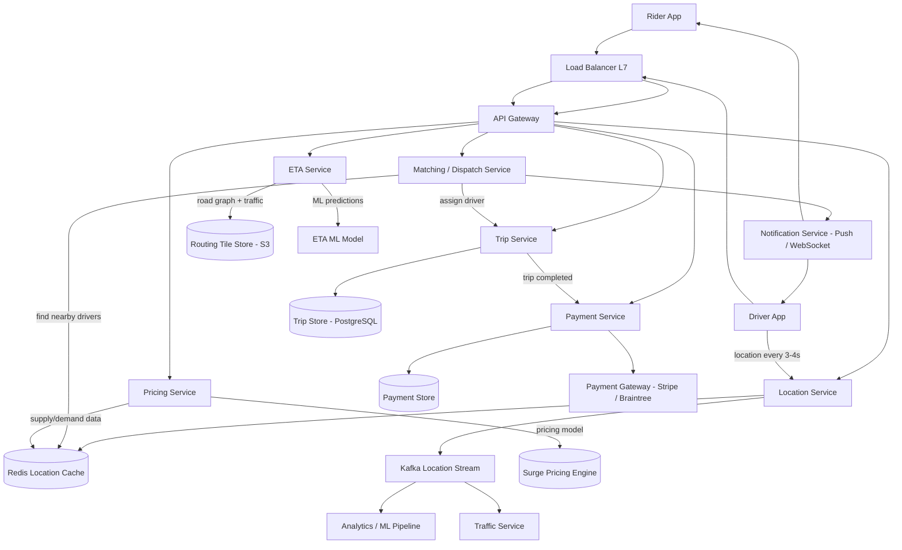
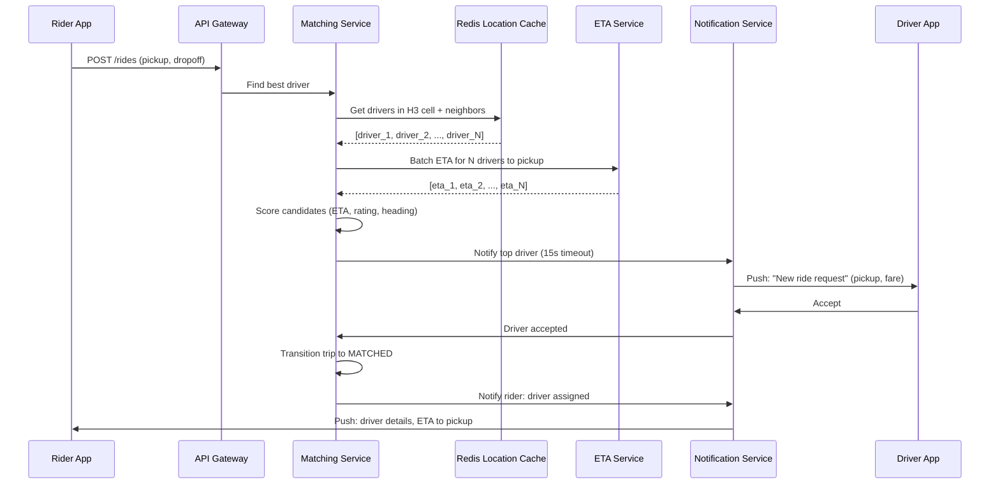

# Uber

## 1. Overview

Uber is a ride-sharing platform that connects riders with nearby drivers in real time. The core architectural challenge is maintaining a continuously updated global view of driver positions -- millions of drivers reporting locations every 3-4 seconds -- while simultaneously supporting sub-second matching and dispatch when a rider requests a trip. This combination of high-frequency writes (location telemetry) and latency-sensitive reads (driver matching) makes Uber one of the most demanding geospatial systems in production. The architecture must also handle surge pricing (a real-time supply/demand pricing engine), accurate ETA prediction, and a multi-step trip lifecycle from request to payment -- all at a scale of 20M+ trips per day across 70+ countries.

## 2. Requirements

### Functional Requirements
- Drivers continuously report their GPS location and availability status.
- Riders see nearby available drivers on a map in real time.
- Riders request a ride by specifying pickup and dropoff locations.
- The system matches the rider with the best available driver and notifies both parties.
- Both rider and driver see each other's real-time location during a trip.
- The system calculates ETA for pickup and trip duration.
- Dynamic (surge) pricing adjusts fares based on real-time supply and demand.
- Upon trip completion, the system processes payment and records the trip.

### Non-Functional Requirements
- **Scale**: 20M+ trips/day, 5M+ active drivers, 100M+ monthly active riders across 70+ countries.
- **Location update throughput**: ~5M drivers reporting every 3-4 seconds = ~1.5M location updates/sec.
- **Matching latency**: Driver assignment within 5-10 seconds of ride request.
- **ETA accuracy**: Predicted ETA within 10-15% of actual arrival time.
- **Availability**: 99.99% uptime -- ride requests must succeed even during partial outages.
- **Consistency**: Eventual consistency is acceptable for driver locations; strong consistency required for trip state transitions and payment processing.
- **Data freshness**: Rider's view of nearby drivers should reflect positions no older than 5-10 seconds.

## 3. High-Level Architecture



## 4. Core Design Decisions

### Geospatial Indexing with H3 / S2 Hexagonal Cells

Uber uses [geospatial indexing](../11-patterns/06-geospatial-indexing.md) to efficiently find nearby drivers. Rather than traditional geohashing (which produces rectangular cells with edge discontinuities), Uber adopted H3 hexagonal cells (and Google S2 internally). Hexagonal cells have uniform adjacency -- every cell has exactly 6 neighbors at equal distance, eliminating the corner-adjacency problem of rectangular grids. This makes proximity queries and supply/demand aggregation more uniform. Driver locations are mapped to H3 cell IDs at resolution 9 (~175m edge length), and the location cache is indexed by cell ID for O(1) lookup of drivers in a given cell.

### Separation of Write Path (Location Updates) and Read Path (Matching)

The location update stream (1.5M writes/sec) and the matching query path (ride requests) are architecturally separated. Location updates flow into [Redis](../04-caching/02-redis.md) as the real-time cache and into [Kafka](../05-messaging/01-message-queues.md) for downstream consumers (analytics, traffic, ETA). The matching service reads from the Redis cache, which reflects the freshest driver positions. This separation prevents the write-heavy location stream from contending with the latency-sensitive matching queries.

### Trip State Machine with Strong Consistency

A trip passes through well-defined states (REQUESTED -> MATCHED -> EN_ROUTE_PICKUP -> IN_PROGRESS -> COMPLETED -> PAID). State transitions require strong consistency to prevent double-dispatch, phantom trips, and payment errors. The trip store uses [PostgreSQL](../03-storage/01-sql-databases.md) with ACID transactions. Each state transition is guarded by optimistic concurrency control (version column) to prevent race conditions when multiple services attempt to update the same trip.

### Event-Driven Architecture for Downstream Processing

Rather than having the location service directly call analytics, traffic, and ETA services, all location updates are published to Kafka topics. Downstream services consume these streams independently, following the [event-driven architecture](../05-messaging/02-event-driven-architecture.md) pattern. This decouples the hot write path from slower analytical workloads and enables replay for ML model training.

### WebSocket for Real-Time Updates

During an active trip, both rider and driver need continuous position updates. The system uses [WebSocket connections](../07-api-design/04-real-time-protocols.md) for bidirectional real-time communication. A notification service maintains persistent connections to active app clients and pushes location updates, trip state changes, and ETA revisions without polling overhead.

## 5. Deep Dives

### 5.1 Matching and Dispatch System

The matching system is the heart of Uber. When a rider requests a trip:

1. **Candidate generation**: The matching service queries the Redis location cache for all available drivers within the rider's H3 cell and its immediate neighbors (ring-1 expansion). If insufficient candidates, it expands to ring-2 (second layer of neighbors).

2. **Filtering**: Candidates are filtered by vehicle type (UberX, UberXL, UberBlack), driver rating, and real-time availability status.

3. **Scoring**: Each candidate is scored by a combination of:
   - **ETA to pickup**: Estimated time for the driver to reach the rider (computed by the ETA service using the road graph).
   - **Driver rating**: Higher-rated drivers receive a preference boost.
   - **Completion rate**: Drivers with high acceptance rates are preferred.
   - **Heading direction**: A driver already heading toward the pickup location is preferred over one heading away (reduces U-turn and detour time).

4. **Assignment**: The top-scored driver receives a push notification with a 15-second acceptance window. If the driver declines or times out, the next candidate is offered the ride. After 3 declines, the search radius expands.

5. **Confirmation**: Once a driver accepts, the trip state transitions to MATCHED. Both rider and driver begin receiving real-time location updates via WebSocket.



**Idempotency safeguard**: The matching service uses a distributed lock (keyed on `driver_id`) with a short TTL to prevent a driver from being simultaneously assigned to two different riders. If the lock acquisition fails, the driver is skipped and the next candidate is tried.

### 5.2 Surge Pricing Engine

Surge pricing balances supply and demand in real time. The core idea is to increase fares when rider demand exceeds driver supply in a geographic area, incentivizing more drivers to enter the high-demand zone.

**How it works:**

1. **Supply measurement**: Count available drivers per H3 cell (resolution 7, ~1.2km edge). The location cache provides this count directly.

2. **Demand measurement**: Count ride requests per H3 cell over a rolling window (e.g., last 5 minutes). Request events flow through Kafka into a [stream processing](../05-messaging/02-event-driven-architecture.md) engine (Apache Flink) that maintains windowed counters per cell.

3. **Surge multiplier calculation**: For each cell, compute `demand / supply`. If the ratio exceeds a threshold (e.g., 2.0), a surge multiplier is applied. The multiplier follows a curve -- not linear -- to prevent extreme spikes. Typical multipliers range from 1.0x (no surge) to 3.0x (high surge), capped to prevent PR disasters.

4. **Spatial smoothing**: Raw cell-level multipliers are smoothed across neighboring cells to avoid sharp price boundaries where a rider standing 50 meters away gets a dramatically different fare.

5. **Temporal decay**: The surge multiplier decays over time as additional drivers enter the area, creating a natural negative feedback loop.

**Data flow:**

```
Ride requests -> Kafka -> Flink (windowed count per H3 cell)
                                          |
Driver locations -> Redis (count per cell) -> Surge Calculator -> Surge Map
                                                                      |
Rider requests fare estimate --------------------------------> Apply multiplier
```

**Architectural choice**: The surge map is computed centrally and cached in Redis with a TTL of 60 seconds. All services (pricing, rider app) read from this cache. The map is recomputed every 30-60 seconds by the Flink job, ensuring freshness without overwhelming downstream systems.

### 5.3 Real-Time Location Tracking and Geospatial Infrastructure

The location tracking pipeline handles the highest write throughput in the entire system.

**Driver location update flow:**

1. Driver app sends `(driver_id, lat, lng, timestamp, heading, speed, availability)` every 3-4 seconds over a persistent HTTP keep-alive connection.

2. The location service receives the update and performs three parallel operations:
   - **Redis update**: Write current location to `driver:{driver_id}` with a TTL of 30 seconds (auto-expires inactive drivers). Also update the H3 cell index: add the driver to the sorted set for their new cell, remove from the old cell if changed.
   - **Kafka publish**: Publish the location event for downstream consumers (traffic, analytics, ETA model training).
   - **In-memory cache**: The location service itself maintains a local in-memory cache of the most recent positions for the drivers assigned to active trips, enabling sub-millisecond lookups for trip tracking.

3. A separate periodic job (every 10-15 seconds) reconciles the Redis state with a persistent store, ensuring that the in-memory view of driver positions does not diverge too far from durable storage.

**Scaling the location cache:**

With 5M active drivers, each location entry consuming ~100 bytes:
- Total memory: 5M x 100 bytes = ~500 MB (easily fits in a single Redis instance from a memory perspective).
- Write throughput: 1.5M writes/sec exceeds a single Redis instance's capacity (~100K-300K writes/sec).
- Solution: [Shard](../02-scalability/04-sharding.md) by `driver_id` across 10-20 Redis instances using [consistent hashing](../02-scalability/03-consistent-hashing.md).

**H3 cell index structure (Redis):**

```
Key:   cell:{h3_cell_id}
Type:  Sorted Set
Score: timestamp of last update
Value: driver_id
```

When matching queries "drivers near this pickup location," the matching service computes the H3 cell for the pickup coordinates and queries `ZRANGEBYSCORE` on that cell and its neighbors, filtering for entries with timestamps within the last 30 seconds (indicating active drivers).

### 5.4 ETA Calculation

ETA prediction is critical for both rider experience (estimated pickup time) and matching quality (the matching service scores candidates by ETA).

**Architecture:**

1. **Road graph representation**: The world's road network is represented as a directed weighted graph stored in routing tiles (similar to the approach described in the Google Maps case study). Routing tiles are stored in [object storage (S3)](../03-storage/03-object-storage.md) and cached aggressively on routing service instances.

2. **Shortest path computation**: A variant of A* is used for path computation, operating over hierarchical routing tiles (local roads -> arterial roads -> highways) to keep the search space tractable.

3. **Traffic-aware edge weights**: Edge weights in the road graph are not static distances -- they are dynamically adjusted based on real-time traffic conditions. The traffic service consumes Kafka location streams, computes average speed per road segment, and updates edge weights. Historical traffic patterns (time-of-day, day-of-week) provide the baseline, and real-time probe data (from driver location reports) adjusts the baseline.

4. **ML-based ETA refinement**: The graph-based ETA provides a baseline, but Uber uses a gradient-boosted tree model (and later graph neural networks, per DeepMind collaboration) to refine predictions based on features like:
   - Time of day and day of week
   - Weather conditions
   - Historical trip durations on this route
   - Current traffic density
   - Number of traffic signals on the route
   - Special events (concerts, sports games)

5. **Caching**: ETAs for popular origin-destination pairs are cached with a short TTL (2-5 minutes). During high-demand events, this cache absorbs a significant fraction of ETA requests.

## 6. Data Model

### Driver Location Cache (Redis)

```
Key:   driver:{driver_id}
Value: {lat, lng, heading, speed, h3_cell, availability, timestamp}
TTL:   30 seconds (auto-expire inactive drivers)
```

### H3 Cell Index (Redis Sorted Set)

```
Key:   cell:{h3_cell_id}
Score: last_update_timestamp
Value: driver_id
```

### Trip Store (PostgreSQL)

```
trips:
  trip_id         UUID PK
  rider_id        UUID FK -> users
  driver_id       UUID FK -> users (nullable until matched)
  status          ENUM (REQUESTED, MATCHED, EN_ROUTE_PICKUP, IN_PROGRESS, COMPLETED, CANCELLED, PAID)
  version         INTEGER (optimistic concurrency)
  pickup_lat      DECIMAL
  pickup_lng      DECIMAL
  dropoff_lat     DECIMAL
  dropoff_lng     DECIMAL
  surge_multiplier DECIMAL
  fare_cents      INTEGER
  requested_at    TIMESTAMP
  matched_at      TIMESTAMP
  pickup_at       TIMESTAMP
  dropoff_at      TIMESTAMP
  created_at      TIMESTAMP
  updated_at      TIMESTAMP
```

### Surge Map (Redis Hash)

```
Key:   surge:{h3_cell_id_res7}
Value: {multiplier: 1.8, updated_at: timestamp}
TTL:   120 seconds
```

### Location History (Cassandra)

```
Partition key: driver_id
Clustering key: timestamp (descending)
Columns: lat, lng, heading, speed, h3_cell, trip_id (nullable)
```

[Cassandra](../03-storage/07-cassandra.md) is chosen for its high write throughput and time-series-friendly data model. With 1.5M writes/sec and data retention of 30-90 days, this table grows rapidly and benefits from Cassandra's compaction and TTL-based expiration.

### Payment Records (PostgreSQL)

```
payments:
  payment_id      UUID PK
  trip_id         UUID FK -> trips
  rider_id        UUID FK -> users
  driver_id       UUID FK -> users
  amount_cents    INTEGER
  currency        VARCHAR(3)
  payment_method  ENUM (CARD, WALLET, CASH)
  status          ENUM (PENDING, CHARGED, REFUNDED, FAILED)
  gateway_txn_id  VARCHAR
  created_at      TIMESTAMP
```

## 7. Scaling Considerations

### Location Service Throughput

At 1.5M location updates/sec, the location service is horizontally scaled behind a [load balancer](../02-scalability/01-load-balancing.md). Each instance handles a shard of driver IDs and writes to the corresponding Redis shard. Kafka producers are batched (linger.ms=5, batch.size=16KB) to reduce network overhead.

### Matching Service Hot Spots

Dense urban areas (Manhattan, central London) have disproportionately high ride request rates. The matching service is stateless and scaled horizontally, but the underlying Redis cells for dense areas become hot keys. Mitigation: use finer H3 resolution (resolution 10 instead of 9) in dense areas to distribute the driver set across more cells.

### Surge Pricing at Scale

The Flink-based surge calculator processes the entire global ride request stream. It is partitioned by H3 cell ID to ensure that all requests for a given cell land on the same Flink operator, enabling accurate windowed counts. During peak events (New Year's Eve), the surge map may cover millions of cells. The Redis cache absorbs read load with < 1ms latency.

### Payment Processing

Payment is a critical path requiring [strong consistency](../01-fundamentals/05-cap-theorem.md). The payment service uses a two-phase approach:
1. **Authorization hold**: When the trip starts, an authorization hold is placed on the rider's payment method for the estimated fare.
2. **Capture**: Upon trip completion, the actual fare is captured. If the actual fare exceeds the hold (e.g., due to route change), a supplemental charge is applied.
3. **Settlement**: Driver payouts are batched weekly, aggregated across all completed trips, using a [saga pattern](../08-resilience/03-distributed-transactions.md) to coordinate between the trip store, payment gateway, and driver wallet.

### Geographic Distribution

Uber operates in 70+ countries. Each region (US, EU, APAC, LATAM) has its own deployment with local Redis clusters, Kafka clusters, and trip databases. Cross-region data (user accounts, payment methods) is replicated asynchronously. Ride matching, location tracking, and pricing operate entirely within the local region to minimize latency.

## 8. Failure Modes & Mitigations

| Failure | Impact | Mitigation |
|---------|--------|------------|
| Redis location cache node failure | Matching service cannot find drivers in affected shards | Consistent hashing redistributes slots; cache rebuilds from incoming driver updates within seconds (30s TTL means full refresh) |
| Kafka broker failure | Location events delayed for downstream consumers | Kafka replication factor 3; producers retry to available brokers; surge pricing uses stale-but-available surge map |
| Matching service cannot find drivers | Rider sees "no drivers available" | Expand search radius progressively (ring-1 -> ring-2 -> ring-3); fall back to estimated pickup times; queue the request for retry |
| Trip database failover | Trip state transitions delayed | PostgreSQL synchronous replication to standby; automatic failover via Patroni/pg_auto_failover; in-flight trips buffer state in Redis and reconcile after recovery |
| Payment gateway timeout | Rider charged but driver not paid (or vice versa) | Idempotent retry with gateway transaction IDs; [saga pattern](../08-resilience/03-distributed-transactions.md) compensating transactions; manual reconciliation queue for unresolved cases |
| Surge pricing engine lag | Stale surge multipliers; riders see outdated prices | Surge map cached with TTL; if Flink job is delayed, the system serves the last known surge map (stale by 1-2 minutes, acceptable) |
| Driver app loses connectivity | Driver position goes stale; may miss ride offers | TTL-based expiration removes driver from cache after 30 seconds; driver re-enters the pool upon reconnection |
| Notification service overload | Riders and drivers do not receive push updates | [Circuit breaker](../08-resilience/02-circuit-breaker.md) on notification service; fall back to SMS for critical notifications (ride assigned, trip completed) |

### Cascade Failure Scenario: New Year's Eve

1. **Trigger**: Demand spikes 10x at midnight across every major city simultaneously.
2. **Surge engine overload**: Flink job processes a massive burst of ride requests; windowed counters temporarily lag.
3. **Stale surge map**: Riders see pre-midnight surge multipliers for 1-2 minutes.
4. **Matching delays**: Ride request volume exceeds matching service capacity; queue depth increases.
5. **Mitigation chain**:
   - [Autoscaling](../02-scalability/02-autoscaling.md) triggers additional matching service instances (pre-scaled based on historical NYE patterns).
   - [Rate limiting](../08-resilience/01-rate-limiting.md) at the API gateway throttles ride requests beyond capacity, queuing excess requests.
   - The surge engine catches up; surge multipliers climb, dampening demand.
   - Matching service processes the queue as supply/demand rebalance.
   - Riders experience 30-60 seconds of "finding your driver" delay, then normal operation resumes.

## 9. Key Takeaways

- Separate the write path (high-frequency location updates) from the read path (latency-sensitive matching) to prevent contention. Redis serves as the bridge between the two paths.
- H3 hexagonal cells provide uniform adjacency for geospatial operations, avoiding the corner-adjacency and boundary problems of rectangular geohashes. See [geospatial indexing](../11-patterns/06-geospatial-indexing.md) for the full comparison of indexing approaches.
- The matching algorithm is a multi-signal scoring function (ETA, rating, heading, completion rate), not a simple "nearest driver" lookup. Nearest is necessary but not sufficient.
- Surge pricing is a supply/demand feedback loop: high prices attract supply, which reduces the price, creating natural equilibrium. The architecture must compute this in near real time (< 60 seconds staleness).
- Trip state machines with optimistic concurrency control prevent double-dispatch and ensure payment correctness without heavyweight distributed locks.
- Event-driven architecture via Kafka decouples the location ingestion pipeline from downstream consumers (traffic, analytics, ETA), enabling independent scaling and replay.
- TTL-based expiration in Redis provides a natural mechanism for removing stale driver positions without explicit cleanup jobs.
- Payment processing requires a saga pattern for multi-step financial transactions spanning multiple services and external gateways.
- Pre-scaling for predictable demand spikes (NYE, concerts, sports events) is essential -- autoscaling alone is too slow to handle instantaneous 10x demand surges.
- Geographic sharding by region keeps latency low and complies with data residency regulations (GDPR in EU, for example).

## 10. Related Concepts

- [Geospatial Indexing (H3, S2, geohash, quadtree)](../11-patterns/06-geospatial-indexing.md)
- [Redis (sorted sets, TTL, geospatial API)](../04-caching/02-redis.md)
- [Message Queues (Kafka for location streaming)](../05-messaging/01-message-queues.md)
- [Event-Driven Architecture (stream processing with Flink)](../05-messaging/02-event-driven-architecture.md)
- [Consistent Hashing (Redis sharding)](../02-scalability/03-consistent-hashing.md)
- [Sharding (location cache, Cassandra)](../02-scalability/04-sharding.md)
- [PostgreSQL / SQL Databases (trip store, payments)](../03-storage/01-sql-databases.md)
- [Cassandra (location history)](../03-storage/07-cassandra.md)
- [Object Storage (routing tiles)](../03-storage/03-object-storage.md)
- [Real-Time Protocols (WebSocket for trip tracking)](../07-api-design/04-real-time-protocols.md)
- [Distributed Transactions / Saga Pattern (payments)](../08-resilience/03-distributed-transactions.md)
- [Rate Limiting (API gateway throttling)](../08-resilience/01-rate-limiting.md)
- [Circuit Breaker (notification service fallback)](../08-resilience/02-circuit-breaker.md)
- [Autoscaling (pre-scaling for demand spikes)](../02-scalability/02-autoscaling.md)
- [Load Balancing (location service, matching service)](../02-scalability/01-load-balancing.md)
- [CAP Theorem (eventual consistency for locations, strong for trips)](../01-fundamentals/05-cap-theorem.md)
- [Back-of-Envelope Estimation](../01-fundamentals/07-back-of-envelope-estimation.md)

## 11. Source Traceability

| Section | Source |
|---------|--------|
| QuadTree for driver locations, DriverLocationHT hash table, 3-second update interval | Grokking System Design (Designing Uber backend, Sections 4-5) |
| Matching algorithm (Aggregator server, top-K drivers, notification to drivers) | Grokking System Design (Designing Uber backend, Sections 4-5) |
| Geospatial indexing (geohash, quadtree, S2, R-tree comparison) | docs/patterns/06-geospatial-indexing.md, Alex Xu Vol 2 (ch02: Proximity Service) |
| H3 hexagonal cells, Uber's adoption of H3 | YouTube Report 7 (Section 2: Geospatial Indexing), Author expertise |
| Kafka for location streaming, event-driven downstream | Alex Xu Vol 2 (ch04: Google Maps - Location Service with Kafka) |
| Redis for real-time location cache, TTL expiration | Alex Xu Vol 2 (ch03: Nearby Friends - Redis Location Cache) |
| Nearby Friends architecture (WebSocket, Redis pub/sub, location updates) | Alex Xu Vol 2 (ch03: Nearby Friends) |
| Surge pricing supply/demand model | YouTube Report 2 (Section 8: Tinder/proximity services), Author expertise |
| ETA with ML (GNNs, traffic prediction) | Alex Xu Vol 2 (ch04: Google Maps - ETA Service, References 15-16) |
| Proximity service use cases (Uber, Lyft driver matching) | System Design Guide (ch14: Proximity Service) |
| Capacity estimation (300M customers, 1M drivers, 500K DAU drivers) | Grokking System Design (Designing Uber backend, Section 3) |
| Fault tolerance (replicas, master-slave, persistent storage) | Grokking System Design (Designing Uber backend, Section 5) |
| Ranking drivers by rating within QuadTree | Grokking System Design (Designing Uber backend, Section 6) |
