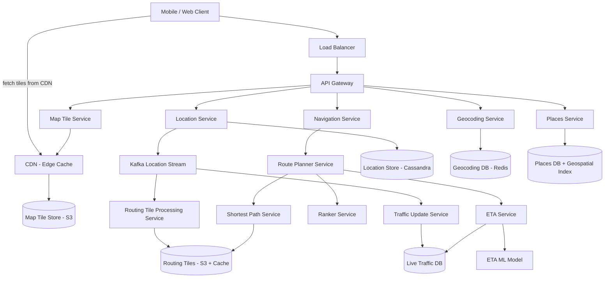
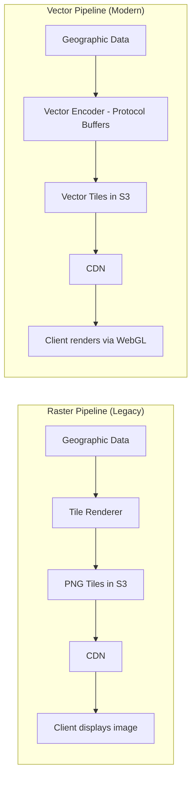
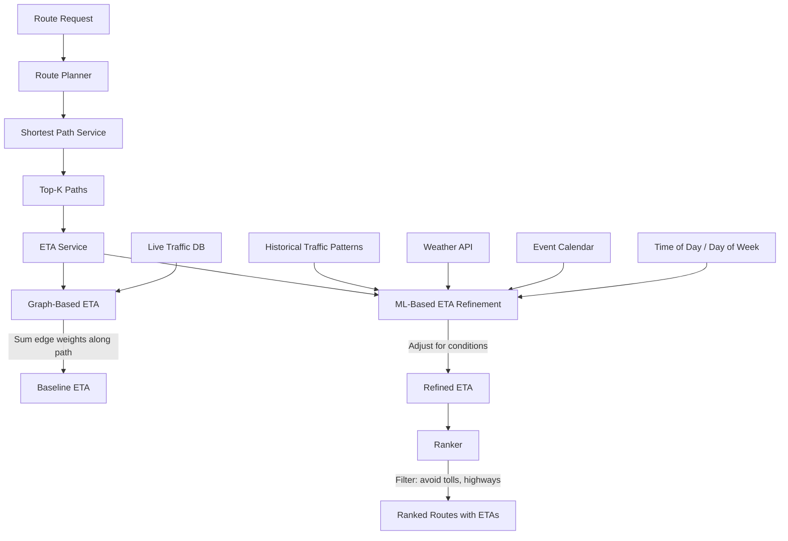

# Google Maps

## 1. Overview

Google Maps is a global mapping platform serving 1B+ daily active users with satellite imagery, street maps, real-time traffic conditions, route planning, and turn-by-turn navigation. The system is architecturally interesting because it combines three fundamentally different workloads: (1) static content serving at enormous scale (map tile rendering and delivery via CDN), (2) graph-based computation (shortest path algorithms on road networks with billions of edges), and (3) real-time data fusion (incorporating live traffic probe data from hundreds of millions of phones to update ETAs and reroute drivers dynamically). The storage challenge alone is staggering -- pre-rendered map tiles at 21 zoom levels total approximately 100 PB -- and the route planning subsystem must run shortest-path algorithms on a graph so large that it cannot fit in a single machine's memory, requiring a hierarchical tiling approach that partitions the road network into loadable segments.

## 2. Requirements

### Functional Requirements
- Display an interactive map with pan, zoom, and tilt at multiple zoom levels (0-21).
- Provide route planning from origin to destination with support for multiple travel modes (driving, walking, cycling, transit).
- Calculate and display estimated time of arrival (ETA) that accounts for real-time traffic conditions.
- Provide turn-by-turn navigation with adaptive rerouting when traffic conditions change.
- Support geocoding (address to lat/lng) and reverse geocoding (lat/lng to address).
- Track user location during navigation and send periodic updates to the server.
- Provide a Places API for searching nearby businesses, restaurants, and points of interest.

### Non-Functional Requirements
- **Scale**: 1B+ DAU, 5 billion minutes of navigation per day.
- **Navigation QPS**: ~7,200 average, ~36,000 peak (5x).
- **Location update QPS**: ~200,000 average (batched every 15 seconds), ~1M peak.
- **Map tile storage**: ~100 PB across all zoom levels.
- **Latency**: Map tile load < 200ms; route computation < 2 seconds for most queries.
- **Accuracy**: Routes must be correct -- users should not be directed the wrong way down a one-way street.
- **Battery and data efficiency**: Mobile clients must minimize data usage and power consumption during navigation (~1.25 MB/min at 30 km/h).
- **Availability**: 99.99% -- navigation failure during driving is a safety concern.
- **Freshness**: Traffic conditions reflected in ETAs within 1-2 minutes of real-world changes.

## 3. High-Level Architecture



## 4. Core Design Decisions

### Pre-Rendered Static Map Tiles Served via CDN

Rather than rendering map images dynamically per request (which would require enormous server-side compute for 1B users), Google Maps pre-renders map tiles at 21 discrete zoom levels. Each tile is a 256x256 pixel image covering a fixed geographic area. The tiles are stored in [object storage (S3)](../03-storage/object-storage.md) and served through a [CDN](../04-caching/cdn.md). This makes map rendering a static content delivery problem -- the most scalable and cache-friendly architecture possible. The client computes which tiles it needs based on its viewport coordinates and zoom level, then fetches them from the nearest CDN POP.

### Geohash-Based Tile Addressing

Each tile is uniquely identified by a [geohash](../11-patterns/geospatial-indexing.md) at the appropriate zoom level. The client computes the geohash from its (lat, lng, zoom) coordinates and constructs the CDN URL directly (e.g., `https://cdn.maps.example.com/tiles/9q9heb.png`). This means the client never needs to query the server to discover which tiles to fetch -- the addressing scheme is deterministic. An optional Map Tile Service can serve as an intermediary, providing operational flexibility to change the tile encoding scheme without pushing a client update.

### Hierarchical Routing Tiles for Graph-Based Path Finding

The entire world's road network is too large to load into a single machine's memory for shortest-path computation. Google Maps solves this by partitioning the road graph into routing tiles at three resolution levels:
- **Level 1 (local)**: Small tiles containing local streets. Used for the start and end of a route.
- **Level 2 (arterial)**: Medium tiles containing arterial roads connecting districts. Used for mid-range routing.
- **Level 3 (highway)**: Large tiles containing only major highways connecting cities and states. Used for cross-country routing.

Each routing tile contains an adjacency list (graph nodes = intersections, edges = road segments with weights). Tiles reference neighboring tiles and tiles at different resolution levels, enabling the routing algorithm to "zoom out" from local streets to highways and back. Routing tiles are stored in [S3](../03-storage/object-storage.md) and cached aggressively on routing service instances.

### Kafka-Based Location Stream for Traffic and Map Improvement

User location updates during navigation are batched on the client (every 15 seconds) and sent to the server. The location service publishes these updates to [Kafka](../05-messaging/message-queues.md), creating a stream that multiple downstream services consume:
- **Traffic Update Service**: Computes real-time road segment speeds by aggregating probe data from active navigators.
- **Routing Tile Processing Service**: Detects new roads, road closures, and changed traffic patterns, periodically regenerating affected routing tiles.
- **Analytics Pipeline**: Feeds ML models for ETA prediction and map quality improvement.

This [event-driven architecture](../05-messaging/event-driven-architecture.md) decouples the location ingestion path from the consumers, allowing each to scale independently.

### Adaptive ETA with Machine Learning

The ETA service combines graph-based shortest path computation with ML models trained on historical and real-time traffic data. The graph provides a structural baseline (road distances and speed limits), while the ML model adjusts for factors that pure graph algorithms cannot capture: time-of-day patterns, weather, construction, special events, and the statistical behavior of traffic flow. Google published work on using Graph Neural Networks (GNNs) for traffic prediction, which models spatiotemporal dependencies across the road network.

## 5. Deep Dives

### 5.1 Map Tile Rendering and Serving

**Tile generation pipeline:**

Map tiles are generated offline by a batch processing pipeline that transforms raw geographic data (roads, buildings, water bodies, terrain, labels) into rendered PNG images at each zoom level.

| Zoom Level | Number of Tiles | Tile Coverage | Use Case |
|------------|----------------|---------------|----------|
| 0 | 1 | Entire world | Continental overview |
| 5 | 1,024 | ~160 km x 160 km | Country view |
| 10 | 1,048,576 | ~5 km x 5 km | City view |
| 15 | 1,073,741,824 | ~150 m x 150 m | Neighborhood view |
| 21 | 4,398,046,511,104 | ~38 m x 19 m | Building-level detail |

**Storage estimation:**
- At zoom level 21: ~4.4 trillion tiles x 100 KB each = ~440 PB.
- Approximately 90% of the world's surface is oceans, deserts, and uninhabited areas. These tiles compress heavily, reducing effective storage to ~50 PB for zoom level 21.
- All zoom levels combined (geometric series: 50 + 50/4 + 50/16 + ...): ~67 PB.
- Total with overhead: ~100 PB.

**CDN serving architecture:**
- 5 billion minutes of navigation per day x 1.25 MB/min = ~6.25 PB of map tile traffic per day.
- Distributed across ~200 CDN POPs: ~300 MB/s per POP -- well within the capacity of modern CDN infrastructure.
- Tiles are highly cacheable because they are static; a tile at a given zoom level and geohash only changes when the underlying geographic data is updated (infrequently for most of the world).

**Vector tiles optimization:**

Modern implementations increasingly use vector tiles instead of rasterized PNG images. Vector tiles transmit geometric data (paths, polygons, labels) rather than pre-rendered pixels. The client renders the vectors using WebGL.

Benefits:
- **Bandwidth savings**: Vector data compresses significantly better than raster images. A vector tile might be 10-50 KB vs. 100 KB for a raster tile.
- **Smooth zooming**: Raster tiles look pixelated between zoom levels. Vectors scale smoothly because the client re-renders at the new zoom.
- **Dynamic styling**: The client can apply custom styles (dark mode, colorblind-friendly) without re-fetching tiles.
- **3D rendering**: Vector data supports 3D building extrusion and terrain rendering.



### 5.2 Route Planning Algorithms

Route planning is the most computationally intensive feature. The goal is to find the fastest (not necessarily shortest) path between two points on a graph with billions of nodes and edges.

**The naive approach fails at scale:**

Running Dijkstra's algorithm on a graph representing the entire world's road network is infeasible. With ~1 billion intersections and ~2 billion road segments, the graph consumes hundreds of GB. A single Dijkstra run would explore millions of nodes before finding the optimal path, taking minutes rather than seconds.

**Hierarchical routing with A* on tiled graphs:**

The routing tile approach solves this by decomposing the global graph into small, loadable segments:

1. **Origin and destination geocoding**: The route planner receives origin and destination as text addresses or lat/lng pairs. The [geocoding service](#geocoding) resolves them to precise coordinates.

2. **Tile identification**: The coordinates are converted to geohash-based tile IDs. The algorithm loads the routing tiles containing the origin and destination.

3. **Local-to-highway traversal**: The algorithm begins A* search from the origin within its local routing tile. When it reaches an edge that connects to an arterial tile, it loads the arterial tile and continues. When the arterial tile connects to a highway tile, it loads the highway tile. This "zooming out" from local to highway is what makes cross-country routing fast -- the highway graph has far fewer nodes than the local street graph.

4. **Highway-to-local descent**: Near the destination, the algorithm "zooms back in" from highway tiles to arterial tiles to local tiles, finding the optimal last-mile path.

5. **Tile caching**: Frequently used routing tiles (major highways, popular urban areas) are cached in memory on the routing service instances. Cache hit rates for popular routes are very high.

**Top-K shortest paths:**

The shortest path service returns not one but the top-K shortest paths (typically 3-5). This gives the route planner flexibility to optimize for different criteria:
- Shortest time (default, uses traffic-adjusted weights)
- Shortest distance (uses static distance weights)
- Avoid tolls (excludes toll road edges)
- Avoid highways (restricts search to local and arterial tiles)

**Algorithm selection:**

| Algorithm | Time Complexity | Use Case | Tradeoff |
|-----------|----------------|----------|----------|
| Dijkstra | O((V+E) log V) | Complete shortest path, no heuristic | Explores too many nodes on large graphs |
| A* | O((V+E) log V) with heuristic | Primary routing algorithm | Heuristic (straight-line distance) prunes search space dramatically |
| Contraction Hierarchies | O(log V) query time after preprocessing | Pre-processed speed optimization | Heavy preprocessing (hours); used for static graph queries |
| ALT (A* with Landmarks) | Better pruning than plain A* | Long-distance routes | Requires landmark preprocessing |

Google Maps uses a customized variant of A* with hierarchical decomposition. Contraction Hierarchies are used as a preprocessing step to accelerate queries on the highway-level graph, where the topology changes infrequently.

### 5.3 Real-Time Traffic

Real-time traffic is what distinguishes a modern mapping platform from a static road atlas. Google Maps uses probe data -- GPS traces from hundreds of millions of phones running Google Maps, Android phones with location services enabled, and Waze users -- to compute live road conditions.

**Traffic data pipeline:**

1. **Probe collection**: Location updates from active navigating users arrive via the location service and are published to Kafka. Each probe includes `(lat, lng, speed, heading, timestamp)`.

2. **Map matching**: Raw GPS points are noisy (accuracy varies from 3-15 meters depending on conditions). The traffic service runs a map-matching algorithm (Hidden Markov Model) to snap each GPS point to the most likely road segment.

3. **Segment speed aggregation**: For each road segment, the service aggregates probe speeds over a sliding window (e.g., last 5 minutes). The aggregated speed is compared to the road segment's free-flow speed to compute a traffic ratio.

4. **Traffic classification**: Each segment is classified into traffic levels:
   - **Green**: Speed > 80% of free-flow speed
   - **Yellow**: Speed 40-80% of free-flow speed
   - **Red**: Speed 10-40% of free-flow speed
   - **Dark Red**: Speed < 10% of free-flow speed (standstill)

5. **Edge weight update**: The traffic-adjusted speed for each road segment is published to the routing tile processing service, which updates the edge weights in the routing tiles. This creates a continuously refreshed view of the road network.

6. **Incident detection**: Sudden drops in speed on a segment (e.g., from 60 mph to 5 mph within minutes) trigger incident detection heuristics. The system infers accidents, road closures, or other events and may reroute affected navigators.

**Coverage and scale:**
- With hundreds of millions of Android phones and Google Maps users providing anonymous location data, Google achieves dense probe coverage on most urban roads globally.
- Sparse coverage on rural roads is supplemented by historical patterns (time-of-day averages) and road characteristics (speed limits, road classification).

**Privacy considerations:**
- Location data is anonymized and aggregated. Individual traces are never stored with identifying information after map-matching.
- Aggregation thresholds ensure that traffic data is only published for road segments with a minimum number of probes (e.g., >= 5 unique devices) to prevent deanonymization.

### 5.4 ETA Prediction

Accurate ETA prediction is the most impactful feature from a user perspective. An ETA that is consistently off by 20% destroys user trust.

**Multi-layer ETA architecture:**



**Graph-based baseline ETA:**
- For each candidate path, sum the traffic-adjusted edge weights (time to traverse each road segment at current speed).
- This provides a structurally sound estimate but cannot account for factors external to the current traffic snapshot.

**ML refinement:**
- A gradient-boosted tree model (or Graph Neural Network) takes the graph-based ETA as a feature and adjusts it based on:
  - **Historical patterns**: "This highway segment is always slow at 5:30 PM on Fridays."
  - **Predictive traffic**: "Traffic on this route typically worsens over the next 20 minutes at this time of day."
  - **Weather**: "Rain reduces average speeds by 15% in this region."
  - **Special events**: "A stadium event ends at 10 PM, causing a 30-minute delay on adjacent roads."
  - **Road type transitions**: "Entering a city from a highway adds an average 3-minute delay at this interchange."

**Adaptive ETA during navigation:**

Once a user begins navigating, the ETA must continuously update as conditions change:

1. The server tracks all actively navigating users and their remaining route segments.
2. When traffic conditions change on a road segment, the server identifies all active routes that traverse that segment.
3. The ETA service recomputes ETAs for affected users and pushes updates via [WebSocket](../07-api-design/real-time-protocols.md).
4. If a significantly faster alternative route is found, the system proposes a reroute to the user.

**Naive approach to finding affected users:** Scan all active routes and check if any contain the affected segment. With millions of active navigators, this is O(N x M) where N = users and M = average route length.

**Optimized approach:** For each user, store the routing tiles their route traverses (not individual segments). When a tile's traffic changes, check only users whose routes include that tile. At the coarsest level, store a hierarchy of tiles: `user_1: tile_local_a, tile_arterial_b, tile_highway_c`. If traffic changes in `tile_highway_c`, only check users whose routes include that highway tile. This dramatically reduces the search space.

## 6. Data Model

### Map Tiles (S3 + CDN)

```
Path:    s3://map-tiles/{zoom_level}/{geohash}.png
         s3://map-tiles/{zoom_level}/{geohash}.pbf  (vector tiles)
Metadata: Content-Type, Cache-Control (max-age=86400), ETag
CDN URL: https://cdn.maps.example.com/tiles/{zoom}/{geohash}.png
```

### Routing Tiles (S3 + Local Cache)

```
Path:    s3://routing-tiles/{resolution}/{geohash}.bin
Content: Serialized adjacency list (Protocol Buffers)
  - nodes: [{node_id, lat, lng, type: INTERSECTION|ON_RAMP|OFF_RAMP}]
  - edges: [{from_node, to_node, distance_m, speed_limit_kph,
             road_class, is_toll, is_one_way, current_speed_kph}]
  - references: [{neighbor_tile_id, connecting_node_id, resolution_level}]
```

### User Location Stream (Kafka -> Cassandra)

```
Kafka topic: user-location-updates
Key:         user_id
Value:       {lat, lng, speed, heading, timestamp, navigation_mode, trip_id}
Partitioning: hash(user_id)

Cassandra table (location_history):
  Partition key:  user_id
  Clustering key: timestamp DESC
  Columns:        lat, lng, speed, heading, navigation_mode
  TTL:            90 days
```

[Cassandra](../03-storage/cassandra.md) is chosen for the location history table due to its write-optimized architecture and ability to handle 200K+ writes/sec with horizontal scaling.

### Traffic Database (Time-Series)

```
road_segment_traffic:
  segment_id     VARCHAR PK
  timestamp      TIMESTAMP (bucketed by 5-minute intervals)
  avg_speed_kph  FLOAT
  probe_count    INTEGER
  traffic_level  ENUM (FREE_FLOW, MODERATE, HEAVY, STANDSTILL)
```

A [time-series database](../03-storage/time-series-databases.md) is ideal for traffic data: append-only writes, time-range queries, and automatic downsampling of historical data.

### Geocoding Database (Redis)

```
Key:   geocode:{normalized_address_hash}
Value: {lat, lng, place_id, formatted_address}
TTL:   7 days

Key:   reverse_geocode:{geohash_precision_8}
Value: {formatted_address, place_id, type}
TTL:   7 days
```

Geocoding lookups are read-heavy with infrequent writes (address data changes rarely). [Redis](../04-caching/redis.md) provides sub-millisecond reads. A backing relational database stores the full geocoding dataset.

### Active Navigation Sessions

```
Key:   nav_session:{user_id}
Value: {
  route_tiles: [tile_id_1, tile_id_2, ...],
  current_position: {lat, lng, segment_id},
  remaining_eta_seconds: INTEGER,
  destination: {lat, lng},
  started_at: TIMESTAMP
}
TTL:   4 hours (auto-expire abandoned sessions)
Store:  Redis
```

## 7. Scaling Considerations

### Map Tile CDN

Map tiles are the highest-bandwidth component. At 6.25 PB/day of tile traffic, the CDN is critical. Tiles are pre-generated and immutable (until the next map data update), making them ideal for aggressive caching with long TTLs (24-48 hours). CDN cache hit rates exceed 99% for popular tiles (urban areas at common zoom levels). Cold tiles (remote areas, extreme zoom levels) hit the S3 origin but represent a tiny fraction of traffic.

### Route Planning Compute

Each route computation involves loading multiple routing tiles and running A* across them. This is CPU-intensive and memory-intensive. The shortest path service is horizontally scaled with each instance caching frequently-used routing tiles in local memory. At 36,000 peak navigation QPS, with each computation taking ~100ms, approximately 3,600 concurrent computations are active. A fleet of ~500 routing service instances (each handling ~72 concurrent computations) is sufficient.

### Location Update Ingestion

At 1M peak location updates/sec, the location service must be horizontally scaled. Kafka provides the buffer between the ingestion rate and downstream processing rate. With Kafka configured for 50+ partitions on the location topic and a consumer group for each downstream service, the system handles bursts gracefully. If the traffic update service falls behind, it processes the backlog without affecting the user-facing location ingestion path.

### Traffic Processing

The traffic update service processes the location stream to compute road segment speeds. This is a classic [stream processing](../05-messaging/event-driven-architecture.md) workload implemented with Apache Flink:
- **Windowed aggregation**: 5-minute tumbling windows per road segment.
- **State management**: Flink maintains segment speed state in RocksDB-backed keyed state.
- **Output**: Updated segment speeds are written to the traffic database and published to a Kafka topic consumed by the routing tile processing service.

### Geographic Distribution

Google Maps operates globally with regional deployments. Map tiles are replicated to all CDN POPs worldwide. Routing tiles are replicated to all regions. Traffic data is region-specific (traffic in Tokyo is irrelevant to a router in Berlin). The location stream is partitioned by region, and traffic processing runs independently per region.

## 8. Failure Modes & Mitigations

| Failure | Impact | Mitigation |
|---------|--------|------------|
| CDN POP failure | Map tiles unavailable in affected region | CDN automatically routes to next-nearest POP; client retries with exponential backoff |
| S3 origin outage | New tiles cannot be fetched on cache miss | CDN serves stale tiles (long TTL means most tiles are cached); 11 nines S3 durability makes this extremely unlikely |
| Routing service instance crash | In-flight route computations fail | [Load balancer](../02-scalability/load-balancing.md) health checks detect failure; client retries are handled by a different instance; routing tiles cached across multiple instances |
| Traffic data pipeline lag | ETAs based on stale traffic (5-10 min old) | Fall back to historical traffic patterns for the time of day; ETA ML model trained to handle data gaps |
| Kafka broker failure | Location updates delayed | Kafka replication factor 3; producers retry to available brokers; traffic data is delayed but not lost |
| Geocoding service outage | Cannot resolve addresses | Client can submit lat/lng directly (from map pin); geocoding results cached in Redis with 7-day TTL absorb most traffic |
| Navigation session lost (server restart) | User loses adaptive ETA and rerouting | Client caches the route locally; reconnection rebuilds the session from client state |
| Map data error (wrong one-way direction) | User directed incorrectly | Map data correction pipeline with user reports; corrections reflected in next routing tile regeneration cycle (hours, not real-time) |

### Degraded Mode During Outages

When the traffic service is unavailable, the system gracefully degrades:
1. The shortest path service uses static edge weights (speed limits) instead of traffic-adjusted weights.
2. The ETA service uses historical traffic patterns for the time of day.
3. Adaptive rerouting is disabled -- the user follows the pre-computed route.
4. The user experience is similar to early GPS devices: functional navigation without real-time traffic intelligence.

## 9. Key Takeaways

- Pre-rendered map tiles served via CDN transform a rendering problem into a static content delivery problem, achieving extreme scalability with minimal compute overhead. This is the single most important architectural decision in the system.
- The hierarchical routing tile approach (local -> arterial -> highway) makes shortest path computation feasible on a global road graph by reducing the working set to a small subset of tiles loaded on demand.
- Vector tiles are the future of map rendering: they reduce bandwidth, enable smooth zooming, support dynamic styling, and enable 3D rendering -- all without re-fetching data from the server.
- Geohash-based tile addressing enables the client to compute tile URLs without server interaction, turning tile fetching into a pure CDN problem.
- Real-time traffic is powered by crowdsourced probe data from hundreds of millions of phones. Map matching (snapping GPS points to road segments) and windowed speed aggregation are the core stream processing operations.
- ETA prediction is a two-layer system: graph-based baseline (sum of traffic-adjusted edge weights) refined by ML models that account for temporal patterns, weather, and events. Neither layer alone is sufficient.
- Kafka-based event streaming decouples location ingestion from downstream consumers (traffic, routing tile updates, analytics), enabling independent scaling and replay.
- Adaptive ETA and rerouting during active navigation requires efficiently finding affected users when traffic changes. The routing tile hierarchy provides a coarse filter that avoids scanning all active sessions.
- [Cassandra](../03-storage/cassandra.md) is the right choice for location history: high write throughput, time-series data model, TTL-based expiration, and horizontal scaling.
- Offline maps (not deeply covered here) download routing tiles and vector map tiles to the device for areas without connectivity, enabling navigation in airplane mode or remote areas.

## 10. Related Concepts

- [Geospatial Indexing (geohash, S2 for tile addressing)](../11-patterns/geospatial-indexing.md)
- [CDN (edge caching for map tiles)](../04-caching/cdn.md)
- [Object Storage (S3 for tiles and routing data)](../03-storage/object-storage.md)
- [Message Queues (Kafka for location streaming)](../05-messaging/message-queues.md)
- [Event-Driven Architecture (stream processing for traffic)](../05-messaging/event-driven-architecture.md)
- [Cassandra (location history)](../03-storage/cassandra.md)
- [Redis (geocoding cache, navigation sessions)](../04-caching/redis.md)
- [Time-Series Databases (traffic data)](../03-storage/time-series-databases.md)
- [Caching Strategies (tile caching, routing tile caching)](../04-caching/caching.md)
- [Load Balancing (routing service)](../02-scalability/load-balancing.md)
- [Real-Time Protocols (WebSocket for adaptive ETA)](../07-api-design/real-time-protocols.md)
- [CAP Theorem (eventual consistency for traffic, strong for geocoding)](../01-fundamentals/cap-theorem.md)
- [Back-of-Envelope Estimation (tile storage, CDN bandwidth)](../01-fundamentals/back-of-envelope-estimation.md)
- [Sharding (Kafka partitioning, traffic processing by region)](../02-scalability/sharding.md)

## 11. Source Traceability

| Section | Source |
|---------|--------|
| Map tile rendering, zoom levels (0-21), tile counts, storage estimation (100 PB) | Alex Xu Vol 2 (ch04: Google Maps, Map Rendering, Table 1) |
| CDN-based tile serving, geohash-based tile URLs | Alex Xu Vol 2 (ch04: Google Maps, Option 2 - Pre-generated tiles) |
| Vector tiles (WebGL, bandwidth savings, smooth zooming) | Alex Xu Vol 2 (ch04: Google Maps, Optimization: use vectors) |
| Routing tiles (local/arterial/highway hierarchy, adjacency lists in S3) | Alex Xu Vol 2 (ch04: Google Maps, Road data processing, Hierarchical routing tiles) |
| A* pathfinding on routing tiles, graph traversal across tiles | Alex Xu Vol 2 (ch04: Google Maps, Shortest-path service) |
| Location service (Kafka, Cassandra, batched updates every 15 seconds) | Alex Xu Vol 2 (ch04: Google Maps, Location service, Figure 15) |
| Navigation QPS (~7,200 avg, ~36,000 peak), location update QPS (~200K avg, ~1M peak) | Alex Xu Vol 2 (ch04: Google Maps, Back-of-the-envelope estimation) |
| Data usage during navigation (~1.25 MB/min at 30 km/h) | Alex Xu Vol 2 (ch04: Google Maps, Data usage) |
| ETA service (ML prediction, GNNs, traffic data) | Alex Xu Vol 2 (ch04: Google Maps, ETA service, References 15-16) |
| Adaptive ETA and rerouting (routing tile hierarchy for affected user lookup) | Alex Xu Vol 2 (ch04: Google Maps, Improvement: adaptive ETA and rerouting) |
| Geocoding (address to lat/lng, reverse geocoding, interpolation) | Alex Xu Vol 2 (ch04: Google Maps, Geocoding) |
| Web Mercator projection, map projections | Alex Xu Vol 2 (ch04: Google Maps, Map 101) |
| Geospatial indexing (geohash, quadtree, S2 comparison) | docs/patterns/geospatial-indexing.md, Alex Xu Vol 2 (ch02: Proximity Service) |
| Traffic update service, routing tile processing service | Alex Xu Vol 2 (ch04: Google Maps, Updater services) |
| WebSocket / SSE for delivery protocol during navigation | Alex Xu Vol 2 (ch04: Google Maps, Delivery protocols) |
| Proximity service real-world use cases (Google Maps navigation, traffic) | System Design Guide (ch14: Proximity Service) |
| Google S2 geometry for map tile serving and geofencing | docs/patterns/geospatial-indexing.md (Section: Google S2 Geometry) |
