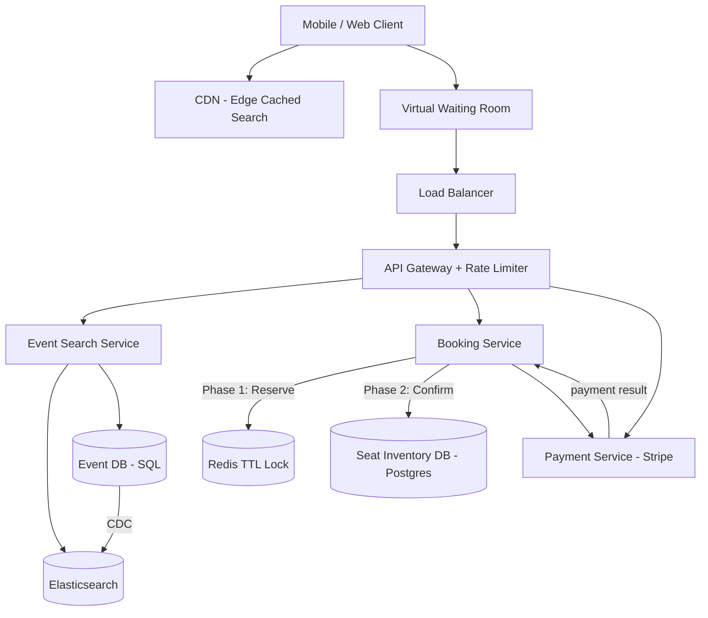
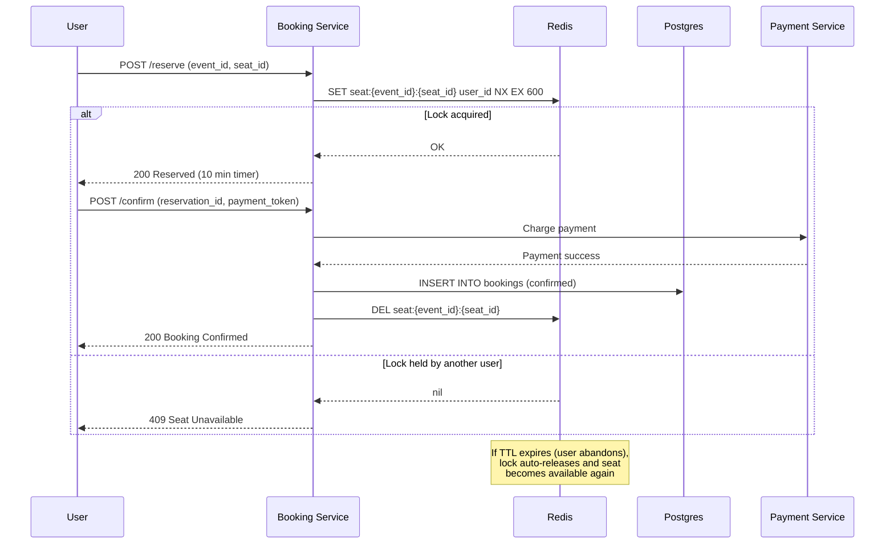

# Ticketmaster

## 1. Overview

Ticketmaster is a ticket booking platform where users search for events, select seats, and complete purchases. The central architectural challenge is maintaining **strong consistency** under extreme concurrency. Unlike social media where eventual consistency is acceptable, ticketing has a zero-tolerance policy for double-booking -- two users must never be assigned the same seat. This constraint, combined with Taylor-Swift-level traffic surges (millions of users hitting the system simultaneously for a single event), makes Ticketmaster a canonical study in distributed locking, two-phase booking protocols, and surge management.

## 2. Requirements

### Functional Requirements
- Users can search for events by name, date, venue, or artist.
- Users can view available seats for an event (seat map).
- Users can reserve a seat temporarily and then confirm via payment.
- Users can view their booking history.
- Event organizers can create events and define seat inventories.

### Non-Functional Requirements
- **Scale**: 100M+ registered users; on-sale events can generate 10M+ concurrent users.
- **Consistency**: Strong consistency for seat inventory -- double-booking is a catastrophic failure.
- **Latency**: Search results in < 500ms; seat reservation in < 1 second.
- **Availability**: 99.99% uptime for the booking flow; graceful degradation during surges (waiting room is acceptable).
- **Durability**: Once a booking is confirmed, it must never be lost.

## 3. High-Level Architecture



## 4. Core Design Decisions

### Strong Consistency via SQL
Seat inventory is stored in [PostgreSQL](../03-storage/sql-databases.md) with full ACID guarantees. Unlike a social media "like count" where off-by-one is acceptable, selling a seat that does not exist causes real financial and reputational harm. SQL's row-level locking and transactional isolation make it the only defensible choice for the booking table.

### Two-Phase Booking Protocol
The booking flow is split into two distinct phases to decouple the user experience from payment latency:
1. **Reserve**: A temporary hold is placed on the seat using a [distributed lock in Redis](../04-caching/redis.md). The lock has a TTL (e.g., 10 minutes).
2. **Confirm**: The user completes payment within the TTL window. On success, the booking service writes the confirmed reservation to Postgres and releases the Redis lock.

This pattern is an application of the [two-phase commit concept](../08-resilience/distributed-transactions.md) adapted for user-facing flows.

### Virtual Waiting Room for Surge Management
During high-demand on-sales, the system activates a [virtual waiting room](../08-resilience/rate-limiting.md) -- a queue-based admission control mechanism. Instead of allowing all users to hit the booking service simultaneously (which would crush the database), the waiting room throttles ingress to a sustainable rate, admitting users in controlled batches.

### CDN-Cached Search Results
Event search results during a surge are largely identical across users -- everyone searches for "Taylor Swift" at the same time, and rankings are not personalized. By caching search results at [CDN edge locations](../04-caching/cdn.md) with a short TTL (30-60 seconds), the system absorbs millions of identical search requests without touching the backend at all.

## 5. Deep Dives

### 5.1 Two-Phase Booking with Redis TTL Locks



**Why Redis TTL locks instead of database row locks?**

Database-level locks (e.g., `SELECT ... FOR UPDATE`) hold a connection open for the entire reservation window (up to 10 minutes). At scale, this exhausts the connection pool. Redis TTL locks are:
- **Non-blocking**: The `SET NX` command is O(1) and does not hold a DB connection.
- **Self-expiring**: The TTL ensures abandoned reservations auto-release without a cron job.
- **Fast**: Sub-millisecond Redis operations handle the high concurrency of on-sale events.

The `NX` flag (set only if not exists) provides mutual exclusion -- exactly one user can hold the lock for a given seat.

### 5.2 The Virtual Waiting Room

During a Taylor Swift on-sale, 10M+ users attempt to access the booking flow within seconds. Without throttling, the database would be overwhelmed.

The virtual waiting room works as follows:

1. **Enqueue**: Users attempting to access the booking page are placed in a FIFO queue (implemented in Redis or SQS).
2. **Token issuance**: The system issues admission tokens at a controlled rate (e.g., 1,000 users/second) based on backend capacity.
3. **Psychological contract**: Users see their position in the queue and an estimated wait time. This serves a dual purpose -- it protects the backend and sets realistic expectations, reducing rage-refreshing.
4. **Token validation**: When a user reaches the front of the queue, they receive a time-limited token that grants access to the booking flow. The API gateway validates this token before allowing requests through to the booking service.

The admission rate is dynamically tuned based on real-time backend metrics (DB connection pool utilization, Redis memory, API error rates).

### 5.3 Seat Inventory and the Search/Book Divergence

The system maintains two views of seat availability:

- **Search-time view**: An approximate, CDN-cacheable snapshot. "Section A has ~50 seats remaining." This is stale by 30-60 seconds and is acceptable for browsing.
- **Book-time view**: An exact, strongly consistent check at the moment of reservation. The Redis `SET NX` command is the authoritative gate.

This divergence is intentional. It would be ruinous to performance to serve strongly consistent seat counts to millions of browsing users. The system optimizes for the common case (browsing) and pays the consistency cost only at the critical moment (booking).

### 5.4 Payment Failure and Rollback

If payment fails after a seat is reserved:

1. The booking service receives the payment failure from the payment provider.
2. The Redis lock for the seat is explicitly deleted (`DEL seat:{event_id}:{seat_id}`).
3. The seat returns to the available pool immediately.
4. No Postgres write occurs -- the reservation was only in Redis, so there is nothing to roll back in the database.

If the booking service crashes between payment success and the Postgres write, an idempotent reconciliation job detects "paid but unconfirmed" reservations and completes the write.

**Idempotency for payment retries:**

Payment operations include an idempotency key (the `reservation_id`). If the client retries a payment request due to a network timeout, the payment provider recognizes the duplicate idempotency key and returns the original result rather than charging twice. This is essential for financial operations -- see [distributed transactions](../08-resilience/distributed-transactions.md) for the saga pattern's compensating transaction model.

### 5.5 Back-of-Envelope Estimation

**Concurrent users during a major on-sale:**
- 10M users attempt to buy tickets within 5 minutes.
- QPS to the search endpoint: 10M / 300 sec = ~33,000 QPS.
- QPS to the booking endpoint (after waiting room throttle): 1,000 users/sec admitted x 1 req/sec = 1,000 QPS.
- The waiting room reduces booking QPS by 33x, from an impossible 33K to a manageable 1K.

**Redis lock capacity:**
- A major venue has 80,000 seats.
- At most 80,000 simultaneous Redis locks exist.
- Each lock: ~100 bytes (key + value + metadata).
- Total: 80,000 x 100B = 8MB -- trivially small for Redis.
- Lock operations: SET NX at 1,000 QPS = well within a single Redis node's capacity.

**Database write volume:**
- 80,000 bookings per event, confirmed over 10-minute windows.
- Writes: ~130/sec sustained during peak.
- A single Postgres instance can handle 10K+ writes/sec, so the database is not the bottleneck.

**CDN cache hit ratio during surge:**
- 10M users searching for "Taylor Swift" within 5 minutes.
- CDN cache TTL: 30 seconds.
- In the first 30-second window, one request hits the backend; the remaining ~1M requests are served from CDN.
- Cache hit ratio: > 99.99% for event search during surges.

### 5.6 Seat Map Rendering

The seat map (visual representation of available/reserved/sold seats) is a read-heavy endpoint:

1. **Approximate view**: Served from a CDN-cached or [Redis-cached](../04-caching/redis.md) snapshot updated every 10-30 seconds. Users see sections with approximate availability ("~50 seats remaining in Section A").
2. **Precise view**: When a user selects a specific section, a live query returns exact seat availability. This query hits the Redis lock layer, checking which seats have active locks.
3. **Optimistic rendering**: The client renders all unlocked seats as "available." If the user attempts to reserve a seat that was just locked by another user in the last few seconds, the reservation fails gracefully with a "seat no longer available" message.

This tiered rendering approach keeps the seat map responsive (CDN-cached overview) while ensuring accuracy at the moment of commitment (Redis lock check).

## 6. Data Model

### Event Table (Postgres)
```sql
events:
  event_id     UUID PK
  name         VARCHAR
  artist       VARCHAR
  venue_id     UUID FK
  event_date   TIMESTAMP
  on_sale_date TIMESTAMP
  total_seats  INTEGER
  status       ENUM('upcoming', 'on_sale', 'sold_out', 'completed')
```

### Seat Inventory (Postgres)
```sql
seats:
  seat_id      UUID PK
  event_id     UUID FK -> events
  section      VARCHAR
  row          VARCHAR
  number       INTEGER
  price_tier   VARCHAR
  status       ENUM('available', 'reserved', 'sold')
  booked_by    UUID FK -> users (nullable)
  UNIQUE (event_id, section, row, number)
```

### Booking Table (Postgres)
```sql
bookings:
  booking_id     UUID PK
  user_id        UUID FK -> users
  seat_id        UUID FK -> seats
  event_id       UUID FK -> events
  payment_id     VARCHAR
  idempotency_key VARCHAR UNIQUE  -- prevents duplicate bookings from retries
  amount_cents   INTEGER
  status         ENUM('confirmed', 'cancelled', 'refunded')
  created_at     TIMESTAMP
  confirmed_at   TIMESTAMP
```

### Waiting Room Queue (Redis / SQS)
```
Key:   waiting_room:{event_id}:{user_id}
Value: { position: integer, token: UUID, issued_at: timestamp }
TTL:   900 seconds (15 minutes to use the token)
```

### API Endpoints

```
GET /v1/events?q={query}&date={date}&page={page}
  Response: { events: [Event], total: integer }
  Served from CDN with 30s TTL during surges

GET /v1/events/{event_id}/seats?section={section}
  Response: { seats: [{ seat_id, section, row, number, price_tier, status }] }
  "status" is approximate for browsing (cached) or precise for booking (live Redis check)

POST /v1/reservations
  Headers: Authorization + Waiting-Room-Token
  Body: { event_id, seat_id }
  Response: { reservation_id, expires_at } or 409 Conflict

POST /v1/bookings
  Body: { reservation_id, payment_token, idempotency_key }
  Response: { booking_id, status: "confirmed" } or 402 Payment Failed

GET /v1/users/{user_id}/bookings
  Response: { bookings: [Booking] }
```

### Redis Lock (Ephemeral)
```
Key:   seat:{event_id}:{seat_id}
Value: user_id
TTL:   600 seconds (10 minutes)
```

## 7. Scaling Considerations

### Read Scaling for Search
[CDN edge caching](../04-caching/cdn.md) absorbs the majority of search traffic during surges. Behind the CDN, Elasticsearch provides fast full-text search with horizontal shard scaling. Event data is indexed via [CDC](../03-storage/database-replication.md) from the event DB, keeping the search index eventually consistent without polluting the write path.

### Write Scaling for Bookings
The booking service is the bottleneck during on-sales. It scales horizontally -- multiple booking service instances can process reservations concurrently because the Redis `SET NX` command provides distributed mutual exclusion per seat. The virtual waiting room caps the concurrency at a level the Redis and Postgres layers can sustain.

### Database Scaling
The seat inventory table is [sharded](../02-scalability/sharding.md) by `event_id`. Each event's seats live on a single shard, allowing row-level locking within a single partition. Cross-event transactions are not needed -- a user never books seats across different events atomically.

For the booking history table (cross-event, per-user), a separate shard strategy by `user_id` enables fast "my bookings" queries without cross-shard joins.

### Hot Event Problem
A single event (Taylor Swift) creates a hot shard. This is mitigated by multiple layers:
1. **Waiting room**: Limits booking concurrency to the system's sustainable throughput.
2. **CDN caching**: Eliminates search load on the backend.
3. **Dedicated provisioning**: High-demand events are pre-provisioned with dedicated Redis instances and Postgres replicas.
4. **Async confirmation**: Payment confirmation is processed asynchronously, reducing the time a booking holds database resources.

### Pre-scaling for Known Events
Major on-sales are scheduled events. The platform pre-scales infrastructure 24-48 hours before the on-sale:
- Additional booking service instances are spun up via [autoscaling](../02-scalability/autoscaling.md) group configuration changes.
- Dedicated Redis nodes are provisioned for the event's lock space.
- CDN cache is pre-warmed with event metadata and search results.
- The waiting room capacity is configured based on expected demand (historical data from similar events).

### Bot Detection and Fraud Prevention
Ticket scalpers use bots to reserve large numbers of seats rapidly. The system employs multiple defenses:

1. **CAPTCHA in waiting room**: Before issuing an admission token, the waiting room requires a CAPTCHA challenge. This adds friction that stops automated bots while only slightly slowing human users.
2. **Device fingerprinting**: The API gateway collects browser/device fingerprints. Multiple reservation attempts from the same device fingerprint are flagged and throttled.
3. **Velocity checks**: A single user cannot reserve more than N seats per event (e.g., 6). Reservations exceeding this limit are rejected.
4. **IP-based rate limiting**: Requests from a single IP exceeding a threshold are throttled or blocked. Cloud provider IP ranges are treated with extra scrutiny.
5. **Purchase verification**: After booking, a verification email is sent. Unverified bookings are released after 24 hours.

### Multi-Event Cart Support
While the core booking flow handles single-seat reservations, the system also supports "cart" mode where a user selects multiple seats before checkout:

1. Each seat in the cart is individually locked in Redis with `SET NX EX`.
2. The cart has a global TTL (10 minutes from the first lock).
3. On checkout, all seats are confirmed atomically in a single Postgres transaction.
4. If any seat's lock expired (user took too long), the checkout fails, all remaining locks are released, and the user is notified to try again.

## 8. Failure Modes & Mitigations

| Failure | Impact | Mitigation |
|---------|--------|------------|
| Redis lock node failure | Temporary inability to reserve seats | Redis Cluster with replication; fallback to Postgres `SELECT FOR UPDATE` with short timeout |
| Payment provider timeout | User stuck in "processing" state | TTL on Redis lock auto-releases seat; user can retry; idempotency key prevents double-charge |
| Database failure | Cannot confirm bookings | Booking service queues confirmation in Kafka; processes when DB recovers; Redis lock TTL prevents permanent seat holds |
| Waiting room failure | All users flood the backend simultaneously | [Circuit breaker](../08-resilience/circuit-breaker.md) at API gateway returns 503 with retry-after header; auto-scaling kicks in |
| CDN stale cache | Users see seats as available that are actually sold | Acceptable for search; the reservation step is the authoritative check |

## 9. Key Takeaways

- Strong consistency is non-negotiable for inventory systems. [SQL with ACID transactions](../03-storage/sql-databases.md) is the correct choice for the booking table. Double-booking is a catastrophic business failure, not just a technical issue.
- The two-phase (reserve + confirm) pattern decouples seat selection from payment, preventing long-held database locks. The reservation lives in Redis (fast, ephemeral) while the confirmed booking lives in Postgres (durable, consistent).
- Redis TTL locks are the mechanism that bridges the gap -- they provide fast, self-expiring mutual exclusion without database connection overhead. The `SET NX EX` command is the atomic primitive that makes this work.
- The virtual waiting room is both an engineering control (throttles ingress) and a UX pattern (sets expectations). It transforms an uncontrolled stampede into a managed queue. The admission rate is dynamically tuned based on real-time backend metrics.
- CDN caching for non-personalized search results eliminates the vast majority of backend load during surges. A 30-second TTL is sufficient because event metadata changes infrequently.
- The search-time/book-time consistency divergence is a deliberate architectural choice: optimize for the common case (browsing -- approximate counts are fine), pay for consistency only when it matters (booking -- exact seat availability required).
- Idempotency keys on payment operations prevent double-charging when clients retry due to network timeouts. This is a fundamental requirement for any system that processes financial transactions.
- Pre-scaling for known high-demand events (Taylor Swift, World Cup) is an operational best practice. Auto-scaling alone cannot react fast enough to a flash-mob scenario where millions of users arrive within seconds.
- The seat map uses tiered rendering: CDN-cached approximate view for browsing, Redis-checked precise view at booking time. This mirrors the broader pattern of relaxing consistency for reads and tightening it for writes.

## 10. Related Concepts

- [Distributed transactions (two-phase commit, saga pattern)](../08-resilience/distributed-transactions.md)
- [Redis (TTL locks, distributed locking, SET NX)](../04-caching/redis.md)
- [Rate limiting (virtual waiting room, queue-based admission)](../08-resilience/rate-limiting.md)
- [SQL databases (ACID, row-level locking, Postgres)](../03-storage/sql-databases.md)
- [CDN (edge caching for search)](../04-caching/cdn.md)
- [Sharding (event_id-based partitioning)](../02-scalability/sharding.md)
- [Circuit breaker (fail-fast during overload)](../08-resilience/circuit-breaker.md)
- [Search and indexing (Elasticsearch for event search)](../11-patterns/search-and-indexing.md)
- [Load balancing (L7 routing to booking service)](../02-scalability/load-balancing.md)
- [Consistent hashing (Redis cluster slot distribution)](../02-scalability/consistent-hashing.md)

## 11. Comparison with Related Systems

| Aspect | Ticketmaster | E-commerce (Checkout) | Uber (Ride Booking) |
|--------|-------------|----------------------|---------------------|
| Consistency | Strong (no double-booking) | Strong (no overselling) | Eventual (driver assignment) |
| Inventory model | Fixed seats (finite, named) | Commodity stock (countable) | Dynamic (driver pool) |
| Lock mechanism | Redis TTL per seat | DB row lock or Redis per SKU | Optimistic concurrency |
| Surge pattern | Flash mob (millions in seconds) | Flash sale (predictable start) | Continuous with peaks |
| Admission control | Virtual waiting room | Queue or lottery | Dynamic pricing |
| Payment timing | After reservation (2-phase) | At checkout (1-phase) | After ride completion |

The key distinction is that Ticketmaster's inventory is **named and finite** (Seat A-Row-3 is unique), while e-commerce inventory is **countable** (100 identical units of a product). Named inventory requires per-item locking (Redis SET NX per seat), while countable inventory can use atomic decrements (Redis DECR or DB counter).

### Architectural Lessons

1. **Decouple browsing from booking with different consistency guarantees**: The search/browse path can be eventually consistent (CDN cached), while the booking path must be strongly consistent (Redis lock + Postgres transaction). Applying the same consistency level to both wastes resources.

2. **TTL-based locks are superior to cron-based expiration for time-limited holds**: Instead of running a cron job every minute to check for expired reservations, Redis TTL locks self-expire automatically. This eliminates clock drift issues between application servers and reduces operational complexity.

3. **Virtual waiting rooms convert a capacity problem into a UX problem**: Rather than scaling infrastructure to handle 10M concurrent users (which would be idle 99.9% of the time), the waiting room limits concurrency to a sustainable level. The engineering cost is a simple queue; the UX cost is a wait time that users understand and accept.

4. **Idempotency is not optional for payment flows**: Network retries are inevitable. Without idempotency keys, a user could be charged twice for the same seat. Every payment operation must be idempotent by design.

5. **Pre-scaling beats auto-scaling for predictable flash events**: Auto-scaling has a 2-5 minute warm-up time. A Taylor Swift on-sale generates peak load in seconds. Pre-provisioning dedicated infrastructure 24 hours in advance is the only reliable approach.

6. **Bot detection is a first-class architectural concern**: Without CAPTCHA, device fingerprinting, and velocity checks, scalpers would consume all inventory before legitimate users clear the waiting room. Security and fairness features are load-bearing architectural components, not add-ons.

### Back-of-Envelope Estimation

**Event database sizing:**
- 500K events/year x 80K seats/event avg = 40B seat records/year
- Each seat record: ~200 bytes
- Annual: 40B x 200B = 8TB
- With 3-year retention + indexes: ~30TB Postgres (sharded by event_id)

**Redis lock memory (during a single event):**
- 80K seats x 100B per lock = 8MB (trivially small)
- Peak concurrent locks: 10K (limited by waiting room admission rate)
- All lock data fits in a single Redis instance's memory with vast headroom

**Payment processing:**
- 80K seats sold over 30 minutes for a hot event
- ~44 payments/sec sustained
- Payment provider (Stripe) handles 10K+ TPS, so this is not a bottleneck
- The waiting room ensures payment volume never exceeds backend capacity

**Waiting room queue length:**
- 10M users arrive in 5 minutes = 33K arrivals/sec
- Admission rate: 1K users/sec
- Queue grows at 32K users/sec for the first 5 minutes
- Peak queue length: 32K x 300 sec = ~9.6M users in queue
- With 80K seats and average purchase time of 5 minutes:
  - Throughput: 80K seats / 5 min = ~267 seats/sec
  - Queue drain time: 80K / 267 = ~5 minutes (then event is sold out)
  - Most queued users will not get tickets -- the waiting room communicates this transparently

## 12. Source Traceability

| Section | Source |
|---------|--------|
| Two-phase booking, Redis TTL locks | YouTube Report 2 (Section 7), YouTube Report 3 (Section 6) |
| Virtual waiting room | YouTube Report 2 (Section 7), YouTube Report 3 (Section 6) |
| CDN caching for search | YouTube Report 3 (Section 6) |
| Strong consistency for booking | YouTube Report 3 (Section 2: CAP analysis) |
| Seat inventory in Postgres | YouTube Report 2 (Section 3), YouTube Report 3 (Section 4) |
| Consistent hashing for Redis cluster | YouTube Report 8 (Section 3: Consistent Hashing) |
| Hotel reservation parallels | Alex Xu Vol 2, Chapter 8 |
