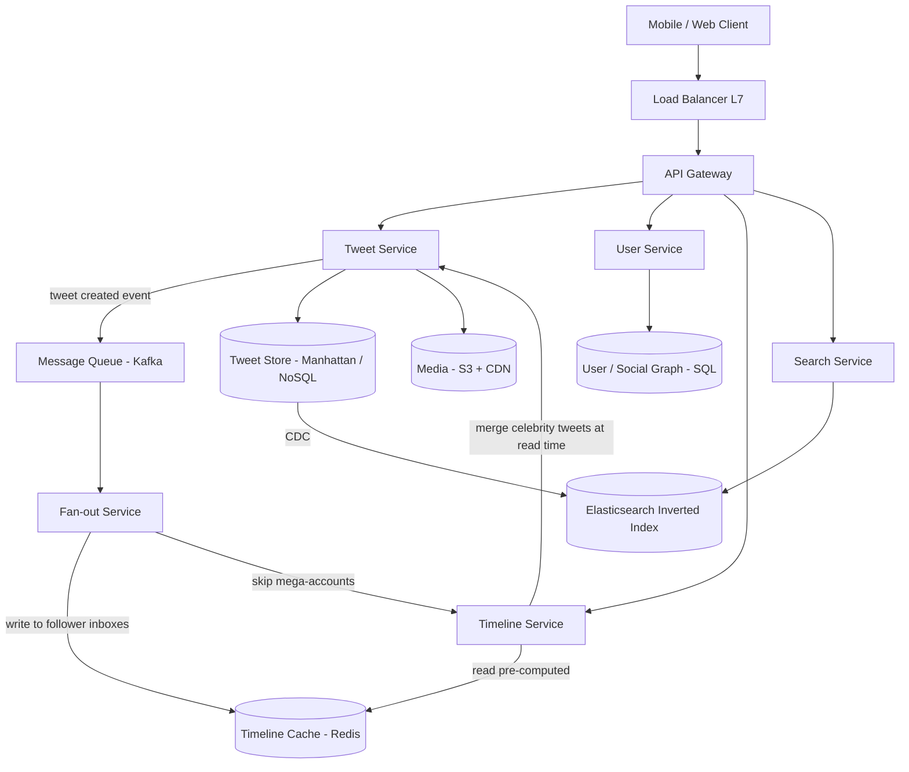
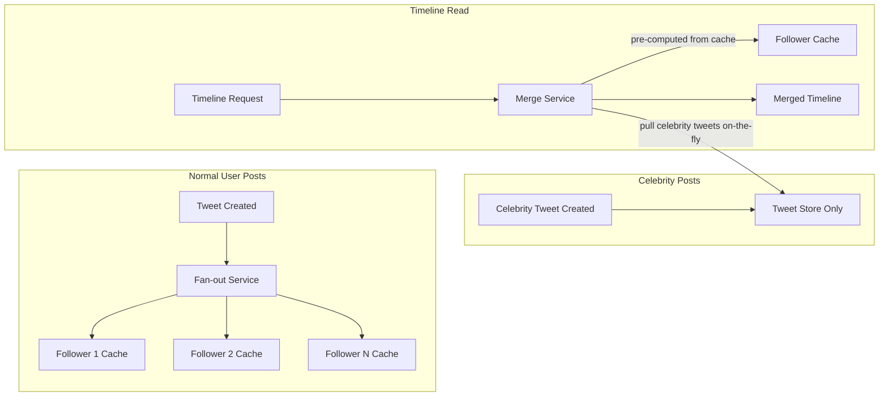

# Twitter

## 1. Overview

Twitter is a microblogging platform where users publish short-form posts ("tweets") consumed by potentially millions of followers. The core architectural challenge is an extreme read-to-write ratio -- hundreds of millions of timeline reads per day versus a comparatively small number of tweet writes -- combined with massive disparity in user influence. A tweet from an average user with 200 followers is trivial to distribute; a tweet from a celebrity with 50 million followers triggers a "write thunderstorm" that can destabilize the entire cluster. Twitter's architecture is a canonical study in how hybrid distribution strategies solve the fan-out problem at scale.

## 2. Requirements

### Functional Requirements
- Users can create, delete, and like tweets (text up to 280 characters, optional media).
- Users can follow/unfollow other users.
- Users can view a home timeline (aggregated feed of tweets from followed accounts).
- Users can search tweets by keyword or hashtag.
- Users can view a user profile timeline (all tweets from a single user).

### Non-Functional Requirements
- **Scale**: 500M+ daily active users, 600M+ tweets/day, ~600K tweets/sec at peak.
- **Latency**: Home timeline fetch in < 300ms (p99).
- **Availability**: 99.99% uptime (four nines).
- **Consistency**: Eventual consistency is acceptable for timelines; missing a tweet for a few seconds is tolerable. Strong consistency for engagement counts is not required.
- **Read-to-write ratio**: Approximately 1000:1. The system is overwhelmingly read-heavy.

## 3. High-Level Architecture



## 4. Core Design Decisions

### Hybrid Fan-out Strategy
Twitter does not use a single fan-out model. It employs a [hybrid fan-out](../11-patterns/fan-out.md) approach:

- **Normal users** (< 10K followers): Uses fan-out on write. When a user tweets, the fan-out service pushes the tweet ID into every follower's pre-computed timeline cache. This makes reads an O(1) lookup -- simply fetch the sorted list from the cache.
- **Celebrity users** (millions of followers): Uses fan-out on read. The tweet is stored once. When a follower requests their timeline, the timeline service merges the pre-computed cache with a real-time pull of celebrity tweets.

This hybrid approach avoids the "write thunderstorm" of pushing a single celebrity tweet to 50M+ inboxes while keeping read latency ultra-low for the common case.

### NoSQL for Tweet Storage
Tweets are JSON-like documents with variable metadata (hashtags, media references, retweet flags). A document store (Twitter uses Manhattan internally; MongoDB is a functional equivalent for design discussions) is ideal because it avoids the rigid schema overhead of SQL while supporting fast primary-key lookups. See [NoSQL databases](../03-storage/nosql-databases.md).

### CDC-Powered Search Indexing
Full-text search on tweets uses an [inverted index via Elasticsearch](../11-patterns/search-and-indexing.md). Rather than having the tweet service write to both the primary store and the search index (which couples them), Twitter uses [CDC (Change Data Capture)](../03-storage/database-replication.md) to stream mutations from the tweet store to Elasticsearch asynchronously. This keeps the write path clean and the search index eventually consistent.

### Timeline Cache in Redis
Pre-computed timelines are stored in [Redis](../04-caching/redis.md) sorted sets, keyed by user ID with tweet IDs as members and timestamps as scores. This allows efficient range queries (fetch the latest 200 tweets) and O(log N) insertions from the fan-out service.

## 5. Deep Dives

### 5.1 The Celebrity Problem

The celebrity problem is the defining challenge of Twitter's architecture. It arises from the power-law distribution of follower counts: the vast majority of users have fewer than 1,000 followers, but a small minority have tens of millions. This asymmetry means a single architectural approach (purely push or purely pull) fails catastrophically for one of the two groups.

**The write amplification math:**

Consider a celebrity with 50 million followers who tweets once. Under pure fan-out on write:
- 50,000,000 Redis writes are generated from a single tweet.
- At 1 microsecond per write: 50 seconds of sustained writes, just for one tweet.
- If this celebrity tweets 10 times per hour, the fan-out service is writing 500M cache entries per hour for one account.
- Multiply by thousands of celebrity accounts tweeting simultaneously, and the write volume exceeds any cache cluster's capacity.

Under pure fan-out on read:
- Zero writes occur at tweet creation time.
- But every timeline read requires querying the tweet store for every account the user follows.
- For a user following 500 accounts: 500 queries to the tweet store on every timeline load.
- At 1B+ timeline loads per day, this is 500B tweet store queries per day -- equally impractical.

The hybrid approach eliminates both extremes.



**How it works in practice:**

1. The `follows` table includes a `is_celebrity` or `pre_computed` flag.
2. When the fan-out service receives a tweet event from Kafka, it checks the author's follower count.
3. If below the threshold (~10K), it iterates through followers and writes to each cache. For a user with 200 followers, this is 200 Redis writes -- trivial.
4. If above the threshold, the tweet is only persisted to the tweet store. No fan-out occurs.
5. At read time, the timeline service fetches the user's pre-computed timeline from Redis, then queries the tweet store for recent tweets from all celebrity accounts the user follows. It performs a merge-sort by timestamp and returns the combined result.

**The threshold is a tuning parameter.** Setting it too low increases read-time computation; setting it too high risks write storms for "mid-tier" celebrities.

### 5.2 Home Timeline Merge at Read Time

When a user opens their timeline:

1. **Fetch pre-computed feed**: `ZREVRANGE user:{id}:timeline 0 199` from Redis -- returns the 200 most recent tweet IDs already sorted by time.
2. **Identify followed celebrities**: Query the social graph for the user's followed accounts that are flagged as celebrity.
3. **Pull recent celebrity tweets**: For each celebrity, fetch tweets from the last N hours from the tweet store.
4. **Merge**: Perform a K-way merge of the pre-computed list and the celebrity tweet lists, sorted by timestamp.
5. **Hydrate**: Batch-fetch tweet content (text, media URLs, like counts) for the final set of tweet IDs.
6. **Return**: Paginated response with cursor-based pagination for infinite scroll.

The merge step adds latency compared to a pure fan-out-on-write system, but it only applies to users who follow celebrities -- and the number of celebrities a single user follows is bounded (typically < 50), keeping the merge tractable.

### 5.3 Search Architecture

Tweet search uses a [full-text inverted index](../11-patterns/search-and-indexing.md) built on Elasticsearch:

- **Indexing**: CDC streams tweet mutations to Elasticsearch. Each tweet is tokenized, and tokens are mapped to tweet IDs.
- **Ranking**: Search results are ranked by a combination of recency, engagement (likes, retweets), and relevance (TF-IDF score).
- **Scale**: With 3.6PB+ of tweet data accumulated over a decade (1B tweets/day x 1KB x 365 x 10), the index is sharded across hundreds of Elasticsearch nodes using hash-based partitioning on tweet ID.
- **Hot terms**: A [Count-Min Sketch](../11-patterns/probabilistic-data-structures.md) identifies trending search terms, allowing the system to pre-warm caches for popular queries.

### 5.4 Tweet Ingestion Pipeline

The write path is intentionally simple and fast:

1. Client sends `POST /tweets` to the API gateway.
2. Tweet service validates, persists to the tweet store, and publishes a `TweetCreated` event to Kafka.
3. The fan-out service consumes the event and decides the distribution strategy (push vs. skip).
4. Media attachments are uploaded via [pre-signed URLs](../03-storage/object-storage.md) directly to S3, bypassing the application server.

**API design:**

```
POST /v1/tweets
  Headers: Authorization: Bearer <token>
  Body: { text: string, media_ids: [string], reply_to: string? }
  Response: { tweet_id: string, created_at: timestamp }

GET /v1/timeline/home?cursor={cursor}&limit={limit}
  Headers: Authorization: Bearer <token>
  Response: { tweets: [Tweet], next_cursor: string }

GET /v1/search?q={query}&from={timestamp}&to={timestamp}
  Response: { tweets: [Tweet], total_count: integer }
```

**Rate limits**: Twitter enforces strict [rate limiting](../08-resilience/rate-limiting.md) -- 300 tweet creates per 3 hours, 900 timeline reads per 15-minute window. These limits protect the fan-out service and cache from abuse while remaining transparent to normal user behavior.

### 5.5 Back-of-Envelope Estimation

Understanding the numbers grounds every architectural decision:

**Timeline cache sizing:**
- 500M DAU, each timeline stores last 200 tweet IDs
- Each entry: 8 bytes (tweet ID) + 8 bytes (timestamp score) = 16 bytes
- Per user: 200 x 16 = 3,200 bytes = ~3.2KB
- Total: 500M x 3.2KB = 1.6TB
- With Redis overhead (~2x): ~3.2TB of Redis cluster memory

**Fan-out write volume (normal users only):**
- 600M tweets/day; assume 95% from normal users = 570M tweets
- Average followers for normal user: 200
- Total fan-out writes: 570M x 200 = 114B Redis writes/day
- QPS: 114B / 86,400 = ~1.3M writes/sec sustained
- This is achievable with a large Redis cluster (16,384 slots, ~100 nodes)

**Search index size:**
- 600M tweets/day x 1KB avg = 600GB/day of new content
- 10 years of tweets: ~2.2PB
- Elasticsearch index (with inverted index overhead, ~3x raw): ~6.6PB
- Sharded across hundreds of Elasticsearch nodes

These numbers validate the architecture: the timeline cache fits in a reasonable Redis cluster, the fan-out volume is manageable after excluding celebrities, and the search index requires a large but feasible Elasticsearch deployment.

## 6. Data Model

### Tweet Store (NoSQL / Document)
```
{
  tweet_id:    UUID (partition key),
  user_id:     UUID,
  text:        String (280 chars),
  media_urls:  [String],
  hashtags:    [String],
  created_at:  Timestamp,
  like_count:  Integer,
  retweet_count: Integer
}
```

### User / Social Graph (SQL)
```
users:
  user_id      UUID PK
  username     VARCHAR UNIQUE
  display_name VARCHAR
  is_celebrity BOOLEAN
  follower_count INTEGER

follows:
  follower_id  UUID FK -> users
  followee_id  UUID FK -> users
  created_at   TIMESTAMP
  PRIMARY KEY (follower_id, followee_id)
```

### Timeline Cache (Redis Sorted Set)
```
Key:   timeline:{user_id}
Score: tweet timestamp (epoch ms)
Value: tweet_id
Max entries: 200 (ZREMRANGEBYRANK to evict oldest)
```

### Search Index (Elasticsearch)
```
Index: tweets
Document:
{
  tweet_id:    keyword,
  user_id:     keyword,
  text:        text (analyzed, tokenized),
  hashtags:    keyword[] (multi-value),
  created_at:  date,
  like_count:  integer,
  retweet_count: integer,
  language:    keyword
}

Sharding: hash(tweet_id) across 256+ shards
Replication factor: 2
```

### Engagement Counters (Redis)
```
Key:   tweet_engagement:{tweet_id}
Hash fields:
  likes:       Integer
  retweets:    Integer
  replies:     Integer
TTL:   None (evicted by LRU when memory pressure is high)
```

## 7. Scaling Considerations

### Fan-out Service Scaling
The fan-out service is the most write-intensive component. It is horizontally scaled via [Kafka consumer groups](../05-messaging/message-queues.md), with each consumer handling a partition of tweet events. Hot partitions caused by celebrity tweets are mitigated by the hybrid approach -- celebrities are simply skipped. The consumer group auto-rebalances when new consumers are added or existing ones fail.

At peak (600K tweets/sec), the fan-out service generates approximately 600K x 200 (avg followers) = 120M Redis writes/sec. This is distributed across a fleet of fan-out workers, each handling a Kafka partition and batching Redis writes using PIPELINE commands for efficiency.

### Timeline Cache Scaling
Redis is [clustered](../04-caching/redis.md) across 16,384 slots using [consistent hashing](../02-scalability/consistent-hashing.md). Hot keys (e.g., a viral user's timeline receiving millions of reads) are mitigated using the N-cache strategy: instead of sharding the cache (which keeps the hot key on one node), the system replicates the hot key across multiple cache instances. The timeline service randomly selects one of N replicas for each read, distributing load evenly.

### Read Scaling
Timeline reads are served entirely from cache in the common case. Cache misses fall through to the tweet store, which uses [sharding](../02-scalability/sharding.md) by tweet ID for even distribution. The cache-aside pattern ensures that missed keys are populated on first access and served from cache on subsequent requests.

Read replicas of the social graph database handle the "identify followed celebrities" query, ensuring the primary database is not overwhelmed by timeline reads.

### CDN for Media
All images and videos are served via [CDN edge locations](../04-caching/cdn.md), keeping media reads off the origin servers entirely. For a platform generating 200M+ media uploads per day, the CDN absorbs 99%+ of media read traffic, with only cold or newly uploaded content hitting the S3 origin.

### Geographic Distribution
Twitter operates in multiple regions. Each region has its own Redis cluster for timeline caches. When a user in Europe follows a user in the US, the fan-out writes replicate cross-region asynchronously. Timeline reads are always served from the local region's cache, ensuring sub-100ms latency regardless of where the tweet was created.

### Engagement Counter Scaling
Like and retweet counts are among the most frequently read and written values in the system. They are maintained in Redis with eventual propagation to the tweet store:
- **Write path**: When a user likes a tweet, Redis `HINCRBY tweet_engagement:{tweet_id} likes 1` is called. This is O(1) and sub-millisecond.
- **Read path**: The hydration step during timeline reads batch-fetches engagement counts from Redis for all tweet IDs in the response.
- **Persistence**: A background job periodically flushes engagement counts from Redis to the tweet store for durability.
- **Hot tweets**: A viral tweet may receive millions of likes per hour. The engagement counter key becomes a hot key. Mitigation: use the [random suffix strategy](../04-caching/redis.md) (`tweet_engagement:{tweet_id}:{shard}`) with a final summation across shards at read time.

### Notification and Activity Feed
Beyond the home timeline, Twitter maintains a separate activity feed ("Notifications" tab) tracking mentions, likes on your tweets, new followers, etc. This is implemented as a second sorted set per user in Redis, written to by a separate notification fan-out service that consumes events from Kafka.

## 8. Failure Modes & Mitigations

| Failure | Impact | Mitigation |
|---------|--------|------------|
| Fan-out service crashes mid-delivery | Some followers miss the tweet in cache | Kafka consumer offsets ensure replay from last committed offset; at-least-once delivery means the fan-out retries |
| Redis timeline cache node dies | Timeline reads for affected users fail | Redis cluster redistributes slots; [cache-aside](../04-caching/caching.md) pattern falls through to DB; cache warming rebuilds hot timelines |
| Elasticsearch index lag | Search results are stale by seconds | Acceptable under eventual consistency; CDC ensures eventual catchup |
| Celebrity tweet goes viral | Massive surge in read-time merges | [Rate limiting](../08-resilience/rate-limiting.md) on timeline API; caching of celebrity tweet lists with short TTL (30s) |
| Kafka broker failure | Tweet events are delayed | Kafka replication factor of 3 ensures no data loss; consumers retry from replicated partitions |
| Tweet store (NoSQL) latency spike | Timeline hydration slows down | Celebrity tweet IDs are cached; batch hydration limits the number of DB calls per timeline request |
| Social graph DB slowdown | Celebrity identification at read time fails | Celebrity list per user is cached with 1-hour TTL; stale list is acceptable |

### Cascade Failure Scenario

Consider a chain of failures during a major event (e.g., Super Bowl):

1. **Trigger**: A celebrity tweets during the Super Bowl. 50M followers request timelines simultaneously.
2. **Fan-out service lag**: The fan-out service processes the celebrity tweet as "skip" (correct). But millions of normal users also tweet about the event, creating a backlog in the fan-out queue.
3. **Cache stampede**: Users whose timelines are not yet updated (due to fan-out lag) experience cache misses and fall through to the tweet store.
4. **Tweet store overload**: The tweet store cannot handle the combined load of celebrity read-pulls and cache-miss fallbacks.

**Mitigation chain**:
- [Circuit breaker](../08-resilience/circuit-breaker.md) on the tweet store trips after error rate exceeds threshold, failing fast and returning cached (possibly stale) timelines.
- Timeline service returns a degraded but functional feed (pre-computed cache only, without celebrity merge).
- Fan-out service catches up once the spike subsides; caches are populated and the circuit breaker closes.
- Users see slightly stale timelines for 30-60 seconds, then normal service resumes.

## 9. Key Takeaways

- The hybrid fan-out model is the central insight: use fan-out on write for the majority of users and fan-out on read for the celebrity minority.
- The celebrity threshold is a business-tunable parameter, not a fixed architectural constant.
- Pre-computing timelines in Redis turns an O(N) aggregation problem into an O(1) cache read.
- CDC decouples the primary write path from secondary systems (search, analytics), keeping the tweet ingestion pipeline fast and simple.
- Eventual consistency is an acceptable trade-off for social media -- users tolerate a few seconds of staleness in exchange for sub-300ms timeline loads.
- Back-of-envelope math matters: 500M users x 200 average follows x 8 bytes per tweet ID = ~800GB of timeline cache -- large but manageable in a Redis cluster.
- The N-cache strategy (replicating hot keys across multiple cache instances) is more effective than sharding for handling viral content, because sharding keeps the hot key on one node.
- Search at Twitter's scale (3.6PB+ of tweet data) requires a massively sharded Elasticsearch cluster with CDC-based indexing -- a pattern that decouples the write path from the search path.
- Rate limiting at the API gateway (300 tweets per 3 hours, 900 reads per 15 minutes) protects downstream services from abuse and ensures fair resource allocation.

## 10. Related Concepts

- [Fan-out (read vs. write, hybrid)](../11-patterns/fan-out.md)
- [Redis (sorted sets, pub/sub, clustering, hot key mitigation)](../04-caching/redis.md)
- [Search and indexing (inverted index, Elasticsearch, CDC sync)](../11-patterns/search-and-indexing.md)
- [Probabilistic data structures (Count-Min Sketch for trending)](../11-patterns/probabilistic-data-structures.md)
- [NoSQL databases (document stores, Manhattan)](../03-storage/nosql-databases.md)
- [Object storage (pre-signed URLs for media)](../03-storage/object-storage.md)
- [CDN (edge caching for media)](../04-caching/cdn.md)
- [Sharding (hash-based partitioning)](../02-scalability/sharding.md)
- [Message queues (Kafka for event streaming)](../05-messaging/message-queues.md)
- [Rate limiting (protecting against viral surges)](../08-resilience/rate-limiting.md)
- [Caching strategies (cache-aside, TTL)](../04-caching/caching.md)

## 11. Comparison with Related Systems

Understanding Twitter's architecture in context highlights the design space:

| Aspect | Twitter | News Feed (Facebook) | WhatsApp |
|--------|---------|---------------------|----------|
| Fan-out model | Hybrid (write for normal, read for celebrity) | Hybrid (pre_computed flag) | No fan-out (point-to-point) |
| Primary store | NoSQL (Manhattan) | NoSQL | Cassandra inbox |
| Cache | Redis sorted sets | Redis sorted sets | N/A (inbox pattern) |
| Real-time protocol | N/A (polling) | N/A (polling) | WebSocket |
| Consistency | Eventual | Eventual | At-least-once |
| Ranking | Chronological (default) | ML-based relevance | N/A (chronological) |
| Read-to-write ratio | 1000:1 | 100:1 | ~1:1 |
| Primary challenge | Celebrity write amplification | Ranking at scale | Connection management |

Twitter's closest architectural sibling is the News Feed, but the key divergence is ranking: Twitter defaults to chronological ordering (though it offers a ranked timeline), while Facebook's News Feed is fundamentally ranked by a relevance model. This difference means Twitter's fan-out service needs only to insert tweet IDs with timestamps, while Facebook's must also supply ranking signals.

### Architectural Lessons

1. **The hybrid fan-out model is the canonical solution for power-law social graphs**: Any system where a small minority of users have massively more connections than the average (celebrities, mega-pages, influencers) benefits from this hybrid approach. Pure push or pure pull fails for one extreme of the distribution.

2. **Cache-aside with sorted sets is the optimal pattern for timeline reads**: By storing pre-computed timelines as Redis sorted sets with timestamp scores, reads become O(1) cache lookups with efficient range queries. This pattern is reusable for any feed-like feature (activity feeds, notification timelines).

3. **CDC for secondary index maintenance is a best practice**: Coupling the primary write path to secondary systems (search, analytics) creates tight coupling and increases write latency. CDC streams changes asynchronously, keeping the write path fast and the secondary systems eventually consistent.

4. **The celebrity threshold is a tuning parameter, not a constant**: Different systems will have different optimal thresholds. Twitter might set it at 10K followers; a smaller platform might set it at 1K. The threshold should be adjustable without code changes, stored in a configuration service or database flag.

5. **Engagement counters on viral tweets require sharded counting**: A single Redis key for a tweet with millions of likes per hour becomes a hot key. The random suffix strategy (`tweet_engagement:{id}:{shard}`) distributes writes across multiple keys, with a summation at read time.

6. **The Kafka-based fan-out pipeline provides natural back-pressure**: When the fan-out service falls behind (tweet rate exceeds processing capacity), the Kafka consumer lag increases but the system does not crash. The lag is a visible, monitorable metric that triggers auto-scaling of fan-out consumers.

7. **Cursor-based pagination is essential for infinite scroll**: Offset-based pagination fails for timelines where new content is continuously inserted, causing the "shifting window" problem. Cursor-based pagination (keyed on tweet timestamp) provides stable page boundaries regardless of new inserts.

## 12. Source Traceability

| Section | Source |
|---------|--------|
| Hybrid fan-out, celebrity problem | YouTube Report 2 (Section 5), YouTube Report 3 (Section 6), YouTube Report 6 (Section 2.1-2.2) |
| Timeline merge at read time | YouTube Report 2 (Section 5), YouTube Report 6 (Section 4.1) |
| Search and CDC indexing | YouTube Report 2 (Section 3: Full-Text Search and CDC) |
| DynamoDB / NoSQL for tweets | YouTube Report 6 (Section 3), YouTube Report 3 (Section 4) |
| Count-Min Sketch for hot terms | YouTube Report 6 (Section 4.2), YouTube Report 8 (Section 6) |
| Dropbox-style pre-signed URLs for media | YouTube Report 4 (Section 1: Pre-signed URLs) |
