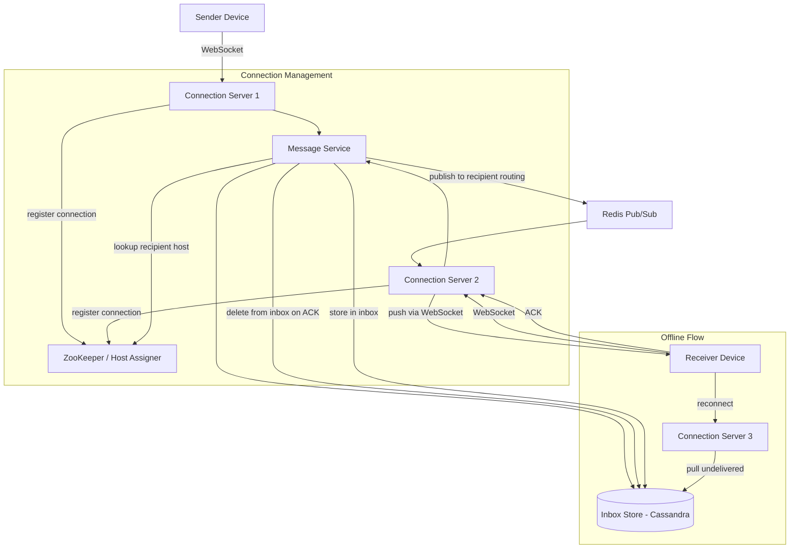
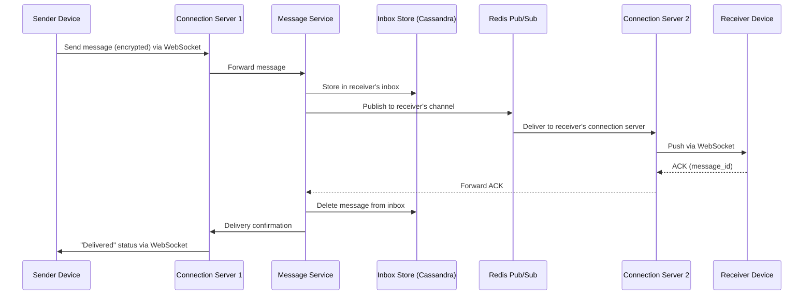
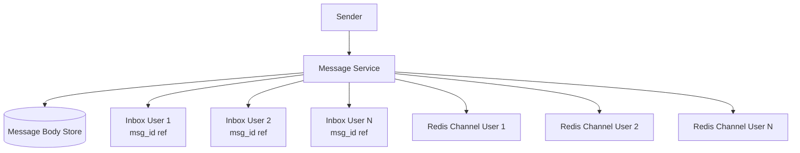

# WhatsApp

## 1. Overview

WhatsApp is a messaging platform that delivers billions of messages per day to 2B+ users across mobile and desktop devices. Unlike broadcast systems (live comments, news feeds), messaging is fundamentally **bidirectional and stateful** -- each client requires a persistent connection to the server, and the server must know which host is responsible for each recipient at all times. The defining architectural challenges are maintaining millions of concurrent WebSocket connections, routing messages through a distributed server fleet using Redis pub/sub, ensuring at-least-once delivery via the inbox pattern, and handling the inevitable reality that recipient devices are frequently offline. WhatsApp is a canonical study in connection management, message durability, and ACK-based deletion.

## 2. Requirements

### Functional Requirements
- Users can send text messages to individuals (1:1 chat).
- Users can send messages to groups (up to 1,000 members).
- Users receive delivery confirmations ("sent", "delivered", "read" receipts).
- Users can retrieve undelivered messages when they come back online.
- Messages are end-to-end encrypted.
- Users can see online/last-seen status of contacts.

### Non-Functional Requirements
- **Scale**: 2B+ registered users, 100B+ messages per day, millions of concurrent WebSocket connections.
- **Latency**: P99 message delivery < 500ms when both users are online.
- **Availability**: 99.99% uptime (four nines). Users expect messaging to always work.
- **Durability**: Messages must never be lost. If a device is offline, messages must be stored and delivered when the device reconnects.
- **Consistency**: Messages must be delivered at least once. Duplicate delivery is acceptable (client-side deduplication), but message loss is not.
- **Security**: End-to-end [encryption](../09-security/encryption.md) -- the server never sees plaintext message content.

## 3. High-Level Architecture



## 4. Core Design Decisions

### WebSocket for Bidirectional Messaging
Unlike live comments (unidirectional, SSE), messaging requires the client to both send and receive messages over the same persistent connection. [WebSockets](../07-api-design/real-time-protocols.md) provide full-duplex communication over a single TCP connection. Each user's device maintains one WebSocket connection to a connection server.

### Redis Pub/Sub for Message Routing
When User A sends a message to User B, the message service must route it to the specific connection server holding User B's WebSocket. [Redis pub/sub](../04-caching/redis.md) provides this routing layer:
- Each connection server subscribes to a channel corresponding to the user IDs it serves.
- The message service publishes to the recipient's channel; the correct connection server receives and forwards it.

This avoids the complexity of a centralized routing table lookup for every message, replacing it with a lightweight publish-subscribe pattern.

### The Inbox Pattern for At-Least-Once Delivery
Messages are not just forwarded -- they are **persisted in the recipient's inbox** before delivery is attempted. The message is only deleted from the inbox when the recipient's device sends an explicit ACK. This guarantees at-least-once delivery:
- If the device is online: message is delivered via WebSocket AND stored in inbox. On ACK, inbox entry is deleted.
- If the device is offline: message remains in inbox. When the device reconnects, it pulls all undelivered messages from the inbox.

This is a critical distinction from fire-and-forget pub/sub (which would lose messages for offline users).

### ZooKeeper for Connection-to-Host Mapping
The system uses [ZooKeeper (service discovery)](../06-architecture/microservices.md) to maintain a mapping of `deviceID -> connectionServerHost`. When a device connects, the connection server registers the mapping. When the message service needs to route a message, it looks up the recipient's host via ZooKeeper.

## 5. Deep Dives

### 5.1 Message Delivery Lifecycle



**Why persist before delivery?** The inbox write (step 3) happens before the pub/sub publish (step 4). If the pub/sub delivery fails (receiver offline, connection server crash), the message survives in the inbox. This ordering is essential for at-least-once guarantees.

### 5.2 Offline Message Retrieval

When a device has been offline and reconnects:

1. **Connection establishment**: Device opens a new WebSocket to a connection server (possibly a different one than before).
2. **Registration**: The connection server registers the device-to-host mapping in ZooKeeper.
3. **Inbox pull**: The connection server queries the inbox store for all undelivered messages for this device.
4. **Delivery**: Messages are pushed to the device in chronological order via the WebSocket.
5. **ACK loop**: For each message received, the device sends an ACK. The message service deletes the ACKed message from the inbox.

**Retention policy**: Messages in the inbox have a TTL (e.g., 30 days). If a device is offline for more than 30 days, older messages are purged. Users can back up their message history to cloud storage independently.

### 5.3 Group Messaging

Group messages introduce a fan-out challenge: a message sent to a 1,000-member group must be delivered to 1,000 recipients, each potentially on a different connection server.

**Approach:**
1. Sender sends the message once to the message service.
2. The message service looks up all group members.
3. For each member, the message is stored in their individual inbox.
4. The message service publishes to each member's Redis channel.
5. Each member's connection server delivers the message.
6. Each member ACKs independently; their inbox entry is deleted on ACK.

**Optimization**: For very large groups, the message service does not store 1,000 copies of the message body. Instead, it stores the message body once (keyed by message_id) and stores lightweight references (message_id pointers) in each member's inbox. The connection server hydrates the reference when delivering.



### 5.4 Presence and Last-Seen Status

Users can see whether their contacts are online and when they were last active.

**Implementation:**
- Each connection server periodically reports its connected users' status to a shared [Redis](../04-caching/redis.md) instance.
- The key `presence:{user_id}` stores the last heartbeat timestamp with a short TTL (e.g., 30 seconds).
- If the TTL expires (user disconnects without a clean close), the presence key auto-deletes, marking the user as offline.
- When a user opens a chat, the client queries the presence service for the contact's status.

**Scaling consideration**: Presence updates are high-frequency (one heartbeat per connection per 10-30 seconds). For 100M concurrent users, this is 3-10M writes/sec to Redis. The presence store is sharded across multiple Redis nodes using [consistent hashing](../02-scalability/consistent-hashing.md).

### 5.5 Back-of-Envelope Estimation

**Message throughput:**
- 2B users, 50% DAU = 1B DAU
- Average 50 messages sent per user per day = 50B messages/day
- QPS: 50B / 86,400 = ~578K messages/sec sustained
- Peak (2x average): ~1.2M messages/sec

**Inbox store sizing:**
- Each message: ~1KB (encrypted body + metadata)
- Daily messages: 50B x 1KB = 50TB/day of new inbox writes
- With 30-day retention and replication factor 3: 50TB x 30 x 3 = 4.5PB of Cassandra storage
- This is a large but manageable Cassandra cluster (~1,000+ nodes)

**Connection server fleet:**
- 500M concurrent connections (peak)
- 200K connections per server (WebSocket is heavier than SSE)
- Fleet size: 500M / 200K = 2,500 connection servers
- Each server: 32GB+ RAM, 10Gbps network

**Redis pub/sub throughput:**
- 578K messages/sec, each published to one Redis channel
- Sharded across 100 Redis instances: ~5,800 publishes/sec per instance
- Well within Redis's capacity (~100K+ ops/sec per instance)

### 5.6 End-to-End Encryption Details

WhatsApp uses the Signal Protocol for [end-to-end encryption](../09-security/encryption.md):

1. Each device generates a public-private key pair on installation.
2. The sender encrypts the message using the recipient's public key (fetched from the key server).
3. The encrypted message traverses the server infrastructure (connection servers, inbox store) as an opaque blob. The server cannot read, scan, or index the content.
4. The recipient decrypts using their private key.

**Implications for system design:**
- **No server-side search**: Because the server cannot read message content, full-text search must be implemented client-side.
- **No content moderation**: Spam and abuse detection must rely on metadata (message frequency, report signals) rather than content analysis.
- **Key rotation**: When a user reinstalls the app, a new key pair is generated. Friends must be notified of the key change to prevent man-in-the-middle attacks.
- **Group encryption**: Each message in a group chat is encrypted separately for each recipient's public key. For a 1,000-member group, this means 1,000 encryptions per message -- computationally expensive but necessary for true end-to-end encryption.

## 6. Data Model

### Inbox Store (Cassandra)
```
partition_key:   recipient_user_id
clustering_key:  message_id (TIMEUUID for chronological ordering)
columns:
  sender_id:     UUID
  chat_id:       UUID (group or 1:1 chat identifier)
  body_ref:      UUID (reference to message body store, for group msg optimization)
  encrypted_body: BLOB (for 1:1 messages, inline encrypted content)
  created_at:    TIMESTAMP
  ttl:           30 days
```

### Message Body Store (Cassandra, for group messages)
```
partition_key:   message_id
columns:
  encrypted_body: BLOB
  sender_id:      UUID
  chat_id:        UUID
  created_at:     TIMESTAMP
  ttl:            30 days
```

### Connection Registry (ZooKeeper)
```
Path: /connections/{user_id}/{device_id}
Data: { host: "conn-server-42.region-us.internal", connected_at: timestamp }
Ephemeral node (auto-deleted when connection closes)
```

### Presence (Redis)
```
Key:   presence:{user_id}
Value: { status: "online", last_seen: timestamp }
TTL:   30 seconds (refreshed by heartbeat)
```

### Group Table (Postgres)
```sql
groups:
  group_id       UUID PK
  name           VARCHAR
  created_by     UUID FK -> users
  created_at     TIMESTAMP
  max_members    INTEGER (default 1024)

group_members:
  group_id       UUID FK -> groups
  user_id        UUID FK -> users
  joined_at      TIMESTAMP
  role           ENUM('admin', 'member')
  PRIMARY KEY (group_id, user_id)
```

### Message Delivery Status (Redis)
```
Key:   delivery:{message_id}
Hash fields:
  {device_id_1}: "delivered" | "read"
  {device_id_2}: "pending"
  ...
TTL:   86400 (24 hours, then status is inferred from inbox presence)
```

### Delivery Receipt Flow
When a message is delivered to a device, the delivery status update flows back:
1. Receiver device sends `{ type: "ack", message_id }` over WebSocket.
2. Connection server forwards ACK to the message service.
3. Message service deletes the message from the receiver's inbox.
4. Message service publishes a delivery status update to the sender's Redis pub/sub channel.
5. Sender's connection server pushes the "delivered" checkmark to the sender's device.

## 7. Scaling Considerations

### Connection Server Fleet
Each server handles ~200K concurrent WebSocket connections. For 500M concurrent users at peak, the fleet needs ~2,500 connection servers. Connection servers are stateful (they hold WebSocket sessions), making them harder to scale than stateless services. [ZooKeeper](../06-architecture/microservices.md) manages host assignment, and ephemeral nodes provide automatic cleanup when a server fails.

Draining a connection server for deployment requires gracefully closing WebSocket connections (send close frame, wait for reconnect to a new server) rather than hard-killing the process. Rolling deployments proceed one server at a time with health checks between steps.

### Inbox Store Throughput
[Cassandra](../03-storage/cassandra.md) handles the high write volume of inbox inserts (50B+ messages/day). Partitioned by `recipient_user_id`, writes are evenly distributed across the cluster. Deletes on ACK are also handled efficiently by Cassandra's tombstone mechanism, though compaction must be monitored -- excessive tombstone accumulation can degrade read performance.

The inbox store uses `TIMEUUID` as the clustering key, ensuring messages are physically sorted by creation time on disk. This makes "fetch all undelivered messages for user X" a single-partition, sequential scan -- the ideal read pattern for Cassandra.

### Redis Pub/Sub Scaling
The pub/sub layer is sharded by `user_id % N` across N Redis instances. Multiple Redis instances handle different segments of the user namespace. Each instance handles ~5-10K message publishes per second, well within Redis's capacity.

For ultra-high-throughput groups (e.g., a 1,000-member group where members are all active), the fan-out is handled by a dedicated Kafka topic rather than Redis pub/sub. This prevents a single active group from overwhelming a Redis instance.

### Group Message Fan-out
Groups with 1,000 members create 1,000 inbox writes and 1,000 pub/sub publishes. This is handled asynchronously via [Kafka](../05-messaging/message-queues.md) to avoid blocking the sender's response. The sender receives a 200 OK as soon as the message is persisted to Kafka. Consumer workers then perform the fan-out to each member's inbox and pub/sub channel.

For very large groups, the message body is stored once and referenced by ID in each member's inbox (see Section 5.3), reducing the write amplification from 1,000 full message copies to 1 body + 1,000 lightweight references.

## 8. Failure Modes & Mitigations

| Failure | Impact | Mitigation |
|---------|--------|------------|
| Connection server crash | All WebSocket connections on that server drop | Client auto-reconnects; ZooKeeper detects ephemeral node deletion; new server picks up users |
| Redis pub/sub failure | Real-time delivery stops; messages are not pushed | Inbox pattern ensures messages survive; devices pull from inbox on reconnect |
| Cassandra inbox node failure | Cannot write or read inbox | Cassandra replication factor 3 ensures availability; reads fall through to replicas |
| ZooKeeper quorum loss | Cannot look up recipient's connection server | Message service falls back to inbox-only mode; delivery happens on reconnect |
| Network partition between DCs | Messages from one region cannot reach recipients in another | Local inbox stores ensure regional durability; cross-region sync catches up after partition heals |
| ACK lost after delivery | Message stays in inbox; re-delivered on next pull | Client-side deduplication by message_id prevents duplicate display |

## 9. Key Takeaways

- WebSockets are the correct choice for bidirectional messaging. SSE (unidirectional) is insufficient when the client needs to both send and receive on the same connection.
- The inbox pattern is the foundation of at-least-once delivery: persist before delivery, delete on ACK. This decouples message durability from connection availability.
- Redis pub/sub provides lightweight, low-latency message routing between connection servers, but it is fire-and-forget. The inbox store provides the durability layer.
- ZooKeeper (or equivalent service discovery) is necessary for mapping users to connection servers in a distributed fleet. Ephemeral nodes handle automatic cleanup on disconnect.
- Group messaging is a fan-out problem solved by storing message body once and writing lightweight references to each member's inbox.
- Connection servers are inherently stateful -- they hold WebSocket sessions. This makes them harder to scale and drain than stateless services, requiring careful orchestration.

## 10. Related Concepts

- [Real-time protocols (WebSockets for bidirectional communication)](../07-api-design/real-time-protocols.md)
- [Redis (pub/sub for message routing, presence with TTL)](../04-caching/redis.md)
- [Message queues (Kafka for async group fan-out)](../05-messaging/message-queues.md)
- [Cassandra (inbox store, high write throughput)](../03-storage/cassandra.md)
- [Microservices (ZooKeeper for service discovery / connection mapping)](../06-architecture/microservices.md)
- [Encryption (end-to-end encryption for message privacy)](../09-security/encryption.md)
- [Consistent hashing (Redis cluster sharding for presence)](../02-scalability/consistent-hashing.md)
- [CAP theorem (eventual consistency for presence, at-least-once for messages)](../01-fundamentals/cap-theorem.md)
- [Circuit breaker (handling downstream failures gracefully)](../08-resilience/circuit-breaker.md)

## 11. Comparison with Related Messaging Systems

| Aspect | WhatsApp | Slack | Facebook Messenger | Telegram |
|--------|---------|-------|-------------------|---------|
| Protocol | WebSocket | WebSocket | WebSocket + MQTT | MTProto (custom) |
| Delivery | At-least-once (inbox + ACK) | At-least-once | At-least-once | At-least-once |
| Encryption | E2E (Signal Protocol) | TLS in transit only | E2E (optional) | E2E (optional, "secret chats") |
| Storage model | Inbox with TTL + client backup | Server-side persistent | Server-side persistent | Cloud-based (server-side) |
| Group size limit | 1,024 | 500K+ (channels) | 250 | 200K |
| Connection model | Dedicated host per user | Shared connection pool | Dedicated host | Shared connection pool |
| Presence | TTL-based heartbeat in Redis | Real-time via WebSocket | Real-time | Approximate |
| Search | Client-side only (E2E) | Server-side full-text | Server-side | Server-side (non-E2E chats) |

WhatsApp's E2E encryption creates a unique constraint: the server is "blind" to message content. This means server-side features like search, spam detection, and content moderation must rely on metadata signals rather than content analysis. Slack and Telegram (for non-secret chats) can provide server-side search because they can read message content.

The key architectural distinction across these systems is the **fan-out topology**. Live comments and Twitch chat are one-to-many broadcast problems (one video, many viewers), while WhatsApp is a many-to-many messaging problem (every user both sends and receives). This is why live comments use fire-and-forget pub/sub (lost comments are tolerable) while WhatsApp uses the inbox pattern (lost messages are not).

### Operational Considerations

**Connection server deployment:**
Connection servers cannot be restarted simultaneously -- each holds thousands of active WebSocket sessions. Rolling deployments proceed one server at a time:
1. Mark the server as "draining" in ZooKeeper (no new connections accepted).
2. Wait for a grace period (30 seconds) to allow in-flight messages to complete.
3. Send WebSocket close frames to all connected clients.
4. Clients auto-reconnect to healthy servers.
5. Once all connections are closed, the server can be safely restarted.
6. After restart, the server re-registers in ZooKeeper and begins accepting new connections.

**Cassandra tombstone management:**
The inbox pattern creates a high volume of deletes (message deleted on ACK). In Cassandra, deletes create tombstones that accumulate until compaction. Excessive tombstones degrade read performance because the read path must scan and filter them. Mitigation:
- Use a time-windowed compaction strategy aligned with the 30-day message retention TTL.
- Monitor tombstone-to-live-data ratio per partition.
- Trigger manual compaction if the ratio exceeds a threshold.

**Multi-device message sync:**
WhatsApp supports multiple devices (phone + web + desktop). When a user links a new device:
1. The new device registers in ZooKeeper alongside the existing device(s).
2. The message service maintains a delivery status map per device per message.
3. A message is only deleted from the inbox when ALL of the user's devices have ACKed it.
4. Each device can independently fetch undelivered messages from the inbox, ensuring consistency across devices even when they are online at different times.

### API Endpoints

```
WebSocket /v1/ws/connect
  On connect: { device_id, auth_token }
  Server registers device in ZooKeeper

Message format (JSON over WebSocket):
  Send:    { type: "message", to: user_id, body: encrypted_blob, message_id: UUID }
  Receive: { type: "message", from: user_id, body: encrypted_blob, message_id: UUID }
  ACK:     { type: "ack", message_id: UUID }
  Status:  { type: "status", message_id: UUID, status: "delivered" | "read" }

REST endpoints (for non-real-time operations):
  GET /v1/inbox?since={timestamp}
    Response: { messages: [Message] }  -- pull undelivered messages on reconnect

  GET /v1/presence/{user_id}
    Response: { status: "online" | "offline", last_seen: timestamp }
```

## 12. Source Traceability

| Section | Source |
|---------|--------|
| WebSocket connections, Redis pub/sub routing | YouTube Report 6 (Section 4.3), YouTube Report 4 (Section 2: Redis PubSub) |
| Inbox pattern, at-least-once delivery, ACK-based deletion | YouTube Report 6 (Section 4.3) |
| ZooKeeper for connection mapping | YouTube Report 3 (Section 5: Scaling Real-Time Servers) |
| Group messaging fan-out | Acing System Design Ch. 17, Grokking Ch. 98 |
| Cassandra for message storage | YouTube Report 2 (Section 3), Acing System Design Ch. 17 |
| End-to-end encryption model | Acing System Design Ch. 17 (Section 14.6) |
| Presence/last-seen with Redis TTL | YouTube Report 4 (Section 2: Redis Logic Patterns) |
